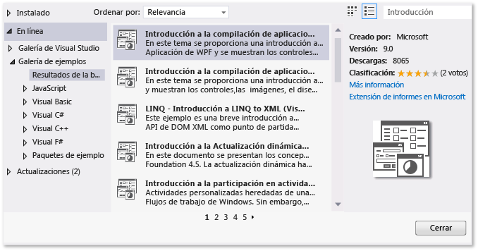
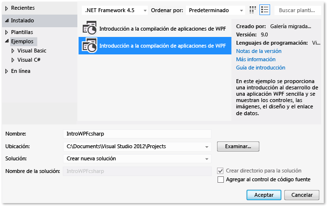
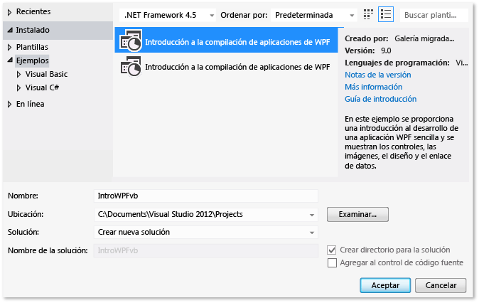

# Tutorial: Compilar una aplicaci&#243;n
[!INCLUDE[vs2017banner](../code-quality/includes/vs2017banner.md)]

Cuando complete este tutorial, estará más familiarizado con varias opciones que se pueden configurar al compilar aplicaciones con Visual Studio.  Creará una configuración de compilación personalizada, ocultará determinados mensajes de advertencia y aumentará la información de los resultados de la compilación, entre otras tareas, para una aplicación de ejemplo.  
  
 Este tema contiene las siguientes secciones:  
  
 [Instalar la aplicación de ejemplo](../ide/walkthrough-building-an-application.md#BKMK_installapp)  
  
 [Crear una configuración de compilación personalizada](../ide/walkthrough-building-an-application.md#BKMK_CreateBuildConfig)  
  
 [Compilar la aplicación](../ide/walkthrough-building-an-application.md#BKMK_building)  
  
 [Ocultar advertencias del compilador](../ide/walkthrough-building-an-application.md#BKMK_hidewarning)  
  
 [Mostrar detalles de compilación adicionales en la ventana de salida](../ide/walkthrough-building-an-application.md#BKMK_outputdetails)  
  
 [Crear una compilación de versión](../ide/walkthrough-building-an-application.md#BKMK_releasebuild)  
  
##   Instalar la aplicación de ejemplo  
 Utilizará el cuadro de diálogo **Extensiones y actualizaciones** para buscar e instalar el ejemplo [Introduction to Building WPF Applications](http://code.msdn.microsoft.com/Introduction-to-Building-b8d16419?SRC=VSIDE) de la Galería de ejemplos del sitio web de Microsoft.  La Galería de ejemplos proporciona diversos proyectos y código de ejemplo que puede descargar y revisar mientras planea y desarrolla aplicaciones.  
  
#### Para instalar la aplicación de ejemplo  
  
1.  En la barra de menús, elija **Herramientas**, **Extensiones y actualizaciones**.  
  
2.  Elija la categoría **En línea** y, a continuación, elija la categoría **Galería de ejemplos**.  
  
3.  Especifique `Introduction` en el cuadro de búsqueda para buscar el ejemplo.  
  
       
  
4.  En la lista de resultados, elija **Introduction to Building WPF Applications \(Visual C\#\)** o **Introduction to Building WPF Applications \(Visual Basic\)**.  
  
5.  Elija el botón **Descargar** y, a continuación, elija el botón **Cerrar**.  
  
 El ejemplo Introduction to Building WPF Applications aparece en el cuadro de diálogo **Nuevo proyecto**.  
  
#### Para crear una solución para la aplicación de ejemplo  
  
1.  Abra el cuadro de diálogo **Nuevo proyecto**.  
  
       
  
2.  En la categoría **Instalado**, elija la categoría **Ejemplos** para mostrar el ejemplo Introduction to Building WPF Applications.  
  
3.  Asigne a la solución el nombre `IntroWPFcsharp` para Visual C\#.  
  
       
  
     OR  
  
     Asigne a la solución el nombre `IntroWPFvb` para Visual Basic.  
  
       
  
4.  Elija el botón **Aceptar**.  
  
##   Crear una configuración de compilación personalizada  
 Cuando se crea una solución, se definen automáticamente configuraciones de compilación de depuración y de versión y sus destinos de plataforma predeterminados para la solución.  Es posible personalizar estas configuraciones o crear sus propias configuraciones.  Las configuraciones de compilación especifican el tipo de compilación.  Las plataformas de compilación especifican el sistema operativo de destino de una aplicación para esa configuración.  Para obtener más información, vea [Descripción de las configuraciones de compilación](../ide/understanding-build-configurations.md), [Descripción de las plataformas de compilación](../ide/understanding-build-platforms.md) y [Debug and Release Project Configurations](http://msdn.microsoft.com/es-es/0440b300-0614-4511-901a-105b771b236e).  
  
 Puede cambiar o crear configuraciones y opciones de plataforma mediante el cuadro de diálogo **Administrador de configuración**.  En este procedimiento, creará una configuración de compilación para probar.  
  
#### Para crear una configuración de compilación  
  
1.  Abra el cuadro de diálogo **Administrador de configuración**.  
  
       
  
2.  En la lista **Configuración de soluciones activas**, elija **Nueva**.  
  
3.  En el cuadro de diálogo **Nueva configuración de la solución**, asigne a la nueva configuración el nombre `Test`, copie valores de la configuración de compilación existente y, a continuación, elija el botón **Aceptar**.  
  
       
  
4.  En la lista **Plataforma de soluciones activas**, elija **Nueva**.  
  
5.  En el cuadro de diálogo de **Nueva plataforma de solución**, elija **x64** y no copie valores de la plataforma x86.  
  
       
  
6.  Elija el botón **Aceptar**.  
  
 La configuración de soluciones activa ha cambiado a Prueba y la plataforma de soluciones activas se ha establecido en x64.  
  
   
  
 Puede comprobar o cambiar rápidamente la configuración de soluciones activas mediante la lista **Configuraciones de soluciones** de la barra de herramientas **Estándar**.  
  
   
  
##   Compilar la aplicación  
 A continuación, compilará la solución con la configuración de compilación personalizada.  
  
#### Para compilar la solución  
  
-   En la barra de menús, elija **Compilar**, **Compilar solución**.  
  
 La ventana **Resultados** muestra los resultados de la compilación.  La compilación se realizó correctamente, pero se generaron algunos mensajes de advertencia.  
  
 Figura 1: advertencias de Visual Basic  
  
   
  
 Figura 2: advertencias de Visual C\#  
  
   
  
##   Ocultar advertencias del compilador  
 Es posible ocultar temporalmente determinados mensajes de advertencia durante una compilación en lugar de que se acumulen en los resultados de la compilación.  
  
#### Para ocultar una advertencia específica de Visual C\#  
  
1.  En el **Explorador de soluciones**, elija el nodo de proyecto de nivel superior.  
  
2.  En la barra de menús, elija **Ver**, **Páginas de propiedades**.  
  
     Se abrirá el **Diseñador de proyectos**.  
  
3.  Elija la página **Compilación** y a continuación, en el cuadro **Suprimir advertencias**, especifique el número de advertencia `1762`.  
  
       
  
     Para obtener más información, vea [Compilar \(Página, Diseñador de proyectos\) \(C\#\)](../ide/reference/build-page-project-designer-csharp.md).  
  
4.  Compile la solución.  
  
     La ventana **Salida** solo muestra información de resumen de la compilación.  
  
       
  
#### Para suprimir todas las advertencias de compilación de Visual Basic  
  
1.  En el **Explorador de soluciones**, elija el nodo de proyecto de nivel superior.  
  
2.  En la barra de menús, elija **Ver**, **Páginas de propiedades**.  
  
     Se abrirá el **Diseñador de proyectos**.  
  
3.  En la página **Compilación**, active la casilla **Deshabilitar todas las advertencias**.  
  
       
  
     Para obtener más información, vea [Configurar advertencias en Visual Basic](../ide/configuring-warnings-in-visual-basic.md).  
  
4.  Compile la solución.  
  
 La ventana **Salida** solo muestra información de resumen de la compilación.  
  
   
  
 Para obtener más información, vea [Cómo: Suprimir advertencias del compilador](../ide/how-to-suppress-compiler-warnings.md).  
  
##   Mostrar detalles de compilación adicionales en la ventana de salida  
 Se puede cambiar la cantidad de información sobre el proceso de compilación que aparece en la ventana **Salida**.  El nivel de detalle de la compilación se establece normalmente en Mínimo, lo que significa que la ventana **Salida** solo muestra un resumen del proceso de compilación, junto con las advertencias y los errores de alta prioridad.  Se puede mostrar más información sobre la compilación mediante [Cuadro de diálogo Opciones, Proyectos y soluciones, Compilar y ejecutar](../ide/reference/options-dialog-box-projects-and-solutions-build-and-run.md).  
  
> [!IMPORTANT]
>  Si se muestra más información, la compilación tardará más tiempo en completarse.  
  
#### Para cambiar la cantidad de información que se muestra en la ventana Salida  
  
1.  Abra el cuadro de diálogo **Opciones**.  
  
       
  
2.  Elija la categoría **Proyectos y soluciones** y, a continuación, elija la página **Compilar y ejecutar**.  
  
3.  En la lista **Contenido de los resultados de compilación del proyecto de MSBuild**, elija **Normal** y, a continuación, elija el botón **Aceptar**.  
  
4.  En la barra de menús, elija **Compilar**, **Limpiar solución**.  
  
5.  Compile la solución y, a continuación, revise la información de la ventana **Salida**.  
  
     La información de compilación incluye la hora a la que se inició la compilación \(situada al principio\), el orden en que se procesaron los archivos y el tiempo que tardó en completarse el proceso \(situado al final\).  Esta información también incluye la sintaxis real del compilador que Visual Studio ejecuta durante la compilación.  
  
     Por ejemplo, en la compilación de Visual C\#, la opción [\/nowarn](/dotnet/visual-basic/reference/command-line-compiler/nowarn) muestra el código de advertencia, 1762, que especificó anteriormente en este tema, junto con otras tres advertencias.  
  
     En la compilación de Visual Basic, [\/nowarn](/dotnet/visual-basic/reference/command-line-compiler/nowarn) no contiene advertencias concretas para excluir, por lo que no aparece ninguna advertencia.  
  
    > [!TIP]
    >  Puede buscar en el contenido de la ventana **Salida** si muestra el cuadro de diálogo **Buscar** eligiendo las teclas Ctrl\+F.  
  
 Para obtener más información, vea [Cómo: Ver, guardar y configurar archivos de registro de compilación](../ide/how-to-view-save-and-configure-build-log-files.md).  
  
##   Crear una compilación de versión  
 Se puede compilar una versión de la aplicación de ejemplo optimizada para su entrega.  Para la compilación de versión, especificará que el ejecutable se copie a un recurso compartido de red antes de que se inicie la compilación.  
  
 Para obtener más información, vea [Cómo: Cambiar el directorio de resultados de compilación](../ide/how-to-change-the-build-output-directory.md) y [Compilar y limpiar proyectos y soluciones en Visual Studio](../ide/building-and-cleaning-projects-and-solutions-in-visual-studio.md).  
  
#### Para especificar una compilación de versión para Visual Basic  
  
1.  Abra el **Diseñador de proyectos**.  
  
       
  
2.  Elija la página **Compilación**.  
  
3.  En la lista **Configuración**, elija **Release**.  
  
4.  En la lista **Plataforma**, elija **x86**.  
  
5.  En el cuadro **Ruta de acceso de los resultados de la compilación**, especifique una ruta de acceso de red.  
  
     Por ejemplo, puede especificar \\\\miServidor\\compilaciones.  
  
    > [!IMPORTANT]
    >  Puede aparecer un cuadro de mensaje advirtiéndole que el recurso compartido de red que ha especificado puede no ser una ubicación de confianza.  Si confía en la ubicación que ha especificado, elija el botón **Aceptar** en el cuadro de mensaje.  
  
6.  Compile la aplicación.  
  
       
  
#### Para especificar una compilación de versión para Visual C\#  
  
1.  Abra el **Diseñador de proyectos**.  
  
       
  
2.  Elija la página **Compilación**.  
  
3.  En la lista **Configuración**, elija **Release**.  
  
4.  En la lista **Plataforma**, elija **x86**.  
  
5.  En el cuadro **Ruta de acceso de los resultados**, especifique una ruta de acceso de red.  
  
     Por ejemplo, puede especificar \\\\miServidor\\compilaciones.  
  
    > [!IMPORTANT]
    >  Puede aparecer un cuadro de mensaje advirtiéndole que el recurso compartido de red que ha especificado puede no ser una ubicación de confianza.  Si confía en la ubicación que ha especificado, elija el botón **Aceptar** en el cuadro de mensaje.  
  
6.  Compile la aplicación.  
  
       
  
 El archivo ejecutable se copia a la ruta de acceso de red especificada.  Su ruta de acceso sería \\\\miServidor\\compilaciones\\*FileName*.exe.  
  
 Enhorabuena: ha completado correctamente este tutorial.  
  
## Vea también  
 [Tutorial: Compilar un proyecto \(C\+\+\)](../Topic/Walkthrough:%20Building%20a%20Project%20\(C++\).md)   
 [Información general sobre la precompilación de proyectos de aplicación web ASP.NET](http://msdn.microsoft.com/es-es/b940abbd-178d-4570-b441-52914fa7b887)   
 [Tutorial: Usar MSBuild](../msbuild/walkthrough-using-msbuild.md)