# <a name="walkthrough-create-a-simple-application-with-visual-c-or-visual-basic"></a>Tutorial: Crear una aplicación sencilla con Visual C# o Visual Basic
Tras completar este tutorial, estará familiarizado con muchas de las herramientas, cuadros de diálogo y diseñadores que puede usar para desarrollar aplicaciones con Visual Studio. Creará una aplicación sencilla "Hola mundo", diseñará la interfaz de usuario, agregará código y depurará errores, mientras aprende a trabajar en el entorno de desarrollo integrado (IDE).  
  
 Este tema contiene las siguientes secciones:  
  
 [Configurar el IDE](../ide/walkthrough-create-a-simple-application-with-visual-csharp-or-visual-basic.md#BKMK_ConfigureIDE)  
  
 [Crear una aplicación sencilla](../ide/walkthrough-create-a-simple-application-with-visual-csharp-or-visual-basic.md#BKMK_CreateApp)  
  
 [Depurar y probar la aplicación](../ide/walkthrough-create-a-simple-application-with-visual-csharp-or-visual-basic.md#BKMK_DebugTest)  
  
##  <a name="BKMK_ConfigureIDE"></a> Configurar el IDE  
Cuando inicie Visual Studio por primera vez, se le pedirá que inicie sesión. Este paso es opcional para este tutorial. Después, probablemente aparezca un cuadro de diálogo que le pide que elija la configuración de desarrollo y el tema de color. Mantenga los valores predeterminados y elija **Iniciar Visual Studio**.  


  
 Una vez que se haya iniciado Visual Studio, verá las ventanas de herramientas, los menús, las barras de herramientas y el espacio de la ventana principal. Las ventanas de herramientas se acoplan a los lados izquierdo y derecho de la ventana de la aplicación, con **Inicio rápido**, la barra de menús y la barra de herramientas estándar en la parte superior. En el centro de la ventana de la aplicación está la **Página principal**. Cuando se carga una solución o un proyecto, los editores y diseñadores aparecen en el espacio donde está la **página de inicio** . Cuando desarrolle una aplicación, pasará la mayor parte del tiempo en esta área central.  
  
 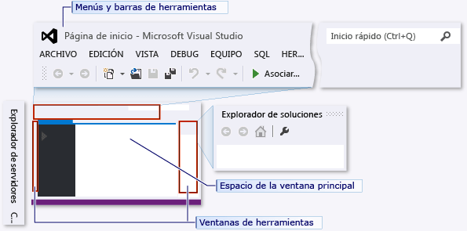  
  
##  <a name="BKMK_CreateApp"></a> Crear una aplicación sencilla  
  
### <a name="create-the-project"></a>Crear el proyecto  
 Cuando cree una aplicación en Visual Studio, primero creará un proyecto y una solución. Para este ejemplo, creará un proyecto de Windows Presentation Foundation (WPF).  
  
#### <a name="to-create-the-wpf-project"></a>Para crear el proyecto de WPF  
  
1.  Cree un nuevo proyecto. En la barra de menús, pulse **Archivo**, **Nuevo**, **Proyecto**.  
  
     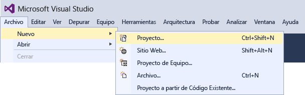  
  
2.  Para elegir la plantilla Aplicación de WPF de Visual Basic o Visual C#, elija en el panel izquierdo **Instalado**, **Visual C#**, **Escritorio clásico de Windows**, por ejemplo, y luego elija **Aplicación de WPF (.NET Framework)** en el panel central.  Asigne al proyecto el nombre HelloWPFApp en la parte inferior del cuadro de diálogo Nuevo proyecto.  
  
     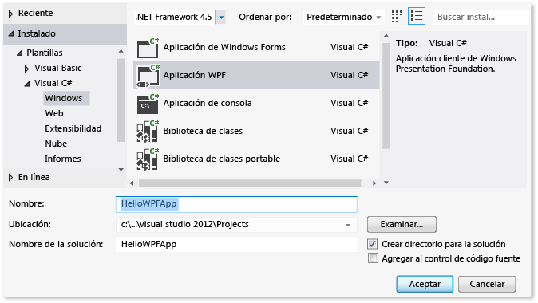  
  
 Visual Studio crea el proyecto HelloWPFApp y la solución, y el **Explorador de soluciones** muestra los distintos archivos. WPF Designer muestra una vista de diseño y una vista XAML de MainWindow.xaml en una vista en dos paneles. Puede deslizar el divisor para mostrar más o menos de cualquiera de las vistas.  Puede elegir ver solo la vista visual o solo la vista XAML. (Para obtener más información, vea [WPF Designer para desarrolladores de Windows Forms](http://msdn.microsoft.com/47ad0909-e89b-4996-b4ac-874d929f94ca)). Los elementos siguientes aparecen en el **Explorador de soluciones**:  
  
   
  
 Después de crear el proyecto, puede personalizarlo. Mediante la ventana **Propiedades** , (que se encuentra en el menú **Ver** ), puede mostrar y cambiar las opciones de los elementos de proyecto, controles y otros elementos de una aplicación.  
  
#### <a name="to-change-the-name-of-mainwindowxaml"></a>Para cambiar el nombre de MainWindow.xaml  
Asignemos a MainWindow un nombre más específico.  

1. En el **Explorador de soluciones**, seleccione MainWindow.xaml. Debería ver la ventana **Propiedades**, pero, si no es así, seleccione el menú **Ver** y el elemento **Ventana de propiedades**.  
2. Cambie la propiedad **Nombre de archivo** a `Greetings.xaml`.  
  
       
  
     El **Explorador de soluciones** muestra que el nombre de archivo es ahora Greetings.xaml y que el nombre del archivo de código anidado es ahora Greetings.xaml.vb o Greetings.xaml.cs. Este archivo de código está anidado bajo el nodo del archivo .xaml para mostrar que están muy relacionados entre sí.  
  
### <a name="design-the-user-interface-ui"></a>Diseñar la interfaz de usuario (IU)  
 Agregaremos tres tipos de controles a esta aplicación: un control TextBlock, dos controles RadioButton y un control Button.  
  
#### <a name="to-add-a-textblock-control"></a>Para agregar un control TextBlock  
  
1.  Abra la ventana **Cuadro de herramientas** eligiendo el menú **Ver** y el elemento **Cuadro de herramientas** .  
  
2.  En el **Cuadro de herramientas**, expanda el nodo **Controles WPF comunes** para ver el control TextBlock.  
  
     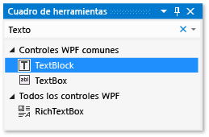  
  
3.  Agregue un control TextBlock a la superficie de diseño. Para ello, elija el elemento **TextBlock** y arrástrelo a la ventana en la superficie de diseño. Centre el control cerca de la parte superior de la ventana.  
  
 La ventana debería ser similar a la siguiente ilustración:  
  
 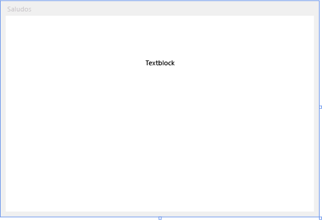  
  
 El marcado XAML debe tener un aspecto similar al siguiente:  
  
     ```xaml  
     <TextBlock HorizontalAlignment="Center" TextWrapping="Wrap" VerticalAlignment="Center" RenderTransformOrigin="4.08,2.312" Margin="237,57,221,238"><Run Text="TextBlock"/><InlineUIContainer><TextBlock TextWrapping="Wrap" Text="TextBlock"/>  
     ```  
  
#### <a name="to-customize-the-text-in-the-text-block"></a>Para personalizar el texto en el bloque de texto  
  
1.  En la vista XAML, busque el marcado de TextBlock y cambie el atributo de texto:  

   ```xaml
   Text="Select a message option and then choose the Display button."
   ```  
  
2.  Vuelva a centrar TextBlock si es necesario y guarde los cambios. Para ello, presione **CTRL+S** o use el elemento de menú **Archivo**.  
  
Después, agregará dos controles [RadioButton](/dotnet/framework/wpf/controls/radiobutton) al formulario.  
  
#### <a name="to-add-radio-buttons"></a>Para agregar botones de radio  
  
1.  En el **Cuadro de herramientas**, busque el control **RadioButton**.  
  
     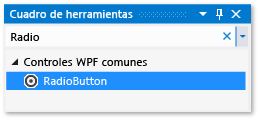  
  
2.  Agregue dos controles RadioButton a la superficie de diseño. Para ello, elija el elemento **RadioButton** y arrástrelo a la ventana en la superficie de diseño. Mueva los botones (para hacerlo, selecciónelos y use las teclas de dirección) de modo que aparezcan uno junto al otro bajo el control TextBlock.  
  
     La ventana debe ser similar a la que se muestra a continuación:  
  
     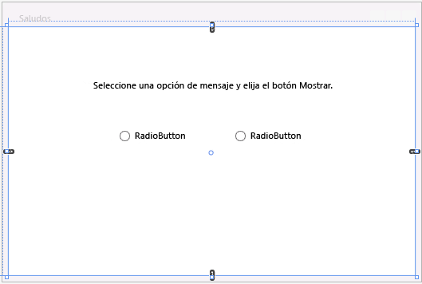  
  
3.  En la ventana **Propiedades** del control RadioButton izquierdo, cambie la propiedad **Name** (la propiedad situada en la parte superior de la ventana **Propiedades**) a **HelloButton**.  

       
  
4.  En la ventana **Propiedades** del control RadioButton derecho, cambie la propiedad **Name** a **GoodbyeButton** y, después, guarde los cambios.  
  
Ahora puede agregar el texto para mostrar de cada control RadioButton. El procedimiento siguiente actualiza la propiedad **Content** de un control RadioButton.  
  
#### <a name="to-add-display-text-for-each-radio-button"></a>Para agregar el texto para mostrar de cada botón de radio  
  
1.  En la superficie de diseño, abra el menú contextual de HelloButton. Para ello, presione el botón derecho del mouse encima de HelloButton. Elija **Editar texto** y, luego, escriba "Hello" (Hola).  
  
2.  Abra el menú contextual de GoodbyeButton. Para ello, presione el botón derecho del mouse encima de GoodbyeButton. Elija **Editar texto** y, luego, escriba "Goodbye" (Adiós).  

### <a name="to-set-a-radio-button-to-be-checked-by-default"></a>Para establecer que un botón de radio esté activado de forma predeterminada  
En este paso haremos que HelloButton esté activado de forma predeterminada, de modo que siempre esté seleccionado uno de los dos botones de radio.  

En la vista XAML, busque el marcado de HelloButton y agregue un atributo **IsChecked**:

```xaml
IsChecked="True"
```  

El último elemento de la interfaz de usuario que agregará es un control [Button](/dotnet/framework/wpf/controls/button).  
  
#### <a name="to-add-the-button-control"></a>Para agregar el control Button  
  
1.  En el **Cuadro de herramientas**, busque el control **Botón** y, después, agréguelo a la superficie de diseño en los controles RadioButton. Para ello, arrástrelo al formulario de la vista de diseño.  
  
2.  En la vista XAML, cambie el valor de **Content** del control de botón de `Content="Button"` a `Content="Display"` y, después, guarde los cambios.  
  
     El marcado debería ser similar al del ejemplo siguiente:  
     `<Button Content="Display" HorizontalAlignment="Left" VerticalAlignment="Top" Width="75" Margin="215,204,0,0"/>`  
  
     La ventana debería parecerse a la de la siguiente ilustración.  
  
     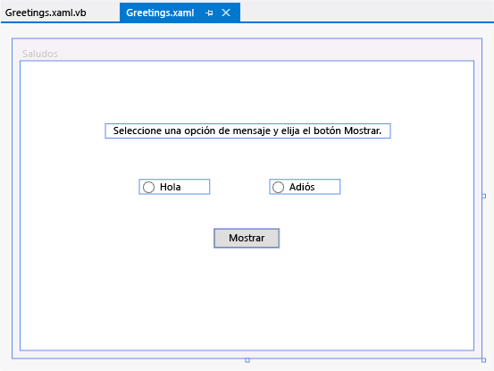  
  
### <a name="add-code-to-the-display-button"></a>Agregar código al botón Mostrar  
 Cuando se ejecuta esta aplicación, aparece un cuadro de mensaje después de que un usuario elija un botón de radio y, luego, el botón **Display**. Aparecerá un cuadro de mensaje para Hello y otro para Goodbye. Para crear este comportamiento, debe agregar código al evento Button_Click en Greetings.xaml.vb o Greetings.xaml.cs.  
  
#### <a name="add-code-to-display-message-boxes"></a>Agregar código para mostrar cuadros de mensaje    
1.  En la superficie de diseño, haga doble clic en el botón **Mostrar** .  
  
     Se abre Greetings.xaml.vb o Greetings.xaml.cs con el cursor en el evento Button_Click. 
  
    ```vb  
    Private Sub Button_Click_1(sender As Object, e As RoutedEventArgs)  
  
    End Sub  
    ```    
    ```csharp  
    private void Button_Click_1(object sender, RoutedEventArgs e)  
    {  
  
    }  
    ```  
  
2.  Escriba el siguiente código:  
  
    ```vb  
    If HelloButton.IsChecked = True Then  
        MessageBox.Show("Hello.")  
    ElseIf GoodbyeButton.IsChecked = True Then 
        MessageBox.Show("Goodbye.")  
    End If  
  
    ```    
    ```csharp  
    if (HelloButton.IsChecked == true)
    {
         MessageBox.Show("Hello.");
    }
    else if (GoodbyeButton.IsChecked == true)
    {
        MessageBox.Show("Goodbye.");
    }
    ```  
  
3.  Guarde la aplicación.  
  
##  <a name="BKMK_DebugTest"></a> Depurar y probar la aplicación  
 Después, depurará la aplicación para buscar errores y probar que los dos cuadros de mensaje aparecen correctamente. Las siguientes instrucciones indican cómo compilar e iniciar el depurador. Lea también [Compilar una aplicación de WPF (WPF)](/dotnet/framework/wpf/app-development/building-a-wpf-application-wpf) y [Depurar WPF](../debugger/debugging-wpf.md) para obtener más información.  
  
### <a name="find-and-fix-errors"></a>Buscar y corregir errores  
 En este paso, buscará el error que se ha producido anteriormente al cambiar el nombre del archivo MainWindow.xaml.  
  
#### <a name="to-start-debugging-and-find-the-error"></a>Para iniciar la depuración y buscar el error  
  
1.  Inicie el depurador seleccionando **Depurar**y después **Iniciar depuración**.  
  
       
  
     Aparece la ventana **Modo de interrupción** y la ventana **Salida** indica que se ha producido una excepción IOException: No se encuentra el recurso 'mainwindow.xaml'.  
  
2.  Detenga el depurador. Para ello, elija **Depurar**, **Detener depuración**.  
  
     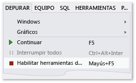  
  
 Hemos cambiado el nombre de MainWindow.xaml a Greetings.xaml al comienzo de este tutorial, pero el código todavía hace referencia a MainWindow.xaml como URI de inicio de la aplicación, por lo que el proyecto no puede iniciarse.  
  
#### <a name="to-specify-greetingsxaml-as-the-startup-uri"></a>Para especificar Greetings.xaml como el URI de inicio  
  
1.  En el **Explorador de soluciones**, abra el archivo App.xaml (en el proyecto de C#) o el archivo Application.xaml (en el proyecto de Visual Basic).  
  
2.  Cambie `StartupUri="MainWindow.xaml"` a `StartupUri="Greetings.xaml"` y después guarde los cambios.  
  
Vuelva a iniciar el depurador (presione **F5**). Debería ver la ventana Greetings de la aplicación. Ahora, cierre la ventana de la aplicación para detener la depuración.  
  
### <a name="to-debug-with-breakpoints"></a>Para depurar con puntos de interrupción  
Puede probar el código durante la depuración. Para ello, agregue algunos puntos de interrupción. Para agregar puntos de interrupción, puede elegir **Depurar**, **Alternar puntos de interrupción**, hacer clic en el margen izquierdo del editor junto a la línea de código donde quiere que se produzca la interrupción o bien presionar **F9**.  
  
#### <a name="to-add-breakpoints"></a>Para agregar puntos de interrupción  
  
1.  Abra Greetings.xaml.vb o Greetings.xaml.cs y seleccione la línea siguiente: `MessageBox.Show("Hello.")`  
  
2.  Agregue un punto de interrupción en el menú seleccionando **Depurar**y después **Alternar puntos de interrupción**.  
  
     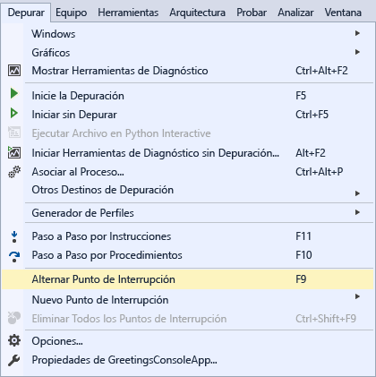  
  
     Aparece un círculo rojo al lado de la línea de código en el margen izquierdo de la ventana del editor.  
  
3.  Seleccione la línea siguiente: `MessageBox.Show("Goodbye.")`.  
  
4.  Presione la tecla **F9** para agregar un punto de interrupción y, después, presione **F5** para iniciar la depuración.  
  
5.  En la ventana **Greetings** , elija el botón de radio **Hello** y después elija el botón **Mostrar** .  
  
     La línea `MessageBox.Show("Hello.")` se resalta en amarillo. En la parte inferior del IDE, las ventanas Automático, Variables locales e Inspección están acopladas juntas en el lado izquierdo, mientras que las ventanas Pila de llamadas, Puntos de interrupción, Comando, Inmediato y Salida están acopladas juntas en el lado derecho.  
  
6.  En la barra de menús, elija **Depurar**, **Paso a paso para salir**.  
  
     La aplicación reanuda la ejecución y aparece un cuadro de mensaje con la palabra "Hello".  
  
7.  Elija el botón **Aceptar** en el cuadro de mensaje para cerrarlo.  
  
8.  En la ventana **Greetings** , elija el botón de radio **Goodbye** y después elija el botón **Mostrar** .  
  
     La línea `MessageBox.Show("Goodbye.")` se resalta en amarillo.  
  
9. Presione la tecla **F5** para continuar con la depuración. Cuando aparezca el cuadro de mensaje, elija el botón **Aceptar** en el cuadro de mensaje para cerrarlo.  
  
10. Cierre la ventana de la aplicación para detener la depuración.  
  
11. En la barra de menús, elija **Depurar**, **Deshabilitar todos los puntos de interrupción**.  
  
### <a name="build-a-release-version-of-the-application"></a>Compilar una versión de lanzamiento de la aplicación  
 Ahora que ha comprobado que todo funciona, puede preparar una versión de lanzamiento de la aplicación.  
  
#### <a name="to-clean-the-solution-files-and-build-a-release-version"></a>Para limpiar los archivos de solución y crear una versión de lanzamiento  
  
1.  En el menú principal, seleccione **Compilar** y **Limpiar solución** para eliminar los archivos intermedios y de salida que se han creado durante las compilaciones anteriores. Esto no es necesario, pero se limpian las salidas de compilación de depuración.  
  
     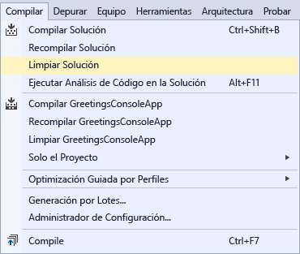  
  
2.  Cambie la configuración de compilación de HelloWPFApp de **Depurar** a **Liberar** mediante el control de lista desplegable en la barra de herramientas (dice "Depurar" actualmente).  
  
       
  
3.  Compile la solución con **Compilar**, **Compilar solución**.  
  
     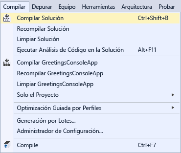  
  
¡Enhorabuena por completar este tutorial! Puede encontrar el .exe creado en el directorio de soluciones y proyectos (...\HelloWPFApp\HelloWPFApp\bin\Release\\). Si desea explorar más ejemplos, vea [Visual Studio Samples](../ide/visual-studio-samples.md).  
  
## <a name="see-also"></a>Vea también  
 [Novedades de Visual Studio 2017](../ide/whats-new-in-visual-studio.md)   
 [Introducción al desarrollo con Visual Studio](../ide/get-started-developing-with-visual-studio.md)   
 [Sugerencias de productividad](../ide/productivity-tips-for-visual-studio.md)