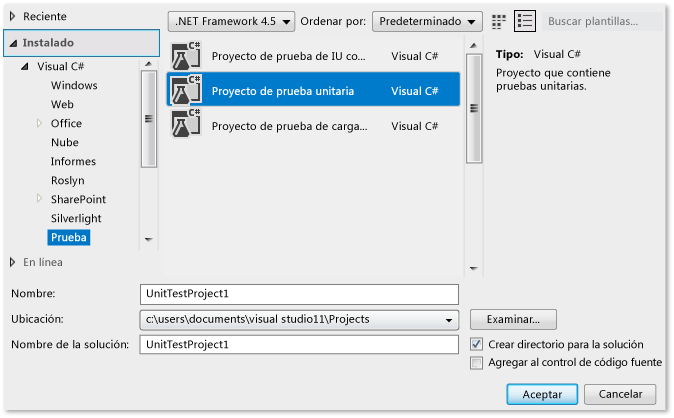
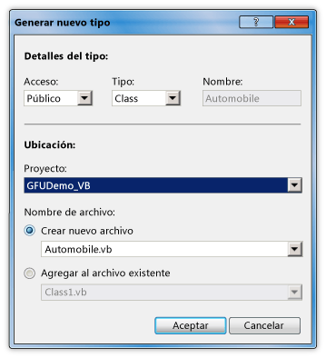
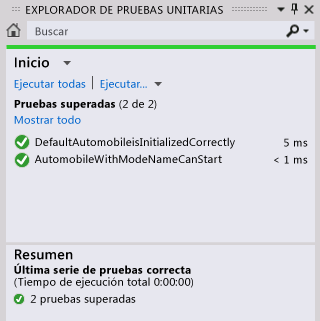

# Tutorial: Desarrollo basado en pruebas previas con la característica de generación a partir del uso

En este tema se muestra cómo usar la característica [Generar a partir del uso](../ide/visual-csharp-intellisense.md#generate-from-usage) que admite el desarrollo de prueba previa.

 El*desarrollo de prueba previa* es un enfoque de diseño de software en el que primero se escriben pruebas unitarias basadas en las especificaciones del producto y, a continuación, se escribe el código fuente que se necesita para que las pruebas se realicen correctamente. Visual Studio admite el desarrollo de prueba previa mediante la generación de nuevos tipos y miembros en el código fuente al hacerles referencia en los casos de prueba, antes de que se definan.

 Visual Studio genera los nuevos tipos y miembros con una interrupción mínima del flujo de trabajo. Puede crear códigos auxiliares para tipos, métodos, propiedades, campos o constructores sin abandonar su ubicación actual en el código. Al abrir un cuadro de diálogo para especificar opciones para la generación de tipos, el foco vuelve inmediatamente al archivo abierto actual cuando se cierra el cuadro de diálogo.

 La característica **Generar a partir del uso** puede usarse con marcos de pruebas que se integran con Visual Studio. En este tema se muestra el marco de pruebas unitarias de Microsoft.

[!INCLUDE[note_settings_general](../data-tools/includes/note_settings_general_md.md)]

### Crear un proyecto de biblioteca de clases de Windows y un proyecto de prueba

1. En [!INCLUDE[csprcs](../data-tools/includes/csprcs_md.md)] o [!INCLUDE[vbprvb](../code-quality/includes/vbprvb_md.md)], cree un proyecto de **biblioteca de clases de Windows**. Asígnele el nombre `GFUDemo_VB` o `GFUDemo_CS`, en función de qué lenguaje use.

2. En el **Explorador de soluciones**, haga clic con el botón derecho en el icono de la solución en la parte superior, elija **Agregar** y **Nuevo proyecto**. En el panel izquierdo del cuadro de diálogo **Nuevo proyecto**, elija **Prueba**.

3. En el panel central, elija **Proyecto de prueba unitaria** y acepte el nombre predeterminado, `UnitTestProject1`. En la siguiente ilustración se muestra el cuadro de diálogo cuando aparece en [!INCLUDE[csprcs](../data-tools/includes/csprcs_md.md)]. En [!INCLUDE[vbprvb](../code-quality/includes/vbprvb_md.md)], el cuadro de diálogo es similar.

    

4. Elija **Aceptar** para cerrar el cuadro de diálogo **Nuevo proyecto**.

### Agregar una referencia al proyecto de biblioteca de clases

1.  En el **Explorador de soluciones**, en el proyecto de prueba unitaria, haga clic con el botón derecho en la entrada **Referencias** y elija **Agregar referencia**.

2.  En el cuadro de diálogo **Administrador de referencias**, seleccione **Proyectos** y, después, seleccione el proyecto de biblioteca de clases.

3.  Elija **Aceptar** para cerrar el cuadro de diálogo **Administrador de referencias**.

4.  Guarde la solución. Ahora ya está listo para empezar a escribir pruebas.

### Generar una nueva clase de una prueba unitaria

1. Un proyecto de prueba contiene un archivo denominado *UnitTest1*. Haga doble clic en este archivo en el **Explorador de soluciones** para abrirlo en el editor de código. Se han generado una clase de prueba y un método de prueba.

2. Busque la declaración de la clase `UnitTest1` y cambie su nombre a `AutomobileTest`.

   > [!NOTE]
   >  IntelliSense proporciona ahora dos alternativas para la finalización de instrucciones de IntelliSense: el *modo de finalización* y el *modo de sugerencia*. Use el modo de sugerencia para situaciones en que se usan clases y miembros antes de definirlos. Cuando se abre una ventana de **IntelliSense**, puede presionar **CTRL**+**Alt**+**Barra espaciadora** para alternar entre el modo de finalización y el modo de sugerencia. Vea [Usar IntelliSense](../ide/using-intellisense.md) para obtener más información. El modo de sugerencia le ayudará cuando escriba `Automobile` en el paso siguiente.

3. Busque el método `TestMethod1()` y cambie su nombre a `DefaultAutomobileIsInitializedCorrectly()`. En este método, cree una instancia de una clase denominada `Automobile`, como se muestra en las siguientes capturas de pantalla. Aparece un subrayado ondulado, que indica un error en tiempo de compilación, y una bombilla de error de [Acciones rápidas](../ide/quick-actions.md) en el margen izquierdo o directamente debajo de la línea ondulada si se sitúa el cursor encima.

    

    

4. Elija o haga clic en la bombilla **Acciones rápidas**. Verá un mensaje de error que indica que el tipo `Automobile` no está definido. También se le presentarán algunas soluciones.

5. Haga clic en **Generar nuevo tipo** para abrir el cuadro de diálogo **Generar tipo**. Este cuadro de diálogo proporciona opciones que incluyen la generación del tipo en otro proyecto.

6. En la lista **Proyecto**, haga clic en **GFUDemo\_VB** o en **GFUDemo_CS** para indicar a Visual Studio que agregue el archivo al proyecto de biblioteca de clases en lugar de agregarlo al proyecto de prueba. Si aún no está seleccionado, elija **Crear nuevo archivo** y asígnele el nombre *Automobile.cs* o *Automobile.vb*.

     

7. Haga clic en **Aceptar** para cerrar el cuadro de diálogo y crear el nuevo archivo.

8. En el **Explorador de soluciones**, busque el nuevo archivo *Automobile.vb* o *Automobile.cs* para comprobar que se encuentra en el nodo del proyecto **GFUDemo_VB** o **GFUDemo_CS**. En el editor de código, el foco aún está en `AutomobileTest.DefaultAutomobileIsInitializedCorrectly`, lo que le permite continuar escribiendo la prueba con una interrupción mínima.

### Generar código auxiliar de propiedad
Supongamos que la especificación del producto indica que la clase `Automobile` tiene dos propiedades públicas denominadas `Model` y `TopSpeed`. El constructor predeterminado debe inicializar estas propiedades con los valores predeterminados `"Not specified"` y `-1` . La siguiente prueba unitaria comprobará que el constructor predeterminado establece las propiedades en sus valores predeterminados correctos.

1. Agregue la siguiente línea de código al método de prueba `DefaultAutomobileIsInitializedCorrectly`.

     [!code-csharp[VbTDDWalkthrough#1](../ide/codesnippet/CSharp/walkthrough-test-first-support-with-the-generate-from-usage-feature_1.cs)]
     [!code-vb[VbTDDWalkthrough#1](../ide/codesnippet/VisualBasic/walkthrough-test-first-support-with-the-generate-from-usage-feature_1.vb)]

2. Dado que el código hace referencia a dos propiedades no definidas en `Automobile`, aparece un subrayado ondulado debajo de `Model` y `TopSpeed`. Sitúe el cursor encima de `Model`, haga clic en la bombilla de error de **Acciones rápidas** y, después, elija **Generar propiedad "Automobile.Model"**.

3. Genere código auxiliar para la propiedad `TopSpeed` de la misma manera.

     En la clase `Automobile` , los tipos de las nuevas propiedades se infieren correctamente del contexto.

### Generar un código auxiliar para un nuevo constructor
Ahora vamos a crear un método de prueba que generará un código auxiliar de constructor para inicializar las propiedades `Model` y `TopSpeed`. Más adelante agregará más código para completar la prueba.

1. Agregue el siguiente método de prueba adicional a su clase `AutomobileTest` .

     [!code-csharp[VbTDDWalkthrough#2](../ide/codesnippet/CSharp/walkthrough-test-first-support-with-the-generate-from-usage-feature_2.cs)]
     [!code-vb[VbTDDWalkthrough#2](../ide/codesnippet/VisualBasic/walkthrough-test-first-support-with-the-generate-from-usage-feature_2.vb)]

2.  Haga clic en la bombilla de error de **Acciones rápidas** situada debajo de la línea roja ondulada y, luego, haga clic en **Generar constructor en "Automobile"**.

     En el archivo de clase `Automobile` , observe que el nuevo constructor ha examinado los nombres de las variables locales que se usan en la llamada al constructor, ha encontrado propiedades que tienen los mismos nombres en la clase `Automobile` y el código proporcionado en el cuerpo del constructor para almacenar los valores de argumento en las propiedades `Model` y `TopSpeed` .

3.  Después de generar el nuevo constructor, aparece un subrayado ondulado bajo la llamada al constructor predeterminado en `DefaultAutomobileIsInitializedCorrectly`. El mensaje de error indica que la clase `Automobile` no tiene ningún constructor que no tome ningún argumento. Para generar un constructor predeterminado explícito que no tenga parámetros, haga clic en la bombilla de error de **Acciones rápidas** y, luego, en **Generar constructor en "Automobile"**.

### Generar un código auxiliar para un método
Suponga que la especificación indica que un nuevo `Automobile` se puede poner en estado de `IsRunning` si sus propiedades `Model` y `TopSpeed` se establecen en un valor distinto de los valores predeterminados.

1. Agregue las líneas siguientes al método `AutomobileWithModelNameCanStart` .

     [!code-csharp[VbTDDWalkthrough#3](../ide/codesnippet/CSharp/walkthrough-test-first-support-with-the-generate-from-usage-feature_3.cs)]
     [!code-vb[VbTDDWalkthrough#3](../ide/codesnippet/VisualBasic/walkthrough-test-first-support-with-the-generate-from-usage-feature_3.vb)]

2.  Haga clic en la bombilla de error de **Acciones rápidas** de la llamada al método `myAuto.Start` y luego en **Generar método "Automobile.Start"**.

3.  Haga clic en la bombilla **Acciones rápidas** de la propiedad `IsRunning` y, luego, haga clic en **Generar propiedad "Automobile.IsRunning"**.

     La clase `Automobile` ahora contiene un método denominado `Start()` y una propiedad denominada `IsRunning`.

### Ejecutar las pruebas

1.  En el menú **Prueba**, elija **Ejecutar** > **Todas las pruebas**.

     Los comandos **Ejecutar** > **Todas las pruebas** ejecutan todas las pruebas en todos los marcos de pruebas escritos para la solución actual. En este caso, hay dos pruebas y ambas finalizan con errores, como se esperaba. La prueba `DefaultAutomobileIsInitializedCorrectly` produce un error porque la condición `Assert.IsTrue` devuelve `False`. La prueba `AutomobileWithModelNameCanStart` produce un error porque el método `Start` de la clase `Automobile` emite una excepción.

     La ventana **Navegar a** se muestra en la siguiente ilustración.

     

2.  En la ventana **Resultados de pruebas**, haga doble clic en cada fila de resultados de pruebas para ir a la ubicación de cada prueba.

### Implementar el código fuente

1.  Agregue el siguiente código al constructor predeterminado hasta que las propiedades `Model`, `TopSpeed` y `IsRunning` se inicialicen con sus valores predeterminados correctos de `"Not specified"`, `-1` y `False` (o `false` para C#).

     [!code-csharp[VbTDDWalkthrough#5](../ide/codesnippet/CSharp/walkthrough-test-first-support-with-the-generate-from-usage-feature_5.cs)]
     [!code-vb[VbTDDWalkthrough#5](../ide/codesnippet/VisualBasic/walkthrough-test-first-support-with-the-generate-from-usage-feature_5.vb)]

2.  Cuando se llama al método `Start` , se debe establecer la marca `IsRunning` en true solo si las propiedades `Model` o `TopSpeed` se establecen en un valor distinto de su valor predeterminado. Quite `NotImplementedException` del cuerpo del método y agregue el código siguiente.

     [!code-csharp[VbTDDWalkthrough#6](../ide/codesnippet/CSharp/walkthrough-test-first-support-with-the-generate-from-usage-feature_6.cs)]
     [!code-vb[VbTDDWalkthrough#6](../ide/codesnippet/VisualBasic/walkthrough-test-first-support-with-the-generate-from-usage-feature_6.vb)]

### Vuelva a ejecutar las pruebas

- En el menú **Probar**, elija **Ejecutar** y haga clic en **Todas las pruebas**.

     Esta vez las pruebas son correctas. La ventana **Navegar a** se muestra en la siguiente ilustración.

     

## Vea también

- [Generar a partir del uso](../ide/visual-csharp-intellisense.md#generate-from-usage)
- [Características del editor de código](../ide/writing-code-in-the-code-and-text-editor.md)
- [Uso de IntelliSense](../ide/using-intellisense.md)
- [Haga una prueba unitaria de su código](../test/unit-test-your-code.md)
- [Acciones rápidas](../ide/quick-actions.md)