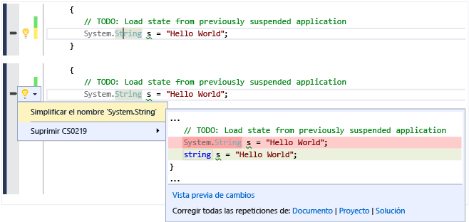
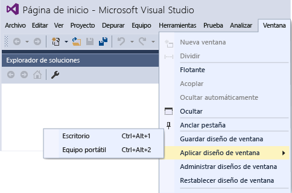
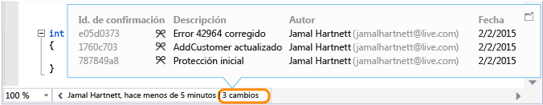

# Novedades de Visual Studio&#160;2015
[!INCLUDE[vs2017banner](../code-quality/includes/vs2017banner.md)]

Le damos la bienvenida a Visual Studio 2015, un conjunto integrado de herramientas de productividad, servicios en la nube y extensiones que permiten que usted y su equipo puedan crear fantásticas aplicaciones y juegos para Internet, la Tienda Windows, el escritorio, Android e iOS.  
  
 Esta página destaca algunas de las funciones más importantes que son nuevas a partir de Visual Studio 2013 RTM, incluidas funciones que se introdujeron en una de las actualizaciones de Visual Studio 2013. Para obtener la lista completa de las novedades de Visual Studio 2015, vea las [Notas de la versión](https://www.visualstudio.com/news/vs2015-vs).  
  
 Para obtener más información sobre las numerosas mejoras y características nuevas de Visual Studio ALM, consulte [Novedades de la Administración del ciclo de vida de las aplicaciones en Visual Studio 2015](http://msdn.microsoft.com/es-es/54b98a53-6083-4303-869a-8063d8fae938).  
  
## Una nueva experiencia de instalación  
 [!INCLUDE[downloadvs](../debugger/includes/downloadvs_md.md)]  
  
 La experiencia de instalación de Visual Studio de 2015 ha sido dividida en componentes para que solo tenga que instalar los elementos que necesita. Esto acelera la instalación de muchos escenarios comunes en el desarrollo .NET o Web. Si realiza otro tipo de desarrollo, como desarrollo móvil multiplataforma, o si trabaja en C\+\+ o F\#, elija la instalación **Personalizada** y seleccione los componentes y los SDK opcionales de terceros que necesite. También puede instalar cualquiera de los componentes personalizados más adelante. Por ejemplo, si elige la instalación básica y, a continuación, intente crear un nuevo proyecto de C\+\+, se le pedirá que descargue las herramientas de desarrollo de C\+\+.  
  
   
  
## Iniciar sesión en varias cuentas  
 Con Visual Studio 2015, la nueva experiencia de inicio de sesión simplificada se diseñó para simplificar en gran medida su acceso a recursos en línea, incluso si tiene varias cuentas de Visual Studio. Al iniciar sesión en Visual Studio, automáticamente se inicia su sesión en todas las instancias de Visual Studio 2015 y Blend en su máquina. Al iniciar sesión, la configuración empieza a transmitirse automáticamente. En Visual Studio 2015, su cuenta se comparte entre funciones para que, siempre que tenga un buen token, pueda obtener acceso a sus cuentas de Visual Studio Team Services desde **Team Explorer** y a recursos y sitios web desde su suscripción de Microsoft Azure desde el Explorador de servidores. Además, podrá ver sus recursos de Azure en el cuadro de diálogo Nuevo proyecto del proyecto para Application Insights y sus cuentas de Azure Mobile, Almacenamiento de Azure, [Microsoft Office 365](http://msdn.microsoft.com/office/aa905340.aspx) y [desarrollador de Saleforce.com](https://developer.salesforce.com/) en el nuevo cuadro de diálogo **Agregar un servicio conectado**.  
  
 Puede trabajar con varias cuentas de usuario en Visual Studio si las agrega sobre la marcha o a través del nuevo Administrador de cuentas. Luego, puede cambiar entre las cuentas también sobre la marcha cuando se conecte a los servicios o acceda a recursos en línea. Visual Studio recuerda las cuentas que agrega: así puede usarlas desde cualquier instancia de Visual Studio o Blend. Visual Studio también transmite la lista de cuentas \(sin las credenciales, evidentemente\) con su cuenta de personalización para que pueda empezar rápidamente a trabajar con una de esas cuentas en otro dispositivo. No olvide que puede quitar cuentas del cuadro de diálogo Configuración de la cuenta en cualquier momento. Para comenzar, vea [Trabajar con varias cuentas de usuario](../ide/work-with-multiple-user-accounts.md).  
  
   
  
## Elija las plataformas de destino  
 Visual Studio 2015 admite el desarrollo multiplataforma de dispositivos móviles. Puede escribir aplicaciones y juegos destinados a iOS, Android y Windows que compartan un código base común, todo desde el IDE de Visual Studio. Todos estos nuevos tipos de proyectos los verá en el cuadro de diálogo Archivo, Nuevo proyecto.  
  
 Además, la compatibilidad para las aplicaciones de escritorio clásicas es mejor que nunca, ya que trae muchas mejoras de lenguajes, bibliotecas y herramientas.  
  
### Aplicaciones móviles entre plataformas en C\# con Xamarin para Visual Studio  
 Xamarin es un marco de trabajo móvil que le permite escribir código en C\# que se enlaza de forma nativa a las API de iOS y Android. Microsoft se ha asociado con Xamarin en el lanzamiento de Xamarin para Visual Studio, una extensión que le permite desarrollar para Android, iOS y Windows Phone en una única solución con código compartido. Con Xamarin, usará un lenguaje y un código base con diferencias mínimas entre las plataformas.  Xamarin para Visual Studio es compatible con Visual Studio 2010 y versiones posteriores. La edición de inicio de Xamarin se incluye en Visual Studio de 2015. Para comenzar, vea [Compilar aplicaciones con interfaz de usuario nativa mediante Xamarin en Visual Studio](../cross-platform/build-apps-with-native-ui-using-xamarin-in-visual-studio.md).  
  
### Aplicaciones móviles multiplataforma en HTML\/JavaScript con Apache Cordova  
 Visual Studio Tools para Apache Cordova es el resultado de una estrecha colaboración entre Microsoft y la comunidad Apache Cordova de código abierto. Las herramientas permiten el desarrollo móvil entre plataformas usando HTML, CSS y JavaScript \(o Typescript\). Puede dirigirse a Android, iOS y Windows con un solo código base y disfrutar de la riqueza del IDE de Visual Studio, que incluye JavaScript IntelliSense, el Explorador DOM, la Consola JavaScript, puntos de interrupción, inspecciones, variables locales, Solo mi código y más.  Con Visual Studio Tools para Apache Cordova, sus aplicaciones tienen acceso a capacidades de dispositivos nativas en todas las plataformas a través de complementos que ofrecen una API común de JavaScript. Para comenzar, vea [Introducción a Visual Studio Tools para Apache Cordova](../Topic/Get%20Started%20with%20Visual%20Studio%20Tools%20for%20Apache%20Cordova1.md).  
  
### Juegos móviles entre plataformas en C\# con Unity  
 Unity es una plataforma muy usada en el desarrollo de juegos multiplataforma en 2D y 3D. Puede escribir un juego en C\# y ejecutarlo de forma nativa en Android, iOS, Windows Phone y muchas otras plataformas. Visual Studio Tools para Unity es una extensión que integra Unity con el IDE de Visual Studio. Con esta extensión, dispone de todas las funciones del IDE y el depurador de Visual Studio, además de las funciones de productividad diseñadas para desarrolladores de Unity. Visual Studio Tools para Unity 2.0 Preview 2 agrega compatibilidad con Visual Studio 2015, además de una serie de características nuevas, como, por ejemplo, una mejor visualización de los objetos en las ventanas Inspección y Variables locales. Microsoft ha adquirido hace poco SyntaxTree, los creadores de Visual Studio Tools para Unity. Para descargar Visual Studio Tools para Unity 2.0 Preview 2 y para obtener más información sobre Visual Studio Tools para Unity, vea [Visual Studio Tools para Unity 2.0](http://Aka.ms/vstu).  
  
### Aplicaciones y bibliotecas multiplataforma para C\+\+ nativo  
 C\+\+ es un lenguaje disponible de forma nativa en la mayoría de dispositivos móviles. Puede usarlo para escribir bibliotecas de código compartido multiplataforma que se pueden compilar y destinar a varias plataformas móviles. Incluso puede crear aplicaciones móviles completas en C\+\+. Visual C\+\+ contiene todas las herramientas para editar, compilar, implementar y depurar el código multiplataforma. Además de las plantillas para aplicaciones de Windows, puede crear proyectos a partir de plantillas de aplicaciones Android Native Activity, aplicaciones de iOS o proyectos de biblioteca de código compartido multiplataforma, entre las que se incluyen las aplicaciones híbridas de Xamarin. Gracias a su especificidad de plataforma, la característica Intellisense le permite explorar las API y generar el código correspondiente para Android, iOS o Windows. Puede configurar la compilación para las plataformas nativas x86 o ARM. Para la realización de pruebas, implemente el código en un simulador de iOS, en dispositivos iOS de un Mac conectado a la red, en dispositivos Android con conexión directa o use el emulador de Microsoft Visual Studio para Android. Puede establecer puntos de interrupción, ver las variables y la pila, y revisar el código de C\+\+ en el depurador de Visual Studio. El código se puede compartir entre varias plataformas de aplicación \(excepto el más específico\), y con una única solución en Visual Studio se puede compilar para todas esas plataformas.  
  
 Para empezar a trabajar en C\+\+ multiplataforma, vea [Compilar aplicaciones multiplataforma con Visual C\+\+](../misc/build-cross-platform-mobile-apps-with-visual-cpp.md).  
  
### Aplicaciones Windows universales para cualquier dispositivo con Windows 10  
 Con la Plataforma universal de Windows y nuestro núcleo de Windows, puede ejecutar la misma aplicación de Windows 10 en cualquier dispositivo, desde teléfonos a equipos de escritorio. Cree estas aplicaciones con Visual Studio 2015 y las herramientas de desarrollo de aplicaciones Windows universales.  
  
   
  
 Ejecute su aplicación en un teléfono con Windows 10, un equipo de escritorio con Windows 10 o una Xbox. Es el mismo paquete de aplicaciones. Con la introducción del núcleo unificado de Windows 10, un mismo paquete de la aplicación puede ejecutarse en todas las plataformas. Varias plataformas tienen SDK de extensión que puede agregar a su aplicación para aprovechar los comportamientos específicos de cada plataforma. Por ejemplo, un SDK de extensión para móvil controla la pulsación del botón atrás en un teléfono Windows. Si hace referencia a un SDK de extensión en su proyecto, solo tiene que agregar comprobaciones en tiempo de ejecución para comprobar que ese SDK se encuentre disponible en esa plataforma. Así es cómo puede tener el mismo paquete de aplicaciones para todas las plataformas.  
  
 Use C\#, Visual Basic, C\+\+ o JavaScript para crear estas [aplicaciones universales de Windows](http://msdn.microsoft.com/library/dn975273.aspx).  
  
### Web  
 ASP.NET 5 es una actualización principal para MVC, WebAPI y SignalR y se ejecuta en Windows, Mac y Linux.  ASP.NET 5 se ha diseñado desde la base para ofrecerle una pila de .NET eficiente y ajustable para compilar modernas aplicaciones basadas en la nube. Las herramientas de Visual Studio 2015 están más estrechamente integradas con ciertas herramientas de desarrollo web populares, como Bower y Grunt. Para empezar, vea todas las entradas de blog en el [Blog de desarrollo web y herramientas de .NET](http://blogs.msdn.com/b/webdev/).  
  
### Escritorio clásico y Tienda Windows  
 Visual Studio 2015 sigue siendo compatible con el escritorio clásico y el desarrollo de la Tienda Windows. La evolución de Visual Studio será paralela a la evolución de Windows.  En Visual Studio 2015, las bibliotecas y los lenguajes de .NET, así como los de C\+\+, han logrado avances significativos que se pueden aplicar a todas las versiones de Windows.  
  
#### .NET Framework  
 Microsoft [!INCLUDE[net_v46](../ide/includes/net_v46_md.md)] ofrece aproximadamente 150 API nuevas y 50 API actualizadas para admitir más escenarios. Por ejemplo, ahora más colecciones implementan <xref:System.Collections.Generic.IReadOnlyCollection%601>, lo que facilita su uso. Además, ASP.NET 5 \(mencionado previamente\) ofrece una plataforma .NET eficiente para compilar modernas aplicaciones basadas en la nube.  
  
 Las aplicaciones de la Tienda Windows escritas en C\# que tienen como destino .NET Framework ahora pueden aprovechar .NET Native, que compila las aplicaciones a código nativo en lugar de IL y [!INCLUDE[net_v46](../ide/includes/net_v46_md.md)] también agrega RyuJIT, un compilador Just\-In\-Time de 64\-bit Just\-In\-Time \(JIT\).  
  
 Los nuevos compiladores C\# y VB \("Roslyn"\) aceleran los tiempos de manera significativa y proporcionan API completas de análisis de código. Visual Studio 2015 aprovecha a Roslyn para proporcionar más refactorizaciones, entre ellas, el cambio de nombre alineado, analizadores y soluciones rápidas.  
  
 Los lenguajes C\# y Visual Basic contienen muchas pequeñas mejoras en el lenguaje básico y en la compatibilidad con IDE. Todas estas mejoras suman para hacer que su experiencia de codificación .NET sea incluso más intuitiva, práctica y productiva.  
  
 Para más información, vea [Novedades](../Topic/What's%20New%20in%20the%20.NET%20Framework.md) y el [blog de .NET](http://blogs.msdn.com/b/dotnet/).  
  
#### C\+\+  
 Visual C\+\+ proporciona importantes avances en compatibilidad con lenguaje C\+\+11\/14, compatibilidad con desarrollo multiplataforma de dispositivos móviles, compatibilidad con funciones reanudables y await \(actualmente planeado para la estandarización en C\+\+17\), mejoras y correcciones de errores en la Biblioteca en tiempo de ejecución de C \(CRT\) e implementaciones de la Biblioteca estándar de C\+\+ \(STL\), cuadros de diálogo de tamaño modificable en MFC, nuevas optimizaciones del compilador, mejor rendimiento de la compilación, nuevas capacidades de diagnóstico y nuevas herramientas de productividad en el editor de código.  
  
 Para más información, vea [Novedades de Visual C\+\+](/visual-cpp/top/what-s-new-for-visual-cpp-in-visual-studio-2015) y el [blog de Visual C\+\+](http://blogs.msdn.com/b/vcblog/).  
  
## Barra de menús de la Vista previa del dispositivo  
 En los proyectos de la Plataforma universal de Windows, la barra de menús de la vista previa del dispositivo permite comprobar cómo se verá la interfaz de usuario XAML en diversos tamaños de pantalla.  
  
   
  
## Diagnóstico de gráficos de Visual Studio  
 A partir de Visual Studio 2013, el diagnóstico de gráficos de Visual Studio ha agregado muchas características nuevas, como el análisis de fotogramas, la compatibilidad con Windows Phone, la edición y aplicación del sombreador, y las herramientas de captura de línea de comandos. También ha agregado compatibilidad para poder depurar aplicaciones de DirectX12. Para obtener más información, vea [Diagnóstico de gráficos de Visual Studio](../debugger/visual-studio-graphics-diagnostics.md).  
  
## Conectarse a los servicios  
 Con Visual Studio 2015 es más fácil que nunca conectar su aplicación a los servicios.  El nuevo asistente Agregar servicio conectado configura su proyecto, agrega la compatibilidad de autenticación requerida y descarga los paquetes NuGet necesarios para que pueda empezar a codificar en su servicio rápidamente y sin problemas. El asistente Agregar servicio conectado también se integra con el nuevo Administrador de cuentas para que sea más fácil trabajar con varias suscripciones y cuentas de usuario. Visual Studio 2015 incluye compatibilidad de fábrica con los siguientes servicios \(si tiene una cuenta\):  
  
1.  Servicios móviles de Azure  
  
2.  Almacenamiento de Azure  
  
3.  Office 365 \(correo, contactos, calendarios, archivos, usuarios y grupos\)  
  
4.  Salesforce  
  
 Se agregarán servicios nuevos continuamente. Estos se pueden consultar haciendo clic en el vínculo "Buscar servicios nuevos" del asistente.  
  
   
  
## Diseñar su UI  
 La experiencia de Blend para diseñar interfaces de usuario de XAML se ha mejorado de forma notable. Blend se ha rediseñado totalmente para ofrecer una IU más intuitiva, capacidades de edición de XAML más potentes \(incluido IntelliSense\) y una mejor integración con Visual Studio. Para obtener más información, consulta [Designing XAML in Visual Studio and Blend for Visual Studio](../designers/designing-xaml-in-visual-studio.md).  
  
## Compatibilidad con la depuración entre plataformas  
 Puede usar Visual Studio para crear y depurar aplicaciones móviles nativas que se ejecutan en dispositivos Windows, iOS y Android. Use el [Emulador de Visual Studio para Android](http://blogs.msdn.com/b/visualstudioalm/archive/2014/11/12/introducing-visual-studio-s-emulator-for-android.aspx), o conecte un dispositivo y depure el código directamente en Visual Studio.  
  
-   **JavaScript \/ Cordova**. Use [Visual Studio Tools para Apache Cordova](http://msdn.microsoft.com/library/dn879821\(v=vs.140\).aspx) para compilar aplicaciones nativas para Windows, iOS y Android con JavaScript.  
  
     [Depurar la aplicación](../Topic/Debug%20Your%20App%20Built%20with%20Visual%20Studio%20Tools%20for%20Apache%20Cordova.md) en MSDN Library es una visión detallada de la compatibilidad de depuración de Visual Studio para Cordova.  
  
-   **C\# \/ Xamarin**. Use [Xamarin](http://msdn.microsoft.com/library/dn879698\(v=vs.140\).aspx) para compilar aplicaciones nativas para Windows, iOS y Android en Visual Studio con C\#.  
  
     [Depuración](http://developer.xamarin.com/guides/ios/deployment,_testing,_and_metrics/debugging_in_xamarin_ios/) \(iOS\) y [Depurar en dispositivo](http://developer.xamarin.com/guides/android/deployment,_testing,_and_metrics/debugging_with_xamarin_android/) en las [Guías para desarrolladores de Xamarin](http://developer.xamarin.com/guides) describen la experiencia de depuración.  
  
-   **C\+\+ \/ Android**. Use las plantillas de [Visual C\+\+ para el desarrollo móvil multiplataforma](http://msdnstage.redmond.corp.microsoft.com/library/dn872463\(v=vs.140\).aspx) junto con herramientas de terceros como el [NDK de Android](https://developer.android.com/tools/sdk/ndk/index.html) para crear aplicaciones nativas para Windows y Android.  
  
## Depuración y diagnósticos  
 Para obtener información sobre las novedades en depuración, vea [Lo nuevo para el depurador en Visual Studio 2015](../debugger/what’s-new-for-the-debugger-in-visual-studio-2015.md).  
  
 Para obtener información sobre las novedades en diagnóstico, vea [Novedades de las herramientas de diagnóstico](../profiling/what-s-new-in-profiling-tools.md).  
  
 Las herramientas siguientes se han introducido o mejorado para realizar diferentes tipos de diagnóstico y análisis en el código:  
  
### Sugerencias de rendimiento  
 Las sugerencias de rendimiento muestran el tiempo de ejecución de los métodos durante la depuración, lo que le permite detectar rápidamente los cuellos de botella sin tener que invocar al generador de perfiles. Para empezar, vea [PerfTips: información de rendimiento de un vistazo mientras se depura con Visual Studio](http://blogs.msdn.com/b/visualstudioalm/archive/2014/08/18/perftips-performance-information-at-a-glance-while-debugging-with-visual-studio.aspx).  
  
### Lista de errores  
 Ahora, la lista de errores permite filtrar en cualquier columna. También muestra una vista activa de los errores, las advertencias y los análisis de código en toda la solución de C\# o Visual Basic mientras escribe, incluso cuando un cambio en el código produce miles de advertencias. La nueva lista de errores es compatible con el uso existente. Para obtener más información, consulta [Lista de errores \(Ventana\)](../ide/reference/error-list-window.md).  
  
### Herramienta de uso de GPU  
 La herramienta de uso de GPU le ayuda a recopilar y analizar los datos de uso de GPU en aplicaciones y juegos de DirectX, así como a detectar si los cuellos de botella se originan en la CPU o la GPU. Para empezar a usar la herramienta, vea la [entrada del blog del equipo de Visual C\+\+](http://blogs.msdn.com/b/vcblog/archive/2014/09/05/gpu-usage-tool-in-visual-studio-2013-update-4-ctp1.aspx).  
  
## Análisis de código activo \(bombillas\)  
 El nuevo compilador Roslyn para C\# y Visual Basic no solo ofrece tiempos de compilación más rápidos, sino que también genera escenarios totalmente nuevos, como el análisis de código activo, que ofrece comentarios y sugerencias enriquecidos y personalizables directamente dentro del editor de código al escribir. En Visual Studio 2015, las bombillas aparecen en el margen izquierdo \(al usar el teclado\) o muestran información sobre herramientas \(al mantener el puntero del mouse sobre un error\). La bombilla dice en tiempo real que el compilador \(posiblemente usando un conjunto de reglas personalizado\) detectó un problema en el código y tiene una sugerencia para corregirlo. Cuando vea una bombilla, haga clic en ella para ver las sugerencias que puede llevar a cabo.  
  
   
  
## Disfrute de estas mejoras adicionales del IDE  
  
### Configuración sincronizada \(Configuración de roaming\)  
 Visual Studio 2013 introdujo Configuración sincronizada para algunas de las opciones que se configuran con más frecuencia, como Editor de texto, Enlaces de teclado, Tema, fuentes y colores, Inicio y Alias de entorno.  Visual Studio 2015 mejora esta experiencia sincronizando más opciones y sincronizando la configuración en la familia de aplicaciones de Visual Studio, como Professional, Enterprise, Express SKUs y Blend. Al iniciar sesión en Visual Studio 2015 por primera vez con la misma cuenta que usó en Visual Studio 2013, verá su configuración sincronizada aplicada desde Visual Studio 2013. Puede obtener acceso a su configuración al escribir “sync” en **Inicio rápido** o al navegar a **Herramientas \> Opciones \> Entorno \> Configuración sincronizada**.  
  
### Actualizaciones automáticas de extensión  
 Las extensiones instaladas de Visual Studio ahora se actualizarán automáticamente cuando haya disponible una versión nueva en la Galería de Visual Studio. Consulte [Buscar y usar extensiones de Visual Studio](../ide/finding-and-using-visual-studio-extensions.md) para obtener detalles sobre cómo personalizar las actualizaciones automáticas de extensión.  
  
### Menús Tipo título  
 Sus deseos son órdenes. Los menús de Visual Studio vuelven a ser tipo título de manera predeterminada. Sin embargo, si le gusta el estilo de TODO EN MAYÚSCULAS, puede establecerlo al inicio o en la página de propiedades **Herramientas \> Opciones \> General**.  
  
   
  
### Imágenes de alta resolución y compatibilidad táctil  
 Ahora, el IDE de Visual Studio tiene imágenes de verdadera alta resolución en pantallas más densas \(en áreas como menús, menús contextuales, barras de comando de ventanas de herramientas y en algunos proyectos del Explorador de soluciones\). Y en una pantalla táctil de la ventana del editor de código de Visual Studio, ahora puede usar gestos, como tocar y mantener presionado, reducir, puntear, etc., para acercarse, desplazarse, seleccionar texto e invocar menús contextuales.  
  
   
  
### Diseños personalizados  
 Puede crear, almacenar y transmitir diseños de ventana personalizados. Por ejemplo, puede definir un diseño preferido para usarlo en su máquina de escritorio y un diseño diferente para usarlo en un equipo portátil o un dispositivo de pantalla pequeña. O quizás prefiera un diseño para un proyecto de UI y otro para un proyecto de base de datos. Los enlaces de teclado le permiten cambiar rápidamente entre distintos diseños. Estos diseños están disponibles en cualquier instancia de Visual Studio cuando tiene iniciada la sesión. Para obtener más información, consulte [Crear diseños de ventana personalizados](../misc/create-custom-window-layouts.md).  
  
   
  
### Centro de notificaciones  
 La interfaz de usuario del centro de notificaciones se optimizó para que resulte más fácil analizar rápidamente. Se agregaron otros tipos de notificaciones, incluidos problemas de rendimiento, problemas de representación y bloqueos, y ahora se le puede indicar a Visual Studio que deje de mostrar una notificación. Para obtener más información, consulte [Notificaciones de Visual Studio](../ide/visual-studio-notifications.md).  
  
### CodeLens: detecte qué ocurrió con el código \(solo en las ediciones Enterprise y Professional\)  
 No pierda de vista su trabajo mientras busca información sobre el código sin salir del editor. Puede revisar los cambios y el historial de elementos de trabajo, errores, revisiones de código y demás para el código que se almacena en Visual Studio Team Services \(VSTS\) o en Team Foundation Server \(TFS\).  
  
 En Visual Studio Enterprise y Visual Studio Professional, ahora puede:  
  
-   Obtener el historial de un archivo de código completo en el editor de Visual Studio.  
  
       
  
-   Ver un gráfico que muestra las personas que cambiaron el código. Esto puede ayudarle a identificar patrones en los cambios de su equipo y a evaluar su impacto.  
  
       
  
-   Ver fácilmente cuándo se cambió el código por última vez.  
  
-   Detectar cambios en otras bifurcaciones que afectan a su código.  
  
 Vea [CodeLens](../ide/find-code-changes-and-other-history-with-codelens.md).  
  
### Herramientas de diseño y modelado \(solo para la edición Enterprise\)  
 **Mapas de código y gráficos de dependencias**  
  
 En Visual Studio Enterprise, cree mapas de código para visualizar y comprender dependencias concretas en el código. Podrá navegar entre estas relaciones mediante el mapa, que aparece junto a su código. Con los mapas de código le será más fácil realizar un seguimiento de su posición en el código mientras trabaja o depura el código, por lo que leerá menos código al tiempo que mejora su comprensión del diseño del mismo.  
  
 En esta versión, los menús contextuales de vínculos y elementos de código son mucho más fáciles de usar porque los comandos están agrupados en secciones relacionadas con la selección, edición y administración de grupos, y el cambio de diseño del contenido del grupo. Observe también que los proyectos de prueba se muestran en un estilo diferente al de otros proyectos, y que se han actualizado los iconos de elementos del mapa a una versión más apropiada.  
  
   
  
 Otras mejoras:  
  
-   **Se han mejorado los diagramas verticales**. En soluciones de Visual Studio de tamaño mediano y grande, ahora se puede usar un menú Arquitectura simplificado con el que se obtienen mapas de código de la solución más útiles. Los ensamblados de la solución se agrupan en las carpetas de la solución para que pueda verlos en contexto y aprovechar el esfuerzo invertido en la estructura de la solución. Inmediatamente se ven las referencias de proyecto y ensamblado y, a continuación, aparecen los tipos de vínculo. Además, los ensamblados externos a la solución se agrupan en una manera más compacta.  
  
-   **Los proyectos de prueba tienen un estilo diferente y se pueden filtrar**. Ahora resulta más fácil y rápido identificar proyectos de prueba en el mapa porque tienen un estilo diferente. Además, se pueden filtrar para permitir centrarse en el código de trabajo de la aplicación.  
  
-   **Los vínculos de dependencias externas se han simplificado**. Los vínculos de dependencia ya no representan la herencia de System.Object, System.ValueType, System.Enum y System.Delegate, lo que facilita ver las dependencias externas en el mapa del código.  
  
-   **La profundización en los vínculos de dependencia tiene en cuenta los filtros**. Obtenga un diagrama útil y claro cuando lo expanda para entender las contribuciones a un vínculo de dependencia. El diagrama aparece menos saturado y tiene en cuenta las opciones de filtración de vínculos que se seleccionen.  
  
-   **Los elementos de código se agregan a un mapa de código con su contexto**. Dado que los diagramas aparecen ahora con su contexto \(hasta la carpeta de ensamblado y solución, que se puede filtrar en caso necesario\), se obtienen diagramas más útiles al arrastrar y soltar elementos de código desde el Explorador de soluciones, la Vista de clases, el Explorador de objetos, o al seleccionar elementos en el Explorador de soluciones y elegir Mostrar en mapa de código.  
  
-   **Obtención más rápida de mapas de código reactivos**. Las operaciones de arrastrar y colocar producen un resultado inmediato y los vínculos entre los nodos se crean mucho más rápidamente, sin que ello afecte a las operaciones posteriores iniciadas por el usuario, como la expansión de un nodo o la solicitud de más nodos. Al crear mapas de código sin compilar la solución, todos los casos extremos y problemáticos—por ejemplo, cuando no se compilan los ensamblados— ahora se procesan.  
  
-   **Omitir la recompilación de la solución.** Mejora el rendimiento en la creación y edición de diagramas.  
  
-   **Filtrado de grupos y nodos de elementos de código**. Ordene rápidamente los mapas: muestre u oculte elementos de código por categoría y agrupe elementos de código por carpetas de solución, ensamblados, espacios de nombres, carpetas de proyecto y tipos.  
  
-   **Filtrado de relaciones para facilitar la lectura de diagramas**. El filtrado de vínculos ahora también se aplica a los vínculos entre grupos, por lo que la ventana de filtros es menos intrusiva que en versiones anteriores.  
  
-   **Creación de diagramas desde la Vista de clases y el Explorador de objetos**. Arrastre y coloque los archivos y ensamblados en un mapa nuevo o existente desde las ventanas Vista de clases y Examinador de objetos.  
  
 Vea [Asignar dependencias de sus soluciones](../modeling/map-dependencies-across-your-solutions.md).  
  
 **Otros cambios de diseño y modelado incluidos en esta versión:**  
  
-   **Diagramas de capas**. Actualice estos diagramas mediante la Vista de clases y el Explorador de objetos. A fin de cumplir los requisitos de diseño de software, use diagramas de capas para describir las dependencias deseadas para el software. Mantenga la coherencia del código con este diseño mediante la búsqueda de código que no cumpla estas restricciones y la validación de código futuro con esta línea base.  
  
-   **Diagramas de UML**. Ya no puede crear diagramas de clase UML y diagramas de secuencia a partir del código. Pero estos diagramas se pueden seguir creando usando nuevos elementos de UML.  
  
-   **Explorador de arquitectura**. El Explorador de arquitectura ya no se puede usar para crear diagramas. Pero se puede seguir usando el Explorador de soluciones.  
  
## Herramientas de extensibilidad de Visual Studio  
 Nunca ha sido tan fácil instalar las herramientas de extensibilidad de Visual Studio \(SDK de VS y plantillas\), ya que ahora se incluyen como componente opcional durante la instalación.  Las herramientas de extensibilidad permiten a los desarrolladores escribir extensiones para personalizar y agregar características a Visual Studio. Para obtener más información sobre la extensibilidad de Visual Studio, vea [Kit de desarrollo de software \(SDK\) de Visual Studio](../extensibility/visual-studio-sdk.md).  
  
 Si desea incluir las herramientas de extensibilidad con la instalación personalizada, las encontrará en **Características \/ Herramientas comunes \/ Herramientas de extensibilidad de Visual Studio**.  También puede instalar las herramientas de extensibilidad más tarde abriendo el cuadro de diálogo **Nuevo proyecto** y seleccionando el elemento **Instalar herramientas de extensibilidad de Visual Studio** en **Visual C\# \/ Extensibilidad**.  
  
## Proporcione comentarios.  
 ¿Por qué enviar comentarios al equipo de Visual Studio? Porque tomamos los comentarios de los clientes muy en serio. De hecho, revisamos detalladamente todos los comentarios que ingresan en nuestro sistema de comentarios. Sus comentarios impulsan muchas de nuestras acciones.  
  
### Envíe una sonrisa.  
 Sus comentarios acerca de lo que le gusta nos ayudan a entender cuándo cumplimos o superamos sus expectativas. Cuando diseñamos e implementamos nuevas características, usamos la información acerca de las características que le gustan como ayuda para nuestras decisiones de diseño. Por eso, si le gusta alguna característica de Visual Studio, cuéntenos. Es fácil y puede hacerlo directamente desde el IDE.  
  
 Solo haga clic en la cara sonriente amarilla en la barra de título, díganos qué le gustó y luego haga clic en el botón **Enviar una sonrisa**.  
  
 ¡Eso es todo\! Enviaremos su comentario al equipo correcto, donde se felicitarán entre ellos y rápidamente comenzarán a pensar en diferentes maneras de deleitarlo aún más.  
  
### Envíe una desaprobación  
 Sus comentarios acerca de todo lo que necesitamos mejorar en los productos nos ayuda a administrar nuestro trabajo, al enfocarnos principalmente en aquellas cosas que son más importantes para nuestros clientes. Si hay algo que le molesta, cuéntenos a través de la función **Enviar una desaprobación** directamente desde el IDE. También hemos hecho que este proceso sea muy sencillo:  
  
 Haga clic en la cara sonriente amarilla en la barra de título y luego haga clic en **Enviar una desaprobación**. Cuéntenos qué no le gusta y luego haga clic en el botón Enviar una desaprobación. Para obtener más información, consulta [Hable con nosotros](../ide/talk-to-us.md).  
  
### Informe bloqueos, caídas y problemas de rendimiento.  
 En ocasiones, solo una nota rápida en una desaprobación no es suficiente para describir el impacto total de algo que no le gusta. En aquellos casos en los que experimenta un bloqueo, una caída o algún problema de rendimiento, puede compartir fácilmente pasos de reproducción, volcados de memoria y archivos de seguimiento, al usar el cuadro de diálogo que aparece luego de que envía una desaprobación.  
  
 Primero, envíe una desaprobación tal como se describió anteriormente. En el cuadro de diálogo que aparece, puede etiquetar su comentario con una de las etiquetas predeterminadas o puede crear su propia etiqueta. Las etiquetas nos ayudan a enviar su comentario al equipo de características correspondiente. En la lista desplegable **Elegir una categoría**, seleccione la opción que representa el problema que está informando y luego siga los pasos para reproducir el problema. También se encuentran disponibles los pasos detallados sobre cómo usar Visual Studio para enviar comentarios. Para obtener más información, consulta [Instrucciones de la función Enviar una sonrisa de Visual Studio](../Topic/Visual%20Studio%20Send%20a%20Smile%20Instructions.md).  
  
### Realice un seguimiento de su problema en Connect  
 Si desea realizar un seguimiento del estado de su comentario sobre Visual Studio 2015, vaya a [Connect](http://connect.microsoft.com/) y notifique el error allí. Después de informar el error, podrá regresar a Connect para llevar a cabo el seguimiento del estado.  
  
## Vea también  
 [Compilar aplicaciones multiplataforma con Apache Cordova](../Topic/Build%20cross-platform%20apps%20with%20Visual%20Studio%20Tools%20for%20Apache%20Cordova.md)   
 [Compilar aplicaciones con interfaz de usuario nativa mediante Xamarin en Visual Studio](../cross-platform/build-apps-with-native-ui-using-xamarin-in-visual-studio.md)   
 [Compilar aplicaciones multiplataforma con Visual C\+\+](../misc/build-cross-platform-mobile-apps-with-visual-cpp.md)   
 [Generar pruebas unitarias para el código con IntelliTest](../test/generate-unit-tests-for-your-code-with-intellitest.md)   
 [Trabajar con varias cuentas de usuario](../ide/work-with-multiple-user-accounts.md)   
 [Crear diseños de ventana personalizados](../misc/create-custom-window-layouts.md)   
 [Realizar acciones rápidas con las bombillas](../ide/perform-quick-actions-with-light-bulbs.md)   
 [Novedades de administración del ciclo de vida de las aplicaciones en Visual Studio 2015](http://msdn.microsoft.com/es-es/54b98a53-6083-4303-869a-8063d8fae938)