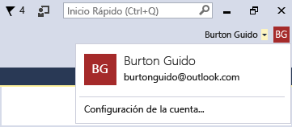

# Trabajar con varias cuentas de usuario

Si tiene varias cuentas de Microsoft y/o cuentas profesionales o educativas, puede agregarlas todas a Visual Studio para que pueda acceder a los recursos desde cualquier cuenta sin tener que iniciar sesión separadamente. Los servicios de Azure, Application Insights, Azure DevOps y Microsoft 365 admiten todos la experiencia de inicio de sesión simplificada.

Después de agregar varias cuentas en un equipo, el conjunto de cuentas lo acompañará si inicia sesión en Visual Studio desde otro equipo.

> [!NOTE]
> Aunque los nombres de cuenta tienen movilidad, las credenciales no. Se le pedirá que escriba las credenciales de las otras cuentas la primera vez que intente usar sus recursos en un equipo nuevo.

En este artículo se explica cómo agregar varias cuentas a Visual Studio. También se indica cómo ver reflejados los recursos accesibles desde esas cuentas en sitios como el cuadro de diálogo **Agregar servicio conectado**, en el **Explorador de servidores** y en **Team Explorer**.

## Iniciar sesión en Visual Studio

Inicie sesión en Visual Studio con una cuenta Microsoft o una cuenta profesional. Debería ver su nombre de usuario en la esquina superior de la ventana, tal como se muestra a continuación:

### Obtener acceso a su cuenta de Azure en el Explorador de servidores

Para abrir el Explorador de servidores, elija **Ver** > **Explorador de servidores** (o, si usa la [configuración de entorno](../ide/environment-settings.md) "General", presione **Ctrl**+**Alt**+**S**). Expanda el nodo **Azure** y fíjese en que contiene los recursos disponibles en la cuenta de Azure que está asociada con la cuenta que ha usado para iniciar sesión en Visual Studio. El aspecto debe ser similar al de la siguiente imagen:

La primera vez que use Visual Studio en cualquier dispositivo específico, el cuadro de diálogo solo muestra las suscripciones registradas en la cuenta con la que ha iniciado sesión. Puede acceder a los recursos de cualquiera de las demás cuentas directamente desde el **Explorador de servidores**: haga clic con el botón derecho en el nodo de **Azure**, elija **Administrar y filtrar suscripciones** y, luego, agregue las cuentas desde el control de selector de cuenta. Si lo desea, después puede elegir otra cuenta haciendo clic en la flecha hacia abajo y eligiendo en la lista de cuentas. Después de elegir la cuenta, puede indicar qué suscripciones de esa cuenta se van a mostrar en el **Explorador de servidores**.

La próxima vez que abra el **Explorador de servidores**, se mostrarán los recursos de esa suscripción.

### Obtener acceso a su cuenta de Azure a través del cuadro de diálogo Agregar servicio conectado

1. Abra un proyecto existente o cree uno.

1. Seleccione el nodo de proyecto en el **Explorador de soluciones** y, después, haga clic con el botón derecho y seleccione **Agregar** > **Servicio conectado**.

   Se abre el asistente **Agregar servicio conectado** con la lista de servicios de la cuenta de Azure que está asociada con la cuenta de personalización de Visual Studio. No tiene que iniciar sesión por separado en Azure. Sin embargo, deberá iniciar sesión en las otras cuentas la primera vez que intente acceder a sus recursos desde otro equipo.

### Obtener acceso a Azure Active Directory en un proyecto web

Azure Active Directory (AAD) ofrece compatibilidad con el inicio de sesión único de usuario final en las aplicaciones web ASP.NET MVC o autenticación AD en los servicios de API web. La autenticación de dominio es diferente de la autenticación de cuentas de usuario individuales; los usuarios que tienen acceso a su dominio de Active Directory pueden usar las cuentas de AAD que poseen para conectarse a sus aplicaciones web. Las aplicaciones de Microsoft 365 también pueden utilizar la autenticación de dominio.

::: moniker range="vs-2017"

Para ver cómo funciona, cree un proyecto de **Aplicación web ASP.NET Core**. En el cuadro de diálogo **Nueva aplicación web ASP.NET Core**, elija la plantilla **Aplicación web** y, luego, elija **Cambiar autenticación**.

::: moniker-end

::: moniker range=">=vs-2019"

Para ver cómo funciona, cree un proyecto de **Aplicación web ASP.NET Core**. En la página **Crear una aplicación web ASP.NET Core**, elija la plantilla **Aplicación web** y, luego, elija **Cambiar** en **Autenticación**.

::: moniker-end

Aparece el cuadro de diálogo **Cambiar autenticación**, donde puede elegir el tipo de autenticación que se va a usar en la aplicación.

Para más información sobre los diferentes tipos de autenticación en ASP.NET, vea [Create ASP.NET web projects in Visual Studio](/aspnet/visual-studio/overview/2013/creating-web-projects-in-visual-studio#authentication-methods) (Crear proyectos web de ASP.NET en Visual Studio).

### Acceder a su organización de Azure DevOps

En el menú principal, elija **Equipo** > **Administrar conexiones** para abrir la ventana **Team Explorer - Conectar**. Elija **Administrar conexiones** > **Conectar a un proyecto**. En el cuadro de diálogo **Conectar a un proyecto**, seleccione un proyecto de la lista (o seleccione **Agregar servidor TFS** y escriba la dirección URL de su servidor). Cuando seleccione la dirección URL, iniciará sesión sin tener que volver a escribir las credenciales.

Para más información, vea [Connect to projects in Team Explorer](connect-team-project.md) (Conectarse a proyectos en Team Explorer).

## Agregar otra cuenta a Visual Studio

Para agregar otra cuenta a Visual Studio:

1. Elija **Archivo** > **Configuración de la cuenta**.

1. En **Todas las cuentas**, elija **Agregar una cuenta**.

1. En la página **Iniciar sesión en la cuenta**, seleccione la cuenta o elija **Usar otra cuenta**. Siga los avisos para escribir las credenciales de la cuenta nueva.

(Opcional) Vaya ahora al **Explorador de servidores** y vea los servicios de Azure asociados con la cuenta que acaba de agregar. En el **Explorador de servidores**, haga clic con el botón derecho en el nodo **Azure** y elija **Administrar y filtrar suscripciones**. Elija la nueva cuenta (haciendo clic en la flecha desplegable junto a la cuenta actual) y elija las suscripciones que desea mostrar en el **Explorador de servidores**. Debería ver todos los servicios asociados a la suscripción especificada. Aunque no tenga iniciada sesión en Visual Studio con la segunda cuenta, sí ha iniciado sesión en los servicios y recursos de esa cuenta. Lo mismo sirve para **Proyecto** > **Agregar servicio conectado** y **Equipo** > **Conectar con Team Foundation Server**.

### Agregar una cuenta mediante el flujo de código del dispositivo

En algunos casos, no se puede iniciar sesión ni agregar una cuenta de la forma habitual. Esto puede ocurrir si Internet Explorer está bloqueado por algún motivo o si la red está detrás de un firewall. Para solucionar este problema, puede habilitar el *flujo de código del dispositivo* para agregar una cuenta o volver a autenticarla. El flujo de código del dispositivo permite iniciar sesión en otro explorador o en otro equipo (sea este físico o virtual).

Para iniciar sesión mediante el flujo de código del dispositivo:

1. Abra la página [**Cuentas**](reference/accounts-environment-options-dialog-box.md) desde **Herramientas** > **Opciones** > **Entorno** y, después, seleccione **Habilitar el flujo de código del dispositivo al agregar o volver a autenticar una cuenta**. Seleccione **Aceptar** para cerrar las páginas de opciones.

1. Elija **Archivo** > **Configuración de la cuenta** para abrir la página de administración de cuentas.

1. Elija **Agregar una cuenta** en **Todas las cuentas**.

   Un cuadro de diálogo muestra una dirección URL y un código para pegarlo en un explorador web.

   

1. Presione **Ctrl**+**C** para copiar el texto del cuadro de diálogo y, luego, elija **Aceptar** para cerrar el cuadro de diálogo. Pegue el texto que ha copiado en un editor de texto, como el Bloc de notas. Así será más fácil copiar el código en el siguiente paso.

1. Vaya a la dirección URL de inicio de sesión de dispositivo en el equipo o explorador web que quiera usar para iniciar sesión en Visual Studio y, después, pegue o introduzca en el cuadro **Código** el código que ha copiado.

   El nombre de la aplicación **Visual Studio** debe aparecer más abajo en la página.

1. En **Visual Studio**, elija **Continuar**.

   

1. Siga las instrucciones para escribir las credenciales de su cuenta.

   Aparece una página que le indica que ha iniciado sesión en Visual Studio en el dispositivo y que puede cerrar la ventana del explorador.

   

1. Vuelva a la página de administración de cuentas de Visual Studio y verá que la cuenta recién agregada figura en **Todas las cuentas**. Elija **Cerrar**.

## Vea también

- [Inicio de sesión en Visual Studio](signing-in-to-visual-studio.md)
- [Iniciar sesión en Visual Studio para Mac](/visualstudio/mac/signing-in)
