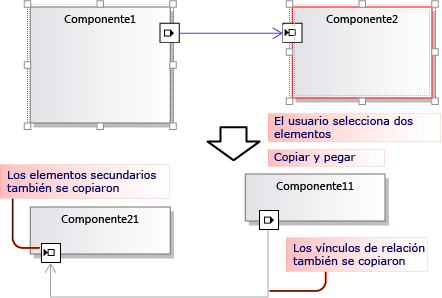
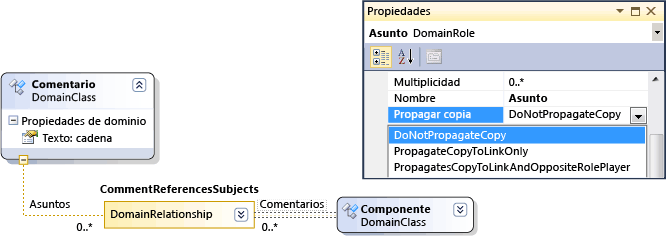
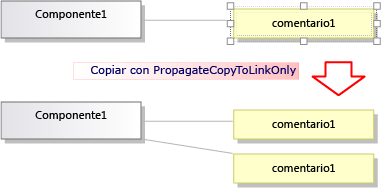
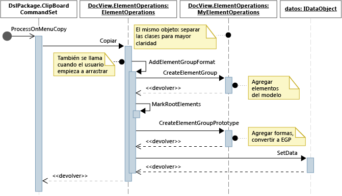
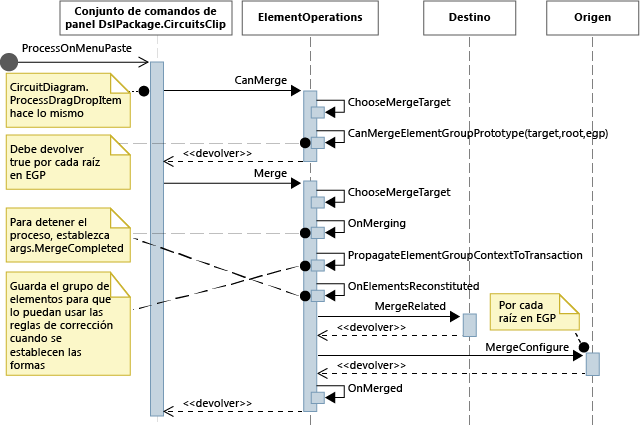

# <a name="customizing-copy-behavior"></a>Personalizar comportamiento de copia
En un lenguaje de específicos de dominio (DSL) creado con el SDK de modelado y visualización de Visual Studio, puede modificar lo que sucede cuando el usuario copia y pega elementos.

## <a name="standard-copy-and-paste-behavior"></a>Comportamiento estándar de copiar y pegar
 Para habilitar la copia, establezca el **habilitar copiar pegar** propiedad de la **Editor** nodo en el Explorador de DSL.

 De forma predeterminada, cuando el usuario copia elementos al portapapeles, también se copian los siguientes elementos:

- Descendientes incrustados de los elementos seleccionados. (Es decir, los elementos que son el destino de relaciones de incrustación con origen en los elementos copiados).

- Vínculos de relación entre los elementos copiados.

  Esta regla se aplica repetidamente a los elementos y vínculos copiados.

  

  Los elementos y vínculos copiados se serializan y almacenan en un <xref:Microsoft.VisualStudio.Modeling.ElementGroupPrototype> (EGP), que se coloca en el portapapeles.

  También se coloca una imagen de los elementos copiados en el portapapeles. Esto permite al usuario pegar en otras aplicaciones, como Word.

  El usuario puede pegar los elementos copiados en un destino que pueda aceptar los elementos de acuerdo con la definición de DSL. Por ejemplo, en un DSL generado a partir de la plantilla de solución de componentes, el usuario puede pegar puertos en los componentes, pero no en el diagrama, y puede pegar componentes en el diagrama, pero no en otros componentes.

## <a name="customizing-copy-and-paste-behavior"></a>Personalizar el comportamiento de copiar y pegar
 Para obtener más información acerca de cómo personalizar el modelo mediante el uso de código de programa, consulte [navegar y actualizar un modelo en el código de programa](../modeling/navigating-and-updating-a-model-in-program-code.md).

 **Habilitar o deshabilitar copiar, cortar y pegar.**
En el Explorador de DSL, establezca el **habilitar copiar pegar** propiedad de la **Editor** nodo.

 **Copiar vínculos al mismo destino.** Por ejemplo, para que un cuadro de comentarios copiado vinculado al mismo elemento de asunto.
Establecer el **Propagates Copy** propiedad del objeto role que **propagar copia a vínculo solo**. Para obtener más información, consulte [personalizar el comportamiento de copiar vínculos](#customizeLinks).

 Copiar elementos vinculados. Por ejemplo, cuando se copia un nuevo elemento, también se realizan copias de los cuadros de comentarios vinculados.
Establecer el **Propagates Copy** propiedad del objeto role que **propagar copia a vínculo y encargado de rol opuesto**. Para obtener más información, consulte [personalizar el comportamiento de copiar vínculos](#customizeLinks).

 **Duplicar elementos rápidamente copiando y pegando.** Normalmente, el elemento que acaba de copiar sigue seleccionado y no se puede pegar el mismo tipo de elemento en él.
Agregue una directiva de combinación de elementos a la clase de dominio y establézcala para que reenvíe las combinaciones a la clase primaria. Esto tendrá el mismo efecto en las operaciones de arrastrar. Para obtener más información, consulte [personalizar la creación de elemento y el movimiento](../modeling/customizing-element-creation-and-movement.md).

 \- o -

 Seleccione el diagrama antes de pegar los elementos; para ello, invalide `ClipboardCommandSet.ProcessOnPasteCommand()`. Agregue este código en un archivo personalizado, en el proyecto DslPackage:

```csharp
namespace Company.MyDsl {
using System.Linq;
using Microsoft.VisualStudio.Modeling.Diagrams;
using Microsoft.VisualStudio.Modeling.Shell;
partial class MyDslClipboardCommandSet
{
  protected override void ProcessOnMenuPasteCommand()
  {
 // Deselect the current selection after copying:
 Diagram diagram = (this.CurrentModelingDocView as SingleDiagramDocView).Diagram;
    this.CurrentModelingDocView
     .SelectObjects(1, new object[] { diagram }, 0);
  }
} }
```

 **Crear vínculos adicionales cuando el usuario pega en un destino seleccionado.** Por ejemplo, cuando un cuadro de comentarios se pega en un elemento, se crea un vínculo entre ellos.
Agregue una directiva de combinación de elementos a la clase de dominio de destino y establézcala para que procese la combinación agregando vínculos. Esto tendrá el mismo efecto en las operaciones de arrastrar. Para obtener más información, consulte [personalizar la creación de elemento y el movimiento](../modeling/customizing-element-creation-and-movement.md).

 \- o -

 Invalide `ClipboardCommandSet.ProcessOnPasteCommand()` para crear vínculos adicionales después de llamar al método base.

 **Personalizar los formatos en los que se pueden copiar elementos** a aplicaciones externas - por ejemplo, para agregar un borde al formulario de mapa de bits.
Invalidar *Midsl* `ClipboardCommandSet.ProcessOnMenuCopyCommand()` en el proyecto DslPackage.

 **Personalizar cómo se copian los elementos en el Portapapeles con el comando Copiar, pero no en una operación de arrastre.**
Invalidar *Midsl* `ClipboardCommandSet.CopyModelElementsIntoElementGroupPrototype()` en el proyecto DslPackage.

 **Conservar el diseño de la forma mediante copiar y pegar.**
Cuando el usuario copia varias formas, puede conservar su posición relativa cuando se peguen. Esta técnica se muestra en el ejemplo en [VMSDK: diagramas de circuitos](http://go.microsoft.com/fwlink/?LinkId=213879).

 Para lograr este efecto, agregue las formas y conectores al ElementGroupPrototype copiado. El método más cómodo para invalidar es ElementOperations.CreateElementGroupPrototype(). Para ello, agregue el siguiente código al proyecto Dsl:

```csharp

public class MyElementOperations : DesignSurfaceElementOperations
{
  // Create an EGP to add to the clipboard.
  // Called when the elements to be copied have been
  // collected into an ElementGroup.
 protected override ElementGroupPrototype CreateElementGroupPrototype(ElementGroup elementGroup, ICollection<ModelElement> elements, ClosureType closureType)
  {
 // Add the shapes and connectors:
 // Get the elements already in the group:
    ModelElement[] mels = elementGroup.ModelElements
        .Concat(elementGroup.ElementLinks) // Omit if the paste target is not the diagram.
        .ToArray();
 // Get their shapes:
    IEnumerable<PresentationElement> shapes =
       mels.SelectMany(mel =>
            PresentationViewsSubject.GetPresentation(mel));
    elementGroup.AddRange(shapes);

 return base.CreateElementGroupPrototype
           (elementGroup, elements, closureType);
  }

 public MyElementOperations(IServiceProvider serviceProvider, ElementOps1Diagram diagram)
      : base(serviceProvider, diagram)
  { }
}

// Replace the standard ElementOperations
// singleton with your own:
partial class MyDslDiagram // EDIT NAME
{
 /// <summary>
 /// Singleton ElementOperations attached to this diagram.
 /// </summary>
 public override DesignSurfaceElementOperations ElementOperations
  {
 get
    {
 if (singleton == null)
      {
        singleton = new MyElementOperations(this.Store as IServiceProvider, this);
      }
 return singleton;
    }
  }
 private MyElementOperations singleton = null;
}
```

 **Pegar formas en la ubicación elegida, como la posición actual del cursor.**
Cuando el usuario copia varias formas, puede conservar su posición relativa cuando se peguen. Esta técnica se muestra en el ejemplo en [VMSDK: diagramas de circuitos](http://go.microsoft.com/fwlink/?LinkId=213879).

 Para lograr este efecto, invalide `ClipboardCommandSet.ProcessOnMenuPasteCommand()` para usar la versión específica de la ubicación de `ElementOperations.Merge()`. Para ello, agregue el siguiente código al proyecto DslPackage:

```csharp

partial class MyDslClipboardCommandSet // EDIT NAME
{
   /// <summary>
    /// This method assumes we only want to paste things onto the diagram
    /// - not onto anything contained in the diagram.
    /// The base method pastes in a free space on the diagram.
    /// But if the menu was used to invoke paste, we want to paste in the cursor position.
    /// </summary>
    protected override void ProcessOnMenuPasteCommand()
    {

  NestedShapesSampleDocView docView = this.CurrentModelingDocView as NestedShapesSampleDocView;

      // Retrieve data from clipboard:
      System.Windows.Forms.IDataObject data = System.Windows.Forms.Clipboard.GetDataObject();

      Diagram diagram = docView.CurrentDiagram;
      if (diagram == null) return;

      if (!docView.IsContextMenuShowing)
      {
        // User hit CTRL+V - just use base method.

        // Deselect anything that's selected, otherwise
        // pasted item will be incompatible:
        if (!this.IsDiagramSelected())
        {
          docView.SelectObjects(1, new object[] { diagram }, 0);
        }

        // Paste into a convenient spare space on diagram:
    base.ProcessOnMenuPasteCommand();
      }
      else
      {
        // User right-clicked - paste at mouse position.

        // Utility class:
        DesignSurfaceElementOperations op = diagram.ElementOperations;

        ShapeElement pasteTarget = diagram;

        // Check whether what's in the paste buffer is acceptable on the target.
        if (pasteTarget != null && op.CanMerge(pasteTarget, data))
        {

        // Although op.Merge would be a no-op if CanMerge failed, we check CanMerge first
          // so that we don't create an empty transaction (after which Undo would be no-op).
          using (Transaction t = diagram.Store.TransactionManager.BeginTransaction("paste"))
          {
            PointD place = docView.ContextMenuMousePosition;
            op.Merge(pasteTarget, data, PointD.ToPointF(place));
            t.Commit();
          }
        }
      }
    }
  }
```

 **Permitir que el usuario arrastre y coloque elementos.**
Consulte [Cómo: agregar un controlador de arrastrar y colocar](../modeling/how-to-add-a-drag-and-drop-handler.md).

## <a name="customizeLinks"></a> Personalizar el comportamiento de copiar vínculos
 Cuando el usuario copia un elemento, el comportamiento estándar es que los elementos incrustados también se copien. Puede modificar el comportamiento estándar de la operación de copiar. En la definición de DSL, seleccione un rol en un lado de una relación y, en la ventana de propiedades establecidas la **Propagates Copy** valor.

 

 Existen tres valores:

- Do not propagate copy (No propagar copia)

- Propagate copy to link only (Propagar copia solo a vínculo): cuando se pega el grupo, la nueva copia de este vínculo hará referencia al elemento existente en el otro extremo del vínculo.

- Propagate copy to link and opposite role player (Propagar copia a vínculo y encargado de rol opuesto): el grupo copiado incluye una copia del elemento en el otro extremo del vínculo.

  

  Los cambios que haga afectarán a los elementos y a la imagen que se copie.

## <a name="programming-copy-and-paste-behavior"></a>Programar el comportamiento de copiar y pegar
 Muchos aspectos del comportamiento de un DSL con respecto a copiar, pegar, creación y eliminación de objetos se rigen por una instancia de <xref:Microsoft.VisualStudio.Modeling.ElementOperations> que está acoplada al diagrama. Puede modificar el comportamiento del DSL, derive su propia clase de <xref:Microsoft.VisualStudio.Modeling.ElementOperations> e invalidar la <xref:Microsoft.VisualStudio.Modeling.Diagrams.Diagram.ElementOperations%2A> propiedad de la clase del diagrama.

> [!TIP]
>  Para obtener más información acerca de cómo personalizar el modelo mediante el uso de código de programa, consulte [navegar y actualizar un modelo en el código de programa](../modeling/navigating-and-updating-a-model-in-program-code.md).

 

 

#### <a name="to-define-your-own-elementoperations"></a>Para definir sus propias ElementOperations

1. En un nuevo archivo del proyecto de DSL, cree una clase que derive de <xref:Microsoft.VisualStudio.Modeling.Diagrams.DesignSurfaceElementOperations>.

2. Agregue una definición de clase parcial para su diagrama de clase. El nombre de esta clase puede encontrarse en **Dsl\GeneratedCode\Diagrams.cs**.

    En la clase de diagrama, invalide <xref:Microsoft.VisualStudio.Modeling.Diagrams.Diagram.ElementOperations%2A> para devolver una instancia de su subclase ElementOperations. Debe devolver la misma instancia en cada llamada.

   Agregue este código en un archivo de código personalizado, en el proyecto DslPackage:

```csharp

using Microsoft.VisualStudio.Modeling;
using Microsoft.VisualStudio.Modeling.Diagrams;
using Microsoft.VisualStudio.Modeling.Diagrams.ExtensionEnablement;

  public partial class MyDslDiagram
  {
    public override DesignSurfaceElementOperations ElementOperations
    {
      get
      {
        if (this.elementOperations == null)
        {
          this.elementOperations = new MyElementOperations(this.Store as IServiceProvider, this);
        }
        return this.elementOperations;
      }
    }
    private MyElementOperations elementOperations = null;
  }

  public class MyElementOperations : DesignSurfaceElementOperations
  {
    public MyElementOperations(IServiceProvider serviceProvider, MyDslDiagram diagram)
      : base(serviceProvider, diagram)
    { }
    // Overridden methods follow
  }
```

## <a name="receiving-items-dragged-from-other-models"></a>Recibir elementos arrastrados de otros modelos
 ElementOperations también se puede usar para definir el comportamiento de copiar, mover, eliminar y arrastrar y colocar. Para demostrar el uso de ElementOperations, el ejemplo que se proporciona define un comportamiento de arrastrar y colocar personalizado. Sin embargo, para ello podría considerar el enfoque alternativo descrito en [Cómo: agregar un controlador de arrastrar y colocar](../modeling/how-to-add-a-drag-and-drop-handler.md), que es más extensible.

 Defina dos métodos en su clase ElementOperations:

-   `CanMerge(ModelElement targetElement, System.Windows.Forms.IDataObject data)` que determina si el elemento de origen se puede arrastrar a la forma, conector o diagrama de destino.

-   `MergeElementGroupPrototype(ModelElement targetElement, ElementGroupPrototype sourcePrototype)` que combina el elemento de origen en el destino.

### <a name="canmerge"></a>CanMerge()
 Se llama a `CanMerge()` para determinar los comentarios que se deben proporcionar al usuario mientras el mouse se mueve por el diagrama. Los parámetros del método son el elemento sobre el cual se mantiene el mouse y los datos sobre el origen desde el cual se realizó la operación de arrastrar. El usuario puede arrastrar desde cualquier lugar de la pantalla. Por lo tanto, el objeto de origen puede ser de muchos tipos diferentes y se puede serializar con diferentes formatos. Si el origen es un DSL o un modelo UML, el parámetro de datos es la serialización de un <xref:Microsoft.VisualStudio.Modeling.ElementGroupPrototype>. Las operaciones de arrastrar, copiar y cuadro de herramientas usan prototipos de grupos de elementos para representar fragmentos de modelos.

 Un prototipo de grupo de elementos puede contener cualquier número de elementos y vínculos. Los tipos de elemento se pueden identificar por sus GUID. El GUID es el de la forma que se arrastró, no el del elemento de modelo subyacente. En el ejemplo siguiente, `CanMerge()` devuelve true si se arrastra una forma de clase desde un diagrama UML a este diagrama.

```csharp
public override bool CanMerge(ModelElement targetShape, System.Windows.Forms.IDataObject data)
 {
  // Extract the element prototype from the data.
  ElementGroupPrototype prototype = ElementOperations.GetElementGroupPrototype(this.ServiceProvider, data);
  if (targetShape is MyTargetShape && prototype != null &&
        prototype.RootProtoElements.Any(rootElement =>
          rootElement.DomainClassId.ToString()
          ==  "3866d10c-cc4e-438b-b46f-bb24380e1678")) // Guid of UML Class shapes
          // or SourceClass.DomainClassId
        return true;
   return base.CanMerge(targetShape, data);
 }
```

## <a name="mergeelementgroupprototype"></a>MergeElementGroupPrototype()
 Se llama a este método cuando el usuario coloca un elemento en un diagrama, una forma o un conector. Debe combinar el contenido arrastrado en el elemento de destino. En este ejemplo, el código determina si reconoce la combinación de los tipos del destino y el prototipo; si lo hace, el método convierte los elementos arrastrados en un prototipo de los elementos que se deben agregar al modelo. Se llama al método base para realizar la combinación, ya sea de los elementos convertidos o no convertidos.

```csharp
public override void MergeElementGroupPrototype(ModelElement targetShape, ElementGroupPrototype sourcePrototype)
{
  ElementGroupPrototype prototypeToMerge = sourcePrototype;
  MyTargetShape pel = targetShape as MyTargetShape;
  if (pel != null)
  {
    prototypeToMerge = ConvertDraggedTypeToLocal(pel, sourcePrototype);
  }
  if (prototypeToMerge != null)
    base.MergeElementGroupPrototype(targetShape, prototypeToMerge);
}
```

 Este ejemplo trata con los elementos de clases UML arrastrados desde un diagrama de clases UML. El DSL no está diseñado para almacenar clases UML directamente; en cambio, creamos un elemento de DSL para cada clase UML arrastrada. Esto resultaría útil, por ejemplo, si el DSL es un diagrama de instancia. El usuario podría arrastrar clases al diagrama para crear instancias de esas clases.

```csharp

private ElementGroupPrototype ConvertDraggedTypeToLocal (MyTargetShape snapshot, ElementGroupPrototype prototype)
{
  // Find the UML project:
  EnvDTE.DTE dte = snapshot.Store.GetService(typeof(EnvDTE.DTE)) as EnvDTE.DTE;
  foreach (EnvDTE.Project project in dte.Solution.Projects)
  {
    IModelingProject modelingProject = project as IModelingProject;
    if (modelingProject == null) continue; // not a modeling project
    IModelStore store = modelingProject.Store;
    if (store == null) continue;
    // Look for the shape that was dragged:
    foreach (IDiagram umlDiagram in store.Diagrams())
    {
      // Get modeling diagram that implements UML diagram:
      Diagram diagram = umlDiagram.GetObject<Diagram>();
      Guid elementId = prototype.SourceRootElementIds.FirstOrDefault();
      ShapeElement shape = diagram.Partition.ElementDirectory.FindElement(elementId) as ShapeElement;
      if (shape == null) continue;
      IClass classElement = shape.ModelElement as IClass;
      if (classElement == null) continue;

      // Create a prototype of elements in my DSL, based on the UML element:
      Instance instance = new Instance(snapshot.Store);
      instance.Type = classElement.Name;
      // Pack them into a prototype:
      ElementGroup group = new ElementGroup(instance);
      return group.CreatePrototype();
    }
  }
  return null;
}
```

## <a name="standard-copy-behavior"></a>Comportamiento estándar de copiar
 El código de esta sección muestra los métodos que puede invalidar para alterar el comportamiento de copiar. Para ayudarle a ver cómo conseguir sus propias personalizaciones, esta sección muestra el código que invalida los métodos implicados en la copia, pero no cambia el comportamiento estándar.

 Cuando el usuario presiona CTRL+C o usa el comando de menú Copiar, se llama al método <xref:Microsoft.VisualStudio.Modeling.Shell.ClipboardCommandSet.ProcessOnMenuCopyCommand%2A>. Puede ver cómo esto se configura **DslPackage\Generated Code\CommandSet.cs**. Para obtener más información acerca de cómo de comandos, consulte [Cómo: agregar un comando al menú contextual](../modeling/how-to-add-a-command-to-the-shortcut-menu.md).

 Puede invalidar la processonmenucopycommand, puede agregar una definición de clase parcial de *Midsl* `ClipboardCommandSet` en el proyecto DslPackage.

```csharp
using System.Collections.Generic;
using System.Drawing;
using System.Windows.Forms;
using Microsoft.VisualStudio.Modeling;
using Microsoft.VisualStudio.Modeling.Diagrams;

partial class MyDslClipboardCommandSet
{
  /// <summary>
  /// Override ProcessOnMenuCopyCommand() to copy elements to the
  /// clipboard in different formats, or to perform additional tasks
  /// before or after copying - for example deselect the copied elements.
  /// </summary>
  protected override void ProcessOnMenuCopyCommand()
  {
    IList<ModelElement> selectedModelElements = this.SelectedElements;
    if (selectedModelElements.Count == 0) return;

    // System container for clipboard data.
    // The IDataObject can contain data in several formats.
    IDataObject dataObject = new DataObject();

    Bitmap bitmap = null; // For export to other programs.
    try
    {
      #region Create EGP for copying to a DSL.
      this.CopyModelElementsIntoElementGroupPrototype
                     (dataObject, selectedModelElements);
      #endregion

      #region Create bitmap for copying to another application.
      // Find all the shapes associated with this selection:
      List<ShapeElement> shapes = new List<ShapeElement>(
        this.ResolveExportedShapesForClipboardImages
              (dataObject, selectedModelElements));

      bitmap = this.CreateBitmapForClipboard(shapes);
      if (bitmap != null)
      {
        dataObject.SetData(DataFormats.Bitmap, bitmap);
      }
      #endregion

      // Add the data to the clipboard:
      Clipboard.SetDataObject(dataObject, true, 5, 100);
    }
    finally
    {
      // Dispose bitmap after SetDataObject:
      if (bitmap != null) bitmap.Dispose();
    }
  }
/// <summary>
/// Override this to customize the element group that is copied to the clipboard.
/// </summary>
protected override void CopyModelElementsIntoElementGroupPrototype(IDataObject dataObject, IList<ModelElement> selectedModelElements)
{
  return this.ElementOperations.Copy(dataObject, selectedModelElements);
}
}
```

 Cada diagrama tiene una instancia singleton de ElementOperations. Puede suministrar su propia derivada. Este archivo, que se puede colocar en el proyecto de DSL, se comportaría igual que el código que invalida:

```csharp
using System;
using System.Collections.Generic;
using System.Linq;
using Microsoft.VisualStudio.Modeling;
using Microsoft.VisualStudio.Modeling.Diagrams;

namespace Company.MyDsl
{
  partial class MyDslDiagram
  {
    /// <summary>
    /// Singleton ElementOperations attached to this diagram.
    /// </summary>
    public override DesignSurfaceElementOperations ElementOperations
    {
      get
      {
        if (this.elementOperations == null)
        {
          this.elementOperations = new MyElementOperations(this.Store as IServiceProvider, this);
        }
        return this.elementOperations;
      }
    }
    private MyElementOperations elementOperations = null;
  }

  // Our own version of ElementOperations so that we can override:
  public class MyElementOperations : DesignSurfaceElementOperations
  {
    public MyElementOperations(IServiceProvider serviceProvider, ElementOps1Diagram diagram)
      : base(serviceProvider, diagram)
    { }

    /// <summary>
    /// Copy elements to the clipboard data.
    /// Provides a hook for adding custom data.
    /// </summary>
    public override void Copy(System.Windows.Forms.IDataObject data,
      ICollection<ModelElement> elements,
      ClosureType closureType,
      System.Drawing.PointF sourcePosition)
    {
      if (CanAddElementGroupFormat(elements, closureType))
      {
        AddElementGroupFormat(data, elements, closureType);
      }

      // Override these to store additional data:
      if (CanAddCustomFormat(elements, closureType))
      {
        AddCustomFormat(data, elements, closureType, sourcePosition);
      }
    }

    protected override void AddElementGroupFormat(System.Windows.Forms.IDataObject data, ICollection<ModelElement> elements, ClosureType closureType)
    {
      // Add the selected elements and those implied by the propagate copy rules:
      ElementGroup elementGroup = this.CreateElementGroup(elements, closureType);

      // Mark all the elements that are not embedded under other elements:
      this.MarkRootElements(elementGroup, elements, closureType);

      // Store in the clipboard data:
      ElementGroupPrototype elementGroupPrototype = this.CreateElementGroupPrototype(elementGroup, elements, closureType);
      data.SetData(ElementGroupPrototype.DefaultDataFormatName, elementGroupPrototype);
    }

    /// <summary>
    /// Override this to store additional elements in the element group:
    /// </summary>
    protected override ElementGroupPrototype CreateElementGroupPrototype(ElementGroup elementGroup, ICollection<ModelElement> elements, ClosureType closureType)
    {
      ElementGroupPrototype prototype = new ElementGroupPrototype(this.Partition, elementGroup.RootElements, elementGroup);
      return prototype;
    }

    /// <summary>
    /// Create an element group from the given starting elements, using the
    /// copy propagation rules specified in the DSL Definition.
    /// By default, this includes all the embedded descendants of the starting elements,
    /// and also includes reference links where both ends are already included.
    /// </summary>
    /// <param name="startElements">model elements to copy</param>
    /// <param name="closureType"></param>
    /// <returns></returns>
    protected override ElementGroup CreateElementGroup(ICollection<ModelElement> startElements, ClosureType closureType)
    {
      // ElementClosureWalker finds all the connected elements,
      // according to the propagate copy rules specified in the DSL Definition:
      ElementClosureWalker walker = new ElementClosureWalker(this.Partition,
        closureType, // Normally ClosureType.CopyClosure
        startElements,
        true, // Do not load other models.
        null, // Optional list of domain roles not to traverse.
        true); // Include relationship links where both ends are already included.

      walker.Traverse(startElements);
      IList<ModelElement> closureList = walker.ClosureList;
      Dictionary<object, object> closureContext = walker.Context;

      // create a group for this closure
      ElementGroup group = new ElementGroup(this.Partition);
      group.AddRange(closureList, false);

      // create the element group prototype for the group
      foreach (object key in closureContext.Keys)
      {
        group.SourceContext.ContextInfo[key] = closureContext[key];
      }

      return group;
    }
  }
}
```

## <a name="see-also"></a>Vea también

- [Personalizar la creación y el movimiento de los elementos](../modeling/customizing-element-creation-and-movement.md)
- [Cómo: Agregar un controlador para arrastrar y colocar](../modeling/how-to-add-a-drag-and-drop-handler.md)
- [Personalizar el comportamiento de eliminación](../modeling/customizing-deletion-behavior.md)
- [Ejemplo: Ejemplo de diagramas de circuitos VMSDK](http://go.microsoft.com/fwlink/?LinkId=213879)

[!INCLUDE[modeling_sdk_info](includes/modeling_sdk_info.md)]