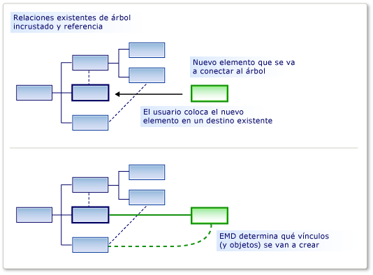
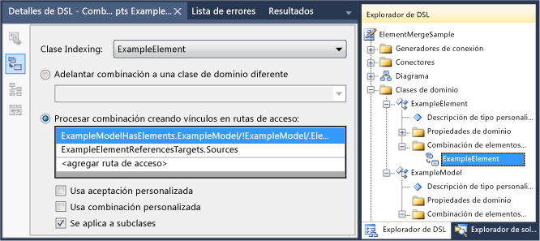

# <a name="customizing-element-creation-and-movement"></a>Personalizar la creación y el movimiento de los elementos

Puede permitir que un elemento se arrastre a otro, ya sea desde el cuadro de herramientas o en una operación de pegar o mover. Puede tener los elementos movidos vinculados a los elementos de destino mediante las relaciones que especifique.

Una directiva de combinación de elementos (EMD) especifica lo que sucede cuando un elemento de modelo se *combina* en otro elemento de modelo. Esto ocurre cuando:

- El usuario arrastra desde el cuadro de herramientas hasta el diagrama o una forma.

- El usuario crea un elemento mediante un menú Agregar en el explorador o una forma de compartimiento.

- El usuario mueve un elemento de una calle a otra.

- El usuario pega un elemento.

- El código del programa llama a la directiva de combinación de elementos.

Aunque las operaciones de creación pueden parecer diferentes de las operaciones de copia, realmente funcionan de la misma manera. Cuando se agrega un elemento, por ejemplo desde el cuadro de herramientas, se replica un prototipo de él. El prototipo se combina en el modelo de la misma manera que los elementos que se han copiado de otra parte del modelo.

La responsabilidad de un EMD es decidir cómo se debe combinar un objeto o grupo de objetos en una ubicación determinada del modelo. En concreto, decide qué relaciones se deben crear para vincular el grupo combinado al modelo. También puede personalizarlo para establecer propiedades y crear objetos adicionales.



Un EMD se genera automáticamente al definir una relación de inserción. Este EMD predeterminado crea una instancia de la relación cuando los usuarios agregan nuevas instancias secundarias al elemento primario. Puede modificar estos EMD predeterminados, por ejemplo agregando código personalizado.

También puede agregar sus propios EMD en la definición de DSL para permitir que los usuarios arrastren o peguen diferentes combinaciones de clases combinadas y receptoras.

## <a name="defining-an-element-merge-directive"></a>Definir una directiva de combinación de elementos

Puede agregar directivas de combinación de elementos a clases de dominio, relaciones de dominio, formas, conectores y diagramas. Puede agregarlos o encontrarlos en el Explorador de DSL en la clase de dominio receptora. La clase receptora es la clase de dominio del elemento que ya está en el modelo y en la que se combinará el elemento nuevo o copiado.



La **clase de indexación** es la clase de dominio de elementos que se pueden combinar en miembros de la clase receptora. Las instancias de subclases de la clase de indexación también se combinarán mediante este EMD, a menos que establezca Applies to subclasses (Se aplica a **subclases)** en False.

Hay dos tipos de directiva de combinación:

- Una **directiva Process Merge** especifica las relaciones por las que el nuevo elemento debe vincularse al árbol.

- Una **directiva Forward Merge** redirige el nuevo elemento a otro elemento receptor, normalmente un elemento primario.

Puede agregar código personalizado a las directivas de combinación:

- Set **Usa la aceptación** personalizada para agregar su propio código para determinar si una instancia determinada del elemento de indexación debe combinarse en el elemento de destino. Cuando el usuario arrastra desde el cuadro de herramientas, el puntero "no válido" muestra si el código no permite la combinación.

   Por ejemplo, podría permitir la combinación solo cuando el elemento receptor está en un estado determinado.

- Set **Usa la combinación personalizada** para agregar proporcionar código propio para definir los cambios que se realizan en el modelo cuando se realiza la combinación.

   Por ejemplo, puede establecer propiedades en el elemento combinado mediante el uso de datos de su nueva ubicación en el modelo.

> [!NOTE]
> Si escribe código de combinación personalizado, solo afecta a las mezclas que se realizan mediante este EMD. Si hay otros EMD que combinan el mismo tipo de objeto o si hay otro código personalizado que crea estos objetos sin usar EMD, el código de combinación personalizado no los verá afectados.
>
> Si desea asegurarse de que el código personalizado siempre procesa un nuevo elemento o una nueva relación, considere la posibilidad de definir en la relación de inserción y en la clase de dominio `AddRule` `DeleteRule` del elemento. Para obtener más información, vea [Reglas propagar cambios dentro del modelo](../modeling/rules-propagate-changes-within-the-model.md).

## <a name="example-defining-an-emd-without-custom-code"></a>Ejemplo: Definir un EMD sin código personalizado

En el ejemplo siguiente se permite a los usuarios crear un elemento y un conector al mismo tiempo arrastrando desde el cuadro de herramientas a una forma existente. En el ejemplo se agrega un EMD a la definición de DSL. Antes de esta modificación, los usuarios pueden arrastrar herramientas al diagrama, pero no a las formas existentes.

Los usuarios también pueden pegar elementos en otros elementos.

### <a name="to-let-users-create-an-element-and-a-connector-at-the-same-time"></a>Para permitir que los usuarios creen un elemento y un conector al mismo tiempo

1. Cree un DSL mediante la plantilla **de solución Lenguaje** mínimo.

    Al ejecutar este DSL, permite crear formas y conectores entre las formas. No se puede arrastrar una nueva **forma ExampleElement** desde el cuadro de herramientas a una forma existente.

2. Para permitir que los usuarios combinen elementos en `ExampleElement` formas, cree un emd en la `ExampleElement` clase de dominio:

   1. En **el Explorador de DSL,** expanda Clases de **dominio**. Haga clic con el botón `ExampleElement` derecho y, a continuación, **haga clic en Agregar nueva directiva de combinación de elementos**.

   2. Asegúrese de que la **ventana Detalles de DSL** está abierta para que pueda ver los detalles del nuevo EMD. (Menú: **Ver**, **Otras ventanas**, Detalles de **DSL**).

3. Establezca la **clase indexación en** la ventana Detalles de DSL para definir qué clase de elementos se puede combinar en `ExampleElement` objetos.

    En este ejemplo, seleccione `ExampleElements` , para que el usuario pueda arrastrar nuevos elementos a los elementos existentes.

    Observe que la clase indexación se convierte en el nombre de EMD en el Explorador de DSL.

4. En **Procesar combinación mediante la creación de vínculos,** agregue dos rutas de acceso:

   - Una ruta de acceso vincula el nuevo elemento al modelo primario. La expresión de ruta de acceso que debe especificar navega desde el elemento existente hasta la relación de incrustación en el modelo primario. Por último, especifica el rol en el nuevo vínculo al que se asignará el nuevo elemento. La ruta de acceso es la siguiente:

      `ExampleModelHasElements.ExampleModel/!ExampleModel/.Elements`

   - La otra ruta de acceso vincula el nuevo elemento al elemento existente. La expresión de ruta de acceso especifica la relación de referencia y el rol al que se asignará el nuevo elemento. Esta ruta de acceso es la siguiente:

      `ExampleElementReferencesTargets.Sources`

      Puede usar la herramienta de navegación path para crear cada ruta de acceso:

      1. En **Procesar combinación mediante la creación de vínculos en rutas de acceso,** haga clic en **\<add path>** .

      2. Haga clic en la flecha desplegable situada a la derecha del elemento de lista. Aparece una vista de árbol.

      3. Expanda los nodos del árbol para formar la ruta de acceso que desea especificar.

5. Pruebe el DSL:

   1. Presione **F5** para volver a generar y ejecutar la solución.

        La recompilación tarda más de lo habitual porque el código generado se actualizará a partir de plantillas de texto para ajustarse a la nueva definición de DSL.

   2. Cuando la instancia experimental de Visual Studio se haya iniciado, abra un archivo de modelo del DSL. Cree algunos elementos de ejemplo.

   3. Arrastre desde la **herramienta Elemento de** ejemplo a una forma existente.

        Aparece una nueva forma y está vinculada a la forma existente con un conector.

   4. Copie una forma existente. Seleccione otra forma y péguela.

        Se crea una copia de la primera forma.  Tiene un nuevo nombre y está vinculado a la segunda forma con un conector.

Observe los siguientes puntos de este procedimiento:

- Al crear directivas de combinación de elementos, puede permitir que cualquier clase de elemento acepte cualquier otro elemento. EmD se crea en la clase de dominio receptora y la clase de dominio aceptada se especifica en el **campo Clase de** índice.

- Al definir rutas de acceso, puede especificar qué vínculos se deben usar para conectar el nuevo elemento al modelo existente.

     Los vínculos que especifique deben incluir una relación de inserción.

- EmD afecta tanto a la creación desde el cuadro de herramientas como a las operaciones de pegado.

     Si escribe código personalizado que crea nuevos elementos, puede invocar explícitamente emd mediante el `ElementOperations.Merge` método . Esto se asegura de que el código vincula nuevos elementos al modelo de la misma manera que otras operaciones. Para obtener más información, vea [Personalizar el comportamiento de copia.](../modeling/customizing-copy-behavior.md)

## <a name="example-adding-custom-accept-code-to-an-emd"></a>Ejemplo: Agregar código de aceptación personalizado a un EMD

Al agregar código personalizado a un EMD, puede definir un comportamiento de combinación más complejo. Este sencillo ejemplo impide que el usuario agregue más de un número fijo de elementos al diagrama. En el ejemplo se modifica el EMD predeterminado que acompaña a una relación de inserción.

### <a name="to-write-custom-accept-code-to-restrict-what-the-user-can-add"></a>Para escribir código de aceptación personalizada para restringir lo que el usuario puede agregar

1. Cree un DSL mediante la plantilla **de solución Lenguaje** mínimo. Abra el diagrama de definición de DSL.

2. En el Explorador de DSL, expanda **Clases de dominio**, , Directivas de combinación de `ExampleModel` **elementos**. Seleccione la directiva de combinación de elementos denominada `ExampleElement` .

     Este EMD controla cómo el usuario puede crear nuevos `ExampleElement` objetos en el modelo, por ejemplo arrastrando desde el cuadro de herramientas.

3. En la **ventana Detalles de DSL,** seleccione **Usa la aceptación personalizada.**

4. Recompilar la solución. Esto llevará más tiempo de lo habitual porque el código generado se actualizará desde el modelo.

     Se mostrará un error de compilación similar al siguiente: "Company.ElementMergeSample.ExampleElement no contiene una definición de CanMergeExampleElement..."

     Debe implementar el método `CanMergeExampleElement` .

5. Cree un nuevo archivo de código en el **proyecto dsl.** Reemplace su contenido por el código siguiente y cambie el espacio de nombres al espacio de nombres del proyecto.

    ```csharp
    using Microsoft.VisualStudio.Modeling;

    namespace Company.ElementMergeSample // EDIT.
    {
      partial class ExampleModel
      {
        /// <summary>
        /// Called whenever an ExampleElement is to be merged into this ExampleModel.
        /// This happens when the user pastes an ExampleElement
        /// or drags from the toolbox.
        /// Determines whether the merge is allowed.
        /// </summary>
        /// <param name="rootElement">The root element in the merging EGP.</param>
        /// <param name="elementGroupPrototype">The EGP that the user wants to merge.</param>
        /// <returns>True if the merge is allowed</returns>
        private bool CanMergeExampleElement(ProtoElementBase rootElement, ElementGroupPrototype elementGroupPrototype)
        {
          // Allow no more than 4 elements to be added:
          return this.Elements.Count < 4;
        }
      }
    }
    ```

    Este sencillo ejemplo restringe el número de elementos que se pueden combinar en el modelo primario. Para condiciones más interesantes, el método puede inspeccionar cualquiera de las propiedades y vínculos del objeto receptor. También puede inspeccionar las propiedades de los elementos de combinación, que se incluyen en <xref:Microsoft.VisualStudio.Modeling.ElementGroupPrototype> . Para obtener más información sobre `ElementGroupPrototypes` , vea Personalizar el comportamiento de [copia.](../modeling/customizing-copy-behavior.md) Para obtener más información sobre cómo escribir código que lee un modelo, vea Navegar y [actualizar un modelo en código de programa.](../modeling/navigating-and-updating-a-model-in-program-code.md)

6. Pruebe el DSL:

    1. Presione **F5** para volver a generar la solución. Cuando se abra la instancia experimental de Visual Studio, abra una instancia del DSL.

    2. Cree nuevos elementos de varias maneras:

        - Arrastre desde la **herramienta Elemento de** ejemplo al diagrama.

        - En el Explorador **de modelos de** ejemplo , haga clic con el botón derecho en el nodo raíz y, a continuación, haga clic en Agregar nuevo elemento de **ejemplo**.

        - Copie y pegue un elemento en el diagrama.

    3. Compruebe que no puede usar ninguna de estas maneras de agregar más de cuatro elementos al modelo. Esto se debe a que todos usan la directiva de combinación de elementos.

## <a name="example-adding-custom-merge-code-to-an-emd"></a>Ejemplo: Agregar código de combinación personalizado a un EMD

En el código de combinación personalizado, puede definir lo que sucede cuando el usuario arrastra una herramienta o pega en un elemento. Hay dos maneras de definir una combinación personalizada:

1. El conjunto **usa combinación personalizada** y proporciona el código necesario. El código reemplaza el código de combinación generado. Use esta opción si desea volver a definir completamente lo que hace la combinación.

2. Invalide `MergeRelate` el método y, opcionalmente, el `MergeDisconnect` método . Para ello, debe establecer la propiedad **Generates Double Derived de** la clase de dominio. El código puede llamar al código de combinación generado en la clase base. Use esta opción si desea realizar operaciones adicionales después de que se haya realizado la combinación.

   Estos enfoques solo afectan a las mezclas que se realizan mediante este EMD. Si desea afectar a todas las formas en que se puede crear el elemento combinado, una alternativa es definir un en la relación de incrustación y un en la clase `AddRule` `DeleteRule` de dominio combinada. Para obtener más información, vea [Reglas propagar cambios dentro del modelo](../modeling/rules-propagate-changes-within-the-model.md).

### <a name="to-override-mergerelate"></a>Para invalidar MergeRelate

1. En la definición de DSL, asegúrese de que ha definido el EMD al que desea agregar código. Si lo desea, puede agregar rutas de acceso y definir código de aceptación personalizado como se describe en las secciones anteriores.

2. En el diagrama DslDefinition, seleccione la clase receptora de la combinación. Normalmente es la clase en el extremo de origen de una relación de inserción.

     Por ejemplo, en un DSL generado a partir de la solución lenguaje mínimo, seleccione `ExampleModel` .

3. En la **ventana** Propiedades, establezca **Genera doble derivado en** **true.**

4. Recompilar la solución.

5. Inspeccione el contenido de **Dsl\Generated Files\DomainClasses.cs**. Busque métodos denominados `MergeRelate` y examine su contenido. Esto le ayudará a escribir sus propias versiones.

6. En un nuevo archivo de código, escriba una clase parcial para la clase receptora e invalide el `MergeRelate` método . No olvide llamar al método base. Por ejemplo:

    ```csharp
    partial class ExampleModel
    {
      /// <summary>
      /// Called when the user drags or pastes an ExampleElement onto the diagram.
      /// Sets the time of day as the name.
      /// </summary>
      /// <param name="sourceElement">Element to be added</param>
      /// <param name="elementGroup">Elements to be merged</param>
      protected override void MergeRelate(ModelElement sourceElement, ElementGroup elementGroup)
      {
        // Connect the element according to the EMD:
        base.MergeRelate(sourceElement, elementGroup);

        // Custom actions:
        ExampleElement mergingElement = sourceElement as ExampleElement;
        if (mergingElement != null)
        {
          mergingElement.Name = DateTime.Now.ToLongTimeString();
        }
      }
    }
    ```

### <a name="to-write-custom-merge-code"></a>Para escribir código de combinación personalizada

1. En **Dsl\Generated Code\DomainClasses.cs,** inspeccione los métodos denominados `MergeRelate` . Estos métodos crean vínculos entre un nuevo elemento y el modelo existente.

    Además, inspeccione métodos denominados `MergeDisconnect` . Estos métodos desvinculan un elemento del modelo cuando se va a eliminar.

2. En **el Explorador de DSL,** seleccione o cree la directiva de combinación de elementos que desea personalizar. En la ventana **Detalles de DSL,** establezca **Usa combinación personalizada.**

    Al establecer esta opción, se  **omiten las** opciones Procesar combinación y Reenviar combinación. En su lugar, se usa el código.

3. Recompilar la solución. El proceso tarda más de lo habitual porque los archivos de código generados se actualizarán desde el modelo.

    Aparecerán mensajes de error. Haga doble clic en los mensajes de error para ver las instrucciones del código generado. Estas instrucciones le piden que proporcione dos métodos, `MergeRelate` *YourDomainClass* y `MergeDisconnect` *YourDomainClass.*

4. Escriba los métodos en una definición de clase parcial en un archivo de código independiente. Los ejemplos que ha inspeccionado anteriormente deben sugerir lo que necesita.

   El código de combinación personalizado no afectará al código que crea objetos y relaciones directamente, y no afectará a otros EMD. Para asegurarse de que los cambios adicionales se implementan independientemente de cómo se cree el elemento, considere la posibilidad de escribir un `AddRule` y un en su `DeleteRule` lugar. Para obtener más información, vea [Reglas propagar cambios dentro del modelo](../modeling/rules-propagate-changes-within-the-model.md).

## <a name="redirecting-a-merge-operation"></a>Redirigir una operación de combinación

Una directiva de combinación hacia delante redirige el destino de una operación de combinación. Normalmente, el nuevo destino es el elemento primario de inserción del destino inicial.

Por ejemplo, en un DSL que se creó con la plantilla de diagrama de componentes, los puertos se incrustan en componentes. Los puertos se muestran como formas pequeñas en el borde de una forma de componente. El usuario crea puertos arrastrando la herramienta Puerto a una forma Componente. Pero a veces, el usuario arrastra erróneamente la herramienta Puerto a un puerto existente, en lugar del componente , y se produce un error en la operación. Se trata de un error sencillo cuando hay varios puertos existentes. Para ayudar al usuario a evitar este problema, puede permitir que los puertos se arrastren a un puerto existente, pero que la acción se redirija al componente primario. La operación funciona como si el elemento de destino fuera el componente .

Puede crear una directiva de combinación de reenvío en la solución Modelo de componentes. Si compila y ejecuta la solución original, debería ver que los  usuarios pueden  arrastrar cualquier número de elementos **Puerto** de entrada o Puerto de salida desde el Cuadro de herramientas a un **elemento** Component. Sin embargo, no pueden arrastrar un puerto a un puerto existente. El puntero No disponible les avisa de que este movimiento no está habilitado. Sin embargo, puede crear una directiva de combinación de reenvío para que  un puerto que se descarta involuntarlamente en un puerto de entrada existente se reenvía al **elemento Component.**

### <a name="to-create-a-forward-merge-directive"></a>Para crear una directiva de combinación de reenvío

1. Cree una [!INCLUDE[dsl](../modeling/includes/dsl_md.md)] solución mediante la plantilla Modelo de componentes.

2. Para mostrar **el Explorador de DSL,** abra DslDefinition.dsl.

3. En el **Explorador de DSL,** expanda **Clases de dominio**.

4. La clase de dominio abstracta **ComponentPort** es la clase base de **InPort** y **OutPort.** Haga clic con el botón **derecho en ComponentPort** y, a continuación, **haga clic en Agregar nueva directiva de combinación de elementos**.

    Aparece un **nuevo nodo Directiva de** combinación de elementos en el nodo Directivas de combinación **de** elementos.

5. Seleccione el **nodo Directiva de combinación de** elementos y abra la ventana Detalles de **DSL.**

6. En la lista Clase de indexación, **seleccione ComponentPort**.

7. Seleccione Forward merge to a different domain class (Reenviar **combinación a otra clase de dominio).**

8. En la lista de selección de ruta de acceso, **expanda ComponentPort**, **expanda ComponentHasPorts** y, a continuación, **seleccione Componente**.

    La nueva ruta de acceso debe ser similar a esta:

    **ComponentHasPorts.Component/!Component**

9. Guarde la solución y, a continuación, transforme las plantillas haciendo clic en el botón situado más a la derecha en la **barra Explorador de soluciones** herramientas.

10. Compile y ejecute la solución. Aparece una nueva instancia de Visual Studio.

11. En **Explorador de soluciones**, abra Sample.mydsl. Aparecen el diagrama y **el cuadro de herramientas ComponentLanguage.**

12. Arrastre un **puerto de entrada** desde el cuadro de **herramientas** a otro puerto **de entrada.** A continuación, arrastre **outputPort** a **inputPort** y, a continuación, a otro **outputPort**.

     No debería ver el puntero No disponible y debería poder quitar el nuevo puerto de **entrada** en el existente. Seleccione el nuevo **puerto de entrada** y arrástrelo a otro punto del **componente**.

## <a name="see-also"></a>Vea también

- [Navegar y actualizar un modelo en el código del programa](../modeling/navigating-and-updating-a-model-in-program-code.md)
- [Personalizar las herramientas y el cuadro de herramientas](../modeling/customizing-tools-and-the-toolbox.md)
- [DSL de ejemplo de diagramas de circuitos](https://code.msdn.microsoft.com/Visualization-Modeling-SDK-763778e8)
