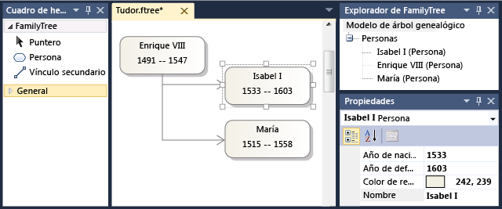

# <a name="customizing-file-storage-and-xml-serialization"></a>Personalizar el almacenamiento de archivos y la serialización XML
Cuando el usuario guarda una instancia o *modelo*, de un lenguaje específico de dominio (DSL) en [!INCLUDE[vsprvs](../code-quality/includes/vsprvs_md.md)], se crea o actualiza un archivo XML. Puede volver a cargar el archivo para volver a crear el modelo en el almacén.  
  
 Puede personalizar el esquema de serialización ajustando la configuración en **un comportamiento de serialización Xml** en el Explorador de DSL. Hay un nodo en **un comportamiento de serialización Xml** para cada clase de dominio, la propiedad y la relación. Las relaciones se encuentran en sus clases de origen. También son los nodos correspondientes a la forma, conector y las clases de diagrama.  
  
 También puede escribir código de programa para la personalización más avanzada.  
  
> [!NOTE]
>  Si desea guardar el modelo en un formato determinado, pero no es necesario volver a cargar desde ese formulario, considere la posibilidad de usar plantillas de texto para generar el resultado del modelo, en lugar de un esquema de serialización personalizada. Para obtener más información, consulte [generar código desde un lenguaje específico de dominio](../modeling/generating-code-from-a-domain-specific-language.md).  
  
## <a name="model-and-diagram-files"></a>Archivos de diagrama y de modelo  
 Normalmente, cada modelo se guarda en dos archivos:  
  
-   El archivo de modelo tiene un nombre como **Model1.mydsl**. Almacena los elementos del modelo y las relaciones y sus propiedades. La extensión de archivo como **.mydsl** viene determinado por la **FileExtension** propiedad de la **Editor** nodo en la definición DSL.  
  
-   El archivo de diagrama tiene un nombre como **Model1.mydsl.diagram**. Almacena las formas, conectores y sus posiciones, colores, grosores de línea y otros detalles de la apariencia del diagrama. Si el usuario elimina una **.diagram** archivo, no se pierde la información esencial en el modelo. Solo el diseño del diagrama se pierde. Cuando se abre el archivo de modelo, establecer un valor predeterminado de las formas y conectores que se va a crear.  
  
#### <a name="to-change-the-file-extension-of-a-dsl"></a>Para cambiar la extensión de archivo de un DSL  
  
1.  Abra la definición DSL. En el Explorador de DSL, haga clic en el nodo del Editor.  
  
2.  En la ventana Propiedades, edite el **FileExtension** propiedad. No incluya la inicial "." de la extensión de nombre de archivo.  
  
3.  En el Explorador de soluciones, cambie el nombre de los archivos de plantilla de dos elementos en **DslPackage\ProjectItemTemplates**. Estos archivos tienen nombres que seguir este formato:  
  
     `myDsl.diagram`  
  
     `myDsl.myDsl`  
  
## <a name="the-default-serialization-scheme"></a>El esquema de serialización predeterminado  
 Para crear un ejemplo de este tema, se utilizará la siguiente definición de DSL.  
  
   
  
 Este DSL se usó para crear un modelo que tiene el aspecto siguiente en la pantalla.  
  
   
  
 Este modelo se guardó y, a continuación, vuelva a abrir en el editor de texto XML:  
  
```  
<?xml version="1.0" encoding="utf-8"?>  
<familyTreeModel xmlns:dm0="http://schemas.microsoft.com/VisualStudio/2008/DslTools/Core" dslVersion="1.0.0.0" Id="f817b728-e920-458e-bb99-98edc469d78f" xmlns="http://schemas.microsoft.com/dsltools/FamilyTree">  
  <people>  
    <person name="Henry VIII" birthYear="1491" deathYear="1547" age="519">  
      <children>  
        <personMoniker name="/f817b728-e920-458e-bb99-98edc469d78f/Elizabeth I" />  
        <personMoniker name="/f817b728-e920-458e-bb99-98edc469d78f/Mary" />  
      </children>  
    </person>  
    <person name="Elizabeth I" birthYear="1533" deathYear="1603" age="477" />  
    <person name="Mary" birthYear="1515" deathYear="1558" age="495" />  
  </people>  
</familyTreeModel>  
  
```  
  
 Tenga en cuenta los siguientes puntos acerca del modelo serializado:  
  
-   Cada nodo XML tiene un nombre que es el mismo que un nombre de clase de dominio, salvo que la letra inicial está en minúscula. Por ejemplo, `familyTreeModel` y `person`.  
  
-   Se serializan las propiedades de dominio como el nombre y el año de nacimiento como atributos en los nodos XML. Una vez más, el carácter inicial de nombre de la propiedad se convierte a minúsculas.  
  
-   Cada relación se serializa como un nodo XML anidado dentro del extremo de origen de la relación. El nodo tiene el mismo nombre que la propiedad del rol de origen, pero con un carácter inicial de minúsculas.  
  
     Por ejemplo, en la definición de DSL, un rol que se denomina **personas** se puede generar en el **árbol genealógico** clase.  En el código XML, se representa mediante el nodo denominado `people` anidado dentro de la `familyTreeModel` nodo.  
  
-   El extremo de destino de cada relación de incrustación se serializa como un nodo anidado en la relación. Por ejemplo, el `people` nodo contiene varios `person` nodos.  
  
-   El extremo de destino de cada relación de referencia se serializa como un *moniker*, que codifica una referencia al elemento de destino.  
  
     Por ejemplo, en un `person` nodo, puede haber un `children` relación. Este nodo contiene monikers, como:  
  
    ```  
    <personMoniker name="/f817b728-e920-458e-bb99-98edc469d78f/Elizabeth I" />  
    ```  
  
## <a name="understanding-monikers"></a>Monikers de descripción  
 Monikers se usan para representar las referencias cruzadas entre las distintas partes de los archivos de diagrama y modelo. También se usan en la `.diagram` que haga referencia a los nodos en el archivo de modelo. Hay dos formas de moniker:  
  
-   *Monikers de identificador* entrecomillar el GUID del elemento de destino. Por ejemplo:  
  
    ```  
    <personShapeMoniker Id="f79734c0-3da1-4d72-9514-848fa9e75157" />  
  
    ```  
  
-   *Calificado monikers claves* identificar el elemento de destino por el valor de una propiedad de dominio designado denominada clave de moniker. El moniker del elemento de destino tiene como prefijo el moniker de su elemento primario en el árbol de incrustación relaciones.  
  
     Los ejemplos siguientes se toman de un DSL no existe en el que es una clase de dominio denominada álbum, que tiene una relación de incrustación a un dominio canción con nombre de clase:  
  
    ```  
    <albumMoniker title="/My Favorites/Jazz after Teatime" />  
    <songMoniker title="/My Favorites/Jazz after Teatime/Hot tea" />  
  
    ```  
  
     Monikers de claves completos que se usará si la clase de destino tiene una propiedad de dominio para el que la opción **es la clave de Moniker** está establecido en `true` en **un comportamiento de serialización Xml**. En el ejemplo, se establece esta opción para las propiedades de dominio denominados "Title" en las clases de dominio "Álbum" y "Canción".  
  
 Monikers de clave completos son más fáciles de leer que monikers de identificador. Si piensa que el XML de los archivos de modelo para ser leídos por personas, considere el uso de monikers de clave completos. Sin embargo, es posible que el usuario puede establecer más de un elemento que se va a tener la misma clave de moniker. Claves duplicadas pudieron provocar que el archivo no vuelva a cargar correctamente. Por lo tanto, si define una clase de dominio al que hace referencia el uso de monikers de clave completos, debe considerar formas de evitar que el usuario guardar un archivo que tiene monikers duplicados.  
  
#### <a name="to-set-a-domain-class-to-be-referenced-by-id-monikers"></a>Para establecer una clase de dominio para hacer referencia a los monikers de Id.  
  
1.  Asegúrese de que **es la clave de Moniker** es `false` para todas las propiedades de dominio en la clase y sus clases base.  
  
    1.  En el Explorador de DSL, expanda **datos de Behavior\Class de serialización de Xml\\***\<la clase de dominio >***\Element datos**.  
  
    2.  Compruebe que **es la clave de Moniker** es `false` para todas las propiedades de dominio.  
  
    3.  Si la clase de dominio tiene una clase base, repita el procedimiento de esa clase.  
  
2.  Establecer **identificador serializar**  =  `true` para la clase de dominio.  
  
     Esta propiedad se puede encontrar en **un comportamiento de serialización Xml**.  
  
#### <a name="to-set-a-domain-class-to-be-referenced-by-qualified-key-monikers"></a>Para establecer una clase de dominio completos monikers claves que hace referencia  
  
-   Establecer **es la clave de Moniker** para una propiedad de dominio de una clase de dominio existente. El tipo de la propiedad debe ser `string`.  
  
    1.  En el Explorador de DSL, expanda **datos de Behavior\Class de serialización de Xml\\***\<la clase de dominio >***\Element datos**y, a continuación, seleccione la propiedad de dominio.  
  
    2.  En la ventana Propiedades, establezca **es la clave de Moniker** a `true`.  
  
-   \- o -  
  
     Cree una nueva clase de dominio mediante la **clase con el nombre de dominio** herramienta.  
  
     Esta herramienta crea una nueva clase que tiene una propiedad de dominio que se conoce como nombre. El **es el nombre del elemento** y **es la clave de Moniker** propiedades de esta propiedad de dominio se inicializan en `true`.  
  
-   \- o -  
  
     Crear una relación de herencia de la clase de dominio a otra clase que tiene una propiedad de clave de moniker.  
  
### <a name="avoiding-duplicate-monikers"></a>Evitar duplicados Monikers  
 Si usas monikers de clave completos, es posible que dos elementos de modelo de un usuario pudieron tener el mismo valor en la propiedad de clave. Por ejemplo, si ADSL tiene una persona que tenga una propiedad de nombre de clase, el usuario puede establecer los nombres de dos elementos para que coincidan. Aunque el modelo podría ser guardado en el archivo, se vuelve a cargar correctamente.  
  
 Existen varios métodos que ayudan a evitar esta situación:  
  
-   Establecer **es el nombre del elemento**  =  `true` para la propiedad de clave del dominio. Seleccione la propiedad de dominio en el diagrama de definición DSL y, a continuación, establezca el valor en la ventana Propiedades.  
  
     Cuando el usuario crea una nueva instancia de la clase, este valor hace que la propiedad de dominio que se asigne automáticamente un valor diferente. El comportamiento predeterminado, agrega un número al final del nombre de clase. Esto no impide que el usuario cambia el nombre a un duplicado, pero resulta útil en el caso cuando el usuario no establece el valor antes de guardar el modelo.  
  
-   Habilitar la validación para el ADSL. En el Explorador de DSL, seleccione Editor\Validation y establezca el **usa...**  propiedades para `true`.  
  
     Hay un método de validación generado automáticamente que comprueba las ambigüedades. El método está en el `Load` categoría de validación. Esto garantiza que el usuario le avisará de que no sería posible volver a abrir el archivo.  
  
     Para obtener más información, consulte [validación en un lenguaje específico de dominio](../modeling/validation-in-a-domain-specific-language.md).  
  
### <a name="moniker-paths-and-qualifiers"></a>Las rutas de acceso de moniker y calificadores  
 Un moniker de clave completo finaliza con la clave de moniker y tiene como prefijo el moniker de su entidad primaria en el árbol de incrustación. Por ejemplo, si el moniker de un álbum es:  
  
```  
<albumMoniker title="/My Favorites/Jazz after Teatime" />  
  
```  
  
 A continuación, podría ser una de las canciones del álbum:  
  
```  
<songMoniker title="/My Favorites/Jazz after Teatime/Hot tea" />  
```  
  
 Sin embargo, si álbumes referenciados por Id. en su lugar, los monikers sería como sigue:  
  
```  
<albumMoniker Id="77472c3a-9bf9-4085-976a-d97a4745237c" />  
<songMoniker title="/77472c3a-9bf9-4085-976a-d97a4745237c/Hot tea" />  
```  
  
 Tenga en cuenta que, como un GUID es único, nunca viene precedida por el moniker de su elemento primario.  
  
 Si sabe que una propiedad de dominio concreto siempre tendrá un valor único dentro de un modelo, puede establecer **calificador de Moniker es** a `true` para esa propiedad. Esto hará que se puede usar como un calificador, sin utilizar el moniker del elemento primario. Por ejemplo, si establece ambos **calificador de Moniker es** y **es la clave de Moniker** para la propiedad de dominio de título de la clase de álbum, nombre o el identificador del modelo no se utiliza en monikers de álbum y su incrustado elementos secundarios:  
  
```  
<albumMoniker name="Jazz after Teatime" />  
<songMoniker title="/Jazz after Teatime/Hot tea" />  
  
```  
  
## <a name="customizing-the-structure-of-the-xml"></a>Personalizar la estructura del contenido XML  
 Para realizar las siguientes personalizaciones, expanda la **un comportamiento de serialización Xml** nodo en el Explorador de DSL. En una clase de dominio, expanda el nodo de datos de elemento para ver la lista de propiedades y relaciones que se obtienen en esta clase. Seleccione una relación y ajustar sus opciones en la ventana Propiedades.  
  
-   Establecer **omitir elemento** en true para omitir el nodo de rol de origen, dejando solo en la lista de elementos de destino. No debe establecer esta opción si hay más de una relación entre las clases de origen y de destino.  
  
    ```  
  
    <familyTreeModel ...>  
      <!-- The following node is omitted by using Omit Element: -->  
      <!-- <people> -->  
        <person name="Henry VIII" .../>  
        <person name="Elizabeth I" .../>  
      <!-- </people> -->  
    </familyTreeModel>  
  
    ```  
  
-   Establecer **usar el formulario completo** para incrustar los nodos de destino en los nodos que representan las instancias de relación. Esta opción se establece automáticamente cuando se agrega propiedades del dominio a una relación de dominio.  
  
    ```  
  
    <familyTreeModel ...>  
      <people>  
        <!-- The following node is inserted by using Use Full Form: -->  
        <familyTreeModelHasPeople myRelationshipProperty="x1">  
          <person name="Henry VIII" .../>  
        </familyTreeModelHasPeople>  
        <familyTreeModelHasPeople myRelationshipProperty="x2">  
          <person name="Elizabeth I" .../>  
        </familyTreeModelHasPeople>  
      </people>  
    </familyTreeModel>  
  
    ```  
  
-   Establecer **representación** = **elemento** tener una propiedad de dominio que se guarda como un elemento en lugar de como un valor de atributo.  
  
    ```  
    <person name="Elizabeth I" birthYear="1533">  
      <deathYear>1603</deathYear>  
    </person>  
    ```  
  
-   Para cambiar el orden en que se serializan los atributos y relaciones, haga clic en un elemento bajo el elemento de datos y usar el **Subir** o **Bajar** comandos de menú.  
  
## <a name="major-customization-using-program-code"></a>Personalización principal utilizando código de programa  
 Puede reemplazar partes o la totalidad de los algoritmos de serialización.  
  
 Se recomienda que revise atentamente el código en **Dsl\Generated Code\Serializer.cs** y **SerializationHelper.cs**.  
  
#### <a name="to-customize-the-serialization-of-a-particular-class"></a>Para personalizar la serialización de una clase determinada  
  
1.  Establecer **personalizado es** en el nodo de esa clase bajo **un comportamiento de serialización Xml**.  
  
2.  Transformar todas las plantillas, compile la solución e investigar los errores de compilación resultante. Comentarios junto a cada error explican qué código se deben proporcionar.  
  
#### <a name="to-provide-your-own-serialization-for-the-whole-model"></a>Para proporcionar su propia serialización para el modelo completo  
  
1.  Invalidar los métodos en Dsl\GeneratedCode\SerializationHelper.cs  
  
## <a name="options-in-xml-serialization-behavior"></a>Opciones de comportamiento de serialización de Xml  
 En el Explorador de ADSL, el nodo de un comportamiento de serialización Xml contiene un nodo secundario para cada clase de dominio, relación, forma, conector y clase de diagrama. En cada uno de los nodos es una lista de propiedades y relaciones con origen en ese elemento. Las relaciones se representan en su propios derecha y en sus clases de origen.  
  
 En la tabla siguiente resume las opciones que se pueden establecer en esta sección de la definición DSL. En cada caso, seleccione un elemento en el Explorador de DSL y establecer las opciones en la ventana Propiedades.  
  
### <a name="xml-class-data"></a>Datos XML (clase)  
 Estos elementos se encuentran en el Explorador de DSL en **datos de Behavior\Class de serialización de Xml**.  
  
|||  
|-|-|  
|Property|Descripción|  
|Tiene esquemas de elemento personalizado.|Si es True, indica que la clase de dominio tiene un esquema de elemento personalizado.|  
|Es personalizada|Establezca esta propiedad en **True** si desea escribir su propio código de serialización y deserialización para esta clase de dominio.<br /><br /> Compile la solución e investigar los errores para conocer las instrucciones detalladas.|  
|Clase de dominio|Clase de dominio al que se aplica este nodo de datos de la clase. Sólo lectura.|  
|Nombre del elemento|Nombre de nodo de XML para los elementos de esta clase. El valor predeterminado es una versión en minúscula del nombre de clase de dominio.|  
|Nombre del atributo moniker|Nombre del atributo que se usa en elementos de moniker para contener la referencia. Si está en blanco, se usa el nombre de la propiedad de clave o identificador.<br /><br /> En este ejemplo, es "name":`<personMoniker name="/Mike Nash"/>`|  
|Nombre del elemento moniker|Nombre del elemento xml utilizado para monikers que hacen referencia a los elementos de esta clase.<br /><br /> El valor predeterminado es una versión en minúsculas del nombre de clase que lleva el sufijo "Moniker". Por ejemplo: `personMoniker`.|  
|Nombre del tipo moniker|Nombre del tipo xsd generado para monikers a los elementos de esta clase. Es el esquema XSD en **Dsl\Generated código\\\*Schema.xsd**|  
|Serializar el Id.|Si es True, el GUID de elemento se incluye en el archivo. Debe ser true si no hay ninguna propiedad que se marca **es la clave de Moniker** y DSL define las relaciones de referencia para esta clase.|  
|Nombre de tipo|Nombre del tipo xml generado en el esquema xsd de la clase de dominio designado.|  
|Notas|Informales notas asociadas con este elemento|  
  
### <a name="xml-property-data"></a>Datos de la propiedad de XML  
 Nodos de propiedad de XML se encuentran en los nodos de la clase.  
  
|||  
|-|-|  
|Property|Descripción|  
|Propiedad de dominio|Propiedad a la que se aplican los datos de configuración de serialización de xml. Sólo lectura.|  
|Es la clave de Moniker|Si es True, la propiedad se utiliza como clave para la creación de monikers que hacen referencia a instancias de esta clase de dominio.|  
|Es el calificador de Moniker|Si es True, la propiedad se usa para crear el calificador de monikers. Si es false, y si no se cumple para esta clase de dominio SerializeId, monikers se califican por el moniker del elemento primario en el árbol de incrustación.|  
|Representación en forma de|Si el atributo, la propiedad se serializa como un atributo xml; Si el elemento, es serializado como un elemento; Si pasar por alto, no está serializado.|  
|Nombre XML|Nombre utilizado para el atributo o elemento xml que representa la propiedad. De forma predeterminada, se trata de una versión en minúscula del nombre de propiedad de dominio.|  
|Notas|Informales notas asociadas con este elemento|  
  
### <a name="xml-role-data"></a>Datos de las funciones de XML  
 Nodos de rol de datos se encuentran en los nodos de la clase de origen.  
  
|Property|Descripción|  
|--------------|-----------------|  
|Tiene un Moniker personalizado|Establecer en true si desea proporcionar su propio código para generar y resolver monikers que atraviesan esta relación.<br /><br /> Para obtener instrucciones detalladas, compile la solución y, a continuación, haga doble clic en los mensajes de error.|  
|Relación de dominio|Especifica la relación a la que estas opciones se aplican. Sólo lectura.|  
|Omitir el elemento|Si es true, se omite el nodo XML que se corresponde con el rol de origen en el esquema.<br /><br /> Si hay más de una relación entre las clases de origen y de destino, este nodo de rol distingue entre los vínculos que pertenecen a las dos relaciones. Por lo tanto, se recomienda no establecer esta opción en este caso.|  
|Nombre del elemento de rol|Especifica el nombre del elemento XML que se deriva de la función de origen. El valor predeterminado es el nombre de propiedad del rol.|  
|Usar el formulario completo|Si es true, todos los elementos de destino o moniker se encierra entre un nodo XML que representa la relación. Esto se debe establecer en true si la relación tiene sus propias propiedades de dominio.|  
  
## <a name="see-also"></a>Vea también  
 [Navegar y actualizar un modelo de código de programa](../modeling/navigating-and-updating-a-model-in-program-code.md)   
 [Generar código a partir de lenguajes específicos de dominio](../modeling/generating-code-from-a-domain-specific-language.md)