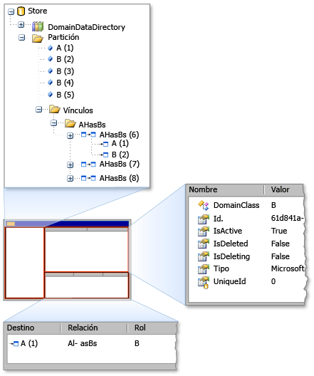

# <a name="debugging-by-using-the-store-viewer"></a>Depurar con el visor de almacén
Con el Visor de almacenar, puede examinar el estado de un *almacenar* utilizando [!INCLUDE[dsl](../modeling/includes/dsl_md.md)]. El Visor de almacenar muestra todos los elementos de modelo de dominio que se encuentran en un almacén concreto, junto con propiedades de los elementos y los vínculos entre elementos.

## <a name="opening-store-viewer"></a>Visor de abrir el almacén
 Cuando se encuentra en la [!INCLUDE[vsprvs](../code-quality/includes/vsprvs_md.md)] experimental compilar, detenga el código en un punto de interrupción en una instancia de la tienda contiene información sobre el modelo. A continuación, abra el Visor de almacén escribiendo el siguiente comando en el **inmediato** ventana:

```
Microsoft.VisualStudio.Modeling.Diagnostics.StoreViewer.Show(mystore);
```

> [!NOTE]
>  Debe reemplazar `mystore` con el nombre de la instancia de almacén. Además, si agrega el espacio de nombres en el código, puede escribir el comando para mostrar el Visor de almacenes sin el espacio de nombres completo:
>
>  `using Microsoft.VisualStudio.Modeling.Diagnostics;`
>
>  `...`
>
>  `StoreViewer.Show(mystore);`

 El `Show` método tiene varias sobrecargas. Puede especificar una instancia de un almacén o una partición como el parámetro.

 Como alternativa, puede colocar la línea de código que muestra el Visor de almacén en cualquier lugar del código donde el parámetro que se pasa a la `Show` método está en el ámbito. Esta acción muestra el Visor de almacén cuando se ejecuta la línea de código como una instantánea del contenido de la tienda.

### <a name="using-store-viewer"></a>Con el Visor de almacén
 Cuando se abre el Visor de almacén, aparece una ventana no modal de Windows Forms, como se muestra en la ilustración siguiente.

  almacenar Visor

 El Visor de almacén tiene tres paneles: el panel izquierdo, el panel derecho de la parte superior y el panel inferior derecho. El panel izquierdo es una vista de árbol de los tipos de los `DomainDataDirectory` miembros de un almacén. Si se expande el nodo de la partición y haga clic en un elemento, las propiedades del elemento aparecen en el panel de la parte superior derecha. Si el elemento está vinculado a otros elementos, los elementos adicionales que aparecen en el panel de la esquina inferior derecha. Si hace doble clic en un elemento en el panel de la esquina inferior derecha, el elemento se resalta en el panel izquierdo.

## <a name="see-also"></a>Vea también

- [Navegar y actualizar un modelo en el código del programa](../modeling/navigating-and-updating-a-model-in-program-code.md)