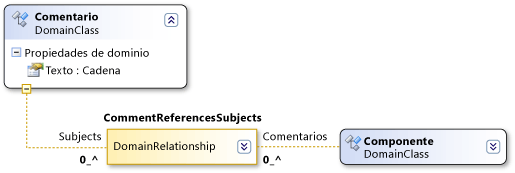

# Sintaxis de las rutas de dominio
[!INCLUDE[vs2017banner](../code-quality/includes/vs2017banner.md)]

Las definiciones de DSL usan una sintaxis del estilo de XPath para ubicar elementos específicos en un modelo.  
  
 Normalmente no tiene que trabajar con esta sintaxis directamente.  Cuando aparece en las ventanas DSL Details \(Detalles de DSL\) o Properties \(Propiedades\), puede hacer clic en la flecha hacia abajo y usar el editor de rutas.  Sin embargo, la ruta aparece con este formato en el campo después de haber usado el editor.  
  
 Una ruta de dominio adopta el formato siguiente:  
  
 *NombreRelación.NombrePropiedad\/\!Rol*  
  
   
  
 La sintaxis atraviesa el árbol del modelo.  Por ejemplo, la relación de dominio CommentReferencesSubjects de la ilustración anterior tiene un rol Subjects.  El segmento de la ruta \/\!Subjectt especifica que la ruta termina en los elementos a los que se accede mediante el rol Subjects.  
  
 Cada segmento comienza con el nombre de una relación de dominio.  Si el recorrido se realiza desde un elemento a una relación, el segmento de ruta aparece como *Relación.NombrePropiedad*.  Si el salto es de un vínculo a un elemento, el segmento de ruta aparece como *Relación\/\!NombreRol*.  
  
 La sintaxis de una ruta se separa con barras inclinadas.  Cada segmento de ruta es un salto desde un elemento a un vínculo \(una instancia de una relación\) o desde un vínculo a un elemento.  Los segmentos de ruta suelen aparecer en parejas.  Un segmento de ruta representa un salto desde un elemento a un vínculo, y el siguiente representa un salto desde el vínculo al elemento del otro extremo.  \(Un vínculo puede ser también origen o destino de una relación\).  
  
 El nombre que use para el salto elemento\-vínculo es el valor de `Property Name` del rol.  El nombre que use para el salto vínculo\-elemento es el nombre del rol de destino.  
  
## Vea también  
 [Introducción a los modelos, las clases y las relaciones](../modeling/understanding-models-classes-and-relationships.md)