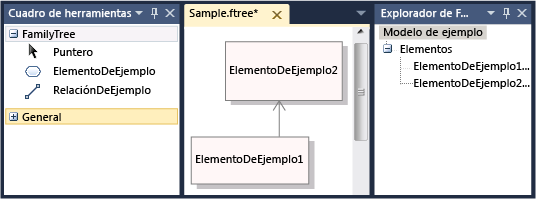
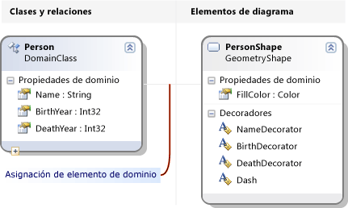
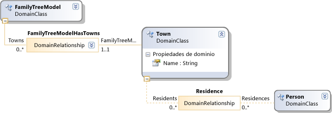
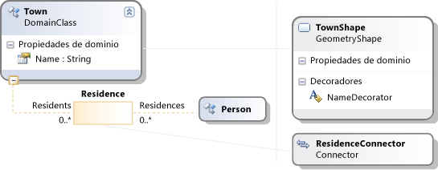

# <a name="get-started-with-domain-specific-languages"></a>Introducción a los lenguajes específicos de dominio

En este tema se explica los conceptos básicos de la definición y uso de un lenguaje específico de dominio (DSL) creado con el SDK de modelado para Visual Studio.

> [!NOTE]
> En Visual Studio 2017, el SDK de transformación de plantilla de texto y el SDK de modelado de Visual Studio se instalan automáticamente al instalar características específicas de Visual Studio. Para obtener más información, consulte [esta entrada de blog](https://blogs.msdn.microsoft.com/visualstudioalm/2016/12/12/the-visual-studio-modeling-sdk-is-now-available-with-visual-studio-2017/).

Si está familiarizado con los DSL, le recomendamos que trabaje a través de la **laboratorio de herramientas de DSL**, que encontrará en este sitio: [visualización y el SDK de modelado](http://go.microsoft.com/fwlink/?LinkID=186128)

## <a name="what-can-you-do-with-a-domain-specific-language"></a>¿Qué puede hacer con un lenguaje específico de dominio?

Un lenguaje específico de dominio es una notación, normalmente, gráfica de que está diseñada para usarse para un propósito específico. Por el contrario, los lenguajes como UML son uso general. En un DSL, puede definir los tipos de elemento de modelo y sus relaciones, y cómo se presentan en la pantalla.

Cuando haya diseñado un DSL, puede distribuirla como parte de un paquete de extensión de integración de Visual Studio (VSIX). Los usuarios trabajan con el DSL en Visual Studio:


La notación es solo una parte de un DSL. Junto con la notación, el paquete VSIX incluye herramientas que pueden aplicar a los usuarios para ayudarles a editar y generar el material de sus modelos.

Una de las aplicaciones de lenguajes DSL principales consiste en generar código de programa, archivos de configuración y otros artefactos. Especialmente en grandes proyectos y líneas de productos, donde se crearán varias variantes de un producto, genera muchos de los aspectos de la variable desde lenguajes DSL puede proporcionar un gran aumento de confiabilidad y una respuesta muy rápida a los cambios de requisitos.

El resto de esta información general es un tutorial que explica las operaciones básicas de creación y uso de un lenguaje específico de dominio en Visual Studio.

## <a name="prerequisites"></a>Requisitos previos

Para definir un DSL, debe tener instalados los siguientes componentes:


| | |
|-|-|
| Programa para la mejora | [http://go.microsoft.com/fwlink/?LinkId=185579](http://go.microsoft.com/fwlink/?LinkId=185579) |
| [!INCLUDE[vssdk_current_short](../modeling/includes/vssdk_current_short_md.md)] | [http://go.microsoft.com/fwlink/?LinkId=185580](http://go.microsoft.com/fwlink/?LinkId=185580) |
| SDK de modelado para Visual Studio | |

[!INCLUDE[modeling_sdk_info](includes/modeling_sdk_info.md)]

## <a name="create-a-dsl-solution"></a>Crear una solución de DSL

Para crear un nuevo lenguaje específico de dominio, crea una nueva solución de Visual Studio mediante el uso de la plantilla de proyecto de lenguaje específico de dominio.

1.  En el menú **Archivo** , elija **Nuevo**y haga clic en **Proyecto**.

2.  En **tipos de proyecto**, expanda el **otros tipos de proyectos** nodo y haga clic en **extensibilidad**.

3.  Haga clic en **Diseñador de lenguaje específico de dominio**.

     

4.  En el **nombre** , escriba **FamilyTree**. Haga clic en **Aceptar**.

     El **Domain-Specific Language asistente** abre y muestra una lista de soluciones DSL de plantilla.

     Haga clic en cada plantilla para ver una descripción,

     Las plantillas son útiles puntos de partida. Cada una de ellas proporciona una completa DSL de trabajo, que se puede modificar para satisfacer sus necesidades. Normalmente, elegiría la plantilla más cercano que desea crear.

5.  En este tutorial, elija el **lenguaje mínimo** plantilla.

6.  Escriba una extensión de nombre de archivo para su DSL en la página del asistente correspondiente. Esta es la extensión que usarán los archivos que contienen instancias de su DSL.

    -   Elija una extensión que no está asociada con cualquier aplicación en el equipo o en cualquier equipo donde desea instalar el DSL. Por ejemplo, **docx** y **htm** sería inaceptable archivo las extensiones de nombre.

    -   El asistente le advertirá en caso de que la extensión que haya especificado se esté usando como un DSL. Piense en usar una extensión de nombre de archivo diferente. También puede restablecer la instancia de Visual Studio SDK Experimental para borrar antiguos diseñadores experimentales. Haga clic en **iniciar**, haga clic en **todos los programas**, **Microsoft Visual Studio 2010 SDK**, **herramientas**y, a continuación, **restablecer Microsoft Instancia de Visual Studio 2010 Experimental**.

7.  Inspeccione el resto de páginas y, a continuación, haga clic en **finalizar**.

     Se genera una solución que contiene dos proyectos. Se denominan Dsl y DslPackage. Es decir, un archivo de diagrama abre DslDefinition.dsl con nombre.

    > [!NOTE]
    > La mayoría del código que se puede ver en las carpetas en los dos proyectos se genera a partir de DslDefinition.dsl. Por este motivo, la mayoría de las modificaciones en su DSL se realizan en este archivo.

Ahora, la interfaz de usuario es similar a la imagen siguiente.


Esta solución define un lenguaje específico de dominio. Para obtener más información, consulte [general de la interfaz de usuario de herramientas de lenguaje específico de dominio](../modeling/overview-of-the-domain-specific-language-tools-user-interface.md).

## <a name="the-important-parts-of-the-dsl-solution"></a>Las partes importantes de la solución de DSL

Tenga en cuenta los siguientes aspectos de la nueva solución:

-   **Dsl\DslDefinition.DSL** trata del archivo que ve cuando se crea una solución de DSL. Casi todo el código de la solución se genera a partir de este archivo y la mayoría de los cambios realizados en una definición de DSL están aquí. Para obtener más información, consulte trabajo con el [trabajar con diagramas de definición DSL](../modeling/working-with-the-dsl-definition-diagram.md).

-   **Proyecto de DSL** este proyecto contiene código que define el lenguaje específico de dominio.

-   **Proyecto DslPackage** este proyecto contiene código que permite que las instancias del DSL para abrir y editar en Visual Studio.

##  <a name="Debugging"></a> Ejecute el DSL

Puede ejecutar la solución de DSL tan pronto como se ha creado. Más adelante, puede modificar la definición de DSL gradualmente, ejecutando la solución de nuevo después de cada cambio.

### <a name="to-experiment-with-the-dsl"></a>Para experimentar con el DSL

1.  Haga clic en **Transformar todas las plantillas** en el **el Explorador de soluciones** barra de herramientas. Esto vuelve a generar la mayoría del código fuente de DslDefinition.dsl.

    > [!NOTE]
    > Cada vez que cambie *DslDefinition.dsl*, debe hacer clic en **Transformar todas las plantillas** antes de volver a generar la solución. Este paso se puede automatizar. Para obtener más información, consulte [cómo automatizar Transformar todas las plantillas](http://msdn.microsoft.com/b63cfe20-fe5e-47cc-9506-59b29bca768a).

2.  Presione **F5**o bien, en el menú **Depurar** , haga clic en **Iniciar depuración**.

     Se crea el DSL y está instalado en la instancia experimental de Visual Studio.

     Inicia una instancia experimental de Visual Studio. La instancia experimental toma su configuración de un subárbol del registro, donde se registran las extensiones de Visual Studio con fines de depuración independiente. Las instancias normales de Visual Studio no tiene acceso a las extensiones registradas no existe.

3.  En la instancia experimental de Visual Studio, abra el archivo de modelo denominado **prueba** desde **el Explorador de soluciones**.

     \- o -

     Haga clic en el proyecto de depuración, elija **agregar**y, a continuación, haga clic en **elemento**. En el **Agregar elemento** cuadro de diálogo, seleccione el tipo de archivo de su DSL.

     Se abre el archivo de modelo como un diagrama en blanco.

     El cuadro de herramientas se abre y muestra herramientas apropiadas para el tipo de diagrama.

4.  Utilice las herramientas para crear formas y conectores en el diagrama.

    1.  Para crear formas, arrastre desde la herramienta de la forma de ejemplo en el diagrama.

    2.  Para conectar dos formas, haga clic en la herramienta Conector de ejemplo, haga clic en la primera forma y, a continuación, haga clic en la segunda forma.

5.  Haga clic en las etiquetas de las formas para cambiarlos.

Visual Studio experimental será similar en el ejemplo siguiente:



### <a name="the-content-of-a-model"></a>El contenido de un modelo

El contenido de un archivo que es una instancia de un DSL se denomina un *modelo*. El modelo contiene *modelo*<em>elementos</em> y *vínculos* entre los elementos. La definición de DSL especifica qué tipos de elementos de modelo y vínculos que pueden existir en el modelo. Por ejemplo, en un DSL creado a partir de la plantilla de lenguaje mínimo, hay un tipo de elemento de modelo y un tipo de vínculo.

La definición de DSL puede especificar cómo deberá aparecer el modelo en un diagrama. Puede elegir entre una variedad de estilos de formas y conectores. Puede especificar que algunas formas aparecen dentro de otras formas.

Puede ver un modelo como un árbol en el **Explorer** ver mientras se está editando un modelo. Cuando se agregan formas al diagrama, los elementos del modelo también aparecen en el explorador. El explorador puede utilizarse incluso si no hay ningún diagrama.

Si no ve el explorador en la instancia de depuración de Visual Studio, en el **vista** menú, seleccione **Other Windows**y, a continuación, haga clic en  *\<su idioma >* **Explorer**.

### <a name="the-api-of-your-dsl"></a>La API de su DSL

Su DSL genera una API que permite leer y actualizar los modelos que son instancias del DSL. Una aplicación de la API consiste en generar archivos de texto de un modelo. Para obtener más información, consulte [generación de código de tiempo de diseño mediante el uso de plantillas de texto T4](../modeling/design-time-code-generation-by-using-t4-text-templates.md).

En la solución de depuración, abra los archivos de plantilla con la extensión "tt". Estos ejemplos muestran cómo puede generar texto a partir de modelos y le permiten probar la API de su DSL. Uno de los ejemplos se escribe [!INCLUDE[vbprvb](../code-quality/includes/vbprvb_md.md)], el otro en [!INCLUDE[csprcs](../data-tools/includes/csprcs_md.md)].

En cada plantilla de archivo es el archivo que genera. Expanda el archivo de plantilla en el Explorador de soluciones y abra el archivo generado.

El archivo de plantilla contiene un segmento corto de código que enumera todos los elementos del modelo.

El archivo generado contiene el resultado.

Cuando se cambia un archivo de modelo, verá los cambios correspondientes en los archivos generados después de regenerar los archivos.

#### <a name="to-regenerate-text-files-after-you-change-the-model-file"></a>Para volver a generar los archivos de texto después de cambiar el archivo de modelo

1.  En la instancia experimental de Visual Studio, guarde el archivo de modelo.

2.  Asegúrese de que el parámetro de nombre de archivo en cada archivo .tt hace referencia al archivo del modelo que está usando para los experimentos. Guarde el archivo .tt.

3.  Haga clic en **Transformar todas las plantillas** en la barra de herramientas de **el Explorador de soluciones**.

     \- o -

     Haga clic en las plantillas que desea volver a generar y, a continuación, haga clic en **ejecutar herramienta personalizada**.

Puede agregar cualquier número de archivos de plantilla de texto a un proyecto. Cada plantilla genera un archivo de resultados.

> [!NOTE]
> Al cambiar la definición de DSL, el código de plantilla de texto de ejemplo no funcionará, a menos que la actualice.

Para obtener más información, consulte [generar código desde un lenguaje específico de dominio](../modeling/generating-code-from-a-domain-specific-language.md) y [escribir código para personalizar lenguajes específicos de dominio](../modeling/writing-code-to-customise-a-domain-specific-language.md).

## <a name="customizing-the-dsl"></a>Personalizar el DSL

Cuando desea modificar la definición de DSL, cierre la instancia experimental y actualizar la definición en la instancia principal de Visual Studio.

> [!NOTE]
> Después de haber modificado la definición de DSL, podría perder la información de los modelos de prueba creados con versiones anteriores.  Por ejemplo, la solución de depuración contiene un archivo que se denomina Sample, que contiene algunas formas y conectores. Después de empezar a desarrollar su definición de DSL, no será visibles y se perderán cuando guarde el archivo.

Puede realizar una amplia variedad de extensiones en su DSL. Los ejemplos siguientes le proporcionará una impresión de las posibilidades.

Después de cada cambio, guarde la definición de DSL, haga clic en **Transformar todas las plantillas** en **el Explorador de soluciones**y, a continuación, presione **F5** para experimentar con el DSL modificado.

### <a name="rename-the-types-and-tools"></a>Cambiar el nombre de los tipos y herramientas

Cambiar el nombre de las clases de dominio existentes y relaciones. Por ejemplo, a partir de una definición de Dsl creado a partir de la plantilla de lenguaje mínimo, podría realizar las siguientes operaciones de cambio de nombre, para hacer el DSL representar árboles de familia.

#### <a name="to-rename-domain-classes-relationships-and-tools"></a>Para cambiar el nombre de las herramientas, las relaciones y las clases de dominio

1.  En el diagrama DslDefinition, cambie el nombre **ExampleModel** a **FamilyTreeModel**, **ExampleElement** a **persona**,  **Destinos** a **padres**, y **orígenes** a **hijos**. Puede hacer clic en cada etiqueta para cambiarla.

     

2.  Cambiar el nombre de las herramientas de elemento y el conector.

    1.  Al hacer clic en la pestaña en el Explorador de soluciones, abra la ventana del explorador de DSL. Si no se ve, en el **vista** menú, seleccione **Other Windows** y, a continuación, haga clic en **DSL Explorer**. Explorador de DSL solo está visible cuando el diagrama de definición de DSL es la ventana activa.

    2.  Abra la ventana Propiedades y colóquela para que puedan ver el Explorador de DSL y propiedades al mismo tiempo.

    3.  En el Explorador de DSL, expanda **Editor**, **Toolbox Tabs**,  *\<su DSL >* y, a continuación, **herramientas**.

    4.  Haga clic en **ExampleElement**. Este es el elemento de cuadro de herramientas que se usa para crear elementos.

    5.  En la ventana Propiedades, cambie la **nombre** propiedad **persona**.

         Tenga en cuenta que el **título** propiedad también cambia.

    6.  En la misma manera, cambie el nombre de la **ExampleConnector** herramienta a **ParentLink**. Modificar el **título** propiedad para que no sea una copia de la propiedad Name. Por ejemplo, escriba **vínculo primario**.

3.  Vuelva a generar el DSL.

    1.  Guarde el archivo de definición de DSL.

    2.  Haga clic en **Transformar todas las plantillas** en la barra de herramientas del explorador de soluciones

    3.  Presione F5. Espere hasta que aparezca la instancia experimental de Visual Studio.

4.  En la solución de depuración en la instancia experimental de Visual Studio, abra un archivo de modelo de prueba. Arrastrar elementos a él desde el cuadro de herramientas. Tenga en cuenta que se han cambiado los títulos de la herramienta y los nombres de tipo en el Explorador de DSL.

5.  Guarde el archivo de modelo.

6.  Abra un archivo .tt y reemplazar las apariciones de los nombres de tipo y la propiedad anteriores con los nombres nuevos.

7.  Asegúrese de que el nombre de archivo que se especifica en el archivo .tt especifica el modelo de prueba.

8.  Guarde el archivo .tt. Abra el archivo generado para ver el resultado de ejecutar el código en el archivo .tt. Compruebe que es correcta.

### <a name="add-domain-properties-to-classes"></a>Agregar propiedades de dominio a clases
 Agregar propiedades a una clase de dominio, por ejemplo, para representar los años de nacimiento y la muerte de una persona.

 Para que las nuevas propiedades visibles en el diagrama, debe agregar *decoradores* a la forma que muestre el elemento de modelo. También se deben asignar las propiedades a los elementos Decorator.

##### <a name="to-add-properties-and-display-them"></a>Para agregar propiedades y mostrarlos

1. Agregue las propiedades.

   1.  En el diagrama de definición de DSL, haga clic en el **persona** la clase de dominio, seleccione **agregar**y, a continuación, haga clic en **la propiedad de dominio**.

   2.  Escriba una lista de los nuevos nombres de propiedad, como **nacimiento** y **muerte**. Presione **ENTRAR** después de cada uno de ellos.

2. Agregar elementos Decorator que muestran las propiedades de la forma.

   1.  Siga la línea gris que abarca desde la clase de dominio de la persona a la otra parte del diagrama. Se trata de una asignación de elemento de diagrama. La clase de dominio vincula a una clase de forma.

   2.  Haga clic en esta clase shape, apunte a **agregar**y, a continuación, haga clic en **elemento Decorator de texto**.

   3.  Agregar dos elementos Decorator con nombres como **BirthDecorator** y **DeathDecorator**.

   4.  Seleccione todos los elementos decorator nuevo y, en la ventana Propiedades, establezca la **posición** campo. Esto determina dónde se mostrará el valor de propiedad de dominio en la forma. Por ejemplo, establecer **InnerBottomLeft** y **InnerBottomRight**.

        

3. Los elementos Decorator se asignan a las propiedades.

   1.  Abra la ventana Detalles de DSL. Normalmente está en una ficha situada junto a la ventana de salida. Si no se ve, en el **vista** menú, elija **Other Windows**y, a continuación, haga clic en **detalles de DSL**.

   2.  En el diagrama de definición de DSL, haga clic en la línea que conecta el **persona** la clase de dominio para la clase shape.

   3.  En **detalles de DSL**, en el **asignaciones del elemento Decorator** pestaña, haga clic en la casilla de verificación en un elemento decorator no asignada. En **propiedad Display**, seleccione la propiedad de dominio al que desea asignar. Por ejemplo, asignar **BirthDecorator** a **nacimiento**.

4. Guardar el DSL, haga clic en Transformar todas las plantillas y presione F5.

5. En un diagrama de modelo de ejemplo, compruebe que ahora puede hacer clic en las posiciones que eligió y escribirlos en ellos. Además, cuando selecciona un **persona** forma, la ventana Propiedades muestra las nuevas propiedades de nacimiento y la muerte.

6. En un archivo .tt, puede agregar código que obtiene las propiedades de cada persona.

   

### <a name="define-new-classes"></a>Definir nuevas clases
 Puede agregar clases de dominio y relaciones a un modelo. Por ejemplo, podría crear una nueva clase para representar las ciudades y una nueva relación para representar que una persona vivido en una ciudad.

 Para hacer que los distintos tipos distintos en un diagrama de modelo, puede asignar las clases de dominio diferentes tipos de formas, o formas con colores y geometría diferentes.

##### <a name="to-add-and-display-a-new-domain-class"></a>Para agregar y mostrar una nueva clase de dominio

1.  Agregue una clase de dominio y convertirlo en un elemento secundario de la raíz del modelo.

    1.  En el diagrama de definición de DSL, haga clic en el **relación de incrustación** de herramientas, haga clic en la clase raíz **FamilyTreeModel**y, a continuación, haga clic en una parte vacía del diagrama.

         Aparece una nueva clase de dominio, que está conectado a la FamilyTreeModel con una relación de incrustación.

         Establezca su nombre, por ejemplo **Town**.

        > [!NOTE]
        >  Cada clase de dominio, excepto la raíz del modelo debe ser el destino de al menos una relación de incrustación, o debe heredar de una clase que es el destino de una inserción. Por este motivo, es conveniente crear una clase de dominio mediante la herramienta de relación de incrustación con frecuencia.

    2.  Agregar una propiedad de dominio a la nueva clase, por ejemplo **nombre**.

2.  Agregar una relación de referencia entre Person y Town.

    1.  Haga clic en el **relación de referencia** de herramientas, haga clic en persona y, a continuación, haga clic en la ciudad.

         

        > [!NOTE]
        >  Relaciones de referencia representan las referencias cruzadas de una parte del árbol del modelo a otro.

3.  Agregar una forma para representar ciudades en los diagramas de modelo.

    1.  Arrastre un **forma geométrica** desde el cuadro de herramientas al diagrama y cambie su nombre, por ejemplo **TownShape**.

    2.  En la ventana Propiedades, establezca los campos de la apariencia de la nueva forma, por ejemplo, el Color de relleno y geometría.

    3.  Agregar un elemento Decorator para mostrar el nombre de la ciudad y cámbiele el nombre NameDecorator. Establezca su propiedad Position.

4.  La clase de dominio de ciudad se asignan a la TownShape.

    1.  Haga clic en el **asignación de elemento de diagrama** herramienta y, después, haga clic en la clase de dominio de ciudad y, a continuación, la clase shape TownShape.

    2.  En el **asignaciones del elemento Decorator** pestaña de la **detalles de DSL** ventana con el conector de asignación seleccionada, comprobar NameDecorator y establecer **propiedad Display** al nombre.

5.  Crear un conector para mostrar la relación entre la persona y ciudades.

    1.  Arrastre un conector desde el cuadro de herramientas al diagrama. Cámbiele el nombre y establecer sus propiedades de apariencia.

    2.  Use la **asignación de elemento de diagrama** herramienta para vincular el nuevo conector a la relación entre la persona y ciudad.

         

6.  Crear una herramienta de elemento para realizar una ciudad de nuevo.

    1.  En **DSL Explorer**, expanda **Editor** , a continuación, **Toolbox Tabs**.

    2.  Haga clic en  *\<su DSL >* y, a continuación, haga clic en **agregar nueva herramienta de elemento**.

    3.  Establecer el **nombre** propiedad de la nueva herramienta y establezca su **clase** propiedad a la misma ciudad.

    4.  Establecer el **icono cuadro de herramientas** propiedad. Haga clic en **[...]**  y en el **nombre de archivo** , seleccione un archivo de icono.

7.  Crear una herramienta de conector para realizar un vínculo entre personas y ciudades.

    1.  Haga clic en  *\<su DSL >* y, a continuación, haga clic en **agregar nueva herramienta de conector**.

    2.  Establezca la propiedad de nombre de la nueva herramienta.

    3.  En el **ConnectionBuilder** propiedad, seleccione el generador que contiene el nombre de la relación persona-persona y persona-ciudad.

    4.  Establecer el **icono cuadro de herramientas**.

8.  Guardar la definición de DSL, haga clic en **Transformar todas las plantillas**y, a continuación, presione **F5**.

9. En la instancia experimental de Visual Studio, abra un archivo de modelo de prueba. Usar las nuevas herramientas para crear las ciudades y los vínculos entre personas y ciudades. Tenga en cuenta que solo se pueden crear vínculos entre los tipos correctos de elemento.

10. Crear código que muestra la ciudad en la que reside cada persona. Las plantillas de texto son uno de los lugares donde puede ejecutar este código. Por ejemplo, podría modificar el archivo Sample.tt existente en la solución de depuración para que contenga el código siguiente:

    ```
    <#@ template inherits="Microsoft.VisualStudio.TextTemplating.VSHost.ModelingTextTransformation" debug="true" #>
    <#@ output extension=".txt" #>
    <#@ FamilyTree processor="FamilyTreeDirectiveProcessor" requires="fileName='Sample.ftree'" #>

    <#
      foreach (Person person in this.FamilyTreeModel.People)
      {
    #>
        <#= person.Name #><#if (person.Town != null) {#> of <#= person.Town.Name #> <#}#>

    <#
          foreach (Person child in person.Children)
      {
    #>
                <#= child.Name #>
    <#
      }
      }
    #>

    ```

     Cuando se guarda el archivo *.tt, creará un archivo subsidiario que contiene la lista de personas y los sus hogares. Para obtener más información, consulte [generar código desde un lenguaje específico de dominio](../modeling/generating-code-from-a-domain-specific-language.md).

## <a name="validation-and-commands"></a>Validación y comandos
 También puede desarrollar aún más este DSL agregando restricciones de validación. Estas restricciones son métodos que se pueden definir, asegúrese de que el modelo está en un estado correcto. Por ejemplo, podría definir una restricción para asegurarse de que la fecha de nacimiento de un elemento secundario es posterior a la de sus objetos primarios. La característica de validación muestra una advertencia si el usuario DSL intenta guardar un modelo que infringe alguna de las restricciones. Para obtener más información, consulte [validación en los lenguajes específicos de dominio](../modeling/validation-in-a-domain-specific-language.md).

 También puede definir comandos de menú que el usuario puede invocar. Comandos pueden modificar el modelo. También pueden interactuar con otros modelos en Visual Studio y con los recursos externos. Para obtener más información, consulte [Cómo: modificar comandos de menú estándar](../modeling/how-to-modify-a-standard-menu-command-in-a-domain-specific-language.md).

## <a name="deploying-the-dsl"></a>Implementación DSL
 Para permitir que otros usuarios usar el lenguaje específico de dominio, distribuir un archivo de extensión de Visual Studio (VSIX). Esto se crea al compilar la solución de DSL.

 Busque el archivo .vsix en la carpeta bin de la solución. Cópielo en el equipo en el que desea instalarlo. En ese equipo, haga doble clic en el archivo VSIX. El DSL se puede usar en todas las instancias de Visual Studio en ese equipo.

 Puede usar el mismo procedimiento para instalar el DSL en su propio equipo para que no es necesario usar la instancia experimental de Visual Studio.

 Para obtener más información, consulte [implementar soluciones de lenguajes específicos de dominio](../modeling/deploying-domain-specific-language-solutions.md).

##  <a name="Reset"></a> Quitar el antiguo DSL Experimental
 Si ha creado DSL experimental que ya no desea, puede quitarlos del equipo mediante el restablecimiento de la instancia Experimental de Visual Studio.

 Todos los lenguajes DSL experimental y otras extensiones de Visual Studio experimentales, Esto quitará de su equipo. Estas son las extensiones que se han ejecutado en modo de depuración.

 Este procedimiento no quita DSL u otras extensiones de Visual Studio que se han instalado completamente ejecutando el archivo VSIX.

#### <a name="to-reset-the-visual-studio-experimental-instance"></a>Para restablecer la instancia Experimental de Visual Studio

1.  Haga clic en **iniciar**, haga clic en **todos los programas**, **Microsoft Visual Studio 2010 SDK**, **herramientas**y, a continuación, **restablecer Microsoft Instancia de Visual Studio 2010 Experimental**.

2.  Vuelva a generar cualquier experimental DSL u otras extensiones de Visual Studio experimentales que desea usar.

## <a name="see-also"></a>Vea también

- [Introducción a los modelos, las clases y las relaciones](../modeling/understanding-models-classes-and-relationships.md)
- [Cómo definir lenguajes específicos de dominio](../modeling/how-to-define-a-domain-specific-language.md)