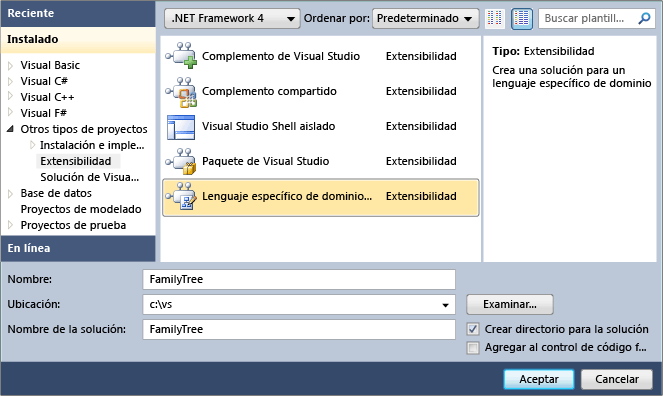

# Cómo: Crear soluciones de lenguajes específicos de dominio
Un lenguaje específico de dominio (DSL) se crea mediante una solución de Visual Studio especializada.

## Requisitos previos

Antes de poder iniciar este procedimiento, Instale estos componentes:

- Programa para la mejora
- SDK de Visual Studio (instalado como parte de la carga de trabajo **desarrollo de extensiones de Visual Studio** )
- SDK de modelado (instalado como componente de Visual Studio)

[!INCLUDE[modeling_sdk_info](includes/modeling_sdk_info.md)]

## Crear una solución de lenguaje específico de dominio

1. Inicie el Asistente para DSL mediante la creación de un nuevo proyecto de **Diseñador de lenguaje específico de dominio** .

   > [!NOTE]
   > Preferiblemente, el nombre que elija para el proyecto debe ser un identificador visual C# válido, ya que se podría usar para generar código.

   ::: moniker range="vs-2017"

   

   ::: moniker-end

2. Elija una plantilla DSL.

    En la página **seleccionar opciones de lenguaje específico de dominio** , seleccione una de las plantillas de solución como el **idioma mínimo**. Elija una plantilla similar a la del DSL que desea crear.

    Para obtener más información acerca de las plantillas de solución, consulte [elegir una plantilla de solución de lenguaje específico de dominio](../modeling/choosing-a-domain-specific-language-solution-template.md).

3. Escriba una extensión de nombre de **archivo** en la página extensión de archivo. Debe ser único en el equipo y en todos los equipos en los que desee instalar el DSL. Debería ver el mensaje **no hay aplicaciones ni editores de Visual Studio que usen esta extensión**.

   - Si ha usado la extensión de nombre de archivo en DSL experimentales anteriores que no se han instalado completamente, puede borrarlas mediante la herramienta **restablecer la instancia experimental** , que se encuentra en el menú del SDK de Visual Studio.

   - Si otra extensión de Visual Studio que usa esta extensión de archivo se ha instalado completamente en el equipo, considere la posibilidad de desinstalarla. En el menú **herramientas** , haga clic en **Administrador de extensiones**.

4. Inspeccione y, si es necesario, ajuste los campos en las páginas restantes del asistente. Cuando esté satisfecho con la configuración, haga clic en **Finalizar**. Para obtener más información sobre la configuración, vea [Diseñador DSL páginas del asistente](#settings).

    El asistente crea una solución que tiene dos proyectos, denominados **DSL** y **DslPackage**.

   > [!NOTE]
   > Si ve un mensaje que le avisa de que no desea ejecutar plantillas de texto de orígenes que no son de confianza, haga clic en **Aceptar**. Puede establecer que este mensaje no vuelva a aparecer.

## Páginas del Asistente para Diseñador DSL
 Puede dejar algunos de los campos sin modificar con respecto a sus valores predeterminados. Sin embargo, asegúrese de establecer el campo de extensión de archivo.

### Página de configuración de la solución
 **¿En qué plantilla desea basar el idioma específico del dominio?**
Elija una plantilla similar a la del DSL que desea crear. Las distintas plantillas proporcionan puntos de partida útiles. Al seleccionar una plantilla de solución, el asistente muestra una descripción. Para obtener más información acerca de las plantillas de solución, consulte [elegir una plantilla de solución de lenguaje específico de dominio](../modeling/choosing-a-domain-specific-language-solution-template.md).

 **¿Qué nombre desea asignar a su lenguaje específico de dominio?**
El valor predeterminado es el nombre de la solución. El código se genera a partir de este valor. Debe ser válido como nombre de C# clase.

### Página extensión de archivo
 **¿Qué extensión deben usar los archivos de modelo?**
Escriba una nueva extensión de archivo.

 Compruebe que esta extensión de archivo no se ha registrado para su uso en este equipo, como se indica a continuación:

 Mire en **otras herramientas y aplicaciones registradas para administrar esta extensión**. Si ve el mensaje **no hay aplicaciones ni editores de Visual Studio que usen esta extensión**, puede usar esta extensión de archivo.

 Si ve una lista de herramientas o paquetes, debe realizar una de las siguientes acciones:

- Escriba una extensión de archivo diferente.

     \- o -

- Restablezca la instancia experimental de Visual Studio. Esto anulará el registro de todos los DSL que ha creado previamente. En el menú **Inicio** , haga clic en **todos los programas**, **Microsoft Visual Studio SDK de 2010**, **herramientas**y, a continuación, **restablezca la instancia experimental de Microsoft Visual Studio 2010**. Puede volver a generar cualquier otro DSL que desee utilizar de nuevo.

     \- o -

- Si una extensión de Visual Studio que usa esta extensión de archivo se ha instalado por completo en el equipo, desinstálelo. En el menú **herramientas** , haga clic en **Administrador de extensiones**.

### Página de configuración del producto
 **¿Cuál es el nombre del producto al que pertenece el nuevo lenguaje específico del dominio?**
El valor predeterminado es el nombre de DSL.

 Este valor se usa en el explorador de Windows (o explorador de archivos) para describir los archivos que tienen esta extensión de archivo.

 **¿Cuál es el nombre de la empresa a la que pertenece el producto?**
El nombre de la empresa.

 Este valor se incorpora en las propiedades de AssemblyInfo del paquete DSL.

 **¿Cuál es el espacio de nombres raíz para los proyectos de esta solución?**
De forma predeterminada, se crea un nombre formado por los nombres de empresa y producto.

### Página firma
 **Crear un archivo de clave de nombre seguro** La opción predeterminada es crear una nueva clave para firmar el ensamblado DSL.

 **Usar clave de nombre seguro existente** Utilice esta opción si desea integrar el DSL con otro ensamblado.

 Para obtener más información sobre los nombres seguros, vea [crear y utilizar ensamblados con nombre seguro](http://go.microsoft.com/fwlink/?LinkId=186073).

## Vea también

- [Cómo definir lenguajes específicos de dominio](../modeling/how-to-define-a-domain-specific-language.md)
- [Glosario de las Herramientas del lenguaje específico de dominio](https://msdn.microsoft.com/ca5e84cb-a315-465c-be24-76aa3df276aa)
