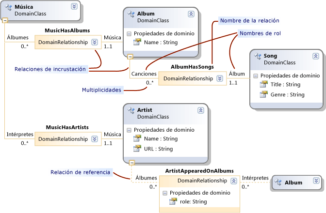
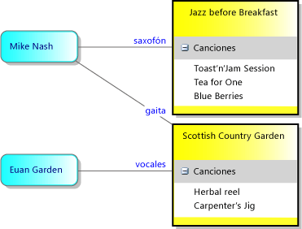
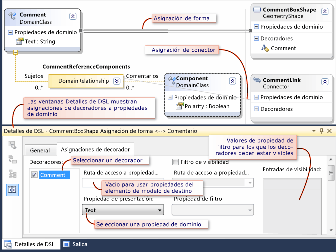
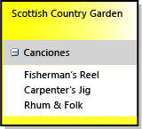
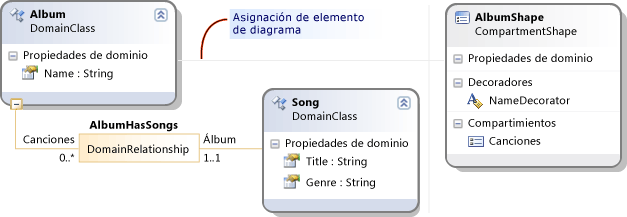
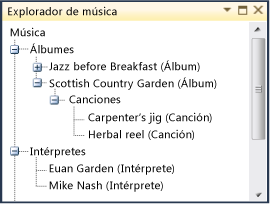

# Cómo: Definir lenguajes específicos de dominio
Para definir un lenguaje específico de dominio (DSL), crea una solución de Visual Studio desde una plantilla. La parte clave de la solución es el diagrama DSL Definition (Definición de DSL), que se almacena en DslDefinition.dsl. DSL Definition (Definición de DSL) define las clases y las formas del DSL. Después de modificar y agregar estos elementos, puede agregar código de programa para personalizar el DSL con más detalle.

Si está familiarizado con los DSL, le recomendamos que trabaje a través de la **laboratorio de herramientas de DSL**, que encontrará en este sitio: [SDK de modelado y](http://go.microsoft.com/fwlink/?LinkID=186128)

##  Seleccionar una plantilla de solución

Para definir un DSL, debe tener instalados los siguientes componentes:

- Programa para la mejora
- Visual Studio extensión carga de trabajo desarrollo (incluye el SDK de Visual Studio)
- SDK de modelado (instalarlo como un componente individual en Visual Studio)

[!INCLUDE[modeling_sdk_info](includes/modeling_sdk_info.md)]

Para crear un nuevo lenguaje específico de dominio, cree una nueva solución de Visual Studio mediante la plantilla de proyecto de lenguaje específico de dominio.

### Para crear una solución de DSL

1. Cree un nuevo **lenguajes específicos de dominio** proyecto.

   ::: moniker range="vs-2017"

    

   ::: moniker-end

    El **Domain-Specific Language asistente** se abre y muestra una lista de soluciones DSL de plantilla.

2. Haga clic en cada plantilla para ver una descripción. Elija la solución que más se parezca a lo que quiere crear.

    Cada plantilla DSL define un DSL de trabajo básico. Editará este DSL para que se ajuste a sus requisitos.

    Haga clic en cada muestra para obtener más información.

   - Seleccione **flujo de tareas** para crear un DSL que tiene calles. Las calles son particiones verticales u horizontales del diagrama.

   - Seleccione **modelos de componentes** para crear un DSL que tenga puertos. Los puertos son pequeñas formas en el borde de una forma mayor.

   - Seleccione **diagramas de clases** para definir un DSL que tenga formas de compartimiento. Las formas de compartimiento contienen listas de elementos.

   - Seleccione **lenguaje mínimo** en otros casos, o si no está seguro.

   - Seleccione **Diseñador de WinForm mínimo** o **Minimal WPF Designer** para crear un DSL que se muestra en una superficie de Windows Forms o WPF. Tendrá que escribir código para definir el editor. Para obtener más información, vea los temas siguientes:

        [Crear lenguajes específicos de dominio basados en Windows Forms](../modeling/creating-a-windows-forms-based-domain-specific-language.md)

        [Crear lenguajes específicos de dominio basados en WPF](../modeling/creating-a-wpf-based-domain-specific-language.md)

3. Escriba una extensión de nombre de archivo para su DSL en la página del asistente correspondiente. Esta es la extensión que usarán los archivos que contienen instancias de su DSL.

   - Elija una extensión de nombre de archivo que no esté asociada con ninguna aplicación en su equipo o en algún equipo donde quiera instalar el DSL. Por ejemplo, **docx** y **htm** sería inaceptable archivo las extensiones de nombre.

   - El asistente le advertirá en caso de que la extensión que haya especificado se esté usando como un DSL. Piense en usar una extensión de nombre de archivo diferente. También puede restablecer la instancia de Visual Studio SDK Experimental para borrar antiguos diseñadores experimentales. Haga clic en **iniciar**, haga clic en **todos los programas**, **Microsoft Visual Studio 2010 SDK**, **herramientas**y, a continuación, **restablecer Microsoft Instancia de Visual Studio 2010 Experimental**.

4. Puede ajustar la configuración en las demás páginas o dejar los valores predeterminados.

5. Haga clic en **Finalizar**.

    El asistente crea una solución que contiene dos o tres proyectos, y genera código a partir de la definición de DSL.

   Ahora, la interfaz de usuario es similar a la imagen siguiente.

   

   Esta solución define un lenguaje específico de dominio. Para obtener más información, consulte [general de la interfaz de usuario de herramientas de lenguaje específico de dominio](../modeling/overview-of-the-domain-specific-language-tools-user-interface.md).

### Probar la solución
 La solución de plantilla proporciona un DSL de trabajo, que puede modificar o usar tal cual.

 Para probar la solución, presione F5 o CTRL+F5. Se abre una nueva instancia de Visual Studio en modo experimental.

 En la nueva instancia de Visual Studio, en el Explorador de soluciones, abra el archivo de ejemplo. Se abre como un diagrama, con un cuadro de herramientas.

 Si se ejecuta una solución que ha creado desde el **lenguaje mínimo** plantilla, Visual Studio experimental tendrá un aspecto similar en el ejemplo siguiente:

 

 Experimente con las herramientas. Cree elementos y conéctelos.

 Cierre la instancia experimental de Visual Studio.

> [!NOTE]
> Cuando haya modificado el DSL, ya no podrá ver las formas en el archivo de prueba Sample. Sin embargo, podrá crear nuevos elementos.

### Modificar la plantilla de DSL
 Cambie el nombre y conserve algunas o todas las clases de dominio y clases de forma en la plantilla de definición de DSL. Los nuevos nombres de clase deben ser nombres CLR válidos, sin espacios ni puntuación.

 Conservar estas clases es especialmente útil:

- La clase raíz aparece en la parte superior izquierda del diagrama de definición de DSL, bajo **clases y relaciones**. Asígnele otro nombre según el DSL. Por ejemplo, un DSL llamado **MusicLibrary** podría tener una clase raíz denominada **música**.

- La clase de diagrama aparece en la esquina inferior derecha del diagrama de definición de DSL, en el **elementos del diagrama** columna. Quizás tenga que desplazarse a la derecha para verlo. Normalmente se denomina _Sudsl_**diagrama**.

- Si ha usado el **flujo de tareas** plantilla y desea crear diagramas con calles, mantener y cambiar el nombre de la clase de dominio Actor y la forma ActorSwimlane.

  Elimine o cambie el nombre de otras clases para que se ajusten a sus necesidades.

##  Patrones para definir un DSL
 Le recomendamos que desarrolle un DSL agregando o ajustando una o dos características cada vez. Agregue una característica, ejecute el DSL y pruébelo y, después, agregue una o dos características más. Una característica típica de su DSL podría ser:

- Una clase de dominio, la relación de incrustación que conecta el elemento con el modelo, la forma necesaria para mostrar elementos de esa clase en el diagrama y la herramienta de elemento que permite a los usuarios crear elementos.

- Las propiedades de dominio de una clase de dominio y los elementos Decorator que los muestran en una forma.

- Una relación de referencia y el conector que la muestra en el diagrama, y la herramienta de conector que permite a los usuarios crear vínculos.

- Una personalización que requiere código de programa, como una restricción de validación o un comando de menú.

  En las secciones siguientes se describe cómo construir los tipos de características DSL más útiles. Hay muchos otros patrones con los que se puede construir un DSL, pero estos son los que se usan con más frecuencia.

> [!NOTE]
> Después de agregar una característica, no olvide hacer clic en **Transformar todas las plantillas** en la barra de herramientas del explorador de soluciones antes de compilar y ejecutar su DSL.

 La figura siguiente muestra las clases y relaciones que forman parte del DSL y que se usan como ejemplo en este tema.

 

 La siguiente figura es un modelo de ejemplo de este DSL:

 

> [!NOTE]
> Con "modelo" nos referimos a una instancia de su DSL que los usuarios crean y que normalmente se muestra como un diagrama. En este tema se explican tanto el diagrama DSL Definition (Definición de DSL) como los diagramas de modelo que aparecen cuando se usa su DSL.

##  Definir clases de dominio
 Las clases de dominio representan los conceptos de su DSL. Las instancias son *elementos del modelo*. Por ejemplo, en un **MusicLibrary** DSL podría tener las clases de dominio **álbum** y **canción**.

 Para crear una clase de dominio, puede arrastrar desde el **la clase de dominio denominado** herramienta al diagrama y, a continuación, cambie el nombre de la clase.

 Para obtener más información, consulte [las propiedades de las clases de dominio](../modeling/properties-of-domain-classes.md).

### Crear una relación incrustada para cada clase de dominio
 Todas las clases de dominio, excepto la clase raíz, deben ser el destino de al menos una relación de incrustación, o deben heredar de una clase que sea el destino de una relación de incrustación.

 En un modelo, todos los elementos de modelo son nodos de un único árbol de relaciones incrustadas. El origen y el destino de una relación de incrustación suelen denominarse clases primaria y secundaria.

 La selección de una clase primaria para una clase de dominio depende de cómo quiere que la duración de sus elementos dependa de otros elementos. Si se elimina un nodo de un árbol, normalmente también se elimina su subárbol. Por lo tanto, las clases de elemento que tienen una existencia independiente se incrustan directamente debajo de la clase raíz.

 Normalmente, si muestra un elemento dentro de otro elemento, quiere indicar una relación de propiedad. En ese caso, la clase primaria más apropiada es la clase del contenedor. La excepción es cuando el elemento que ve dentro del contendor es tan solo un vínculo de referencia a un elemento independiente. En ese caso, al eliminar el contenedor se elimina la referencia pero no el destino.

 En los patrones de una definición de DSL que se describen en este tema, damos por hecho que los elementos que se muestran dentro de un contenedor se eliminarán cuando el contenedor se elimine. Se pueden lograr esquemas más complejos mediante la definición de reglas.

|Cómo se muestra el elemento|Clase primaria (incrustación)|Ejemplo en la plantilla de solución de DSL|
|-|-|-|
|Forma en el diagrama   Calle.|Clase raíz del DSL.|Minimal Language.   Task Flow: clase Actor.|
|Forma en una calle.|Clase de dominio de los elementos que se muestran como calles.|Task Flow: clase Task.|
|Elemento en una lista en una forma; el elemento se elimina si el contenedor se elimina.   Puerto en el borde de una forma.|Clase de dominio que se asigna a la forma del contenedor.|Diagrama de clases: clase Attribute.   Component diagram: clase Port.|
|Elemento en una lista; no se elimina si el contenedor se elimina.|Clase raíz del DSL.   La lista muestra vínculos de referencia.||
|No se muestra directamente.|Clase de la que forma parte.||

 En el ejemplo de la biblioteca de música, los álbumes se muestran como rectángulos en los que se enumeran los títulos de las canciones. Por lo tanto, la clase primaria de Album es la clase raíz Music, y la clase primaria de Song es Album.

 Para crear una clase de dominio y su incrustación al mismo tiempo, haga clic en el **relación de incrustación** de herramientas, a continuación, haga clic en la clase primaria y, a continuación, haga clic en una parte en blanco del diagrama.

 Normalmente no es necesario ajustar el nombre de la relación de incrustación y de sus roles, porque rastrearán los nombres de las clases automáticamente.

 Para obtener más información, consulte [las propiedades de las relaciones de dominio](../modeling/properties-of-domain-relationships.md) y [las propiedades de los Roles de dominio](../modeling/properties-of-domain-roles.md).

> [!NOTE]
> Incrustación no es lo mismo que herencia. En una relación de incrustación, las clases secundarias no heredan las características de sus primarias.

### Agregar propiedades de dominio a cada clase de dominio
 Las propiedades de dominio almacenan valores. Algunos ejemplos son: Name, Title, Publication Date.

 Haga clic en **las propiedades de dominio** en la clase, presione la tecla ENTRAR y, a continuación, escriba el nombre de una propiedad. El tipo predeterminado de una propiedad de dominio es String. Si desea cambiar el tipo, seleccione la propiedad de dominio y establezca el **tipo** en el **propiedades** ventana. Si el tipo que desea no está en la lista desplegable, consulte [agregar tipos de propiedad](#addTypes).

 **Establecer una propiedad de nombre de elemento.** Seleccione una propiedad de dominio que se puede usar para identificar los elementos en el explorador del lenguaje. Por ejemplo, en la clase de dominio Song que pueda seleccionar la propiedad de dominio Title (Título). En el **propiedades** ventana, establezca **es el nombre del elemento** a `true`.

### Crear clases de dominio derivadas
 Si quiere que una clase de dominio tenga variantes que hereden sus propiedades y relaciones, cree clases que deriven de ella. Por ejemplo, Album podría tener las clases derivadas WMA y MP3.

 Cree la clase derivada mediante la **la clase de dominio** herramienta.

 Haga clic en el **herencia** de herramientas, haga clic en la clase derivada y, a continuación, haga clic en la clase base.

 Considere la posibilidad de la **modificador de herencia** de la clase base para **abstracta**. Si cree que puede necesitar instancias de la clase base, considere la posibilidad de crear en su lugar una clase derivada diferente para ellas.

 Las clases derivadas heredan las propiedades y los roles de sus clases base.

### Ordenar el diagrama DSL Definition (Definición de DSL)
 Cuando se agregan relaciones, algunas de las clases aparecen en más de un lugar. Para reducir el número de repeticiones y ampliar el diagrama, haga clic en la clase de destino de una relación y, a continuación, haga clic en **Traer árbol aquí**. Para el efecto contrario, haga clic en la clase de destino de una relación y haga clic en **dividir árbol**. Si no ve estos comandos del menú, asegúrese de que solo está seleccionada la clase de dominio.

 Use CTRL+Flecha arriba y CTRL+Flecha abajo para mover las clases de dominio y las clases de forma.

### Probar las clases de dominio

##### Para probar las nuevas clases de dominio

1. **Haga clic en Transformar todas las plantillas** en la barra de herramientas del explorador de soluciones, para generar el código del Diseñador de DSL. Este paso se puede automatizar. Para obtener más información, consulte [cómo automatizar Transformar todas las plantillas](/previous-versions/visualstudio/visual-studio-2012/ff521399\(v\=vs.110\)).

2. **Compile y ejecute el DSL.** Presione F5 o CTRL+F5 para ejecutar una nueva instancia de Visual Studio en modo experimental. En la instancia experimental de Visual Studio, abra o cree un archivo que tiene la extensión de nombre de archivo de su DSL.

3. **Abra el explorador.** En el lado del diagrama es la ventana de explorador del lenguaje, que normalmente se denomina *Sulenguaje* Explorer. Si no ve esta ventana, podría estar en una pestaña debajo del Explorador de soluciones. Si no lo encuentra, en la **vista** menú, elija **Other Windows**y, a continuación, haga clic en *Sulenguaje* **Explorer**.

     El explorador presenta una vista de árbol del modelo.

4. **Crear nuevos elementos.** Haga clic en el nodo raíz en la parte superior y, a continuación, haga clic en **Agregar nuevo**_Suclase_.

     En el explorador del lenguaje aparece una nueva instancia de su clase.

5. Cuando cree nuevas instancias, compruebe que cada instancia tenga un nombre diferente. Esto ocurrirá sólo si se ha establecido la **es el nombre del elemento** marca en una propiedad de dominio.

6. **Examine las propiedades de dominio. Con una instancia de la clase seleccionada,** inspeccione la ventana Propiedades. Debe mostrar las propiedades de dominio que ha definido en esta clase de dominio.

7. **Guarde el archivo, ciérrelo y vuelva a abrirlo**. Después de expandir los nodos en el explorador, todas las instancias creadas deben ser visibles.

##  Definir formas del diagrama
 Puede definir clases de elementos que aparecen en un diagrama, como rectángulos, elipses o iconos.

#### Para definir una clase de elementos que aparecen como formas en un diagrama

1. **Definir y probar una clase de dominio como se describe en**[definir clases de dominio](#classes) **.**

   - La clase primaria debería ser la clase raíz. Es decir, debería haber una relación de incrustación entre la clase raíz y la nueva clase de dominio.

   - Si el diagrama tiene calles, la clase primaria puede ser la clase de dominio que está asignada a una calle. Antes de continuar con este procedimiento, consulte [definir un DSL que tiene calles](#swimlanes).

2. **Agregar una clase de forma** para representar los elementos en el diagrama del modelo. Arrastre desde una de las siguientes herramientas al diagrama DSL Definition (Definición de DSL):

   - **Forma geométrica** proporciona un rectángulo o una elipse.

   - **Forma de imagen** muestra una imagen que proporcione.

   - **Forma de compartimiento** es un rectángulo que contiene una o varias listas de elementos.

     Cambie el nombre de la clase de forma, que aparecerá en el lado derecho del diagrama DSL Definition (Definición de DSL), en Shapes and Connectors (Formas y conectores).

3. **Definir una imagen, si ha creado una forma de imagen**.

   1. Cree un archivo de imagen de cualquier tamaño. Se admiten los formatos BMP, JPEG, GIF y EMF.

   2. En el Explorador de soluciones, agregue el archivo a la solución, en Dsl\Resources.

   3. Vuelva al diagrama DSL Definition (Definición de DSL) y seleccione la nueva clase de forma de imagen.

   4. En la ventana Propiedades, haga clic en el **imagen** propiedad.

   5. En el **Seleccionar imagen** diálogo cuadro, haga clic en el menú desplegable bajo **nombre de archivo**y seleccione la imagen.

4. **Agregar elementos Decorator de texto a la forma, para mostrar las propiedades de dominio.**

    Para mostrar el nombre o el título del elemento de modelo, probablemente necesitará al menos un elemento Decorator de texto.

    Haga clic en el encabezado de la clase shape, apunte a **agregar**y, a continuación, haga clic en **elemento Decorator de texto**. Establezca el nombre del elemento decorator y en la ventana de propiedades establecidas su **posición**.

5. **Conectar cada forma con una asignación de elemento de diagrama a la clase de dominio que debe mostrar**.

    Haga clic en el **asignación de elemento de diagrama** de herramientas, haga clic en la clase de dominio y, luego, haga clic en la clase shape.

6. **Las propiedades se asignan a los elementos Decorator de texto.**

   1. Seleccione la línea gris entre la clase de dominio y la clase de forma que representa la asignación de elemento de diagrama.

   2. En el **detalles de DSL** ventana, haga clic en el **asignaciones del elemento Decorator** ficha. Si no ve el **detalles de DSL** ventana, en el **vista** menú, elija **Other Windows** y, a continuación, haga clic en **detalles de DSL**. Normalmente es necesario levantar la parte superior de esta ventana para ver todo su contenido.

   3. Seleccione el nombre de un elemento Decorator. En **Mostrar propiedad**, seleccione el nombre de una propiedad de la clase de dominio. Repita este paso para cada elemento Decorator.

       Si desea mostrar una propiedad de un elemento relacionado, haga clic en el navegador de árbol de la lista desplegable bajo **ruta para mostrar la propiedad**.

   4. Asegúrese de que hay una marca de verificación junto al nombre de cada elemento Decorator.

      

7. **Asegúrese de un elemento de cuadro de herramientas para crear elementos de la clase de dominio.**

   1. En **DSL Explorer**, expanda el **Editor** nodo y todos sus subnodos.

   2. Haga clic en el nodo bajo **Toolbox Tabs** que tiene el mismo nombre que su DSL, por ejemplo, MusicLibrary. Haga clic en **Agregar herramienta de elemento**.

       > [!NOTE]
       > Si hace doble clic en el **herramientas** nodo, no verá **Agregar herramienta de elemento**. En su lugar, haga clic en el nodo situado encima de él.

   3. En la ventana Propiedades con la nueva herramienta de elemento seleccionada, establezca **clase** a la clase de dominio que ha agregado recientemente.

   4. Establecer **título** y **información sobre herramientas**.

   5. Establecer **icono cuadro de herramientas** a un icono que aparecerá en el cuadro de herramientas. Puede establecerlo en un icono nuevo o en un icono que ya se haya usado para otra herramienta.

        Para crear un nuevo icono, abra Dsl\Resources en **el Explorador de soluciones**. Copie y pegue uno de los archivos BMP existentes de las herramientas de elemento. Cambie el nombre a la copia pegada y, después, haga doble clic en él para editarlo.

        Vuelva al diagrama de definición de DSL, seleccione la herramienta y, en la ventana Propiedades, haga clic en **[...]**  en **icono cuadro de herramientas**. En el **Seleccionar mapa de bits** cuadro de diálogo, seleccione su. Archivo BMP en el menú desplegable.

   Para obtener más información, consulte [geométricas propiedades](../modeling/properties-of-geometry-shapes.md) y [las propiedades de las formas de imagen](../modeling/properties-of-image-shapes.md).

#### Para probar las formas

1. **Haga clic en Transformar todas las plantillas** en la barra de herramientas del explorador de soluciones, para generar el código del Diseñador de DSL.

2. **Compile y ejecute el DSL.** Presione F5 o CTRL+F5 para ejecutar una nueva instancia de Visual Studio en modo experimental. En la instancia experimental de Visual Studio, abra o cree un archivo que tiene la extensión de nombre de archivo de su DSL.

3. **Compruebe que las herramientas de elemento aparecen en el cuadro de herramientas.**

4. **Crear formas** arrastrando desde una herramienta al diagrama del modelo.

5. **Compruebe que aparece cada elemento decorator de texto,** y que:

   1. Puede editar, a menos que ha establecido la **Is UI Read Only** marca en la propiedad de dominio.

   2. Cuando se edita la propiedad en la ventana Properties (Propiedades) o en el elemento Decorator, la otra vista se actualiza.

   Después de probar una forma por primera vez, quizás quiera ajustar algunas de sus propiedades y agregar algunas características más avanzadas. Para obtener más información, consulte [personalizar y ampliar lenguajes específicos de dominio](../modeling/customizing-and-extending-a-domain-specific-language.md).

##  Definir relaciones de referencia
 Puede definir una relación de referencia entre cualquier clase de dominio de origen y cualquier clase de dominio de destino. Las relaciones de referencia suelen mostrarse en un diagrama como conectores, que son líneas entre formas.

 Por ejemplo, si los álbumes y los artistas se muestran como formas en el diagrama, podría definir una relación llamada ArtistsAppearedOnAlbums que vincula los artistas con los álbumes en los que han trabajado. Vea el ejemplo en la figura.

 

 Las relaciones de referencia también pueden vincular elementos del mismo tipo. Por ejemplo, en un DSL que representa un árbol genealógico, la relación entre los padres y los hijos es una relación de referencia de persona a persona.

### Definir una relación de referencia
 Haga clic en la herramienta Reference Relationship (Relación de referencia), haga clic en la clase de dominio de origen de la relación y, después, haga clic en la clase de dominio de destino. La clase de destino puede ser la misma que la clase de origen.

 Cada relación tiene dos roles, representados por la línea a cada lado del cuadro de relación. Puede seleccionar cada rol y establecer sus propiedades en la ventana Properties (Propiedades).

 **Considere la posibilidad de cambiar el nombre de los roles**. Por ejemplo, en una relación entre personas, quizás quiera cambiar los nombres predeterminados por Padres e Hijos, Director y Subordinados, Profesor y Estudiante, etc.

 **Ajuste las multiplicidades de cada rol**, si es necesario. Si quiere que cada persona tenga al menos un director, establezca la multiplicidad que aparece debajo de la etiqueta Director en el diagrama a 0..1.

 **Agregar propiedades de dominio a la relación.** En la ilustración, la relación Artist-Album tiene una propiedad de rol.

 **Establece la propiedad permite duplicados de la relación,** si puede haber más de un vínculo de la misma clase entre el mismo par de elementos del modelo. Por ejemplo, podría permitir que un Profesor enseñe más de una Asignatura al mismo Estudiante.

 

 Para obtener más información, consulte [las propiedades de las relaciones de dominio](../modeling/properties-of-domain-relationships.md) y [las propiedades de los Roles de dominio](../modeling/properties-of-domain-roles.md).

### Definir un conector para mostrar la relación
 Un conector muestra una línea entre dos formas en el diagrama del modelo.

 Arrastre el **conector** herramienta al diagrama DSL definition.

 Agregue elementos Decorator de texto si quiere mostrar etiquetas en el conector. Establezca sus posiciones. Para permitir que el usuario mueve un elemento decorator de texto, establezca su **es Moveable** propiedad.

 Use la **asignación de elemento de diagrama** herramienta para vincular el conector a la relación de referencia.

 Con la asignación de elemento de diagrama seleccionada, abra el **detalles de DSL** ventana y abra el **asignaciones del elemento Decorator** ficha.

 Seleccione cada **Decorator** y establecer **Mostrar propiedad** a la propiedad de dominio correcto.

 Asegúrese de que aparece una marca de verificación junto a cada elemento en el **decoradores** lista.

### Definir una herramienta Connection Builder (Generador de conexiones)
 En el **DSL Explorer** ventana, expanda el **Editor** nodo y todos sus subnodos.

 Haga clic en el nodo que tiene el mismo nombre que su DSL y, a continuación, haga clic en **agregar nueva herramienta de conexión**.

 Con la nueva herramienta seleccionada, en la ventana Properties (Propiedades):

- Establecer el **título** y **información sobre herramientas**.

- Haga clic en **generador de conexiones** y seleccione el generador apropiado para la nueva relación.

- Establecer **icono cuadro de herramientas** del icono que desea que aparezca en el cuadro de herramientas. Puede establecerlo en un icono nuevo o en un icono que ya se haya usado para otra herramienta.

     Para crear un nuevo icono, abra Dsl\Resources en **el Explorador de soluciones**. Copie y pegue uno de los archivos BMP existentes de las herramientas de elemento. Cambie el nombre a la copia pegada y, después, haga doble clic en él para editarlo.

     Vuelva al diagrama de definición de DSL, seleccione la herramienta y, en la ventana Propiedades, haga clic en **[...]**  en **icono cuadro de herramientas**. En el **Seleccionar mapa de bits** cuadro de diálogo, seleccione su. Archivo BMP en el menú desplegable.

##### Para probar una relación de referencia y un conector

1. **Haga clic en Transformar todas las plantillas** en la barra de herramientas del explorador de soluciones, para generar el código del Diseñador de DSL.

2. **Compile y ejecute el DSL.** Presione F5 o CTRL+F5 para ejecutar una nueva instancia de Visual Studio en modo experimental. En la instancia experimental de Visual Studio, abra o cree un archivo que tiene la extensión de nombre de archivo de su DSL.

3. **Compruebe que la herramienta de conexión aparece en el cuadro de herramientas.**

4. **Crear formas** arrastrando desde una herramienta al diagrama del modelo.

5. **Crear conexiones** entre las formas. Haga clic en la herramienta de conector, en una forma y, después, en otra forma.

6. **Compruebe que no se puede crear conexiones entre clases inapropiadas.** Por ejemplo, si la relación es entre Albums y Artists, compruebe que no se puede vincular a Artists con Artists.

7. **Compruebe que las multiplicidades son correctas. Por ejemplo, compruebe que no se puede conectar a una persona a más de un administrador.**

8. **Compruebe que aparece cada elemento decorator de texto,** y que:

   1. Puede editar, a menos que ha establecido la **Is UI Read Only** marca en la propiedad de dominio.

   2. Cuando se edita la propiedad en la ventana Properties (Propiedades) o en el elemento Decorator, la otra vista se actualiza.

   Después de probar un conector por primera vez, quizás quiera ajustar algunas de sus propiedades y agregar algunas características más avanzadas. Para obtener más información, consulte [personalizar y ampliar lenguajes específicos de dominio](../modeling/customizing-and-extending-a-domain-specific-language.md).

##  Definir formas que contienen listas: Formas de compartimiento
 Una forma de compartimiento contiene una o varias listas de elementos. Por ejemplo, en un DSL de biblioteca de música, podría usar formas de compartimiento para representar álbumes de música. En cada álbum, hay una lista de canciones.

 

 En el método más sencillo de lograr este efecto en una definición de DSL, se define una clase de dominio para el contenedor y una clase de dominio para cada lista. La clase de contenedor se asigna a la forma de compartimiento.

 

 Para obtener más información, consulte [las propiedades de las formas de compartimiento](../modeling/properties-of-compartment-shapes.md).

#### Para definir una forma de compartimiento

1. **Crear la clase de dominio de contenedor**. Haga clic en el **relación de incrustación** de herramientas, haga clic en la clase raíz del modelo y, a continuación, haga clic en una parte en blanco del diagrama de definición de DSL. Esto crea la clase de dominio llamada Album en la figura de ejemplo.

     En lugar de incrustarlo en la clase raíz, también puede incrustar el contenedor en una clase de dominio que esté asignada a una calle.

     Agregue una propiedad de dominio como el nombre a la clase y establezca su **es el nombre del elemento** marca en la ventana Propiedades.

2. **Crear la clase de dominio del elemento de lista**. Haga clic en el **relación de incrustación** de herramientas, haga clic en la clase de contenedor (Album) y, a continuación, haga clic en una parte en blanco del diagrama. Esto crea la clase de dominio llamada Song en la figura de ejemplo.

     Agregue una propiedad de dominio, como el título a la clase y establezca su **es el nombre del elemento** marca.

     Agregue otras propiedades de dominio.

     Agregue otra clase de dominio de elemento de lista para cada lista que quiera mostrar.

3. **Para mezclar varios tipos de elemento de la lista**, crear clases que heredan de la clase list. Hacer que la clase list abstracta estableciendo su **modificador de herencia**.

     Por ejemplo, si quiere que la música clásica se ordene por compositor en lugar de por artista, podría crear dos subclases de Song, ClassicalSong y NonClassicalSong.

4. **Creación de la forma de compartimiento**. Arrastre desde el **forma de compartimiento** herramienta al diagrama DSL definition.

     Agregue un elemento Decorator de texto y establezca su nombre.

     Agregue un compartimiento y establezca su nombre.

5. Para que el usuario pueda ocultar los compartimientos de lista, haga clic en la clase de la forma de compartimiento, elija **agregar**y, a continuación, haga clic en **Decorator de expansión o contracción**. En la ventana Properties (Propiedades), establezca la posición del elemento Decorator.

6. Haga clic en el **asignación de elemento de diagrama** de herramientas, haga clic en la clase de dominio de contenedor y, a continuación, haga clic en la forma de compartimiento.

7. Seleccione el vínculo de la asignación de elemento de diagrama entre la clase de dominio y la forma. En el **detalles de DSL** ventana:

    1. Haga clic en el **decoradores** ficha. Haga clic en el nombre del elemento decorator y, a continuación, seleccione el elemento correspondiente en **propiedad Display**. Asegúrese de que haya una marca de verificación junto al nombre del elemento Decorator.

    2. Haga clic en el **asignaciones de compartimiento** ficha.

         Haga clic en el nombre del compartimiento.

         En **ruta de acceso de colección de elementos de mostradas**, vaya a la clase de elemento de lista (Song). Haga clic en la flecha hacia abajo para usar la herramienta de navegador.

         En **propiedad Display**, seleccione la propiedad que se debe mostrar en la lista. En el ejemplo, es Title.

> [!NOTE]
> Use los campos Path (Ruta de acceso) del Decorator Map (Asignación de elemento Decorator) y los campos de Compartment Maps (Asignaciones de compartimientos) para crear relaciones más complejas entre las clases de dominio y la forma de compartimiento.

#### Para definir una herramienta para crear la forma

1. **Asegúrese de un elemento de cuadro de herramientas para crear elementos de la clase de dominio.**

2. En **DSL Explorer**, expanda el **Editor** nodo y todos sus subnodos.

3. Haga clic en el nodo bajo **Toolbox Tabs** que tiene el mismo nombre que su DSL, por ejemplo, MusicLibrary. Haga clic en **Agregar herramienta de elemento**.

    > [!NOTE]
    > Si hace doble clic en el **herramientas** nodo, no verá **Agregar herramienta de elemento**. En su lugar, haga clic en el nodo situado encima de él.

4. En la ventana Propiedades con la nueva herramienta de elemento seleccionada, establezca **clase** a la clase de dominio que ha agregado recientemente.

5. Establecer **título** y **información sobre herramientas**.

6. Establecer **icono cuadro de herramientas** a un icono que aparecerá en el cuadro de herramientas. Puede establecerlo en un icono nuevo o en un icono que ya se haya usado para otra herramienta.

     Para crear un nuevo icono, abra Dsl\Resources en **el Explorador de soluciones**. Copie y pegue uno de los archivos .BMP existentes de las herramientas de elemento. Cambie el nombre a la copia pegada y, después, haga doble clic en él para editarlo.

     Vuelva al diagrama de definición de DSL, seleccione la herramienta y, en la ventana Propiedades, haga clic en **[...]**  en **icono cuadro de herramientas**. En el **Seleccionar mapa de bits** cuadro de diálogo, seleccione el archivo BMP en el menú desplegable.

#### Para probar una forma de compartimiento

1. **Haga clic en Transformar todas las plantillas** en la barra de herramientas del explorador de soluciones, para generar el código del Diseñador de DSL.

2. **Compile y ejecute el DSL.** Presione F5 o CTRL+F5 para ejecutar una nueva instancia de Visual Studio en modo experimental. En la instancia experimental de Visual Studio, abra o cree un archivo que tiene la extensión de nombre de archivo de su DSL.

3. **Compruebe que la herramienta aparece en el cuadro de herramientas.**

4. Arrastre la herramienta al diagrama del modelo. Se crea una forma.

    Compruebe que el nombre del elemento aparece y se establece automáticamente en un valor predeterminado.

5. Haga clic en el encabezado de la nueva forma y, a continuación, haga clic en agregar *su elemento de lista.* En el ejemplo, el comando es Add Song (Agregar canción).

    Compruebe que aparece un elemento en la lista y que tiene un nombre nuevo.

6. Haga clic en uno de los elementos de lista y, después, examine la ventana Properties (Propiedades). Verá las propiedades de los elementos de lista.

7. Abra el explorador del lenguaje. Compruebe que puede ver los nodos de contenedor con los nodos de elemento de lista dentro.

   

   Después de probar una forma de compartimiento por primera vez, quizás quiera ajustar algunas de sus propiedades y agregar algunas características más avanzadas. Para obtener más información, consulte [personalizar y ampliar lenguajes específicos de dominio](../modeling/customizing-and-extending-a-domain-specific-language.md).

### Mostrar un vínculo de referencia en un compartimiento
 Normalmente, un elemento que se muestra en un compartimiento es un elemento secundario del elemento que está representado por la forma de compartimiento. Pero a veces querrá mostrar un elemento que está vinculado a él con una relación de referencia.

 Por ejemplo, podríamos agregar un segundo compartimiento a AlbumShape que muestra una lista de los artistas que están vinculados al álbum.

 En este caso, el compartimiento debe mostrar el vínculo en lugar del elemento referenciado. El motivo es que quiere que, cuando el usuario seleccione el elemento en el compartimiento y presione Supr, se elimine el vínculo, no el elemento referenciado.

 En cualquier caso, puede hacer que se muestre el nombre del elemento referenciado en el compartimiento.

 En el procedimiento siguiente se da por hecho que ya ha creado la clase de dominio, la relación de referencia, la forma de compartimiento y la asignación de elemento de diagrama, tal y como se describió anteriormente en esta sección.

##### Para mostrar un vínculo de referencia en un compartimiento

1. **Agregue un compartimiento a la forma de compartimiento**. En el diagrama de definición de DSL, haga clic en la clase de la forma de compartimiento, elija **agregar**y, a continuación, haga clic en **compartimiento**.

2. Establecer **ruta de acceso de colección de elementos de mostradas** para navegar al vínculo, en lugar de su elemento de destino. Haga clic en el menú desplegable y use la vista de árbol para seleccionar la relación de referencia en lugar de su destino. En el ejemplo, la relación es **ArtistAppearedOnAlbums**.

3. Establecer **ruta de acceso a la propiedad Display** para navegar desde el vínculo al elemento de destino. En el ejemplo, esto es **artista**.

4. Establecer **propiedad Display** en la propiedad correspondiente del elemento de destino, por ejemplo **nombre**.

5. **Transformar todas las plantillas**, compilar y ejecutar el DSL y abrir un modelo de prueba.

6. En el diagrama del modelo, cree las clases de forma apropiadas, establezca sus nombres y cree un vínculo entre ellas. En la forma de compartimiento, deben aparecer los nombres de los elementos vinculados.

7. Seleccione el vínculo o el elemento en la forma de compartimiento. Deben desaparecer tanto el vínculo como el elemento.

##  Definición de los puertos en los límites de otra forma
 Un puerto es una forma que está situada en los límites de otra forma.

 Los puertos se pueden usar para proporcionar un punto de conexión fijo en otra forma al cual el usuario puede dibujar conectores. En este caso, puede hacer que la forma de puerto sea transparente.

 Para ver un ejemplo que usa los puertos, seleccione el **diagrama de componentes** plantilla al crear una nueva solución DSL. En este ejemplo se muestran los principales aspectos para tener en cuenta al definir puertos:

- Hay una clase de dominio que representa el contenedor de los puertos, `Component`.

- Hay una clase de dominio que representa los puertos. En el ejemplo, es `ComponentPort`.

- Hay una relación de incrustación desde la clase de dominio de contendor a la clase de dominio de puerto. Para obtener más información, consulte [definir clases de dominio](#classes).

- Si quiere mezclar diferentes tipos de puerto en el mismo contenedor, puede crear subclases de la clase de dominio de puerto. En el ejemplo, `InPort` y `OutPort` heredan de `ComponentPort`.

- La clase de dominio de contenedor se puede asignar a cualquier tipo de forma. En el ejemplo, es `ComponentShape`. Para obtener más información, consulte [definir formas](#shapes).

- Las clases de dominio de puerto se asignan a formas de puerto. Puede asignar las clases derivadas a clases de forma de puerto diferentes, o asignar la clase base a una clase de forma de puerto.

  En otros aspectos, las formas de puerto se comportan como se describe en [definir formas](#shapes).

  Para obtener más información, consulte [las propiedades de las formas de puerto](../modeling/properties-of-port-shapes.md).

##  Definir un DSL que tiene calles
 Las calles son una partición horizontal o vertical de un diagrama. Cada calle corresponde a un elemento de modelo. Su definición de DSL requiere una clase de dominio para los elementos de calle.

 La mejor manera de crear un DSL con calles es crear una nueva solución de DSL y elegir la plantilla de solución Task Flow (Flujo de tareas). En la definición de DSL, la clase Actor es la clase de dominio asignada a la calle. Cambie el nombre de esta y otras clases para adaptarlas a su proyecto.

 Para agregar una clase que se mostrará como una forma dentro de una calle, cree una relación de incrustación entre la clase de calle y la nueva clase. Los usuarios podrán arrastrar elementos desde una calle a otra, pero cada elemento siempre estará dentro de una calle determinada. En la plantilla de solución Task Flow (Flujo de tareas), FlowElement es una clase secundaria de la clase de calle.

 Para agregar una clase que se mostrará como una forma independiente de las calles, cree una relación de incrustación entre la clase raíz y la nueva clase. Los usuarios podrán colocar estas formas en cualquier lugar del diagrama, incluso traspasando los límites de las calles y fuera de ellas. En la plantilla de solución Task Flow (Flujo de tareas), Comment es una clase secundaria de la clase raíz.

 Para obtener más información, consulte [las propiedades de las calles](../modeling/properties-of-swimlanes.md).

##  Agregar tipos de propiedad

### Literales y enumeradores de dominio
 Una enumeración de dominio es un tipo con varios valores literales.

 Para agregar una enumeración de dominio, haga clic en la raíz del modelo en el **DSL Explorer** y, a continuación, haga clic en **agregar nueva enumeración de dominio**. El elemento aparecerá en el **DSL Explorer** bajo el **tipos de dominio** nodo. Este elemento no aparece en el diagrama.

 Para agregar literales de enumeración a la enumeración de dominio, haga clic en la enumeración de dominio en el **DSL Explorer** y, a continuación, haga clic en **Agregar nuevo Literal de enumeración**.

 De forma predeterminada, una propiedad que tiene un tipo de enumeración solo se puede establecer en un valor de la enumeración al mismo tiempo. Si desea que los usuarios y los programadores puedan establecer cualquier combinación de estos valores: establecer un "campo de bits:" el **IsFlags** propiedad de la enumeración.

### Tipos externos
 Cuando se establece el tipo de una propiedad de dominio, si no encuentra el tipo que desee en el **tipo** la lista desplegable, puede agregar un tipo externo. Por ejemplo, podría agregar el **System.Drawing.Color** tipo a la lista.

 Para agregar un tipo, haga clic en la raíz del modelo en el Explorador de DSL y, a continuación, haga clic en **Agregar nuevo tipo externo**. En la ventana Propiedades, establezca el nombre en **Color** y el espacio de nombres **System.Drawing**. Este tipo ahora aparece en el Explorador de DSL en **tipos de dominio**. Puede elegirlo siempre que establezca el tipo de una propiedad de dominio.

##  Personalizar el DSL
 Con las técnicas descritas en este tema, puede crear rápidamente un DSL con una notación en forma de diagrama, un formato XML legible, y las herramientas básicas que se necesitan para generar código y otros artefactos.

 Hay dos métodos para extender la definición de DSL:

1. Ajuste el DSL usando más características de la definición de DSL. Por ejemplo, puede crear una sola herramienta de conector que pueda crear varios tipos de conector, y puede controlar las reglas por las que al eliminar un elemento también se eliminan los elementos relacionados. Estas técnicas se logran principalmente estableciendo valores en la definición de DSL, y algunas requieren unas cuantas líneas de código de programa.

     Para obtener más información, consulte [personalizar y ampliar lenguajes específicos de dominio](../modeling/customizing-and-extending-a-domain-specific-language.md).

2. Amplíe sus herramientas de modelado usando código de programa para lograr efectos más avanzados. Por ejemplo, puede crear comandos de menú que pueden cambiar el modelo, y puede crear herramientas que integren dos o más DSL. VMSDK está diseñado específicamente para facilitar la integración de las extensiones con el código que se genera a partir de la definición de DSL.  Para obtener más información, consulte [escribir código para personalizar un lenguaje específico de dominio](../modeling/writing-code-to-customise-a-domain-specific-language.md).

### Cambiar la definición de DSL
 Cuando se crea un elemento en una definición de DSL, muchos valores predeterminados se establecen automáticamente. Una vez establecidos, puede cambiarlos. Esto simplifica el desarrollo de un DSL, al tiempo que permite realizar personalizaciones eficaces.

 Por ejemplo, cuando se asigna una forma a un elemento, la ruta del elemento primario de la asignación se establece automáticamente de acuerdo con la relación de incrustación de la clase de dominio. Sin embargo, si más adelante cambia la relación de incrustación, la ruta del elemento primario no cambia automáticamente.

 Por lo tanto, debe tener en cuenta que, cuando se cambian algunas relaciones en una definición de DSL, no es extraño que aparezcan errores al guardar la definición o al transformar todas las plantillas. La mayoría de estos errores son fáciles de corregir. Haga doble clic en el informe de error para ver la ubicación del error.

 Vea también [Cómo: Cambiar el Namespace de un lenguaje específico de dominio](../modeling/how-to-change-the-namespace-of-a-domain-specific-language.md).

##  Solución de problemas
 En la tabla siguiente se enumeran algunos de los problemas más comunes que se encuentran al diseñar un DSL, además de sugerencias para solucionarlos. Encontrará más consejos está disponible en el [foro de extensibilidad de herramientas de visualización](http://go.microsoft.com/fwlink/?LinkId=186074).

| Problema | Sugerencia |
|-|-|
| Los cambios que he hecho en el archivo de definición de DSL no surten efecto. | Haga clic en **Transformar todas las plantillas** en la barra de herramientas por encima del explorador de soluciones y vuelva a compilar la solución. |
| Las formas muestran el nombre de un elemento Decorator en lugar del valor de la propiedad. | Configure la asignación del elemento Decorator. En el diagrama DSL Definition (Definición de DSL), haga clic en la asignación de elemento de diagrama, que es la línea gris entre la clase de dominio y la clase de forma.   Abra el **detalles de DSL** ventana. Si no puede ver, en el menú Ver, elija **Other Windows**y, a continuación, haga clic en **detalles de DSL**.   Haga clic en el **asignaciones del elemento Decorator** ficha. Seleccione el nombre del elemento Decorator. Asegúrese de que la casilla situada junto a él está activada. En **Mostrar propiedad**, seleccione el nombre de una propiedad de dominio.   Para obtener más información, consulte [formas del diagrama](#shapes). |
| En DSL Explorer (Explorador de DSL), no puedo agregar nada a una colección. Por ejemplo, al hacer clic con el botón secundario en Tools (Herramientas), no hay ningún comando "Add Tool" (Agregar herramienta) en el menú.   En el explorador de mi DSL, no puedo agregar un elemento a una lista. | Haga clic en el elemento situado encima del nodo que está intentando. Cuando quiera agregar algo a una lista, el comando Add (Agregar) no está en el nodo de lista, sino en su propietario. |
| Creé una clase de dominio pero no puedo crear instancias en el explorador del lenguaje. | Todas las clases de dominio, excepto la raíz, deben ser el destino de una relación de incrustación. |
| En el explorador de mi DSL, los elementos se muestran solo con sus nombres de tipo. | En la definición de DSL, seleccione una propiedad de dominio de la clase y en las propiedades de ventana, establezca **es el nombre del elemento** en true. |
| Mi DSL siempre se abre en el editor XML. | El motivo puede ser que se produjo un error mientras se leía el archivo. Sin embargo, después de corregir ese error, debe restablecer explícitamente el editor para que sea su diseñador de DSL.   Haga clic en el elemento de proyecto, haga clic en **abrir con** y seleccione * Sulenguaje ***diseñador (valor predeterminado)** . |
| El cuadro de herramientas de mi DSL no aparece después de cambiar los nombres de ensamblado. | Inspeccione y actualice **DslPackage\GeneratedCode\Package.tt** para obtener más información, vea [Cómo: Cambiar el Namespace de un lenguaje específico de dominio](../modeling/how-to-change-the-namespace-of-a-domain-specific-language.md). |
| El cuadro de herramientas de mi DSL no aparece, pero no he cambiado el nombre del ensamblado.   O bien, se muestra un cuadro de mensaje que indica un error al cargar una extensión. | Restablezca la instancia experimental y vuelva a compilar la solución.   1.  En el Windows menú Inicio, en **todos los programas**, expanda [!INCLUDE[vssdk_current_long](../misc/includes/vssdk_current_long_md.md)], a continuación, **herramientas**y, a continuación, haga clic en **restablecer la instancia de Microsoft con Visual Studio Experimental**. 2.  En el menú **Compilar**, haga clic en **Recompilar solución**. |

## Vea también

- [Introducción a los lenguajes específicos de dominio](../modeling/getting-started-with-domain-specific-languages.md)
- [Crear lenguajes específicos de dominio basados en Windows Forms](../modeling/creating-a-windows-forms-based-domain-specific-language.md)
- [Crear lenguajes específicos de dominio basados en WPF](../modeling/creating-a-wpf-based-domain-specific-language.md)
