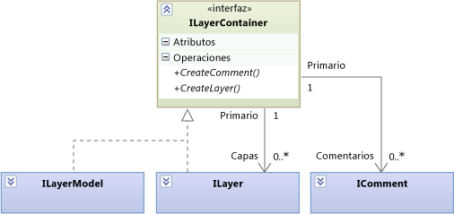
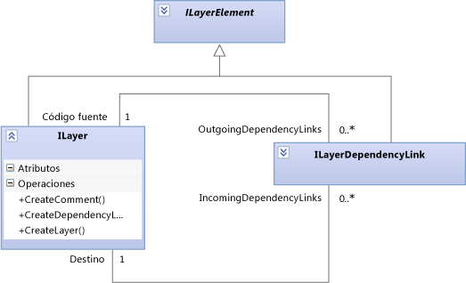
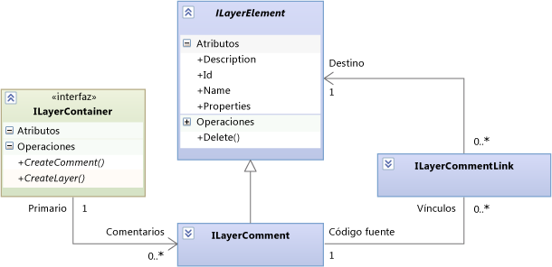
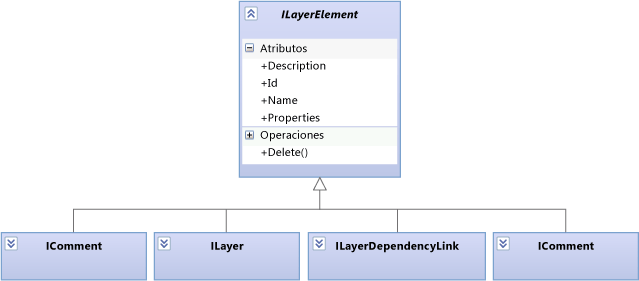

# <a name="navigate-and-update-layer-models-in-program-code"></a>Navegar y actualizar modelos de capas en el código del programa

Este artículo describen los elementos y relaciones en modelos de capas, que puede navegar y actualizar mediante código del programa. Para obtener más información acerca de los diagramas de dependencia de punto de vista del usuario, consulte [diagramas de dependencia: referencia](../modeling/layer-diagrams-reference.md) y [diagramas de dependencia: directrices](../modeling/layer-diagrams-guidelines.md).

El <xref:Microsoft.VisualStudio.ArchitectureTools.Extensibility.Layer> modelo descrito en este tema es una fachada en general más <xref:Microsoft.VisualStudio.GraphModel> modelo. Si está escribiendo un [extensión de gesto o comando de menú](../modeling/add-commands-and-gestures-to-layer-diagrams.md), use el `Layer` modelo. Si está escribiendo un [extensión de validación de capas](../modeling/add-custom-architecture-validation-to-layer-diagrams.md), resulta más fácil de usar el `GraphModel`.

## <a name="transactions"></a>Transacciones

Cuando se actualiza un modelo, considere la posibilidad de insertar los cambios en un `ILinkedUndoTransaction`, que agrupa los cambios en una transacción. Si se produce un error en cualquiera de los cambios, se revierte la transacción entera. Si el usuario deshace un cambio, todos los cambios se deshacen juntos.

```
using (ILinkedUndoTransaction t =
        LinkedUndoContext.BeginTransaction("a name"))
{
    // Make changes here ....
    t.Commit(); // Don't forget this!
}
```

## <a name="containment"></a>Inclusiones



Las capas (<xref:Microsoft.VisualStudio.ArchitectureTools.Extensibility.Layer.ILayer>) y el modelo de capas (<xref:Microsoft.VisualStudio.ArchitectureTools.Extensibility.Layer.ILayerModel>) pueden incluir comentarios y capas.

Una capa (`ILayer`) puede incluirse en un modelo de capas (`ILayerModel`) o anidarse en otra `ILayer`.

Para crear un comentario o una capa, use los métodos de creación pertinentes del contenedor adecuado.

## <a name="dependency-links"></a>Vínculos de dependencias

Un vínculo de dependencia se representa mediante un objeto. La navegación puede producirse en cualquier dirección:



Llame a `source.CreateDependencyLink(target)` para crear un vínculo de dependencia.

## <a name="comments"></a>Comentarios

Los comentarios pueden incluirse en capas o en el modelo de capas, así como vincularse a cualquier elemento de capa:



Un comentario puede estar vinculado a cualquier número de elementos o a ninguno.

Use lo siguiente para obtener los comentarios adjuntos a un elemento de capa:

```csharp
ILayerModel model = diagram.GetLayerModel();
IEnumerable<ILayerComment> comments =
   model.Comments.Where(comment =>
      comment.Links.Any(link => link.Target == layerElement));
```

> [!CAUTION]
> La propiedad `Comments` de `ILayer` obtiene los comentarios incluidos en `ILayer`, pero no los comentarios vinculados a dicha capa.

Crear un comentario mediante una llamada a `CreateComment()` en el contenedor correspondiente.

Para crear un vínculo, use `CreateLink()` en el comentario.

## <a name="layer-elements"></a>Elementos de capa

Todos los tipos de elemento que se pueden incluir en un modelo son elementos de capa:



## <a name="properties"></a>Propiedades

Cada `ILayerElement` tiene un diccionario de cadenas denominado `Properties`. Este diccionario se puede usar para incorporar información arbitraria acerca de cualquier elemento de capa.

## <a name="artifact-references"></a>Referencias de artefacto

Una referencia de artefacto (<xref:Microsoft.VisualStudio.ArchitectureTools.Extensibility.Layer.ILayerArtifactReference>) representa el vínculo entre una capa y un elemento del proyecto, como un archivo, una clase o una carpeta. El usuario crea artefactos al crear una capa o agregarle al arrastrar elementos desde el Explorador de soluciones, vista de clases y Examinador de objetos a un diagrama de dependencia. Se puede vincular a una capa un número indeterminado de referencias de artefacto.

Cada fila del Explorador de capas muestra una referencia de artefacto. Para obtener más información, consulte [crear diagramas de dependencia desde el código](../modeling/create-layer-diagrams-from-your-code.md).

Los métodos y tipos principales relacionados con las referencias de artefactos son los siguientes:

<xref:Microsoft.VisualStudio.ArchitectureTools.Extensibility.Layer.ILayerArtifactReference>. La propiedad Categories indica el tipo de artefacto al que se está haciendo referencia, como una clase, un archivo ejecutable o un ensamblado. La propiedad Categories determina cómo el identificador identifica el artefacto de destino.

<xref:Microsoft.VisualStudio.ArchitectureTools.Extensibility.Layer.ArtifactReferenceExtensions.CreateArtifactReferenceAsync%2A> crea una referencia de artefacto a partir de un <xref:EnvDTE.Project> o de un <xref:EnvDTE.ProjectItem>. Se trata de una operación asincrónica, Por lo tanto, que se suele proporciona una devolución de llamada que se llama cuando se completa la creación.

Las referencias de artefacto de capa son diferentes a los artefactos en los diagramas de casos de uso.

## <a name="shapes-and-diagrams"></a>Formas y diagramas

Se usan dos objetos para representar a cada elemento en un modelo de capas: <xref:Microsoft.VisualStudio.ArchitectureTools.Extensibility.Layer.ILayerElement> y <xref:Microsoft.VisualStudio.ArchitectureTools.Extensibility.Presentation.IShape>. `IShape` señala la posición y el tamaño de la forma en el diagrama. En los modelos de capas, cada `ILayerElement` tiene uno `IShape`y cada `IShape` en una dependencia diagrama tiene un `ILayerElement`. `IShape` también se usa en los modelos UML. Por lo tanto, no todos los `IShape` poseen un elemento de capa.

De igual modo, el <xref:Microsoft.VisualStudio.ArchitectureTools.Extensibility.Layer.ILayerModel> se muestra en un <xref:Microsoft.VisualStudio.ArchitectureTools.Extensibility.Presentation.IDiagram>.

En el código de un controlador de gesto o comando personalizado se puede obtener el diagrama actual y la selección de formas actual de la importación de `DiagramContext`:

```
public class ... {
[Import]
    public IDiagramContext DiagramContext { get; set; }
...
public void ... (...)
{ IDiagram diagram = this.DiagramContext.CurrentDiagram;
  ILayerModel model = diagram.GetLayerModel();
  if (model != null)
  { foreach (ILayer layer in model.Layers) { ... }}
  foreach (IShape selected in diagram.SelectedShapes)
  { ILayerElement element = selected.GetLayerElement();
    if (element != null) ... }}
```


<xref:Microsoft.VisualStudio.ArchitectureTools.Extensibility.Presentation.IShape> y <xref:Microsoft.VisualStudio.ArchitectureTools.Extensibility.Presentation.IDiagram> también se usan para mostrar modelos UML.

## <a name="see-also"></a>Vea también

- [Adición de comandos y gestos a diagramas de dependencia](../modeling/add-commands-and-gestures-to-layer-diagrams.md)
- [Adición de validación de arquitectura personalizada a diagramas de dependencia](../modeling/add-custom-architecture-validation-to-layer-diagrams.md)
- [Adición de propiedades personalizadas a diagramas de dependencia](../modeling/add-custom-properties-to-layer-diagrams.md)
- [Diagramas de dependencia: referencia](../modeling/layer-diagrams-reference.md)
- [Diagramas de dependencia: instrucciones](../modeling/layer-diagrams-guidelines.md)
