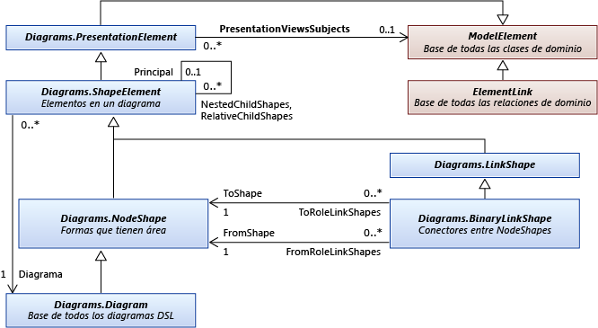
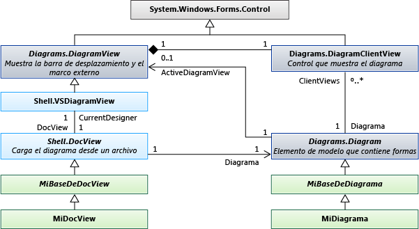

# <a name="navigate-and-update-a-model-in-program-code"></a>Navegar por un modelo en el código del programa y actualizarlo

Puede escribir código para crear y eliminar elementos del modelo, establecer sus propiedades y crear y eliminar vínculos entre elementos. Todos los cambios deben realizarse dentro de una transacción. Si los elementos se ven en un diagrama, el diagrama se "fija" automáticamente al final de la transacción.

## <a name="example"></a>Definición de DSL de ejemplo
 Esta es la parte principal de DslDefinition. DSL para los ejemplos de este tema:

 

 Este modelo es una instancia de este DSL:

 

### <a name="references-and-namespaces"></a>Referencias y espacios de nombres
 Para ejecutar el código de este tema, debe hacer referencia a:

 `Microsoft.VisualStudio.Modeling.Sdk.11.0.dll`

 El código usará este espacio de nombres:

 `using Microsoft.VisualStudio.Modeling;`

 Además, si está escribiendo el código en un proyecto diferente del en el que se define el DSL, debe importar el ensamblado compilado por el proyecto DSL.

## <a name="navigation"></a>Navegar por el modelo

### <a name="properties"></a>Properties (Propiedades)
 Las propiedades de dominio que se definen en la definición de DSL se convierten en propiedades a las que se puede tener acceso en el código del programa:

 `Person henry = ...;`

 `if (henry.BirthDate < 1500) ...`

 `if (henry.Name.EndsWith("VIII")) ...`

 Si desea establecer una propiedad, debe hacerlo dentro de una [transacción](#transaction):

 `henry.Name = "Henry VIII";`

 Si se encuentra en la definición de DSL, se **calcula**el **tipo** de una propiedad, no se puede establecer. Para obtener más información, consulte [calculadas y las propiedades de almacenamiento personalizado](../modeling/calculated-and-custom-storage-properties.md).

### <a name="relationships"></a>Relaciones
 Las relaciones de dominio que defina en la definición de DSL se convertirán en pares de propiedades, una en la clase en cada extremo de la relación. Los nombres de las propiedades aparecen en el diagrama DslDefinition como etiquetas en los roles en cada lado de la relación. Dependiendo de la multiplicidad del rol, el tipo de la propiedad es la clase del otro extremo de la relación o una colección de esa clase.

 `foreach (Person child in henry.Children) { ... }`

 `FamilyTreeModel ftree = henry.FamilyTreeModel;`

 Las propiedades de los extremos opuestos de una relación son siempre recíprocas. Cuando se crea o se elimina un vínculo, se actualizan las propiedades de rol en ambos elementos. La expresión siguiente (que utiliza las extensiones de `System.Linq`) siempre es true para la relación ParentsHaveChildren en el ejemplo:

 `(Person p) => p.Children.All(child => child.Parents.Contains(p))`

 `&& p.Parents.All(parent => parent.Children.Contains(p));`

 **ElementLinks**. Una relación también se representa mediante un elemento de modelo denominado *vínculo*, que es una instancia del tipo de relación de dominio. Un vínculo siempre tiene un elemento de origen y un elemento de destino. El elemento de origen y el elemento de destino pueden ser iguales.

 Puede tener acceso a un vínculo y sus propiedades:

 `ParentsHaveChildren link = ParentsHaveChildren.GetLink(henry, edward);`

 `// This is now true:`

 `link == null || link.Parent == henry && link.Child == edward`

 De forma predeterminada, no se permite que más de una instancia de una relación vincule ningún par de elementos de modelo. Pero si está en la definición de DSL `Allow Duplicates` , la marca es true para la relación, puede haber más de un vínculo y debe usar: `GetLinks`

 `foreach (ParentsHaveChildren link in ParentsHaveChildren.GetLinks(henry, edward)) { ... }`

 También hay otros métodos para tener acceso a los vínculos. Por ejemplo:

 `foreach (ParentsHaveChildren link in     ParentsHaveChildren.GetLinksToChildren(henry)) { ... }`

 **Roles ocultos.** Si en la definición de DSL, **se genera la propiedad es** **false** para un rol determinado, no se genera ninguna propiedad que corresponda a ese rol. Sin embargo, todavía puede tener acceso a los vínculos y recorrer los vínculos con los métodos de la relación:

 `foreach (Person p in ParentsHaveChildren.GetChildren(henry)) { ... }`

 El ejemplo de uso más frecuente es <xref:Microsoft.VisualStudio.Modeling.Diagrams.PresentationViewsSubject> la relación, que vincula un elemento del modelo con la forma que lo muestra en un diagrama:

 `PresentationViewsSubject.GetPresentation(henry)[0] as PersonShape`

### <a name="the-element-directory"></a>Directorio de elementos
 Puede tener acceso a todos los elementos del almacén mediante el directorio de elementos:

 `store.ElementDirectory.AllElements`

 También hay métodos para buscar elementos, como los siguientes:

 `store.ElementDirectory.FindElements(Person.DomainClassId);`

 `store.ElementDirectory.GetElement(elementId);`

## <a name="metadata"></a>Obtener acceso a la información de clase
 Puede obtener información sobre las clases, las relaciones y otros aspectos de la definición de DSL. Por ejemplo:

 `DomainClassInfo personClass = henry.GetDomainClass();`

 `DomainPropertyInfo birthProperty =`

 `personClass.FindDomainProperty("BirthDate")`

 `DomainRelationshipInfo relationship =`

 `link.GetDomainRelationship();`

 `DomainRoleInfo sourceRole = relationship.DomainRole[0];`

 Las clases antecesoras de los elementos de modelo son las siguientes:

- ModelElement: todos los elementos y relaciones son ModelElements

- ElementLink: todas las relaciones son ElementLinks

## <a name="transaction"></a>Realizar cambios dentro de una transacción
 Siempre que el código del programa cambie cualquier elemento del almacén, debe hacerlo dentro de una transacción. Esto se aplica a todos los elementos del modelo, las relaciones, las formas, los diagramas y sus propiedades. Para obtener más información, consulta <xref:Microsoft.VisualStudio.Modeling.Transaction>.

 El método más práctico para administrar una transacción es con una `using` instrucción que se incluye `try...catch` en una instrucción:

```
Store store; ...
try
{
  using (Transaction transaction =
    store.TransactionManager.BeginTransaction("update model"))
    // Outermost transaction must always have a name.
  {
    // Make several changes in Store:
    Person p = new Person(store);
    p.FamilyTreeModel = familyTree;
    p.Name = "Edward VI";
    // end of changes to Store

    transaction.Commit(); // Don't forget this!
  } // transaction disposed here
}
catch (Exception ex)
{
  // If an exception occurs, the Store will be
  // rolled back to its previous state.
}
```

 Puede realizar cualquier número de cambios dentro de una transacción. Puede abrir transacciones nuevas dentro de una transacción activa.

 Para que los cambios sean permanentes, debe `Commit` realizar la transacción antes de que se elimine. Si se produce una excepción que no se detecta dentro de la transacción, el almacén se restablecerá a su estado anterior a los cambios.

## <a name="elements"></a>Crear elementos de modelo
 En este ejemplo se agrega un elemento a un modelo existente:

```csharp
FamilyTreeModel familyTree = ...; // The root of the model.
using (Transaction t =
    familyTree.Store.TransactionManager
    .BeginTransaction("update model"))
{
  // Create a new model element
  // in the same partition as the model root:
  Person edward = new Person(familyTree.Partition);
  // Set its embedding relationship:
  edward.FamilyTreeModel = familyTree;
          // same as: familyTree.People.Add(edward);
  // Set its properties:
  edward.Name = "Edward VII";
  t.Commit(); // Don't forget this!
}
```

 En este ejemplo se muestran estos puntos esenciales acerca de la creación de un elemento:

- Cree el nuevo elemento en una partición específica del almacén. En el caso de las relaciones y los elementos del modelo, pero no las formas, suele ser la partición predeterminada.

- Conviértalo en el destino de una relación de incrustación. En el DslDefinition de este ejemplo, cada persona debe ser el destino de la relación de incrustación FamilyTreeHasPeople. Para ello, podemos establecer la propiedad de rol FamilyTreeModel del objeto Person o agregar la persona a la propiedad de rol People del objeto FamilyTreeModel.

- Establezca las propiedades de un nuevo elemento, especialmente la propiedad para la `IsName` que es true en DslDefinition. Esta marca marca la propiedad que sirve para identificar el elemento de forma única dentro de su propietario. En este caso, la propiedad Name tiene esa marca.

- La definición de DSL de este DSL debe haberse cargado en el almacén. Si está escribiendo una extensión como un comando de menú, esto normalmente ya será true. En otros casos, puede cargar explícitamente el modelo en el almacén o usar [ModelBus](/previous-versions/ee904639(v=vs.140)) para cargarlo. Para obtener más información, consulte [Cómo Abra un modelo desde el archivo en el](../modeling/how-to-open-a-model-from-file-in-program-code.md)código del programa.

  Cuando se crea un elemento de esta manera, se crea automáticamente una forma (si el DSL tiene un diagrama). Aparece en una ubicación asignada automáticamente, con la forma predeterminada, el color y otras características. Si desea controlar dónde y cómo aparece la forma asociada, vea [crear un elemento y su forma](#merge).

## <a name="links"></a>Crear vínculos de relación
 Hay dos relaciones definidas en la definición de DSL de ejemplo. Cada relación define una *propiedad de rol* en la clase en cada extremo de la relación.

 Existen tres formas de crear una instancia de una relación. Cada uno de estos tres métodos tiene el mismo efecto:

- Establezca la propiedad del encargado de rol de origen. Por ejemplo:

  - `familyTree.People.Add(edward);`

  - `edward.Parents.Add(henry);`

- Establezca la propiedad del encargado de rol de destino. Por ejemplo:

  - `edward.familyTreeModel = familyTree;`

       La multiplicidad de este rol es `1..1`, por lo que asignamos el valor.

  - `henry.Children.Add(edward);`

       La multiplicidad de este rol es `0..*`, por lo que se agrega a la colección.

- Construya explícitamente una instancia de la relación. Por ejemplo:

  - `FamilyTreeHasPeople edwardLink = new FamilyTreeHasPeople(familyTreeModel, edward);`

  - `ParentsHaveChildren edwardHenryLink = new ParentsHaveChildren(henry, edward);`

  El último método es útil si desea establecer propiedades en la propia relación.

  Cuando se crea un elemento de esta manera, se crea automáticamente un conector en el diagrama, pero tiene una forma predeterminada, un color y otras características. Para controlar cómo se crea el conector asociado, vea [crear un elemento y su forma](#merge).

## <a name="deleteelements"></a>Eliminar elementos

Elimine un elemento mediante `Delete()`una llamada a:

`henry.Delete();`

Esta operación también eliminará:

- Vínculos de relación con el elemento y desde él. Por ejemplo, `edward.Parents` ya no contendrá `henry`.

- Elementos de los roles para los `PropagatesDelete` que la marca es true. Por ejemplo, se eliminará la forma que muestra el elemento.

De forma predeterminada, todas las relaciones `PropagatesDelete` de incrustación tienen el valor true en el rol de destino. Al eliminar, no se elimina `familyTree`el, `familyTree.Delete()` sino que se eliminan todos los `Persons`. `henry`

De forma predeterminada `PropagatesDelete` , no es true para los roles de relaciones de referencia.

Puede hacer que las reglas de eliminación omitan propagaciones específicas al eliminar un objeto. Esto resulta útil si va a sustituir un elemento por otro. Proporcione el GUID de uno o más roles para los que no se debe propagar la eliminación. El GUID se puede obtener de la clase de relación:

`henry.Delete(ParentsHaveChildren.SourceDomainRoleId);`

(Este ejemplo concreto no tendría ningún efecto, porque `PropagatesDelete` es `false` para los roles de la `ParentsHaveChildren` relación).

En algunos casos, la eliminación se evita por la existencia de un bloqueo, ya sea en el elemento o en un elemento que se eliminaría por propagación. Puede usar `element.CanDelete()` para comprobar si se puede eliminar el elemento.

## <a name="deletelinks"></a>Eliminar vínculos de relación
 Puede eliminar un vínculo de relación quitando un elemento de una propiedad de rol:

 `henry.Children.Remove(edward); // or:`

 `edward.Parents.Remove(henry);  // or:`

 También puede eliminar el vínculo explícitamente:

 `edwardHenryLink.Delete();`

 Estos tres métodos tienen el mismo efecto. Solo tiene que usar uno de ellos.

 Si el rol tiene una multiplicidad de 0.. 1 o 1.. 1, puede establecerlo en `null`o en otro valor:

 `edward.FamilyTreeModel = null;`de

 `edward.FamilyTreeModel = anotherFamilyTree;`

## <a name="reorder"></a>Volver a ordenar los vínculos de una relación
 Los vínculos de una relación determinada cuyo origen o destino es un elemento de modelo determinado tienen una secuencia específica. Aparecen en el orden en que se agregaron. Por ejemplo, esta instrucción siempre producirá los elementos secundarios en el mismo orden:

 `foreach (Person child in henry.Children) ...`

 Puede cambiar el orden de los vínculos:

 `ParentsHaveChildren link = GetLink(henry,edward);`

 `ParentsHaveChildren nextLink = GetLink(henry, elizabeth);`

 `DomainRoleInfo role =`

 `link.GetDomainRelationship().DomainRoles[0];`

 `link.MoveBefore(role, nextLink);`

## <a name="locks"></a>Pestillo
 Es posible que los cambios impidan un bloqueo. Los bloqueos se pueden establecer en elementos individuales, en particiones y en el almacén. Si alguno de estos niveles tiene un bloqueo que impide el tipo de cambio que desea realizar, es posible que se produzca una excepción cuando se intente. Puede detectar si los bloqueos se establecen mediante el elemento. GetLocks (), que es un método de extensión que se define en el <xref:Microsoft.VisualStudio.Modeling.Immutability>espacio de nombres.

 Para obtener más información, vea [definir una directiva de bloqueo para crear segmentos de solo lectura](../modeling/defining-a-locking-policy-to-create-read-only-segments.md).

## <a name="copy"></a>Copiar y pegar
 Puede copiar elementos o grupos de elementos en un <xref:System.Windows.Forms.IDataObject>:

```csharp
Person person = personShape.ModelElement as Person;
Person adopter = adopterShape.ModelElement as Person;
IDataObject data = new DataObject();
personShape.Diagram.ElementOperations
      .Copy(data, person.Children.ToList<ModelElement>());
```

 Los elementos se almacenan como un grupo de elementos serializados.

 Puede combinar elementos de un elemento IDataObject en un modelo:

```csharp
using (Transaction t = targetDiagram.Store.
        TransactionManager.BeginTransaction("paste"))
{
  adopterShape.Diagram.ElementOperations.Merge(adopter, data);
}
```

 `Merge ()`puede aceptar `PresentationElement` `ModelElement`o. Si le asigna un `PresentationElement`, también puede especificar una posición en el diagrama de destino como tercer parámetro.

## <a name="diagrams"></a>Navegar y actualizar diagramas
 En un DSL, el elemento de modelo de dominio, que representa un concepto como persona o canción, es independiente del elemento de forma, que representa lo que se ve en el diagrama. El elemento modelo de dominio almacena las propiedades y relaciones importantes de los conceptos. El elemento de forma almacena el tamaño, la posición y el color de la vista del objeto en el diagrama, y el diseño de sus partes componentes.

### <a name="presentation-elements"></a>Elementos de presentación
 

 En la definición de DSL, cada elemento que especifique crea una clase que se deriva de una de las clases estándar siguientes.

|Tipo de elemento|Clase base|
|-|-|
|Clase de dominio|<xref:Microsoft.VisualStudio.Modeling.ModelElement>|
|Relación de dominio|<xref:Microsoft.VisualStudio.Modeling.ElementLink>|
|Forma|<xref:Microsoft.VisualStudio.Modeling.Diagrams.NodeShape>|
|Conector|<xref:Microsoft.VisualStudio.Modeling.Diagrams.BinaryLinkShape>|
|Diagrama|<xref:Microsoft.VisualStudio.Modeling.Diagrams.Diagram>|

 Un elemento de un diagrama normalmente representa un elemento de modelo. Normalmente (pero no siempre), un <xref:Microsoft.VisualStudio.Modeling.Diagrams.NodeShape> representa una instancia de clase de dominio <xref:Microsoft.VisualStudio.Modeling.Diagrams.BinaryLinkShape> y representa una instancia de relación de dominio. La <xref:Microsoft.VisualStudio.Modeling.Diagrams.PresentationViewsSubject> relación vincula una forma de nodo o vínculo con el elemento de modelo que representa.

 Cada forma de nodo o vínculo pertenece a un diagrama. Una forma de vínculo binario conecta dos formas de nodo.

 Las formas pueden tener formas secundarias en dos conjuntos. Una forma `NestedChildShapes` del conjunto se limita al rectángulo de selección de su elemento primario. Una forma de la `RelativeChildShapes` lista puede aparecer fuera o parcialmente fuera de los límites del elemento primario; por ejemplo, una etiqueta o un puerto. Un diagrama no `RelativeChildShapes` tiene `Parent`ni.

### <a name="views"></a>Navegar entre formas y elementos
 Los elementos de modelo de dominio y los elementos de <xref:Microsoft.VisualStudio.Modeling.Diagrams.PresentationViewsSubject> forma están relacionados por la relación.

```csharp
// using Microsoft.VisualStudio.Modeling;
// using Microsoft.VisualStudio.Modeling.Diagrams;
// using System.Linq;
Person henry = ...;
PersonShape henryShape =
  PresentationViewsSubject.GetPresentation(henry)
    .FirstOrDefault() as PersonShape;
```

 La misma relación vincula relaciones con los conectores del diagrama:

```
Descendants link = Descendants.GetLink(henry, edward);
DescendantConnector dc =
   PresentationViewsSubject.GetPresentation(link)
     .FirstOrDefault() as DescendantConnector;
// dc.FromShape == henryShape && dc.ToShape == edwardShape
```

 Esta relación también vincula la raíz del modelo al diagrama:

```
FamilyTreeDiagram diagram =
   PresentationViewsSubject.GetPresentation(familyTree)
      .FirstOrDefault() as FamilyTreeDiagram;
```

 Para obtener el elemento de modelo representado por una forma, use:

 `henryShape.ModelElement as Person`

 `diagram.ModelElement as FamilyTreeModel`

### <a name="navigating-around-the-diagram"></a>Desplazarse por el diagrama
 En general, no es aconsejable desplazarse entre las formas y los conectores del diagrama. Es mejor navegar por las relaciones en el modelo, desplazándose entre las formas y los conectores solo cuando es necesario trabajar en la apariencia del diagrama. Estos métodos vinculan los conectores con las formas en cada extremo:

 `personShape.FromRoleLinkShapes, personShape.ToRoleLinkShapes`

 `connector.FromShape, connector.ToShape`

 Muchas formas son compuestos; se componen de una forma primaria y una o más capas de elementos secundarios. Las formas que se colocan en relación con otra forma seconsideran secundarias. Cuando se mueve la forma primaria, los elementos secundarios se mueven con ella.

 Los *elementos secundarios relativos* pueden aparecer fuera del rectángulo de selección de la forma primaria. Los elementos secundarios anidados aparecen estrictamente dentro de los límites del elemento primario.

 Para obtener el conjunto superior de formas en un diagrama, use:

 `Diagram.NestedChildShapes`

 Las clases antecesoras de formas y conectores son:

 <xref:Microsoft.VisualStudio.Modeling.ModelElement>

 -- <xref:Microsoft.VisualStudio.Modeling.Diagrams.PresentationElement>

 -- <xref:Microsoft.VisualStudio.Modeling.Diagrams.ShapeElement>

 ----- <xref:Microsoft.VisualStudio.Modeling.Diagrams.NodeShape>

 ------- <xref:Microsoft.VisualStudio.Modeling.Diagrams.Diagram>

 ------- *YourShape*

 ----- <xref:Microsoft.VisualStudio.Modeling.Diagrams.LinkShape>

 ------- <xref:Microsoft.VisualStudio.Modeling.Diagrams.BinaryLinkShape>

 --------- *YourConnector*

### <a name="shapeProperties"></a>Propiedades de las formas y los conectores
 En la mayoría de los casos, no es necesario realizar cambios explícitos en las formas. Cuando ha cambiado los elementos del modelo, las reglas de "corrección" actualizan las formas y los conectores. Para obtener más información, consulte [responder a los cambios y](../modeling/responding-to-and-propagating-changes.md)propagarlos.

 Sin embargo, resulta útil realizar algunos cambios explícitos en las formas en las propiedades que son independientes de los elementos del modelo. Por ejemplo, puede cambiar estas propiedades:

- <xref:Microsoft.VisualStudio.Modeling.Diagrams.NodeShape.Size%2A>: determina el alto y el ancho de la forma.

- <xref:Microsoft.VisualStudio.Modeling.Diagrams.NodeShape.Location%2A>-posición relativa al diagrama o la forma primaria

- <xref:Microsoft.VisualStudio.Modeling.Diagrams.ShapeElement.StyleSet%2A>-el conjunto de lápices y pinceles que se usan para dibujar la forma o el conector

- <xref:Microsoft.VisualStudio.Modeling.Diagrams.ShapeElement.Hide%2A>: hace que la forma sea invisible

- <xref:Microsoft.VisualStudio.Modeling.Diagrams.ShapeElement.Show%2A>: hace que la forma esté visible después de un`Hide()`

### <a name="merge"></a>Crear un elemento y su forma

Cuando se crea un elemento y se vincula en el árbol de relaciones de incrustación, se crea automáticamente una forma y se asocia a ella. Esto se realiza mediante las reglas de "corrección" que se ejecutan al final de la transacción. Sin embargo, la forma aparecerá en una ubicación asignada automáticamente y su forma, el color y otras características tendrán valores predeterminados. Para controlar cómo se crea la forma, puede usar la función Merge. Primero debe agregar los elementos que desee agregar a un ElementGroup y, a continuación, combinar el grupo en el diagrama.

Este método:

- Establece el nombre si se ha asignado una propiedad como nombre del elemento.

- Observa las directivas de combinación de elementos que especificó en la definición de DSL.

En este ejemplo se crea una forma en la posición del mouse, cuando el usuario hace doble clic en el diagrama. En la definición de DSL para este ejemplo, `FillColor` se ha `ExampleShape` expuesto la propiedad de.

```csharp
using Microsoft.VisualStudio.Modeling;
using Microsoft.VisualStudio.Modeling.Diagrams;
partial class MyDiagram
{
  public override void OnDoubleClick(DiagramPointEventArgs e)
  {
    base.OnDoubleClick(e);

    using (Transaction t = this.Store.TransactionManager
        .BeginTransaction("double click"))
    {
      ExampleElement element = new ExampleElement(this.Store);
      ElementGroup group = new ElementGroup(element);

      { // To use a shape of a default size and color, omit this block.
        ExampleShape shape = new ExampleShape(this.Partition);
        shape.ModelElement = element;
        shape.AbsoluteBounds = new RectangleD(0, 0, 1.5, 1.0);
        shape.FillColor = System.Drawing.Color.Azure;
        group.Add(shape);
      }

      this.ElementOperations.MergeElementGroupPrototype(
        this,
        group.CreatePrototype(),
        PointD.ToPointF(e.MousePosition));
      t.Commit();
    }
  }
}
```

 Si proporciona más de una forma, establezca sus posiciones relativas mediante `AbsoluteBounds`.

 También puede establecer el color y otras propiedades expuestas de los conectores mediante este método.

### <a name="use-transactions"></a>Usar transacciones
 Las formas, los conectores y los diagramas son subtipos de <xref:Microsoft.VisualStudio.Modeling.ModelElement> y viven en el almacén. Por lo tanto, debe realizar cambios en ellos solo dentro de una transacción. Para obtener más información, consulte [Cómo Use transacciones para actualizar el modelo](../modeling/how-to-use-transactions-to-update-the-model.md).

## <a name="docdata"></a>Vista de documento y datos de documento
 

## <a name="store-partitions"></a>Almacenar particiones
 Cuando se carga un modelo, el diagrama que lo acompaña se carga al mismo tiempo. Normalmente, el modelo se carga en Store. DefaultPartition y el contenido del diagrama se carga en otra partición. Normalmente, el contenido de cada partición se carga y se guarda en un archivo independiente.

## <a name="see-also"></a>Vea también

- <xref:Microsoft.VisualStudio.Modeling.ModelElement>
- [La validación en los lenguajes específicos de dominio](../modeling/validation-in-a-domain-specific-language.md)
- [Generar código a partir de lenguajes específicos de dominio](../modeling/generating-code-from-a-domain-specific-language.md)
- [Cómo: Usar transacciones para actualizar el modelo](../modeling/how-to-use-transactions-to-update-the-model.md)
- [Integrar modelos mediante Modelbus de Visual Studio](../modeling/integrating-models-by-using-visual-studio-modelbus.md)
- [Responder a los cambios y propagarlos](../modeling/responding-to-and-propagating-changes.md)
