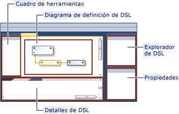
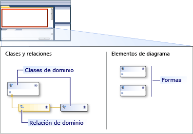

# Información general sobre la interfaz de usuario de las herramientas de los lenguajes específicos de dominio
Cuando se abre una solución de herramientas de lenguajes específicos de dominio (herramientas ADSL) en [!INCLUDE[vsprvs](../code-quality/includes/vsprvs_md.md)], la interfaz de usuario será similar a la siguiente imagen.  
  
   
  
 En la tabla siguiente se explica cómo se usan las partes de la interfaz de usuario.  
  
|**Element**|**Definición**|  
|-----------------|--------------------|  
|Diagram|El diagrama muestra el modelo de dominio.   El diagrama tiene dos lados. Lado "uno" define los tipos de los elementos en los modelos. El otro lado define la apariencia de los modelos en la pantalla.|  
|Cuadro de herramientas|Arrastre herramientas desde el cuadro de herramientas para agregar clases de dominio y dar forma tipos al diagrama. Para agregar relaciones, conectores y mapas de formas, haga clic en la herramienta, haga clic en el nodo de origen en el diagrama y, a continuación, en el nodo de destino.|  
|Explorador de DSL|**El Explorador de DSL** aparece cuando una definición DSL es la ventana activa. Muestra la DSL como un árbol. El Explorador de DSL permite editar características del modelo que no se muestran en el diagrama. Por ejemplo, puede agregar elementos de cuadro de herramientas y cambiar en el proceso de validación mediante el **DSL explorador**.|  
|Ventana Detalles de DSL|El **detalles de DSL** ventana muestra los elementos del modelo que le permiten controlar cómo se muestran los elementos, y cómo se copian y se eliminan los elementos de propiedades del dominio.   -De forma predeterminada, el **detalles de DSL** ventana aparece junto a la **lista de errores** y **salida** windows.|  
  
## El diagrama del modelo de dominio  
 El diagrama del modelo de dominio se divide en dos partes. Un lado del diagrama muestra los elementos y relaciones en el modelo. El otro lado muestra cómo se puede mostrar, el modelo e incluye las formas que se utilizan para mostrar los elementos y las propiedades del diagrama de modelo. La siguiente imagen muestra los elementos del diagrama.  
  
   
  
 La tabla siguiente explican algunos de los elementos del diagrama de modelo de dominio.  
  
|**Término**|**Definición**|  
|--------------|--------------------|  
|Clase de dominio|Clases de dominio son los tipos de elementos de los modelos.   Una clase de dominio puede aparecer más de una vez en un diagrama, si es el destino de más de una relación.   Para agregar una clase de dominio, arrastre la herramienta de la clase de dominio desde el **cuadro de herramientas** a la **clases y relaciones** lateral del diagrama.|  
|Relación de dominio|Las relaciones de dominio son los tipos de vínculos entre los elementos de los modelos.   Un *incrustar relación* indica que el elemento de destino está propiedad o incluido en el elemento de origen y aparece como una línea sólida. Todos los elementos de un modelo deben ser el destino de una relación de incrustación, para que el modelo constituye un árbol. A *referencia relación* indica un vínculo entre elementos del modelo general y aparece como una línea discontinua. Cualquier elemento puede tener cualquier número de vínculos de referencia.   Crear una relación, haga clic en la herramienta en el **cuadro de herramientas**, haga clic en la clase de dominio de origen y, a continuación, haga clic en la clase de destino.|  
|Formas y conectores|Formas de especifican cómo se deben mostrar los elementos del modelo en un diagrama DSL., conectores especifican líneas en un diagrama DSL que puede usarse para mostrar las relaciones.   Para crear un conector o una forma, arrastre la herramienta para la **elementos del diagrama** lateral del diagrama.|  
|Asignaciones de formas|Un mapa de formas aparece como una línea en el diagrama del modelo de dominio, vincular una forma a la clase de dominio que muestra, o un conector a la relación de dominio que muestra.|  
  
## Vea también  
 [Información general sobre las herramientas de lenguaje específico de dominio](../modeling/overview-of-domain-specific-language-tools.md)   
 [Glosario de herramientas de lenguaje específico de dominio](http://msdn.microsoft.com/en-us/ca5e84cb-a315-465c-be24-76aa3df276aa)   
 [Personalizar y ampliar lenguajes específicos de dominio](../modeling/customizing-and-extending-a-domain-specific-language.md)