# Escenario: Cambiar el diseño usando modelado y visualización

Asegúrese de que su sistema de software cumple las necesidades de los usuarios mediante las herramientas de visualización y modelado de Visual Studio.
Use herramientas como mapas de código, diagramas de dependencia y diagramas de clases para:

Para ver qué versiones de Visual Studio admite cada herramienta, vea [Version support for architecture and modeling tools](../modeling/what-s-new-for-design-in-visual-studio.md#VersionSupport).

- Aclarar los requisitos y procesos de negocio de los usuarios.

- Visualizar y explorar el código existente.

- Describir los cambios de un sistema existente.

- Verificar que el sistema cumple sus requisitos.

- Mantener la coherencia del código con el diseño.

Este tutorial:

- Describe la manera en que estas herramientas pueden beneficiar a su proyecto de software.

- Muestra cómo puede usar estas herramientas, independientemente de su enfoque de desarrollo, con un escenario de ejemplo.

Para obtener más información acerca de estas herramientas y los escenarios compatibles, vea:

- [Analizar y modelar la arquitectura](../modeling/analyze-and-model-your-architecture.md)

- [Visualizar el código](../modeling/visualize-code.md)

## Información general de escenario

En este escenario se describen capítulos del ciclo de vida de desarrollo del software de dos empresas ficticias: Dinner Now y Lucerne Publishing. Dinner Now, con sede en Seattle, proporciona un servicio de comida a domicilio basado en web. A través de él, los clientes pueden pedir comida y pagarla en el sitio web de Dinner Now. Los pedidos se envían entonces al restaurante local que corresponda para que realice la entrega. Lucerne Publishing es una empresa de Nueva York con varios negocios tanto en Internet como fuera de ella. Entre esos negocios, Lucerne cuenta con un sitio web donde los clientes pueden publicar opiniones sobre restaurantes.

Lucerne adquirió recientemente Dinner Now y quiere realizar los siguientes cambios:

- Integrar sus sitios web y agregar la opción de opinar en Dinner Now.

- Reemplazar el sistema de pago de Dinner Now por el sistema de Lucerne.

- Ampliar el servicio de Dinner Now a toda la región.

En Dinner Now usan programación eXtreme y SCRUM y tienen una cobertura de pruebas muy elevada y mucho código compatible. Minimizan los riesgos mediante la creación de versiones de un sistema, pequeñas pero funcionales, a las que se les agrega funcionalidad de forma incremental. Desarrollan el código en iteraciones cortas y frecuentes, lo que les permite adoptar cambios con confianza, refactorizar el código frecuentemente y evitar tener que realizar un "gran diseño por adelantado".

Lucerne mantiene una colección mucho más grande y compleja de sistemas, algunos de los cuales tienen más de 40 años de antigüedad. Son muy prudentes a la hora de realizar cambios debido a la complejidad y al ámbito del código heredado. Siguen un proceso de desarrollo más riguroso; prefieren diseñar soluciones detalladas y documentar el diseño y los cambios que se producen durante el desarrollo.

Ambos equipos usan diagramas de modelado de Visual Studio para desarrollar sistemas que satisfagan las necesidades del usuario. Asimismo, usan Team Foundation Server junto con otras herramientas para la planeación, organización y administración de su trabajo.

Para obtener más información acerca de Team Foundation Server, vea:

- [Planear y realizar el seguimiento del trabajo](#plan-and-track-work)

- [Pruebas, validación y protección de código actualizado](#TestValidateCheckInCode)

##  Roles de arquitectura y diagramas de modelado en el desarrollo de software

En la tabla siguiente se describen las funciones que estas herramientas pueden desempeñar durante múltiples y diversas fases del ciclo de vida de desarrollo de software:

|Herramienta/función|Modelado de requisitos de usuarios|Modelado de procesos de negocio|Diseño y arquitectura de sistemas|Visualización y exploración de código|Comprobación|
|------|-|-|-|-|-|
|Diagrama de Lenguaje específico del dominio (DSL)|Sí|Sí|Sí|||
|Diagrama de dependencia, validación de capas|||Sí|Sí|Sí|
|Mapa de código|||Sí|Sí|Sí|
|Diseñador de clases (basado en código)||||Sí||

Para dibujar diagramas de dependencia, cree un proyecto de modelado como parte de una solución nueva o existente. Estos diagramas se deben crear en el proyecto de modelado.
Los elementos de los diagramas de dependencia se encuentran en el proyecto de modelado, pero no se almacenan en el modelo común. Los mapas de código y los diagramas de clases de .NET creados a partir de código existen fuera del proyecto de modelado.

Consulte:

- [Crear diagramas de dependencia a partir del código](../modeling/create-layer-diagrams-from-your-code.md)

- [Asignar dependencias en las soluciones](../modeling/map-dependencies-across-your-solutions.md)

- [Cómo: Agregar diagramas de clases a proyectos (Diseñador de clases)](../ide/class-designer/how-to-add-class-diagrams-to-projects.md)

- [Modelar el SDK de Visual Studio: lenguajes específicos de dominio](../modeling/modeling-sdk-for-visual-studio-domain-specific-languages.md)

[!INCLUDE[modeling_sdk_info](includes/modeling_sdk_info.md)]

Ambos equipos también usan la validación de dependencia para asegurarse de que el código en desarrollo siga siendo coherente con el diseño. Consulte:

- [Coherencia entre código y diseño](#ValidatingCode)

- [Descripción de la arquitectura lógica: diagramas de dependencia](#DescribeLayers)

- [Validación código con diagramas de dependencia](../modeling/validate-code-with-layer-diagrams.md)

> [!NOTE]
> Algunas versiones de Visual Studio admiten validación de dependencia, versiones de solo lectura de mapas de código para visualización y modelado. Para ver qué ediciones de Visual Studio admiten esta característica, consulte [Compatibilidad de ediciones con las herramientas de arquitectura y modelado](../modeling/what-s-new-for-design-in-visual-studio.md#VersionSupport).

## Comprensión y comunicación de información sobre el sistema

No hay ningún orden establecido para usar los diagramas de modelado de Visual Studio, por lo que puede usarlos como mejor se adapten a sus necesidades o enfoque. Normalmente, los equipos revisan sus modelos de forma iterativa y con frecuencia a lo largo de un proyecto. Cada diagrama ofrece determinados puntos fuertes para ayudarle a entender, describir y comunicar diferentes aspectos del sistema en desarrollo.

Dinner Now y Lucerne se comunican entre sí y con los participantes del proyecto mediante el uso de diagramas como su lenguaje común. Por ejemplo, Dinner Now usa diagramas para realizar estas tareas:

- Visualizar el código existente.

- Comunicarse con Lucerne acerca de casos de usuario nuevos o actualizados.

- Identificar los cambios que son necesarios para admitir casos de usuario nuevos o actualizados.

Lucerne usa diagramas para realizar estas tareas:

- Obtener información acerca del proceso de negocio de Dinner Now.

- Entender el diseño del sistema.

- Comunicarse con Dinner Now acerca de los requisitos de usuario nuevos o actualizados.

- Documentar las actualizaciones del sistema.

Los diagramas se integran con Team Foundation Server para que los equipos puedan planear, administrar y realizar un seguimiento de su trabajo más fácilmente. Por ejemplo, usan modelos para identificar los casos de prueba y las tareas de desarrollo, y para calcular su trabajo. Lucerne vincula los elementos de trabajo de Team Foundation Server con elementos del modelo para poder supervisar el progreso y asegurarse de que el sistema cumple los requisitos de los usuarios. Por ejemplo, los casos de uso se vinculan a elementos de trabajo de caso de prueba para poder ver si los casos de uso se cumplen cuando se pasan todas las pruebas.

Antes de que los equipos protejan sus cambios, el código se valida con las pruebas y el diseño mediante la ejecución de compilaciones que incluyen validación de dependencia y pruebas automatizadas. Con esto se garantiza que el código actualizado no está en conflicto con el diseño ni interrumpe funcionalidades que anteriormente no presentaban problemas.

### Identificación de cambios en el sistema existente

Dinner Now debe estimar el costo de satisfacer el requisito nuevo. Esto depende en parte de en qué medida afectará este cambio a las otras partes del sistema. Para ayudarles a comprender esto, uno de los desarrolladores de Dinner Now crea estos mapas y diagramas a partir del código existente:

|**Mapa o diagrama**|**Qué muestra**|
|-|-|
|*Mapa de código*   Consulte:   - [Asignar dependencias en las soluciones](../modeling/map-dependencies-across-your-solutions.md) - [Examinar y reorganizar mapas de código](../modeling/browse-and-rearrange-code-maps.md) - [Personalizar mapas de código mediante la edición de los archivos DGML](../modeling/customize-code-maps-by-editing-the-dgml-files.md)|Dependencias y otras relaciones en el código.   Por ejemplo, Dinner Now puede empezar revisando los mapas de código de ensamblado para obtener información general de los ensamblados y de sus dependencias. Dinner Now puede profundizar en los mapas para explorar los espacios de nombres y las clases de esos ensamblados.   Dinner Now también puede crear mapas para explorar áreas particulares y otros tipos de relaciones en el código. Mediante el Explorador de soluciones, buscan y seleccionan las áreas y las relaciones de interés.|
|*Diagrama de clases basado en código*   Vea [Cómo: Agregar diagramas de clases a proyectos (Diseñador de clases)](../ide/class-designer/how-to-add-class-diagrams-to-projects.md).|Clases existentes en el código|

 Por ejemplo, el desarrollador crea un mapa de código y ajusta su ámbito para centrarse en las áreas que se verán afectadas por el nuevo escenario. Estas áreas se seleccionan y se resaltan en el mapa:

 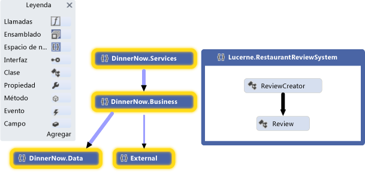

 **Mapa de código de espacio de nombres**

 El desarrollador expande los espacios de nombres seleccionados para ver sus clases, métodos y relaciones:

 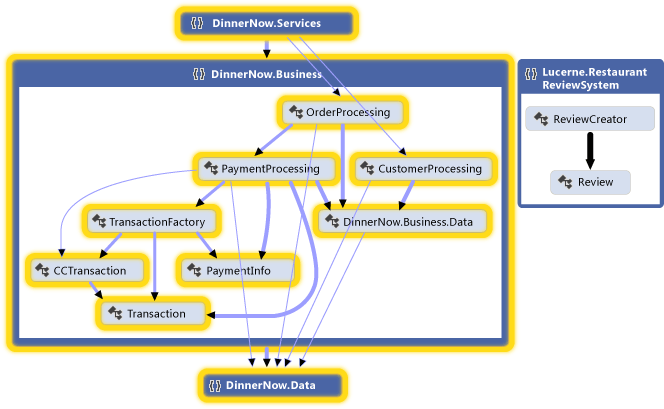

 **Mapa de código de espacios de nombres expandidos con vínculos entre grupos visibles**

 El desarrollador examina el código para encontrar los métodos y las clases afectados. Para ver los efectos de cada cambio a medida que se producen, regenere los mapas de código después de cada cambio. Consulte [Visualizar el código](../modeling/visualize-code.md).

 Para describir los cambios realizados en otras partes del sistema, como componentes o interacciones, el equipo podría dibujar estos elementos en pizarras. También pueden dibujar los siguientes diagramas en Visual Studio, de manera que ambos equipos puedan capturar, administrar y entender los detalles:

|**Diagramas**|**Qué describe**|
|-|-|
|*Diagrama de clases basado en código*   Vea [Cómo: Agregar diagramas de clases a proyectos (Diseñador de clases)](../ide/class-designer/how-to-add-class-diagrams-to-projects.md).|Las clases existentes en el código.|

###  Coherencia entre código y diseño
 Dinner Now debe asegurarse de que el código actualizado mantiene la coherencia con el diseño. Crea diagramas de dependencia en los que se describen las capas de funcionalidad del sistema, se especifican las dependencias permitidas entre ellas y se asocian artefactos de la solución a esas capas.

|**Diagrama**|**Qué describe**|
|-|-|
|*Diagrama de dependencia*   Consulte:   - [Creación de diagramas de dependencia a partir del código](../modeling/create-layer-diagrams-from-your-code.md) - [Diagramas de dependencia: referencia](../modeling/layer-diagrams-reference.md) - [Diagramas de dependencia: directrices](../modeling/layer-diagrams-guidelines.md) - [Validación de código con diagramas de dependencia](../modeling/validate-code-with-layer-diagrams.md)|La arquitectura lógica del código.   Un diagrama de dependencia organiza y asigna los artefactos de una solución de Visual Studio para abstraer grupos denominados *capas*. Estas capas identifican los roles, las tareas o las funciones que realizan estos artefactos en el sistema.   Los diagramas de dependencia son útiles para describir el diseño previsto del sistema y validar el código cambiante comparándolo con ese diseño.   Para crear las capas, arrastre elementos desde el Explorador de soluciones, los mapas de código, la vista de clases y el examinador de objetos. Para dibujar capas nuevas, use el cuadro de herramientas o haga clic con el botón derecho en la superficie del diagrama.   Para ver las dependencias actuales, haga clic con el botón derecho en la superficie del diagrama de dependencia y, después, haga clic en **Generar dependencias**. Para especificar dependencias previstas, trace nuevas dependencias.|

Por ejemplo, en el siguiente diagrama de dependencia se describen las dependencias existentes entre capas y el número de artefactos que están asociados con cada capa:

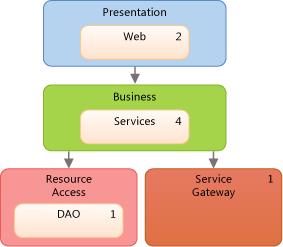

 **Diagrama de dependencia**

Para asegurarse de que no haya conflictos con el diseño durante el desarrollo de código, los equipos usan validación de dependencia en compilaciones que se ejecutan en Azure DevOps. También crean una tarea MSBuild personalizada para exigir la validación de dependencia en las operaciones de protección. Para recopilar los errores de validación, usan informes de compilación.

Consulte:

- [Usar el diseñador visual](/azure/devops/pipelines/get-started-designer)

- [Inserción en el repositorio validada de TFVC](/azure/devops/pipelines/build/triggers)

- [Tareas de compilación y versión](/azure/devops/pipelines/tasks/index)

### Sugerencias generales para crear y usar modelos

- La mayoría de los diagramas constan de nodos que están conectados mediante líneas. Para cada tipo de diagrama, el cuadro de herramientas proporciona distintas clases de nodos y líneas.

   Para abrir el cuadro de herramientas, vaya el menú **Ver** y haga clic en **Cuadro de herramientas**.

- Para crear un nodo, arrástrelo desde el cuadro de herramientas al diagrama. Hay determinados tipos de nodos que deben arrastrarse a los nodos existentes. Por ejemplo, en un diagrama de componentes, un puerto nuevo debe agregarse a un componente existente.

- Para crear una línea o una conexión, haga clic en la herramienta correspondiente del cuadro de herramientas, luego haga clic en el nodo de origen y, por último, haga clic en el nodo de destino. Algunas líneas solo se pueden crear entre determinados tipos de nodos. Cuando mueve el puntero sobre un posible origen o destino, el puntero indica si puede crear una conexión.

### Planear y realizar el seguimiento del trabajo

Los diagramas de modelado de Visual Studio se integran con Team Foundation Server para que pueda planear, administrar y realizar un seguimiento del trabajo más fácilmente. Ambos equipos usan modelos para identificar los casos de prueba y las tareas de desarrollo, y para calcular su trabajo. Lucerne crea elementos de trabajo de Team Foundation Server y los vincula a elementos de modelo, como casos de uso o componentes. Esto les ayuda a supervisar sus progresos y a realizar un seguimiento de su trabajo hasta los requisitos de los usuarios. Así se aseguran de que sus cambios continúan cumpliendo dichos requisitos.

A medida que avanza su trabajo, los equipos actualizan los elementos de trabajo para que reflejen el tiempo que invierten en sus tareas. También supervisan y registran el estado de su trabajo con las siguientes características de Team Foundation Server:

- *Informes de evolución* diarios que muestran si se completa el trabajo planeado en el tiempo esperado. También generan otros informes similares de Team Foundation Server para realizar un seguimiento del progreso de los errores.

- Una *hoja de cálculo de iteración* que usa Microsoft Excel para ayudar al equipo a supervisar y repartir la carga de trabajo entre sus miembros. Esta hoja de cálculo está vinculada a Team Foundation Server y sirve de foco de discusión durante las reuniones en las que se analizan los progresos.

- Un *panel de desarrollo* que usa Office Project para mantener informado al equipo sobre aspectos importantes del proyecto.

Consulte:

- [Sobre herramientas y gestión de proyectos de Agile](/azure/devops/boards/backlogs/backlogs-overview?view=vsts&preserve-view=true)

- [Gráficos, paneles y widgets (Azure DevOps Services)](/azure/devops/report/dashboards/overview?view=vsts&preserve-view=true)

- [Crear un registro de trabajo pendiente y tareas mediante Project](/azure/devops/boards/backlogs/office/create-your-backlog-tasks-using-project)

###  Prueba, validación y protección del código

Cuando los equipos completan una tarea, comprueban su código en el control del código fuente y reciben un aviso de Team Foundation Server si se olvidan de hacerlo. Antes de que Team Foundation Server acepte las protecciones, los equipos ejecutan pruebas unitarias y validación de dependencia para comprobar el código comparándolo con sus casos de prueba y el diseño. Usan Team Foundation Server para ejecutar con regularidad compilaciones, pruebas unitarias automatizadas y validación de dependencia. Con esto se aseguran de que el código cumple los criterios siguientes:

- Funciona.

- No interrumpe código que ya funcionaba anteriormente.

- No está en conflicto con el diseño.

Dinner Now tiene una gran cantidad de pruebas automatizadas que Lucerne puede reutilizar porque casi todo se sigue aplicando. Lucerne también puede compilar en estas pruebas y agregar nuevas pruebas que cubran nuevas funcionalidades. Ambos también usan Visual Studio para ejecutar pruebas manuales.

Para asegurarse de que el código se ajusta al diseño, los equipos configuran sus compilaciones en Azure DevOps para incluir la validación de dependencia. Si se produce algún conflicto, se genera un informe con los detalles.

Consulte:

- [Probar la aplicación](/azure/devops/test/overview?view=vsts&preserve-view=true)

- [Validar el sistema durante el desarrollo](../modeling/validate-your-system-during-development.md)

- [Uso del control de versiones](/azure/devops/repos/tfvc/overview?view=azure-devops&preserve-view=true)

- [Azure Pipelines](/azure/devops/pipelines/index?view=vsts&preserve-view=true)

## Actualización del sistema mediante visualización y modelado

Lucerne y Dinner Now deben integrar sus sistemas de pago. En las secciones siguientes se muestra cómo los diagramas de modelado de Visual Studio les ayudan con esta tarea:

- [Visualización del código existente: mapas de código](#VisualizeCode)

- [Definición de un glosario de tipos: diagramas de clases](#DefineClasses)

- [Descripción de la arquitectura lógica: diagramas de dependencia](#DescribeLayers)

Consulte:

- [Visualizar el código](../modeling/visualize-code.md)

- [Usar modelos en el proceso de desarrollo](../modeling/use-models-in-your-development-process.md)

- [Modelar la arquitectura de la aplicación](../modeling/model-your-app-s-architecture.md)

###  Visualización del código existente: mapas de código

Los mapas de código muestran la organización y las relaciones actuales del código. Los elementos se representan mediante *nodos* en el mapa y las relaciones mediante *vínculos*. Los mapas de código le ayudan a realizar los siguientes tipos de tareas:

- Examinar código desconocido.

- Comprender dónde y cómo un cambio propuesto podría afectar al código existente.

- Buscar áreas de complejidad, dependencias o patrones naturales, u otras áreas que podrían beneficiarse de una mejora.

Por ejemplo, Dinner Now debe calcular el costo de actualización del componente PaymentProcessing. Esto depende en parte de en qué medida afectará este cambio a las otras partes del sistema. Para tener una idea más clara, uno de los desarrolladores de Dinner Now genera mapas de código a partir del código y se centra en las áreas que podrían verse afectadas por el cambio.

En el mapa siguiente se muestran las dependencias entre la clase PaymentProcessing y otros elementos del sistema Dinner Now, que aparecen seleccionados:

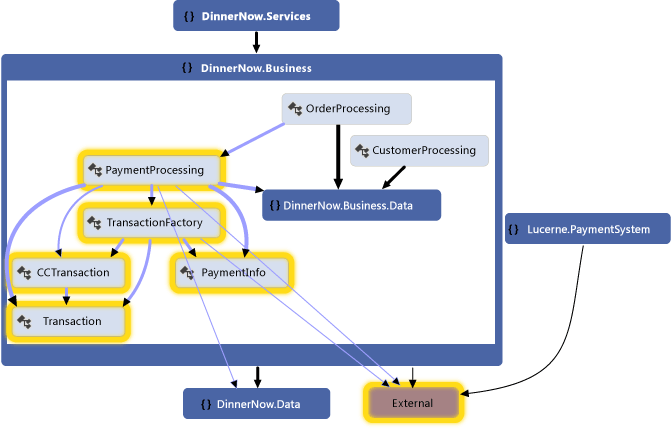

**Mapa de código del sistema de pago de Dinner Now**

Para explorar el mapa, el desarrollador expande la clase PaymentProcessing y selecciona sus miembros para ver las áreas que podrían verse afectadas:

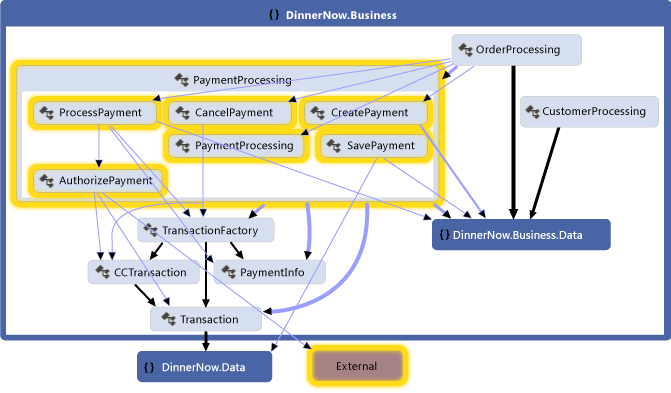

**Métodos de la clase PaymentProcessing y sus dependencias**

El mapa siguiente del sistema de pago de Lucerne se genera para inspeccionar sus clases, métodos y dependencias. El equipo ve que también podría ser necesario actuar en el sistema de Lucerne para que interactúe con los demás elementos de Dinner Now:

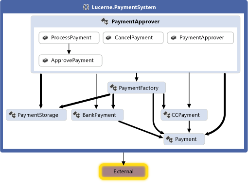

**Mapa de código del sistema de pago de Lucerne**

Ambos equipos colaboran para determinar los cambios que son necesarios para integrar los dos sistemas. Deciden refactorizar parte del código para que sea más fácil de actualizar. La clase PaymentApprover se moverá al espacio de nombres DinnerNow.Business y requerirá algunos métodos nuevos. Las clases de Dinner Now que controlan las transacciones tendrán su propio espacio de nombres. Los equipos crean y usan elementos de trabajo para planear, organizar y realizar un seguimiento de su trabajo. Vinculan los elementos de trabajo a elementos del modelo donde resulta útil.

Después de reorganizar el código, los equipos generan un nuevo mapa de código para ver la estructura y las relaciones actualizadas:

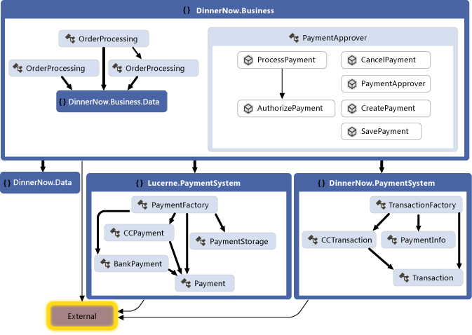

**Mapa de código con código reorganizado**

Este mapa muestra que la clase PaymentApprover se encuentra ahora en el espacio de nombres DinnerNow.Business y tiene algunos métodos nuevos. Las clases de transacción de Dinner Now ahora tienen su propio espacio de nombres PaymentSystem, lo que facilita el trabajo posterior con ese código.

#### Creación de un mapa de código

- Para obtener una visión general rápida del código fuente, siga estos pasos para generar un mapa de código:

     En el menú **Arquitectura** , haga clic en **Generar mapa de código para solución**.

     Para obtener una visión general rápida del código compilado, cree un mapa de código en blanco y, después, arrastre los archivos de ensamblado o los archivos binarios a la superficie del mapa.

- Para explorar código específico o elementos de la solución, use el Explorador de soluciones para seleccionar los elementos y las relaciones que quiere visualizar. A continuación puede generar un mapa nuevo o agregar elementos seleccionados a un mapa existente. Vea [Map dependencies across your solutions](../modeling/map-dependencies-across-your-solutions.md).

- Para que le sea más fácil explorar el mapa, reorganice el diseño para que se adapte a los tipos de tareas que quiere realizar.

     Por ejemplo, para visualizar la distribución en capas del código, seleccione un diseño de árbol. Consulte [Examinar y reorganizar mapas de código](../modeling/browse-and-rearrange-code-maps.md).

#### Resumen: Ventajas de los mapas de código
 Los mapas de código le ayudan en las siguientes tareas:

- Obtener información acerca de la organización y las relaciones en el código existente.

- Identificar áreas que podrían verse afectadas por un cambio propuesto.

- Buscar áreas de complejidad, patrones, capas u otras áreas que se podrían mejorar para que el código sea más fácil de mantener, modificar y reutilizar.

#### Relación con otros diagramas

|**Diagrama**|**Qué describe**|
|-|-|
|Diagrama de dependencia|La arquitectura lógica del sistema. Mediante la validación de dependencia, asegúrese de que el código mantiene la coherencia con el diseño.   Para ayudarle a identificar las dependencias existentes o las previstas, cree un mapa de código y agrupe los elementos relacionados. Para crear un diagrama de dependencia, consulte:   - [Creación de diagramas de dependencia a partir del código](../modeling/create-layer-diagrams-from-your-code.md) - [Diagramas de dependencia: directrices](../modeling/layer-diagrams-guidelines.md)|
|Diagrama de clases (basado en código)|Las clases existentes en el código de un proyecto específico.   Para visualizar y modificar una clase existente en el código, use el Diseñador de clases.   Vea [Cómo: Agregar diagramas de clases a proyectos (Diseñador de clases)](../ide/class-designer/how-to-add-class-diagrams-to-projects.md).|

###  Definición de un glosario de tipos: Diagramas de clases
 Los diagramas de clases definen las entidades, términos o conceptos que participan en el sistema y sus relaciones entre sí. Por ejemplo, estos diagramas se pueden usar durante el desarrollo para describir los atributos y las operaciones de cada clase, independientemente del lenguaje de implementación o el estilo.

 Para describir y analizar las entidades que participan en el caso de uso del proceso de pago, en Lucerne dibujan el diagrama de clases siguiente:

 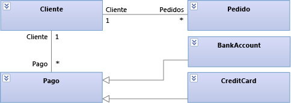

 **Entidades del proceso de pago en un diagrama de clases**

 En este diagrama se muestra que un cliente (Customer) puede tener muchos pedidos (Orders) y diferentes modos de pago para los pedidos. BankAccount y CreditCard heredan de Payment.

 Durante el desarrollo, Lucerne usa el siguiente diagrama de clases para describir y analizar los detalles de cada clase:

 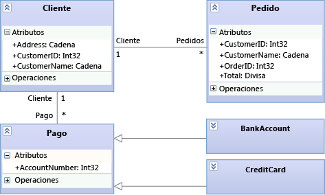

 **Detalles del proceso de pago en el diagrama de clases**

#### Dibujo de un diagrama de clases

Un diagrama de clases tiene las siguientes características principales:

- Tipos como clases, interfaces y enumeraciones:

  - Una *clase* es la definición de objetos que comparten determinadas características estructurales y de comportamiento.

  - Una *interfaz* define una parte del comportamiento externamente visible de un objeto.

  - Una *enumeración* es un clasificador que contiene una lista de valores literales.

- Los *atributos* son valores de un tipo determinado que describen cada instancia de un *clasificador*. Un clasificador es un nombre general para tipos, componentes, casos de uso e incluso actores.

- Las *operaciones* son métodos o funciones que las instancias de un clasificador pueden realizar.

- Una *asociación* indica algún tipo de relación entre dos clasificadores.

  - Una *agregación* es una asociación que indica una propiedad compartida entre clasificadores.

  - Una *composición* es una asociación que indica una relación todo-parte entre clasificadores.

    Para mostrar las agregaciones o composiciones, establezca la propiedad **Agregación** en una asociación. **Compartido** muestra las agregaciones y **Compuesto** muestra las composiciones.

- Una *dependencia* indica que al cambiar la definición de un clasificador, también puede cambiar la definición de otro clasificador.

- Una *generalización* indica que un clasificador específico hereda parte de su definición de un clasificador general. Una *realización* indica que una clase implementa las operaciones y los atributos que ofrece una interfaz.

     Para crear estas relaciones, use la herramienta **Herencia** . Una realización también puede representarse como un *círculo*.

- Los *paquetes* son grupos de clasificadores, asociaciones, líneas de vida, componentes y otros paquetes. Las relaciones de *importación* indican que un paquete incluye todas las definiciones de otro paquete.

Como punto de partida para explorar y analizar las clases existentes, puede usar el Diseñador de clases para crear diagramas de clases desde el código.

- [Cómo: Agregar diagramas de clases a proyectos (Diseñador de clases)](../ide/class-designer/how-to-add-class-diagrams-to-projects.md)

#### Resumen: Ventajas de los diagramas de clases
 Los diagramas de clases le ayudan a definir lo siguiente:

- Un glosario común de términos que se usan al analizar las necesidades de los usuarios y las entidades que participan en el sistema. Consulte [Requisitos del usuario de modelos](../modeling/model-user-requirements.md).

- Tipos usados por partes del sistema, como los componentes, independientemente de su implementación. Consulte [Modelar la arquitectura de la aplicación](../modeling/model-your-app-s-architecture.md).

- Relaciones entre tipos, como dependencias. Por ejemplo, puede mostrar un tipo que se puede asociar con varias instancias de otro tipo.

#### Relación con otros diagramas

|**Diagrama**|**Descripción**|
|-|-|
|Diagrama de dependencia|Definición de la arquitectura lógica del sistema en lo referente a las clases.   Mediante la validación de dependencia, asegúrese de que el código mantiene la coherencia con el diseño.   Consulte:   - [Creación de diagramas de dependencia a partir del código](../modeling/create-layer-diagrams-from-your-code.md) - [Diagramas de dependencia: referencia](../modeling/layer-diagrams-reference.md) - [Diagramas de dependencia: directrices](../modeling/layer-diagrams-guidelines.md) - [Validación de código con diagramas de dependencia](../modeling/validate-code-with-layer-diagrams.md)|
|Mapa de código|Visualización de la organización y las relaciones en el código existente.   Para identificar las clases, sus relaciones y sus métodos, cree un mapa de código que muestre esos elementos.   Consulte:   - [Asignar dependencias en las soluciones](../modeling/map-dependencies-across-your-solutions.md)|

###  Descripción de la arquitectura lógica: diagramas de dependencia
 Los diagramas de dependencia organizan los artefactos de la solución en grupos abstractos, o *capas*, con los que describen la arquitectura lógica de un sistema. Estos artefactos pueden ser muchas cosas: espacios de nombres, proyectos, clases, métodos, etcétera. En las capas se representan y describen los roles o las tareas que realizan los artefactos en el sistema. También puede incluir la validación de capas en la compilación y las operaciones de protección para asegurarse de que el código sigue siendo coherente con el diseño.

 Para mantener la coherencia entre el código y el diseño, Dinner Now y Lucerne usan el siguiente diagrama de dependencia para validar el código a medida que evoluciona:

 

 **Diagrama de dependencia para la integración de Dinner Now y Lucerne**

 Las capas de este diagrama se vinculan a los artefactos correspondientes de la solución de Dinner Now y Lucerne. Por ejemplo, la capa Business se vincula al espacio de nombres DinnerNow.Business y a sus miembros, que ahora incluyen la clase PaymentApprover. La capa Resource Access se vincula al espacio de nombres DinnerNow.Data. Las flechas, o *dependencias*, especifican que solo la capa Business puede usar la funcionalidad de la capa Resource Access. La validación de capas se realiza con regularidad a medida que los equipos actualizan su código; esto les permite detectar los conflictos cuando se producen y resolverlos rápidamente.

 Los equipos trabajan juntos para que la integración se realice de forma incremental y para probar los dos sistemas. Antes de ocuparse de PaymentProcessing, primero se aseguran de que PaymentApprover y el resto de Dinner Now trabajan de forma conjunta y correcta.

 En el mapa de código siguiente se muestran las nuevas llamadas entre Dinner Now y PaymentApprover:

 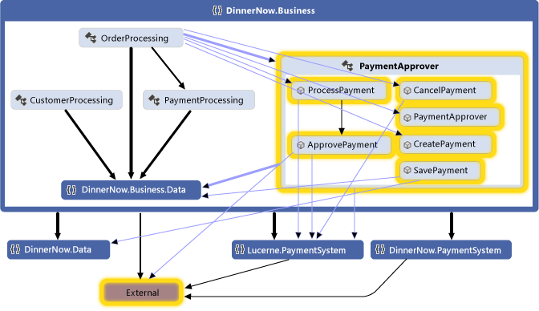

 **Mapa de código con llamadas a método actualizadas**

 Una vez que confirman que el sistema funciona según lo esperado, Dinner Now convierte en comentario el código de PaymentProcessing. Los informes de validación de capas están limpios y el mapa de código resultante muestra que ya no existen más dependencias de PaymentProcessing:

 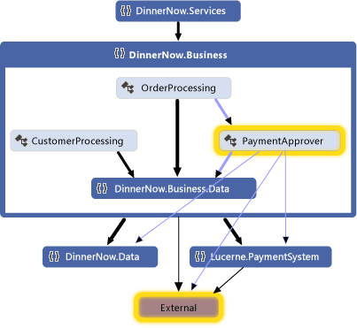

 **Mapa de código sin PaymentProcessing**

#### Dibujo de un diagrama de dependencia

Un diagrama de dependencia tiene las siguientes características principales:

- *Capas* que describen grupos lógicos de artefactos.

- *Vínculos* , es decir, asociaciones entre capas y artefactos.

     Para crear las capas a partir de artefactos, arrastre elementos desde el Explorador de soluciones, los mapas de código, la vista de clases o el examinador de objetos. Para dibujar capas nuevas y luego vincularlas a artefactos, use el cuadro de herramientas o haga clic con el botón derecho en la superficie del diagrama para crear las capas y, después, arrastre elementos a esas capas.

     El número de una capa muestra la cantidad de artefactos vinculados a ella. Estos artefactos pueden ser espacios de nombres, proyectos, clases, métodos, etc. Cuando interprete el número de artefactos de una capa, recuerde lo siguiente:

  - Si una capa se vincula a un artefacto que contiene otros artefactos, pero no se vincula directamente a estos otros artefactos, el número incluye únicamente el artefacto vinculado. Sin embargo, los demás artefactos se incluyen para el análisis durante la validación de capas.

       Por ejemplo, si una capa está vinculada a un solo espacio de nombres, el número de artefactos vinculados es 1, aunque el espacio de nombres contenga clases. Si la capa tiene también vínculos a cada clase del espacio de nombres, el número incluirá las clases vinculadas.

  - Si una capa contiene otras que están vinculadas a artefactos, la capa contenedora también está vinculada a esos artefactos, incluso aunque el número de la capa contenedora no los incluya.

    Para ver los artefactos que están vinculados a una capa, haga clic con el botón derecho en la dependencia y luego haga clic en **Ver vínculos** para abrir el **Explorador de capas**.

- *Dependencias* que indican que una capa puede usar la funcionalidad de otra capa, pero no viceversa. Una *dependencia bidireccional* indica que una capa puede usar la funcionalidad de otra capa, y viceversa.

     Para ver las dependencias actuales en el diagrama de dependencia, haga clic con el botón derecho en la superficie del diagrama y, después, haga clic en **Generar dependencias**. Para describir las dependencias previstas, dibuje unas nuevas.

Consulte:

- [Crear diagramas de dependencia a partir del código](../modeling/create-layer-diagrams-from-your-code.md)

- [Diagramas de dependencia: referencia](../modeling/layer-diagrams-reference.md)

- [Diagramas de dependencia: instrucciones](../modeling/layer-diagrams-guidelines.md)

- [Validación código con diagramas de dependencia](../modeling/validate-code-with-layer-diagrams.md)

#### Resumen: Ventajas de los diagramas de dependencia

Los diagramas de dependencia le ayudan a:

- Describir la arquitectura lógica de un sistema conforme a la funcionalidad de sus artefactos.

- Asegurarse de que el código en desarrollo se ajusta al diseño especificado.

#### Relación con otros diagramas

|**Diagrama**|**Descripción**|
|-|-|
|Mapa de código|Visualización de la organización y las relaciones en el código existente.   Para crear las capas, genere un mapa de código y, después, agrupe los elementos en el mapa como capas potenciales. Arrastre los grupos desde el mapa al diagrama de dependencia.   Consulte:   - [Asignar dependencias en las soluciones](../modeling/map-dependencies-across-your-solutions.md) - [Examinar y reorganizar mapas de código](../modeling/browse-and-rearrange-code-maps.md)|

## Recursos externos

|**Categoría**|**Vínculos**|
|-|-|
|**Foros**|- [Herramientas de visualización y modelado de Visual Studio](https://social.msdn.microsoft.com/Forums/en-US/home?forum=vsarch) - [SDK de visualización y modelado de Visual Studio (Herramientas ADSL)](https://social.msdn.microsoft.com/Forums/home?forum=dslvsarchx)|

## Vea también

- [Visualizar el código](../modeling/visualize-code.md)
- [Usar modelos en el proceso de desarrollo](../modeling/use-models-in-your-development-process.md)
- [Usar modelos en Agile Development](/previous-versions/ff398061(v=vs.140))
- [Validar el sistema durante el desarrollo](../modeling/validate-your-system-during-development.md)