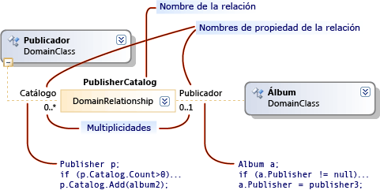

# Introducción a los modelos, las clases y las relaciones
Un lenguaje específico de dominio (DSL) se define mediante su archivo de definición de DSL, junto con cualquier código de programa personalizado que pueda escribir. La mayor parte del código de programa de la solución DSL se genera a partir de este archivo.

 En este tema se explican las características centrales de la definición de DSL.

## Definición de DSL
 Al abrir , `Dsl\DslDefinition.dsl` la ventana de Visual Studio se parece a la siguiente imagen.

 

 La información más importante de la definición de DSL se muestra en el diagrama de definición de DSL. La información adicional, que también forma parte de DslDefinition.dsl, se muestra en el Explorador de DSL, que normalmente aparece en el lado del diagrama. Trabajará con el diagrama para las tareas más frecuentes y con el Explorador de DSL para personalizaciones más avanzadas.

 El diagrama de definición de DSL muestra las clases de dominio que definen los elementos del modelo y las relaciones que definen vínculos entre los elementos del modelo. También muestra las formas y los conectores que se usan para mostrar los elementos del modelo al usuario.

 

 Al seleccionar un elemento en la definición de DSL, ya sea en el diagrama o en el Explorador de DSL, la información sobre él se muestra en el ventana Propiedades. Se puede mostrar información adicional en la ventana Detalles de DSL.

### Los modelos son instancias de DSL
 Un *modelo* es una instancia del DSL creado por un usuario. Un modelo contiene elementos de modelo, que son instancias de las clases de dominio que defina, y vínculos entre los elementos, que son instancias de las relaciones de dominio que defina. Un modelo también puede tener formas y conectores, que muestran los elementos y vínculos del modelo en un diagrama. La definición de DSL incluye las clases de forma, las clases de conector y una clase para el diagrama.

 Una definición de DSL también se conoce como modelo *de dominio*. Un modelo de dominio o definición de DSL es la representación en tiempo de diseño del lenguaje específico del dominio, mientras que el modelo es la creación de instancias en tiempo de ejecución del lenguaje específico del dominio.

## Las clases de dominio definen elementos de modelo
 Las clases de dominio se usan para crear los distintos elementos del dominio y las relaciones de dominio son los vínculos entre los elementos. Son la representación en tiempo de diseño de los elementos y vínculos a los que crearán instancias los usuarios del lenguaje específico del diseño al crear sus modelos.

 En esta ilustración se muestra un modelo creado por el usuario de un DSL de la biblioteca de música. Los álbumes de música se representan mediante cuadros que contienen listas de canciones. Los intérpretes se representan mediante cuadros de redondeo y están conectados a los álbumes a los que han contribuido.

 

 La definición de DSL separa dos aspectos. La apariencia de los elementos del modelo en el diagrama de modelos se define mediante clases de forma y clases de conector. La información que se lleva a cabo en el modelo se define mediante clases de dominio y relaciones de dominio.

 En la ilustración siguiente se muestran las clases de dominio y las relaciones en la definición de DSL de la biblioteca de música.

 

 En la ilustración se muestran cuatro clases de dominio: Música, Álbum, Intérprete y Canción. Las clases de dominio definen propiedades de dominio como Nombre, Título, entre otras. En el modelo de instancia, los valores de algunas de estas propiedades se muestran en el diagrama.

 Entre las clases hay relaciones de dominio: MusicHasAlbums, MusicHasArtists, AlbumbHasSongs y ArtistAppearedOnAlbums. Las relaciones tienen variasplicidades, como 1..1, 0..*. Por ejemplo, cada canción debe estar relacionada con exactamente un álbum a través de la relación AlbumHasSongs. Cada álbum puede tener cualquier número de canciones.

### Reorganizar el diagrama de definición de DSL
 Observe que una clase de dominio puede aparecer varias veces en el diagrama de definición de DSL, como hace Album en esta imagen. Siempre hay una vista principal y puede haber algunas vistas *de* referencia.

 Para reorganizar el diagrama de definición de DSL, puede:

- Intercambie las vistas principal y de referencia mediante los comandos **Bring Tree Here (Traer árbol aquí)** **y Split Tree (Dividir** árbol). Haga clic con el botón derecho en una sola clase de dominio para ver estos comandos.

- Vuelva a ordenar las clases de dominio y las clases de forma presionando Ctrl+Arriba y Ctrl+Abajo.

- Contraiga o expanda clases mediante el icono situado en la esquina superior derecha de cada forma.

- Contraiga partes del árbol haciendo clic en el signo menos (-) en la parte inferior de una clase de dominio.

## Herencia
 Las clases de dominio se pueden definir mediante herencia. Para crear una derivación de herencia, haga clic en la herramienta Herencia, haga clic en la clase derivada y, a continuación, haga clic en la clase base. Un elemento de modelo tiene todas las propiedades que se definen en su propia clase de dominio, junto con todas las propiedades heredadas de la clase base. También hereda sus roles en las relaciones.

 La herencia también se puede usar entre relaciones, formas y conectores. La herencia debe mantenerse dentro del mismo grupo. Una forma no puede heredar de una clase de dominio.

## Relaciones de dominio
 Los elementos del modelo se pueden vincular mediante relaciones. Los vínculos siempre son binarios; vinculan exactamente dos elementos. Sin embargo, cualquier elemento puede tener muchos vínculos a otros objetos e incluso puede haber más de un vínculo entre el mismo par de elementos.

 Al igual que puede definir diferentes clases de elementos, puede definir diferentes clases de vínculos. La clase de un vínculo se denomina relación *de dominio*. Una relación de dominio especifica qué clases de elemento pueden conectar sus instancias. Cada final de una relación se denomina rol *y* la relación de dominio define nombres para los dos roles, así como para la propia relación.

 Hay dos tipos de relaciones de dominio: relaciones de inserción y relaciones de referencia. En el diagrama de definición de DSL, las relaciones de inserción tienen líneas sólidas en cada rol y las relaciones de referencia tienen líneas discontinuas.

### Inserción de relaciones
 Cada elemento de un modelo, excepto su raíz, es el destino de un vínculo de inserción. Por lo tanto, todo el modelo forma un único árbol de vínculos de inserción. Una relación de incrustación representa la contención o la propiedad. Dos elementos de modelo que están relacionados de esta manera también se conocen como elementos primarios y secundarios. Se dice que el elemento secundario está incrustado en el elemento primario.

 Los vínculos de inserción no suelen mostrarse explícitamente como conectores en un diagrama. En su lugar, normalmente se representan mediante contención. El diagrama representa la raíz del modelo y los elementos insertados en él se muestran como formas en el diagrama.

 En el ejemplo, la clase raíz Music tiene una relación de incrustación MusicHasAlbums to Album, que tiene una inserción de AlbumHasSongs en Song. Las canciones se muestran como elementos en una lista dentro de cada álbum. La música también tiene una clase MusicHasArtists insertada en la clase Artist, cuyas instancias también aparecen como formas en el diagrama.

 De forma predeterminada, los elementos incrustados se eliminan automáticamente cuando se eliminan sus elementos principales.

 Cuando un modelo se guarda en un archivo en formato XML, los elementos incrustados se anidan dentro de sus elementos principales, a menos que haya personalizado la serialización.

> [!NOTE]
> Incrustación no es lo mismo que herencia. Los elementos secundarios de una relación de inserción no heredan las propiedades del elemento primario. Una incrustación es un tipo de vínculo entre los elementos del modelo. La herencia es una relación entre clases y no crea vínculos entre los elementos del modelo.

### Reglas de inserción
 Cada elemento de un modelo de instancia debe ser el destino de exactamente un vínculo de inserción, excepto la raíz del modelo.

 Por lo tanto, todas las clases de dominio no abstractas, excepto la clase raíz, deben ser el destino de al menos una relación de inserción, o bien deben heredar una inserción de una clase base. Una clase puede ser el destino de dos o más incrustaciones, pero sus elementos del modelo de instancia solo pueden tener un elemento primario a la vez. La multiplicidad de destino a origen debe ser 0...1 o 1..1.

### El Explorador muestra el árbol de inserción
 La definición de DSL también crea un explorador, que los usuarios ven junto con su diagrama de modelos.

 

 El explorador muestra todos los elementos del modelo, incluso aquellos para los que no ha definido ninguna forma. Muestra los elementos y las relaciones de inserción, pero no las relaciones de referencia.

 Para ver los valores de las propiedades de dominio de un elemento, el usuario selecciona un elemento, ya sea en el diagrama del modelo o en el explorador de modelos, y abre el ventana Propiedades. Muestra todas las propiedades de dominio, incluidas las que no se muestran en el diagrama. En el ejemplo, cada canción tiene un título y un género, pero solo el valor del título se muestra en el diagrama.

## Relaciones de referencia
 Una relación de referencia representa cualquier tipo de relación que no se inserta.

 Las relaciones de referencia se muestran normalmente en un diagrama como conectores entre formas.

 En la representación XML del modelo, se representa un vínculo de referencia entre dos elementos mediante *monikers.* Es decir, los monikers son nombres que identifican de forma única cada elemento del modelo. El nodo XML de cada elemento de modelo contiene un nodo que especifica el nombre de la relación y el moniker del otro elemento.

## Roles
 Cada relación de dominio tiene dos roles, un rol de origen y un rol de destino.

 En la siguiente imagen, la línea entre la clase de dominio **Publisher** y la relación de **dominio PublisherCatalog** es el rol de origen. La línea entre la relación de dominio y la **clase de** dominio Album es el rol de destino.

 

 Los nombres asociados a una relación son especialmente importantes al escribir código de programa que atraviesa el modelo. Por ejemplo, al compilar la solución DSL, la clase generada Publisher tiene una propiedad Catalog que es una colección de álbumes. La clase Album tiene una propiedad Publisher que es una única instancia de la clase Publisher.

 Al crear una relación en una definición de DSL, los nombres de propiedad y relación reciben valores predeterminados. Sin embargo, puede cambiarlos.

## Multiplicities
 Las multiplicidades especifican cuántos elementos pueden tener el mismo rol en una relación de dominio. En el ejemplo, la configuración de multiplicidad de cero a varios (0.. ) en el rol Catálogo especifica que cualquier instancia de la clase de dominio Publisher puede tener tantos vínculos de relación publisherCatalog como desee \* darle.   

 Configure la multiplicidad de un rol escribiendo en el diagrama o modificando la `Multiplicity` propiedad en la **ventana** Propiedades. En la tabla siguiente se describe la configuración de esta propiedad.

|Tipo de multiplicidad|Descripción|
|-|-|
|0..*(De cero a varios)|Cada instancia de la clase de dominio puede tener varias instancias de la relación o ninguna instancia de la relación.|
|0..1 (de cero a uno)|Cada instancia de la clase de dominio no puede tener más de una instancia de la relación o ninguna instancia de la relación.|
|1..1 (Uno)|Cada instancia de la clase de dominio puede tener una instancia de la relación. No se puede crear más de una instancia de esta relación a partir de ninguna instancia de la clase de rol. Si la validación está habilitada, aparecerá un error de validación cuando cualquier instancia de la clase de rol no tenga ninguna instancia de la relación.|
|1..* (de uno a varios)|Cada instancia de la clase en el rol que tiene esta multiplicidad puede tener varias instancias de la relación y cada instancia debe tener al menos una instancia de la relación. Si la validación está habilitada, aparecerá un error de validación cuando cualquier instancia de la clase de rol no tenga ninguna instancia de la relación.|

## Relaciones de dominio como clases
 Un vínculo se representa en store como una instancia de LinkElement, que es una clase derivada de ModelElement. Puede definir estas propiedades en el diagrama del modelo de dominio en las relaciones de dominio.

 También puede convertir una relación en el origen o destino de otras relaciones. En el diagrama del modelo de dominio, haga clic con el botón derecho en la relación de dominio y, a continuación, haga clic **en Mostrar como clase**. Aparecerá un cuadro de clase adicional. A continuación, puede conectar relaciones a ella.

 Puede definir una relación parcialmente por herencia, igual que con las clases de dominio. Seleccione la relación derivada y establezca **Relación base** en el ventana Propiedades.

 Una relación derivada especializa su relación base. Las clases de dominio a las que vincula deben derivarse de o igual que las clases vinculadas por la relación base. Cuando se crea un vínculo de la relación derivada en un modelo, es una instancia de las relaciones derivadas y base. En el código del programa, puede navegar al extremo opuesto del vínculo mediante las propiedades generadas por la base o por la clase derivada.

## Vea también

- [Glosario de las Herramientas del lenguaje específico de dominio](/previous-versions/bb126564(v=vs.100))