# Usar mapas de código para depurar aplicaciones
Los mapas de código le ayudan a evitar bases de código de gran tamaño, código con el que no esté familiarizado o código heredado. Por ejemplo, al depurar, puede que tenga que buscar en varios proyectos y archivos. Use mapas de código para navegar por fragmentos de código y entender las relaciones entre ellos. De este modo evitará tener que realizar un seguimiento mental de este código o dibujar un diagrama independiente. Así, cuando interrumpa su trabajo, los mapas de código le ayudarán a recordar el código en el que está trabajando.  

   

 **Una flecha verde muestra el cursor en el editor de**  

 Para obtener información detallada de los comandos y las acciones que puede utilizar cuando se trabaja con mapas de código, vea [examinar y reorganizar mapas de código](../modeling/browse-and-rearrange-code-maps.md).  

## Entender el problema  
 Supongamos que hay un error en un programa de dibujo en el que está trabajando. Para reproducir el error, abra la solución en Visual Studio y presione **F5** para iniciar la depuración.  

 Cuando dibuje una línea y elija **deshacer mi último trazo**, no ocurre nada hasta que se dibuje la línea siguiente.  

 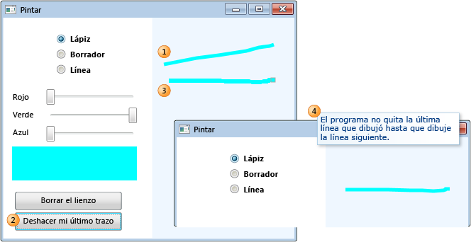  

 Por tanto, comienza la investigación buscando el método `Undo`. Lo encuentra en la clase `PaintCanvas`.  

 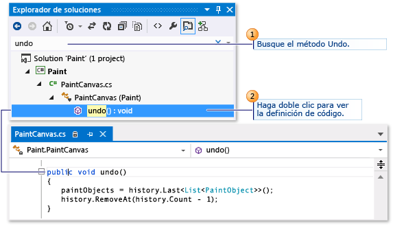  

## Empezar a asignar el código  
 Ahora comience la asignación del método `undo` y sus relaciones. Desde el editor de código, agrega el método `undo` y los campos a los que se hace referencia a un nuevo mapa de código. Cuando se crea un nuevo mapa, es posible que se tarde algo de tiempo en indizar el código. Esto ayuda a que se ejecuten más rápido las operaciones posteriores.  

 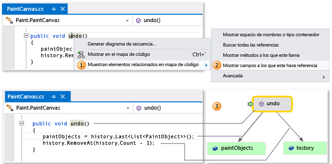  

> [!TIP]
>  El resaltado verde muestra los últimos elementos agregados al mapa. La flecha verde muestra la posición del cursor en el código. Las flechas entre los elementos representan diferentes relaciones. Para más información sobre los elementos del mapa, pase el mouse sobre ellos y examine su información sobre herramientas.  

 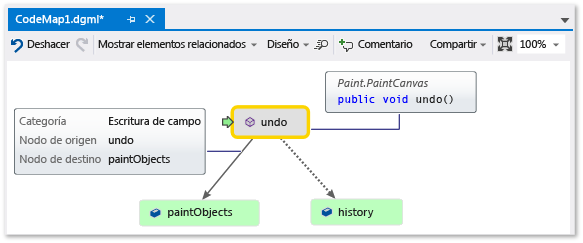  

## Navegar y examinar código desde la asignación  
 Para ver la definición de código para cada campo, haga doble clic en el campo en el mapa o seleccione el campo y presione **F12**. La flecha verde se desplaza entre los elementos del mapa. El cursor del editor de código también se desplaza automáticamente.  

 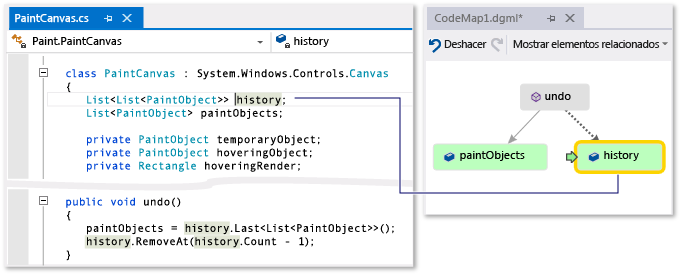  

 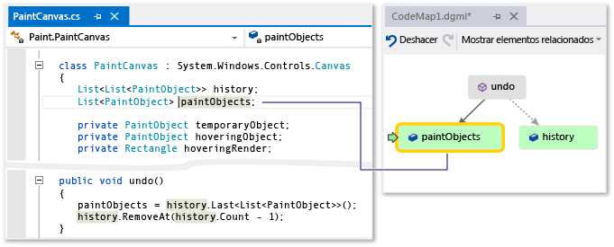  

> [!TIP]
>  También puede mover la flecha verde en el mapa moviendo el cursor en el editor de código.  

## Entender las relaciones entre los elementos de código  
 Ahora desea saber qué otro código interactúa con los campos `history` y `paintObjects`. Puede agregar todos los métodos que hacen referencia a estos campos al mapa. Puede hacer esto desde el mapa o desde el editor de código.  

 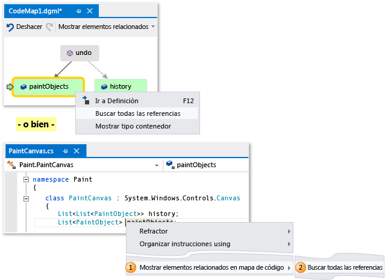  

   

> [!NOTE]
>  Si agrega elementos de un proyecto que se comparte entre varias aplicaciones, como Windows Phone o la Tienda Windows, dichos elementos aparecen siempre en el mapa con el proyecto de aplicación activo actualmente. Por lo tanto, si cambia el contexto a otro proyecto de aplicación, también cambia el contexto en el mapa para cualquier elemento recién agregado desde el proyecto compartido. Las operaciones que se realizan con un elemento en el mapa solo se aplican a los elementos que comparten el mismo contexto.  

 Cambie el diseño para reorganizar el flujo de las relaciones y facilitar la lectura del mapa. También puede mover los elementos por el mapa arrastrándolos.  

 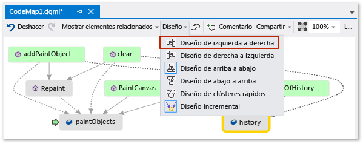  

> [!TIP]
>  De forma predeterminada, **diseño Incremental** está activado. El mapa se reorganiza lo menos posible cuando se agregan nuevos elementos. Para reorganizar el mapa completo cada vez que agregue nuevos elementos, desactive la opción **diseño Incremental**.  

 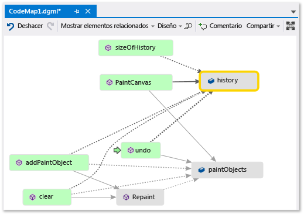  

 Examinemos estos métodos. En el mapa, haga doble clic en el **PaintCanvas** método, o seleccione este método y presione **F12**. Verá que este método crea `history` y `paintObjects` como listas vacías.  

 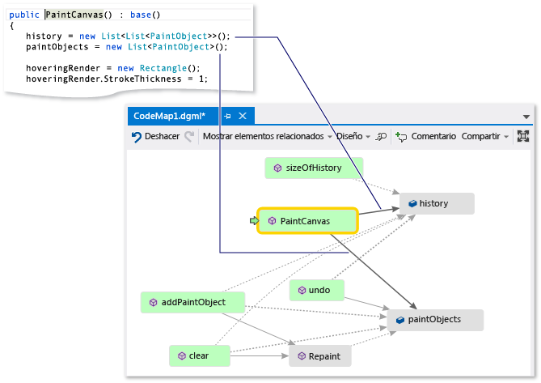  

 Ahora repita los mismos pasos para examinar la definición del método `clear`. Verá que `clear` lleva a cabo algunas tareas con `paintObjects` e `history`. A continuación, llama al método `Repaint`.  

 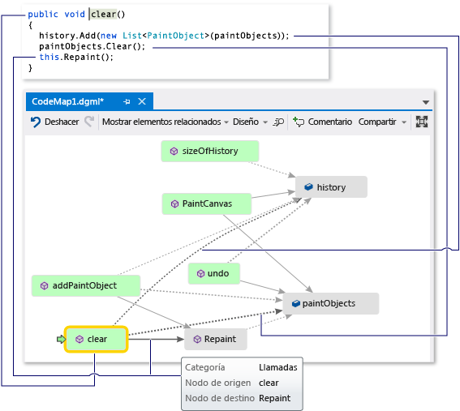  

 Ahora, examine la definición del método `addPaintObject`. También realiza algunas tareas con `history` y `paintObjects`. También llama a `Repaint`.  

 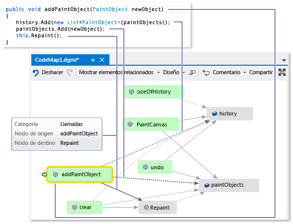  

## Buscar el problema examinando la asignación  
 Parece que todos los métodos que modifican `history` y `paintObjects` llaman a `Repaint`. Con todo, el método `undo` no llama a `Repaint`, aunque `undo` modifica los mismos campos. Por tanto, cree que puede corregir este problema mediante una llamada a `Repaint` desde `undo`.  

 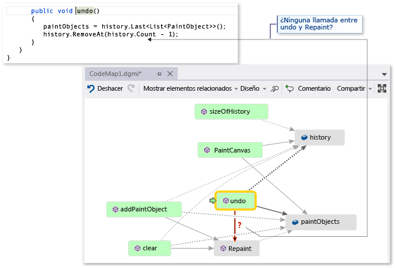  

 Si no tuviese un mapa para encontrar la llamada que falta, posiblemente sería más difícil localizar este problema, sobre todo con código más complejo.  

## Compartir la información y pasos siguientes  
 Antes de que usted u otro usuario corrija este error, puede hacer anotaciones en el mapa acerca del problema y de cómo corregirlo.  

 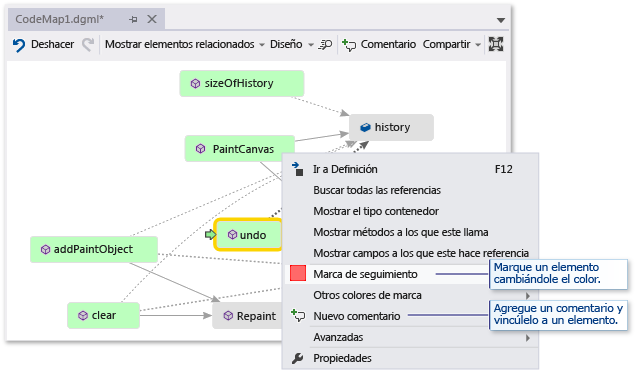  

 Por ejemplo, puede agregar comentarios al mapa y marcar los elementos con colores.  

 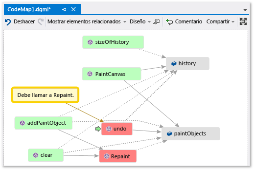  

 Si tiene Microsoft Outlook instalado, puede enviar el mapa a otras personas por correo electrónico. También puede exportar el mapa como imagen u otro formato.  

 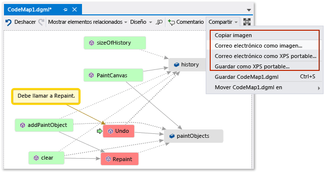  

## Corregir el problema y mostrar lo que hizo  
 Para corregir este error, agregue la llamada de `Repaint` a `undo`.  

 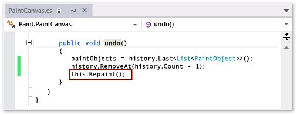  

 Para confirmar la corrección, reinicie su sesión de depuración e intente reproducir el error. Ahora, si elige **deshacer mi último trazo** funciona como se esperaba y confirma que realizó la solución adecuada.  

 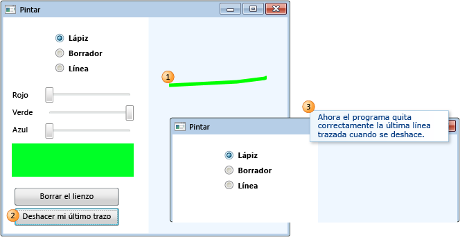  

 Puede actualizar el mapa para mostrar la corrección que realizó.  

 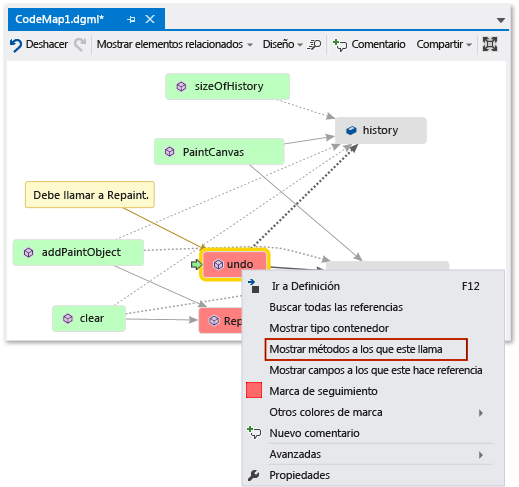  

 El mapa muestra ahora un vínculo entre **deshacer** y **volver a dibujar**.  

 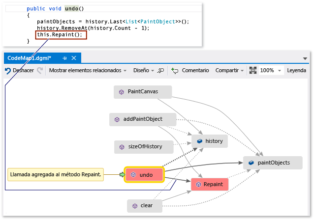  

> [!NOTE]
>  Cuando actualice el mapa, puede que vea un mensaje que indica que se ha actualizado el índice de código utilizado para crear el mapa. Esto significa que alguien ha cambiado el código, lo que hace que el mapa no coincida con código actual. Esto no detiene su actualización del mapa, pero podría tener que volver a crearlo para confirmar que coincide con el código.  

 Ahora ha terminado con la investigación. Encontró y corrigió correctamente el problema asignando el código. También tiene un mapa que le ayuda a navegar por el código y a recordar lo que ha aprendido, y le muestra los pasos llevados a cabo para corregir el problema.  

## Vea también  
 [Asignar métodos en la pila de llamadas durante la depuración](../debugger/map-methods-on-the-call-stack-while-debugging-in-visual-studio.md)   
 [Visualizar el código](../modeling/visualize-code.md)
