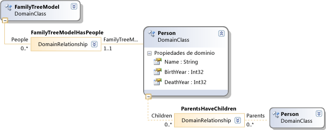

# <a name="validation-in-a-domain-specific-language"></a>La validación en los lenguajes específicos de dominio
Como autor de un lenguaje específico de dominio (DSL), puede definir restricciones de validación para comprobar que el modelo creado por el usuario tiene significado. Por ejemplo, si su DSL permite a los usuarios dibujar un árbol genealógico de personas y antepasados, podría escribir una restricción que garantice que la fecha de nacimiento de los hijos sea posterior a la de los padres.

 Puede tener las restricciones de validación que ejecutará cuando se guarda el modelo, cuando se abre, y cuando el usuario ejecute explícitamente el **validar** comando de menú. También puede ejecutar la validación bajo el control del programa. Por ejemplo, podría ejecutar la validación en respuesta a un cambio en un valor de propiedad o de una relación.

 La validación es especialmente importante si va a escribir plantillas de texto u otras herramientas que procesan los modelos de los usuarios. La validación garantiza que los modelos cumplen las condiciones previas que esas herramientas dan por hecho.

> [!WARNING]
>  También puede permitir que las restricciones de validación se definan en extensiones diferentes de su DSL, junto con los controladores de gestos y los comandos de menú de la extensión. Los usuarios pueden elegir instalar estas extensiones además de su DSL. Para obtener más información, consulte [ampliar DSL mediante MEF](../modeling/extend-your-dsl-by-using-mef.md).

## <a name="running-validation"></a>Ejecutar la validación
 Cuando un usuario edita un modelo, es decir, una instancia de su lenguaje específico de dominio, las siguientes acciones pueden ejecutar la validación:

- Haga clic en el diagrama y seleccione **validar todos los**.

- Haga clic en el nodo superior en el Explorador de su DSL y seleccionar **validar todos los**

- Guardar el modelo.

- Abrir el modelo.

- Además, puede escribir código de programa que ejecute la validación, por ejemplo, como parte de un comando de menú o en respuesta a un cambio.

  Errores de validación aparecerán en el **lista de errores** ventana. El usuario puede hacer doble clic en un mensaje de error para seleccionar los elementos del modelo que causaron el error.

## <a name="defining-validation-constraints"></a>Definir restricciones de validación
 Para definir restricciones de validación, se agregan métodos de validación a las relaciones o clases de dominio de su DSL. Cuando el usuario o el control del programa ejecutan la validación, se ejecutan algunos o todos los métodos de validación. Cada método se aplica a cada una de las instancias de la clase, y puede haber varios métodos de validación en cada clase.

 Cada método de validación notifica todos los errores que encuentra.

> [!NOTE]
>  Los métodos de validación notifican los errores, pero no cambian el modelo. Si desea ajustar o evitar determinados cambios, consulte [alternativas a la validación](#alternatives).

#### <a name="to-define-a-validation-constraint"></a>Para definir una restricción de validación

1. Habilite la validación en el **Editor\Validation** nodo:

   1.  Abra **Dsl\DslDefinition.dsl**.

   2.  En el Explorador de DSL, expanda el **Editor** nodo y seleccione **validación**.

   3.  En la ventana Propiedades, establezca la **usa** propiedades a `true`. Lo más conveniente es establecer todas las propiedades.

   4.  Haga clic en **Transformar todas las plantillas** en el **el Explorador de soluciones** barra de herramientas.

2. Escriba definiciones de clases parciales para una o varias de sus clases de dominio o relaciones de dominio. Escriba estas definiciones en un nuevo archivo de código en el **Dsl** proyecto.

3. Asigne este atributo como prefijo a cada clase:

   ```csharp
   [ValidationState(ValidationState.Enabled)]
   ```

   -   De forma predeterminada, este atributo también permitirá validar clases derivadas. Si quiere deshabilitar la validación para una clase derivada específica, puede usar `ValidationState.Disabled`.

4. Agregue métodos de validación a las clases. Los métodos de validación pueden tener cualquier nombre, pero tienen que tener un parámetro del tipo <xref:Microsoft.VisualStudio.Modeling.Validation.ValidationContext>.

    Deben tener como prefijo uno o varios atributos `ValidationMethod`:

   ```csharp
   [ValidationMethod (ValidationCategories.Open | ValidationCategories.Save | ValidationCategories.Menu ) ]
   ```

    ValidationCategories especifica cuándo se ejecuta el método.

   Por ejemplo:

```csharp
using Microsoft.VisualStudio.Modeling;
using Microsoft.VisualStudio.Modeling.Validation;

// Allow validation methods in this class:
[ValidationState(ValidationState.Enabled)]
// In this DSL, ParentsHaveChildren is a domain relationship
// from Person to Person:
public partial class ParentsHaveChildren
{
  // Identify the method as a validation method:
  [ValidationMethod
  ( // Specify which events cause the method to be invoked:
    ValidationCategories.Open // On file load.
  | ValidationCategories.Save // On save to file.
  | ValidationCategories.Menu // On user menu command.
  )]
  // This method is applied to each instance of the
  // type (and its subtypes) in a model:
  private void ValidateParentBirth(ValidationContext context)
  {
    // In this DSL, the role names of this relationship
    // are "Child" and "Parent":
     if (this.Child.BirthYear < this.Parent.BirthYear
        // Allow user to leave the year unset:
        && this.Child.BirthYear != 0)
      {
        context.LogError(
             // Description:
                       "Child must be born after Parent",
             // Unique code for this error:
                       "FAB001ParentBirthError",
              // Objects to select when user double-clicks error:
                       this.Child,
                       this.Parent);
    }
  }
```

 Observe los siguientes aspectos sobre este código:

- Puede agregar métodos de validación a las clases de dominio o a las relaciones de dominio. El código para estos tipos está en **Dsl\Generated Code\Domain\*.cs**.

- Cada método de validación se aplica a todas las instancias de su clase y sus subclases. En el caso de una relación de dominio, cada instancia es un vínculo entre dos elementos de modelo.

- Los métodos de validación no se aplican con un orden específico, y los métodos no se aplican a las instancias de su clase con ningún orden predecible.

- Normalmente no es recomendable que un método de validación actualice el contenido del almacén, porque podría producir resultados incoherentes. En su lugar, el método debe notificar los errores llamando a `context.LogError`, `LogWarning` o `LogInfo`.

- En la llamada a LogError, puede proporcionar una lista de elementos de modelo o de vínculos de relación que se seleccionarán cuando el usuario haga doble clic en el mensaje de error.

- Para obtener información acerca de cómo leer el modelo en el código de programa, consulte [navegar y actualizar un modelo en el código de programa](../modeling/navigating-and-updating-a-model-in-program-code.md).

  El ejemplo se aplica al siguiente modelo de dominio. La relación ParentsHaveChildren tiene roles con los nombres Child y Parent.

  

## <a name="validation-categories"></a>Categorías de validación
 En el atributo <xref:Microsoft.VisualStudio.Modeling.Validation.ValidationMethodAttribute> se especifica cuándo se debe ejecutar el método de validación.

|Categoría|Execution|
|-|-|
|<xref:Microsoft.VisualStudio.Modeling.Validation.ValidationCategories>|Cuando el usuario invoca el comando de menú Validate (Validar).|
|<xref:Microsoft.VisualStudio.Modeling.Validation.ValidationCategories>|Cuando se abre el archivo del modelo.|
|<xref:Microsoft.VisualStudio.Modeling.Validation.ValidationCategories>|Cuando se guarda el archivo. Si hay errores de validación, el usuario tendrá la opción de cancelar la operación de guardado.|
|<xref:Microsoft.VisualStudio.Modeling.Validation.ValidationCategories>|Cuando se guarda el archivo. Si hay errores de métodos en esta categoría, se advierte al usuario de que quizás no sea posible volver a abrir el archivo.<br /><br /> Use esta categoría para los métodos de validación que comprueban si hay nombres o identificadores duplicados, u otras condiciones que pudieran provocar errores de carga.|
|<xref:Microsoft.VisualStudio.Modeling.Validation.ValidationCategories>|Cuando se llama al método ValidateCustom. Las validaciones de esta categoría se pueden invocar solo desde el código de programa.<br /><br /> Para obtener más información, consulte [categorías de validación personalizadas](#custom).|

## <a name="where-to-place-validation-methods"></a>Dónde colocar los métodos de validación
 Con frecuencia se puede lograr el mismo efecto colocando un método de validación en un tipo diferente. Por ejemplo, podría agregar un método a la clase Person en lugar de a la relación ParentsHaveChildren, y hacer que itere por los vínculos:

```
[ValidationState(ValidationState.Enabled)]
public partial class Person
{[ValidationMethod
 ( ValidationCategories.Open
 | ValidationCategories.Save
 | ValidationCategories.Menu
 )
]
  private void ValidateParentBirth(ValidationContext context)
  {
    // Iterate through ParentHasChildren links:
    foreach (Person parent in this.Parents)
    {
        if (this.BirthYear <= parent.BirthYear)
        { ...
```

 **Agregar restricciones de validación.** Para aplicar la validación en un orden predecible, defina un método de validación única en una clase de propietario, como el elemento raíz del modelo. Esta técnica también perite agregar varios informes de error en un único mensaje.

 Las desventajas son que el método combinado es menos fácil de administrar y que todas las restricciones deben tener las mismas `ValidationCategories`. Por lo tanto, le recomendamos que mantenga cada restricción en un método diferente, si es posible.

 **Pasar valores en la memoria caché del contexto.** El parámetro de contexto tiene un diccionario que se pueden colocar valores arbitrarios. El diccionario persiste mientras dura la ejecución de la validación. Un método de validación determinado podría, por ejemplo, mantener un recuento de errores en el contexto y usarlo para evitar desbordar la ventana de errores con mensajes repetidos. Por ejemplo:

```csharp
List<ParentsHaveChildren> erroneousLinks;
if (!context.TryGetCacheValue("erroneousLinks", out erroneousLinks))
erroneousLinks = new List<ParentsHaveChildren>();
erroneousLinks.Add(this);
context.SetCacheValue("erroneousLinks", erroneousLinks);
if (erroneousLinks.Count < 5) { context.LogError( ... ); }
```

## <a name="validation-of-multiplicities"></a>Validación de multiplicidades
 Su DSL genera automáticamente los métodos de validación para comprobar la multiplicidad mínima. El código se escribe en **Dsl\Generated Code\MultiplicityValidation.cs**. Estos métodos surten efecto cuando se habilita la validación en el **Editor\Validation** nodo en el Explorador de DSL.

 Si establece que la multiplicidad de un rol de una relación de dominio es 1..* o 1..1, pero el usuario no crea un vínculo de esta relación, aparecerá un mensaje de error de validación.

 Por ejemplo, si su DSL tiene clases Person y Town y una relación PersonLivesInTown con una relación **1..\\** * en el rol Town, a continuación, para cada persona que no tenga ningún Town, un mensaje de error aparecerá.

## <a name="running-validation-from-program-code"></a>Ejecutar la validación desde el código de programa
 Para ejecutar la validación, puede acceder a un controlador de validación o crear uno. Si desea que los errores que se mostrará al usuario en la ventana de error, utilice el controlador de validación que está asociado al DocData de su diagrama. Por ejemplo, si está escribiendo un comando de menú, `CurrentDocData.ValidationController` está disponible en la clase de conjunto de comandos:

```csharp
using Microsoft.VisualStudio.Modeling;
using Microsoft.VisualStudio.Modeling.Validation;
using Microsoft.VisualStudio.Modeling.Shell;
...
partial class MyLanguageCommandSet
{
  private void OnMenuMyContextMenuCommand(object sender, EventArgs e)
  {
   ValidationController controller = this.CurrentDocData.ValidationController;
...
```

 Para obtener más información, consulte [Cómo: agregar un comando al menú contextual](../modeling/how-to-add-a-command-to-the-shortcut-menu.md).

 También puede crear un controlador de validación diferente y administrar los errores por sí mismo. Por ejemplo:

```csharp
using Microsoft.VisualStudio.Modeling;
using Microsoft.VisualStudio.Modeling.Validation;
using Microsoft.VisualStudio.Modeling.Shell;
...
Store store = ...;
VsValidationController validator = new VsValidationController(s);
// Validate all elements in the Store:
if (!validator.Validate(store, ValidationCategories.Save))
{
  // Deal with errors:
  foreach (ValidationMessage message in validator.ValidationMessages) { ... }
}
```

## <a name="running-validation-when-a-change-occurs"></a>Ejecutar la validación cuando se produce un cambio
 Si quiere asegurarse de que el usuario reciba una advertencia inmediata si el modelo queda invalidado, puede definir un evento de almacén que ejecute la validación. Para obtener más información acerca de los eventos de almacén, vea [controladores propagar los cambios fuera el modelo de evento](../modeling/event-handlers-propagate-changes-outside-the-model.md).

 Además del código de validación, agregue un archivo de código personalizado a su **DslPackage** proyecto con un contenido similar al ejemplo siguiente. Este código usa el `ValidationController` que está asociado al documento. Este controlador muestra los errores de validación en la lista de errores de Visual Studio.

```csharp
using System;
using System.Linq;
using Microsoft.VisualStudio.Modeling;
using Microsoft.VisualStudio.Modeling.Validation;
namespace Company.FamilyTree
{
  partial class FamilyTreeDocData // Change name to your DocData.
  {
    // Register the store event handler:
    protected override void OnDocumentLoaded()
    {
      base.OnDocumentLoaded();
      DomainClassInfo observedLinkInfo = this.Store.DomainDataDirectory
         .FindDomainClass(typeof(ParentsHaveChildren));
      DomainClassInfo observedClassInfo = this.Store.DomainDataDirectory
         .FindDomainClass(typeof(Person));
      EventManagerDirectory events = this.Store.EventManagerDirectory;
      events.ElementAdded
         .Add(observedLinkInfo, new EventHandler<ElementAddedEventArgs>(ParentLinkAddedHandler));
      events.ElementDeleted.Add(observedLinkInfo, new EventHandler<ElementDeletedEventArgs>(ParentLinkDeletedHandler));
      events.ElementPropertyChanged.Add(observedClassInfo, new EventHandler<ElementPropertyChangedEventArgs>(BirthDateChangedHandler));
    }
    // Handler will be called after transaction that creates a link:
    private void ParentLinkAddedHandler(object sender,
                                ElementAddedEventArgs e)
    {
      this.ValidationController.Validate(e.ModelElement,
           ValidationCategories.Save);
    }
    // Called when a link is deleted:
    private void ParentLinkDeletedHandler(object sender,
                                ElementDeletedEventArgs e)
    {
      // Don't apply validation to a deleted item!
      // - Validate store to refresh the error list.
      this.ValidationController.Validate(this.Store,
           ValidationCategories.Save);
    }
    // Called when any property of a Person element changes:
    private void BirthDateChangedHandler(object sender,
                      ElementPropertyChangedEventArgs e)
    {
      Person person = e.ModelElement as Person;
      // Not interested in changes in other properties:
      if (e.DomainProperty.Id != Person.BirthYearDomainPropertyId)
          return;

      // Validate all parent links to and from the person:
      this.ValidationController.Validate(
        ParentsHaveChildren.GetLinksToParents(person)
        .Concat(ParentsHaveChildren.GetLinksToChildren(person))
        , ValidationCategories.Save);
    }
  }
}
```

 También se llama a los controladores después de las operaciones de deshacer o rehacer que afectan a los vínculos o elementos.

## <a name="custom"></a> Categorías personalizadas de validación
 Además de las categorías de validación estándar, como Menu y Open, puede definir sus propias categorías. Puede invocar estas categorías desde el código de programa. El usuario no puede invocarlas directamente.

 Un uso típico de las categorías personalizadas es definir una categoría que pruebe si el modelo cumple las condiciones previas de una herramienta determinada.

 Para agregar un método de validación a una categoría determinada, asígnele como prefijo un atributo como este:

```csharp
[ValidationMethod(CustomCategory = "PreconditionsForGeneratePartsList")]
[ValidationMethod(ValidationCategory.Menu)]
private void TestForCircularLinks(ValidationContext context)
{...}
```

> [!NOTE]
>  A un método se pueden asignar como prefijo tantos atributos `[ValidationMethod()]` como quiera. Puede agregar un método a las categorías tanto personalizadas como estándar.

 Para invocar una validación personalizada:

```csharp

// Invoke all validation methods in a custom category:
validationController.ValidateCustom
  (store, // or a list of model elements
   "PreconditionsForGeneratePartsList");
```

## <a name="alternatives"></a> Alternativas a la validación
 Las restricciones de validación notifican los errores, pero no cambian el modelo. Si, en su lugar, quiere evitar que el modelo quede invalidado, puede usar otras técnicas.

 Sin embargo, estas técnicas no se recomiendan. Normalmente lo mejor es dejar que el usuario decida cómo corregir un modelo no válido.

 **Ajuste el cambio para restaurar el modelo de validez.** Por ejemplo, si el usuario establece una propiedad por encima del máximo permitido, se pudo restablecer la propiedad al valor máximo. Para ello, defina una regla. Para obtener más información, consulte [propagar cambios en el modelo de reglas de](../modeling/rules-propagate-changes-within-the-model.md).

 **Revertir la transacción si se intenta realizar un cambio no válido.** También podría definir una regla para este propósito, pero en algunos casos es posible reemplazar un controlador de propiedad **OnValueChanging()**, o para invalidar un método como `OnDeleted().` para revertir una transacción, use `this.Store.TransactionManager.CurrentTransaction.Rollback().` para obtener más información obtener información, consulte [controladores de cambio de valor de propiedad de dominio](../modeling/domain-property-value-change-handlers.md).

> [!WARNING]
> Asegúrese de que el usuario sabe que el cambio se ha ajustado o revertido. Por ejemplo, use `System.Windows.Forms.MessageBox.Show("message").`.

## <a name="see-also"></a>Vea también

- [Navegar y actualizar un modelo en el código del programa](../modeling/navigating-and-updating-a-model-in-program-code.md)
- [Los controladores de eventos propagan cambios fuera del modelo](../modeling/event-handlers-propagate-changes-outside-the-model.md)