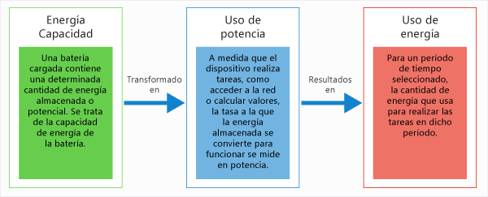
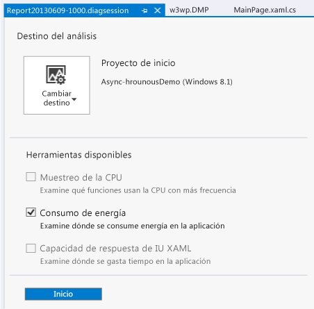
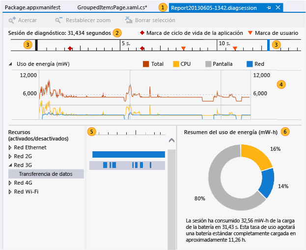
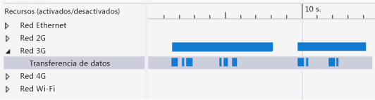
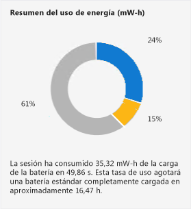

# <a name="analyze-energy-use-in-uwp-apps"></a>Análisis del uso de energía en las aplicaciones para UWP
El generador de perfiles **Consumo de energía** de Visual Studio le ayuda a analizar el consumo de potencia y energía de las aplicaciones para UWP en dispositivos de tableta de bajo consumo que funcionan siempre o al menos parte del tiempo con baterías. En un dispositivo que funciona con baterías, una aplicación que usa demasiada energía puede producir tanta insatisfacción en el cliente que este puede decidir incluso desinstalarla. La optimización del uso de energía puede incrementar la adopción y el uso de la aplicación por parte de los clientes.

## <a name="what-the-energy-consumption-profiler-is-how-it-works-and-what-it-measures"></a>Qué es el generador de perfiles Consumo de energía, cómo funciona y qué mide
 El generador de perfiles Consumo de energía captura las actividades de la pantalla, la CPU y las conexiones de red de un dispositivo durante una sesión de generación de perfiles. Después genera estimaciones de la potencia usada para esas actividades y de la cantidad total de energía para la sesión de generación de perfiles.

> [!NOTE]
> El generador de perfiles de energía calcula el uso de potencia y energía mediante un modelo de hardware de dispositivo de referencia estándar representativo de los dispositivos de tableta de bajo consumo en los que se puede ejecutar la aplicación. Para proporcionar las mejores estimaciones, recomendamos recopilar los datos del perfil en un dispositivo de tableta de bajo consumo.
>
> Aunque el modelo proporciona buenas estimaciones para diversos dispositivos de bajo consumo, los valores reales del dispositivo para el que se genera el perfil probablemente serán diferentes. Use los valores para buscar las actividades de pantalla, la CPU y de red con un consumo elevado de los recursos en relación con otros usos de estos y que, por tanto, puedan ser buenas candidatas para la optimización.

 El generador de perfiles Consumo de energía usa estas definiciones de *potencia* y *energía*:

- *Potencia* mide la velocidad a la que se usa la fuerza para realizar un trabajo que se lleva a cabo en un período de tiempo. En electricidad, la unidad de potencia estándar es un *vatio*, que se define como la velocidad a la que se realiza un trabajo cuando una corriente de un amperio fluye a través de una diferencia de potencial eléctrico de un voltio. En el gráfico **Uso de potencia** , las unidades se muestran en milivatios **mW** , que son la milésima parte de un vatio.

   Tenga en cuenta que, dado que la potencia es una tasa, tiene una dirección (el trabajo puede aumentar o disminuir en un período de tiempo) y una velocidad (la cantidad en la que aumenta o disminuye el trabajo).

- *Energía* mide la cantidad total de potencia, bien como capacidad o como potencial, como en la capacidad de potencia de una batería, o como el total de potencia gastada en un período de tiempo. La unidad de energía es un vatio-hora, la cantidad de potencia de un vatio aplicada constantemente durante una hora. En el **Resumen de uso de energía**, las unidades se muestran en milivatios-hora **mW-h**.

  

  Por ejemplo, una batería totalmente cargada en una tableta gráfica tiene cierta cantidad de energía almacenada. Dado que la energía se usa para realizar tareas, como comunicarse a través de una red, calcular valores o mostrar gráficos, la potencia de la batería se disipa a distintas tasas. En cualquier período de tiempo, el total de potencia consumido también se mide por energía.

## <a name="identify-scenarios-with-user-marks"></a>Identificar escenarios con marcas de usuario
 Puedes agregar *marcas de usuario* a los datos de generación de perfiles para ayudar a identificar áreas en la regla de escala de tiempo.

 

 La marca aparece como un triángulo naranja en la escala de tiempo en el momento de la ejecución del método. El mensaje y el tiempo se muestran como información sobre herramientas al mantener el mouse sobre la marca. Si dos o más marcas de usuario están muy próximas, se combinan dichas marcas y los datos sobre herramientas. Puedes acercar la escala de tiempo para separar las marcas.

 **Agregar marcas a código de C#, Visual Basic y C++**

 Para agregar una marca de usuario a código de C#, Visual Basic o C++, primero cree un objeto <xref:Windows.Foundation.Diagnostics.LoggingChannel?displayProperty=fullName>. Luego inserte llamadas a métodos <xref:Windows.Foundation.Diagnostics.LoggingChannel.LogMessage%2A?displayProperty=nameWithType> en los puntos del código que quiere marcar. Use [LoggingLevel.Information](xref:Windows.Foundation.Diagnostics.LoggingLevel) en las llamadas.

 Al ejecutarse el método, se agrega una marca de usuario a los datos de generación de perfiles junto con un mensaje.

> [!NOTE]
> - Windows.Foundation.Diagnostics LoggingChannel implementa la interfaz [Windows.Foundation.IClosable](/uwp/api/windows.foundation.iclosable) (proyectada como [System.IDisposable](/dotnet/api/system.idisposable) en C# y VB). Para evitar la pérdida de recursos de sistema operativo, llame a [LoggingChannel.Close](/uwp/api/Windows.Foundation.Diagnostics.LoggingChannel) ([Windows.Foundation.Diagnostics.LoggingChannel.Dispose](/uwp/api/Windows.Foundation.Diagnostics.LoggingChannel) en C# y VB) cuando haya finalizado con un canal de registro.
>  - Cada canal de registro abierto debe tener un nombre único. Al intentar crear un nuevo canal de registro con el mismo nombre que un canal no desechado, se produce una excepción.

 Vea el ejemplo [LoggingSession](https://code.msdn.microsoft.com/windowsapps/LoggingSession-Sample-ccd52336) de Windows SDK para obtener otros ejemplos.

 **Agregar marcas a código de JavaScript**

 Para agregar marcas de usuario, agrega el código siguiente en los puntos del código que desees marcar:

```JavaScript
if (performance && performance.mark) {
    performance.mark(markDescription);
}
```

 *markDescription* es una cadena que contiene el mensaje que se va a mostrar en la información sobre herramientas de la marca de usuario.

## <a name="configure-your-environment-for-profiling"></a>Configurar el entorno para la generación de perfiles
 Para obtener buenas estimaciones, deberá generar un perfil de uso de energía para la aplicación en un dispositivo de bajo consumo que esté funcionando con baterías. Dado que Visual Studio no se ejecuta en la mayoría de estos dispositivos, deberá conectar su equipo de Visual Studio al dispositivo usando las Herramientas remotas para Visual Studio. Para conectarte con un dispositivo remoto, debes configurar tanto el proyecto de Visual Studio como el dispositivo remoto. Vea [Ejecución de aplicaciones para UWP en un equipo remoto](../debugger/run-windows-store-apps-on-a-remote-machine.md) para más información.

> [!TIP]
> - No se recomienda la generación de perfiles de energía en el simulador de UWP ni en el equipo de Visual Studio. La generación de perfiles en el dispositivo real proporciona datos mucho más realistas.
>   -   Genere el perfil en el dispositivo de destino mientras esté funcionando con baterías.
>   -   Cierre otras aplicaciones que puedan usar los mismos recursos (red, CPU o pantalla).

## <a name="collect-energy-profile-data-for-your-app"></a>Recopilar datos del perfil de energía para la aplicación

1.  En el menú **Depurar** , elija **Iniciar diagnóstico sin depurar**.

     

2.  Elija **Consumo de energía** y, a continuación, **Iniciar**.

    > [!NOTE]
    >  Al iniciar el generador de perfiles **Consumo de energía**, es posible que vea una ventana **Control de cuentas de usuario** que solicite su permiso para ejecutar *VsEtwCollector.exe*. Elija **Sí**.

3.  Ejecute la aplicación para recopilar datos.

4.  Para detener la generación de perfiles, vuelve a Visual Studio (Alt + Tab) y elige **Detener colección** en la página del concentrador de diagnósticos.

     

     Visual Studio analiza los datos recopilados y muestra los resultados.

## <a name="collect-energy-profile-data-for-an-installed-app"></a>Recopilar datos del perfil de energía para una aplicación instalada
 La herramienta Consumo de energía solo puede ejecutarse en aplicaciones UWP que se inicien desde una solución de Visual Studio o se instalen desde Microsoft Store. Cuando una solución se abre en Visual Studio, el destino predeterminado es el **Proyecto de inicio**. Para establecer el destino de una aplicación instalada:

1. Elija **Cambiar destino** y, a continuación, **Aplicación instalada**.

2. En la lista **Seleccionar paquete de aplicaciones instalado** , elija el destino.

3. Elija **Consumo de energía** en la página del concentrador de diagnósticos.

4. Elija **Iniciar** para dar comienzo a la generación de perfiles.

   Para detener la generación de perfiles, vuelve a Visual Studio (Alt + Tab) y elige **Detener colección** en la página del concentrador de diagnósticos.

## <a name="analyze-energy-profile-data"></a>Analizar datos de perfil de energía
 Los datos de perfil de energía se muestran en la ventana de documento de Visual Studio:

 

|||
|-|-|
||El archivo de informe se denomina Report*YYYYMMDD-HHMM*.diagsession. Puedes cambiar el nombre si decides guardarlo.|
||La escala de tiempo muestra la longitud de la sesión de generación de perfiles, los eventos de activación del ciclo de vida de la aplicación y las marcas de usuario.|
||Puedes restringir el informe a una parte de la escala de tiempo arrastrando las barras azules para seleccionar una región de esta.|
||El gráfico **Uso de potencia** es un gráfico de varias líneas que muestra los cambios producidos en la potencia de salida por un recurso de dispositivo durante una sesión de generación de perfiles. El generador de perfiles Consumo de energía hace un seguimiento de la potencia utilizada por la CPU, la actividad de red y la presentación en pantalla.|
||El gráfico **Recursos (activados/desactivados)**  proporciona detalles sobre los costos energéticos de red. La barra **Red** representa el tiempo que estuvo abierta la conexión de red. La barra secundaria **Transferencia de datos** es el tiempo que la aplicación estuvo recibiendo o enviando datos a través de la red.|
||El **Resumen de uso de energía** muestra la cantidad proporcional de la energía total utilizada en la escala de tiempo seleccionada por la CPU, la actividad de red y la presentación en pantalla.|

 **Para analizar los datos de perfil de energía**

 Busca un área donde la potencia del recurso presente un pico de actividad. Establezca una relación entre el área del pico con la funcionalidad de la aplicación. A continuación, use las barras de control de la escala de tiempo para acercarse a dicha área. Si deseas centrarte en el uso de la red, expande el nodo **Red** del gráfico **Recursos (activados/desactivados)**  para comparar el tiempo que estuvo abierta la conexión de red con el tiempo que la aplicación estuvo recibiendo o transfiriendo datos en la conexión. Reducir el tiempo que la red está abierta innecesariamente es un método de optimización muy eficaz.

## <a name="optimize-energy-use"></a>Optimizar el uso de energía
 Además de transmitir datos, las conexiones de red incurren en ciertos costos de energía para inicializar, mantener y cerrar la conexión. Algunas redes mantienen la conexión durante un período de tiempo después de que los datos se hayan enviado o recibido para permitir que se transmitan más datos en una única conexión. Puedes utilizar el panel **Recursos (activados/desactivados)** para examinar la manera en que la aplicación interactúa con la conexión.

 

 Si las barras **Red** y **Transferencia de datos** muestran que la conexión está abierta durante largos períodos para transmitir intermitentemente una serie de pequeños paquetes de datos, puedes procesar por lotes los datos para enviarlos en una transmisión, reduciendo así el tiempo que la red está abierta y los costos energéticos.

 

 Sin embargo, tienes menos control sobre los costos de energía de la pantalla. La mayoría de las pantallas requieren más energía para mostrar colores claros que colores más oscuros, por lo que usar un fondo oscuro es una manera de reducir costos.

## <a name="other-resources"></a>Otros recursos

-   Las secciones de **estado de la conexión y administración de los costos** para [C#/VB/C++ y XAML](/previous-versions/windows/apps/hh452985\(v\=win.10\)) y [JavaScript y HTML](https://msdn.microsoft.com/372afa6a-1c7c-4657-967d-03a77cd8e933) en el Centro de desarrollo de Windows describen las API de Windows que proporcionan información sobre la conectividad de red que puede usar su aplicación para minimizar el costo del tráfico de red.

     El simulador de Visual Studio para aplicaciones para UWP permite simular las propiedades de la conexión de datos de las API de información de red. Vea [Ejecución de aplicaciones para UWP en el simulador](../debugger/run-windows-store-apps-in-the-simulator.md)

-   Las herramientas **Control de tiempo de función de JavaScript** y **Uso de CPU** pueden ayudarle a reducir la carga de la CPU siempre que esté causada por funciones ineficaces Vea [Analizar el uso de CPU](/visualstudio/profiling/beginners-guide-to-performance-profiling).

## <a name="see-also"></a>Vea también

- [Generación de perfiles en Visual Studio](../profiling/index.md)
- [Primer vistazo a la generación de perfiles](../profiling/profiling-feature-tour.md)