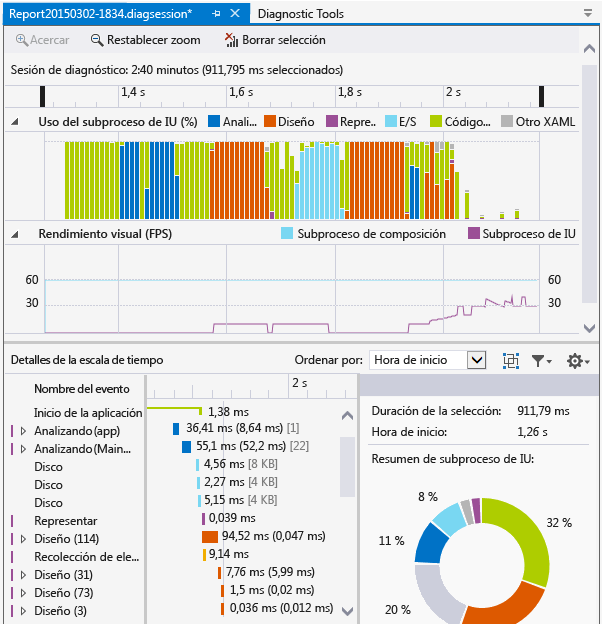
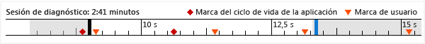
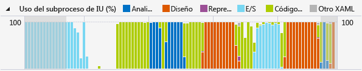
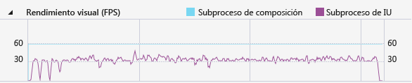

# Análisis del consumo de recursos y la actividad del subproceso de interfaz de usuario (XAML)
Use la **escala de tiempo de aplicación** del generador de perfiles para buscar y corregir en aplicaciones XAML los problemas de rendimiento relacionados con la interacción. Esta herramienta le ayuda a mejorar el rendimiento de las aplicaciones XAML proporcionando una vista detallada del consumo de recursos de las aplicaciones. Puede analizar el tiempo consumido por la aplicación en la preparación de marcos de la interfaz de usuario (diseño y presentación), la atención de solicitudes de red y de disco y escenarios tales como el inicio de la aplicación, la carga de la página y el cambio de tamaño de las ventanas.  
  
 **Escala de tiempo de aplicación** es una de las herramientas que puede iniciar con el comando **Depurar** > **Generador de perfiles de rendimiento**.  
  
 Esta herramienta reemplaza a **Capacidad de respuesta de la IU de XAML** , que formaba parte del conjunto de herramientas de diagnóstico de Visual Studio 2013.  
  
 Puede utilizar esta herramienta en las siguientes plataformas:  
  
1.  Aplicaciones Windows universales (en Windows 10)  
  
2.  Windows 8.1  
  
4.  Windows Presentation Foundation (.NET 4.0 y posterior)  
  
5.  Windows 7  
  
> [!NOTE]
>  Puede recopilar y analizar datos de uso de CPU y de consumo de energía junto con los datos de la **Escala de tiempo de aplicación** . Vea [Ejecutar herramientas de generación de perfiles con o sin el depurador](../profiling/running-profiling-tools-with-or-without-the-debugger.md).
  
## Recopilar datos de la escala de tiempo de aplicación  
 Puede generar perfiles de capacidad de respuesta de la aplicación en su máquina local, en un dispositivo conectado, en un simulador o emulador de Visual Studio o un dispositivo remoto. Vea [Ejecutar herramientas de generación de perfiles con o sin el depurador](../profiling/running-profiling-tools-with-or-without-the-debugger.md).
  
> [!TIP]
>  Si es posible, ejecute la aplicación directamente en el dispositivo. El rendimiento de la aplicación observado en el simulador o a través de una conexión a escritorio remoto puede no ser igual al rendimiento real en el dispositivo. Por otro lado, la recopilación de datos mediante el uso de Herramientas remotas para Visual Studio no afecta a los datos de rendimiento.  
  
 Estos son los pasos básicos:  
  
1.  Abra la aplicación XAML.  
  
2.  Haga clic en **Depurar / Generador de perfiles de rendimiento**. Debería ver una lista de herramientas de generación de perfiles en la ventana .diagsession.  
  
3.  Seleccione **Escala de tiempo de aplicación** y luego haga clic en **Iniciar** en la parte inferior de la ventana.  
  
    > [!NOTE]
    >  Es posible que vea una ventana Control de cuentas de usuario en la que se le solicita permiso para ejecutar *VsEtwCollector.exe*. Haga clic en **Sí**.  
  
4.  Ejecute el escenario del que quiera generar un perfil en su aplicación para recopilar datos de rendimiento.  
  
5.  Para detener la generación de perfiles, vuelva a la ventana .diagsession y haga clic en **Detener** en la parte superior.  
  
     Visual Studio analiza los datos recopilados y muestra los resultados.  
  
       
  
## Analizar datos de generación de perfiles de escala de tiempo  
 Después de obtener los datos de la generación de perfiles, puede seguir estos pasos para iniciar el análisis:  
  
1.  Examine la información de los gráficos **Utilización del subproceso de IU** y **Rendimiento visual (FPS)** y, a continuación, use las barras de navegación de la escala de tiempo para seleccionar el intervalo de tiempo que desea analizar.  
  
2.  Con la información de los gráficos **Utilización del subproceso de IU** o **Rendimiento visual (FPS)** , examine los detalles de la vista **Detalles de la escala de tiempo** para detectar las posibles causas de cualquier falta de capacidad de respuesta.  
  
###   Informes de escenarios, categorías y eventos  
 La herramienta **Escala de tiempo de aplicación** muestra datos de tiempo para escenarios, categorías y eventos relacionados con el rendimiento de XAML.  
  
###   Escala de tiempo de la sesión de diagnóstico  
   
  
 La regla que aparece en la parte superior de la página muestra la escala de tiempo para la información cuyo perfil se ha generado. Esta escala de tiempo se aplica a los gráficos **Utilización del subproceso de IU** y **Rendimiento visual** . Puedes restringir el ámbito del informe arrastrando las barras de navegación en la escala de tiempo para seleccionar un segmento de esta.  
  
 La escala de tiempo también muestra cualquier marca de usuario que haya insertado, así como los eventos del ciclo de vida de activación de la aplicación.  
  
###   Gráfico de utilización del subproceso de IU  
   
  
 El gráfico **Utilización del subproceso de UI (%)** es un gráfico de barras que muestra la cantidad relativa de tiempo empleado en una categoría durante un intervalo de la colección.  
  
###   Gráfico de rendimiento visual (FPS)  
   
  
 El gráfico de líneas **Rendimiento visual (FPS)** muestra los fotogramas por segundo (FPS) en el subproceso de interfaz de usuario y de composición de la aplicación.  
  
###   Detalles de la escala de tiempo  
 En la vista de detalles es donde pasará la mayor parte del tiempo analizando el informe. Muestra una vista detallada del uso de CPU de la aplicación en dos categorías, el subsistema Marco de trabajo de la interfaz de usuario y el componente del sistema que consumía la CPU.  
  
 Se admiten los siguientes eventos:  
  
|||  
|-|-|  
|**Análisis**|Tiempo invertido en analizar archivos XAML y crear objetos.   Si se expande un nodo **Análisis** en **Detalles de la escala de tiempo** , se muestra la cadena de dependencia de todos los archivos XAML que se han analizado como resultado del evento de raíz. Esto le permitirá identificar análisis de archivos y creación de objetos innecesarios en escenarios sensibles al rendimiento y optimizarlos.|  
|**Diseño**|En aplicaciones grandes, pueden mostrarse miles de elementos en la pantalla al mismo tiempo. Esto podría producir una baja tasa de imágenes por segundo en la interfaz y, por tanto, una mala capacidad de respuesta de la aplicación. El evento de diseño determina con precisión el costo de implementar estos elementos (es decir, el tiempo empleado en Arrange, Measure, ApplyTemplate y ArrangeOverride) y genera los árboles visuales que participaron en una fase de Diseño. Puede usar esta visualización para determinar qué árboles lógicos debe eliminar o para evaluar otros mecanismos de aplazamiento que optimicen la fase de diseño.|  
|**Representar**|Tiempo invertido en representar elementos XAML en la pantalla.|  
|**E/S**|Tiempo invertido en recuperar datos desde el disco local o desde recursos de red a los que se tiene acceso mediante la API [Microsoft Windows Internet (WinINet)](https://msdn.microsoft.com/en-us/library/windows/desktop/aa385331.aspx).|  
|**Código de aplicación**|Tiempo invertido en la ejecución de código (de usuario) de la aplicación no relacionado con el análisis ni el diseño.|  
|**Otro XAML**|Tiempo invertido en ejecutar código en tiempo de ejecución XAML.|  
  
> [!TIP]
>  Elija la herramienta **Uso de CPU** junto con la herramienta **Escala de tiempo de aplicación** al comenzar a generar perfiles para ver los métodos de aplicación que se ejecutan en el subproceso de UI. Mover el código de la aplicación de larga duración a un subproceso en segundo plano puede mejorar la capacidad de respuesta de la UI.  
  
####   Personalizar detalles de escala de tiempo  
 Utilice la barra de herramientas **Detalles de la escala de tiempo** para ordenar, filtrar y especificar las anotaciones de las entradas de la vista **Detalles de la escala de tiempo** .  
  
|||  
|-|-|  
|**Ordenar por**|Ordenar por hora de inicio o longitud de los eventos.|  
||Agrega o quita una categoría **Marco** de nivel superior que agrupa eventos por marco.|  
||Filtra la lista por categorías seleccionadas y la longitud de los eventos.|  
||Permite especificar las anotaciones de eventos.|  
  
## Vea también  
 [WPF Team Blog: New UI Performance Analysis Tool for WPF Applications (Blog del equipo de WPF: Nueva herramienta de análisis de rendimiento de interfaz de usuario para aplicaciones de WPF)](http://blogs.msdn.com/b/wpf/archive/2015/01/16/new-ui-performance-analysis-tool-for-wpf-applications.aspx)  
 [Procedimientos recomendados de rendimiento para aplicaciones para UWP con C++, C# y Visual Basic](http://msdn.microsoft.com/en-us/567bcefa-5da5-4e42-a4b8-1358c71adfa2)   
 [Optimizar el rendimiento de las aplicaciones WPF](/dotnet/framework/wpf/advanced/optimizing-wpf-application-performance)  
 [Generación de perfiles en Visual Studio](../profiling/index.md)  
 [Primer vistazo a la generación de perfiles](../profiling/profiling-feature-tour.md)
