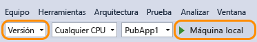

# Analizar el uso de CPU
Si necesita investigar problemas de rendimiento de la aplicación, un buen punto de partida es entender cómo utiliza la CPU. La herramienta **Uso de CPU** muestra el punto en que la CPU dedica tiempo a ejecutar el código Visual C++, Visual C#/Visual Basic y JavaScript. A partir de Visual Studio 2015 Update 1, puede ver un desglose por función del uso de CPU sin salir del depurador. Puede activar y desactivar la generación de perfiles de CPU durante la depuración y ver los resultados cuando se detiene la ejecución, por ejemplo, en un punto de interrupción.  
  
Tiene varias opciones para ejecutar y administrar la sesión de diagnóstico. Por ejemplo, puede ejecutar la herramienta **Uso de CPU** en equipos locales o remotos o en un simulador o emulador. Puede analizar el rendimiento de un proyecto abierto en Visual Studio, conectado a una aplicación en ejecución, o iniciar una aplicación que se instala desde Microsoft Store. Para obtener más información, vea [Ejecutar herramientas de generación de perfiles con o sin el depurador](../profiling/running-profiling-tools-with-or-without-the-debugger.md). 

Aquí le mostramos cómo recopilar y analizar el uso de CPU con compilaciones de versión. Para analizar el uso de CPU durante la depuración, vea [Guía básica para la generación de perfiles de rendimiento](../profiling/beginners-guide-to-performance-profiling.md).

Se requiere Windows 7 o una versión posterior para usar la herramienta de generación de perfiles que se muestra en este artículo, que es [Generador de perfiles de rendimiento](../profiling/profiling-feature-tour.md).
  
##  Recopilar datos de Uso de CPU  
  
1. En Visual Studio, establezca la configuración de soluciones en **Versión** y elija el destino de implementación.  
  
      
  
   -   Ejecutar la aplicación en el modo **Versión** ofrece una mejor perspectiva del rendimiento real de la aplicación.  
  
   -   Ejecutar la aplicación en el equipo local replica la ejecución de la aplicación instalada de la mejor forma posible.  
  
   -   Si va a recopilar datos de un dispositivo remoto, ejecute la aplicación directamente en el dispositivo y no mediante una Conexión a Escritorio remoto.  
  
   -   Para las aplicaciones de Windows Phone, recopilar datos directamente desde el **Dispositivo** permite obtener los datos más precisos.  
  
2. En el menú **Depurar**, elija **Generador de perfiles de rendimiento**.  
  
3. Elija **Uso de CPU** y luego elija **Iniciar**.  
  
      
  
4. Cuando se inicie la aplicación, haga clic en **Obtener número máximo**. Espere aproximadamente un segundo después de que se muestre el resultado y elija **Obtener async del número máximo**. Esperar entre los clics de botón hace que resulte más fácil aislar las rutinas de clic de botón en el informe de diagnóstico.  
  
5. Cuando aparezca la segunda línea de resultados, elija **Detener recolección** en el hub Rendimiento y diagnósticos.  
  
     
  
   La herramienta Uso de CPU analiza y muestra el informe.  
  
     
  
## Analizar el informe de Uso de CPU  
  
###   Árbol de llamadas de Uso de CPU  
 Para comenzar a comprender la información del árbol de llamadas, vuelva a seleccionar el segmento `GetMaxNumberButton_Click` y vea los detalles del árbol de llamadas.  
  
####   Estructura del árbol de llamadas  
   
  
|||  
|-|-|  
||El nodo de nivel superior de los árboles de llamadas de Uso de CPU es un pseudonodo|  
||En la mayoría de las aplicaciones, si la opción **Mostrar código externo** está deshabilitada, el nodo de segundo nivel es un nodo **[Código externo]** que contiene el código del sistema y Framework que inicia y detiene la aplicación, dibuja la IU, controla la programación de subprocesos y ofrece otros servicios de bajo nivel a la aplicación.|  
||Los elementos secundarios del nodo de segundo nivel son los métodos de código de usuario y las rutinas asíncronas llamados o creados por el sistema de segundo nivel y el código de Framework.|  
||Los nodos secundarios de un método contienen datos únicamente de las llamadas del método principal. Cuando está deshabilitada la opción **Mostrar código externo** , los métodos de aplicación también pueden contener un nodo **[Código externo]** .|  
  
####   Código externo  
 El código externo son funciones de los componentes del sistema y del marco que son ejecutadas por el código que escribe. El código externo incluye funciones que inician y detienen la aplicación, dibujan la UI, controlan los subprocesos y proporcionan otros servicios de bajo nivel a la aplicación. En la mayoría de los casos, no le interesará el código externo, por lo que el árbol de llamadas de Uso de CPU reúne las funciones externas de un método de usuario en un nodo **[Código externo]**.  
  
 Si quiere ver las rutas de acceso a las llamadas de código externo, elija **Mostrar código externo** en la lista **Vista de filtro** y luego **Aplicar**.  
  
   
  
 Tenga en cuenta que muchas cadenas de llamadas de código externo están profundamente anidadas, así que el ancho de la columna Nombre de la función puede superar el ancho de pantalla de todos los monitores, excepto de los más grandes. Si ese es el caso, los nombres de función se muestran como **[…]**:  
  
   
  
 Use el cuadro de búsqueda para localizar un nodo que esté buscando y luego use la barra de desplazamiento horizontal para visualizar los datos:  
  
   
  
###   Columnas de datos del árbol de llamadas  
  
|||  
|-|-|  
|**CPU total (%)**|   El porcentaje de actividad de la CPU de la aplicación en el intervalo de tiempo seleccionado que usaron las llamadas a la función y las funciones llamadas por la función. Tenga en cuenta que esto no es lo mismo que el gráfico de línea cronológica **Utilización de CPU** , que compara la actividad total de la aplicación en un intervalo de tiempo con la capacidad total de CPU disponible.|  
|**Solo CPU (%)**|   El porcentaje de actividad de la CPU de la aplicación en el intervalo de tiempo seleccionado que usaron las llamadas a la función, excluidas la actividad de las funciones llamadas por la función.|  
|**CPU total (ms)**|El número de milisegundos empleado en llamadas a la función en el intervalo de tiempo seleccionado y las funciones que fueron llamadas por la función.|  
|**Propia CPU (ms)**|El número de milisegundos empleado en llamadas a la función en el intervalo de tiempo seleccionado y las funciones que fueron llamadas por la función, excluida la actividad de las funciones llamadas por la función.|  
|**Módulo**|El nombre del módulo que contiene la función o el número de módulos que contienen las funciones en un nodo [Código externo].|  
  
###   Funciones asincrónicas en el árbol de llamadas de Uso de CPU  
 Cuando el compilador encuentra un método asincrónico, crea una clase oculta para controlar la ejecución del método. Conceptualmente, la clase es una máquina de estados que incluye una lista de funciones generadas por el compilador que llaman a operaciones del método original de forma asincrónica, así como las devoluciones de llamadas, el programador y los iteradores necesarios para que se ejecuten correctamente. Cuando un método principal llama al método original, el tiempo de ejecución quita al método del contexto de ejecución del elemento principal y ejecuta los métodos de la clase oculta en el contexto del código del sistema y Framework que controla la ejecución de la aplicación. A menudo, aunque no siempre, los métodos asincrónicos se ejecutan en uno o varios subprocesos diferentes. Este código se muestra en el árbol de llamadas de Uso de CPU como elementos secundarios del nodo **[Código externo]** que se encuentra justo debajo del nodo superior del árbol.  
  
 Para verlo en el ejemplo, vuelva a seleccionar el segmento `GetMaxNumberAsyncButton_Click` en la escala de tiempo.  
  
   
  
 Los dos primeros nodos bajo **[Código externo]** son los métodos generados por el compilador de la clase de la máquina de estados. El tercero es la llamada al método original. Al expandir los métodos generados se muestra lo que está sucediendo.  
  
   
  
-   `MainPage::GetMaxNumberAsyncButton_Click` hace poca cosa; administra una lista de valores de la tarea, calcula el valor máximo de los resultados y muestra el resultado.  
  
-   `MainPage+<GetMaxNumberAsyncButton_Click>d__3::MoveNext` muestra la actividad necesaria para programar e iniciar las 48 tareas que incluyen la llamada en `GetNumberAsync`.  
  
-   `MainPage::<GetNumberAsync>b__b` muestra la actividad de las tareas que llaman a `GetNumber`.
