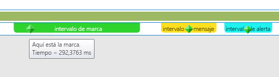
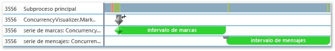
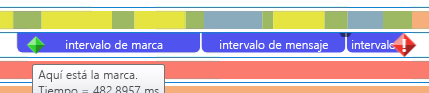
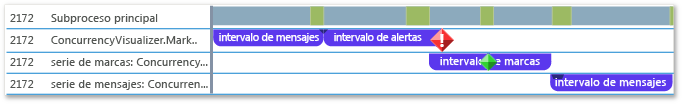

# <a name="how-to-use-the-concurrency-visualizer-markers-sdk"></a>Cómo: Usar el SDK de marcadores del visualizador de concurrencia
Este tema muestra cómo usar el SDK del visualizador de simultaneidad para crear intervalos y escribir marcas, mensajes y alertas.  
  
### <a name="to-use-c"></a>Para usar C++  
  
1.  Agregue compatibilidad con el SDK del visualizador de simultaneidad a la aplicación. Para obtener más información, consulte [SDK del visualizador de simultaneidad](../profiling/concurrency-visualizer-sdk.md).  
  
2.  Agregue una instrucción `include` y una instrucción `using` para el SDK.  
  
    ```C++  
  
    #include <cvmarkersobj.h>  
    using namespace Concurrency::diagnostic;  
  
    ```  
  
3.  Agregue código para crear tres intervalos en la serie del marcador predeterminado y escriba una marca, un mensaje y una alerta para cada intervalo. Los métodos para escribir marcas, mensajes y alertas son miembros de la clase [marker_series](../profiling/marker-series-class.md). El constructor para la clase [span](../profiling/span-class.md) requiere un objeto `marker_series`, para que cada intervalo esté asociado a una serie de marcadores específica. Un `span` finaliza cuando se elimina.  
  
    ```C++  
  
    marker_series series;  
    span *flagSpan = new span(series, 1, _T("flag span"));  
    series.write_flag(_T("Here is the flag."));  
    delete flagSpan;  
  
    span *messageSpan = new span(series, 2, _T("message span"));  
    series.write_flag(_T("Here is the message."));  
    delete messageSpan;  
  
    span *alertSpan = new span(series, 3, _T("alert span"));  
    series.write_flag(_T("Here is the alert."));  
    delete alertSpan;  
  
    ```  
  
4.  En la barra de menús, elija **Analizar**, **Visualizador de simultaneidad**, **Comenzar con el proyecto actual** para ejecutar la aplicación y mostrar el visualizador de simultaneidad. La siguiente ilustración muestra los tres intervalos y tres marcadores en el visualizador de simultaneidad.  
  
       
  
5.  Agregue código para crear series de marcadores personalizadas adicionales llamando al constructor de `marker_series` que toma un nombre de cadena para la serie de marcadores.  
  
    ```C++  
  
    marker_series flagSeries(_T("flag series"));  
    span *flagSeriesSpan = new span(flagSeries, 1, _T("flag span"));  
    flagSeries.write_flag(1, _T("flag"));  
    // Sleep to even out the display in the Concurrency Visualizer.  
    Sleep(50);  
    delete flagSeriesSpan;  
  
    marker_series messageSeries(_T("message series"));  
    span *messageSeriesSpan = new span(messageSeries, 1, _T("message span"));  
    messageSeries.write_message(1, _T("message"));  
    // Sleep to even out the display in the Concurrency Visualizer.  
    Sleep(50);  
    delete messageSeriesSpan;  
  
    ```  
  
6.  Inicie el proyecto actual para mostrar el visualizador de simultaneidad. La serie de dos marcadores aparece en sus propios canales en la vista Subprocesos. En la siguiente ilustración se muestran dos nuevos intervalos.  
  
       
  
### <a name="to-use-visual-basic-or-c"></a>Para usar Visual Basic o C# #
  
1.  Agregue compatibilidad con el SDK del visualizador de simultaneidad a la aplicación. Para obtener más información, consulte [SDK del visualizador de simultaneidad](../profiling/concurrency-visualizer-sdk.md).  
  
2.  Agregue una instrucción `using` o `Imports` para el SDK.  
  
    ```VB  
    Imports Microsoft.ConcurrencyVisualizer.Instrumentation  
  
    ```  
  
    ```CSharp  
    using Microsoft.ConcurrencyVisualizer.Instrumentation;  
    ```  
  
3.  Agregue código para crear tres intervalos en la serie de marcadores predeterminada y escriba una marca, un mensaje y una alerta para cada intervalo. Cree un objeto <xref:Microsoft.ConcurrencyVisualizer.Instrumentation.Span> llamando al método estático `EnterSpan`. Para escribir en la serie predeterminada, use los métodos de escritura estáticos de la clase <xref:Microsoft.ConcurrencyVisualizer.Instrumentation.Markers>.  
  
    ```VB  
  
    Dim flagSpan As Span = Markers.EnterSpan("flag span")  
    Markers.WriteFlag("Here is the flag.")  
    flagSpan.Leave()  
  
    Dim messageSpan As Span = Markers.EnterSpan("message span")  
    ' Sleep for a millisecond to even out the display in the Concurrency Visualizer.  
    System.Threading.Thread.Sleep(1)  
    Markers.WriteMessage("Here is a message")  
    messageSpan.Leave()  
  
    Dim alertSpan As Span = Markers.EnterSpan("alert span")  
    ' Sleep for a millisecond to even out the display in the Concurrency Visualizer.  
    System.Threading.Thread.Sleep(1)  
    Markers.WriteAlert("Here is an alert")  
    alertSpan.Leave()  
  
    ```  
  
    ```CSharp  
  
    Span flagSpan = Markers.EnterSpan("flag span");  
    Markers.WriteFlag("Here is the flag.");  
    flagSpan.Leave();  
  
    Span messageSpan = Markers.EnterSpan("message span");  
    // Sleep for a millisecond to even out the display in the Concurrency Visualizer.  
    System.Threading.Thread.Sleep(1);  
    Markers.WriteMessage("Here is a message");  
    messageSpan.Leave();  
  
    Span alertSpan = Markers.EnterSpan("alert span");  
    // Sleep for a millisecond to even out the display in the Concurrency Visualizer.  
    System.Threading.Thread.Sleep(1);  
    Markers.WriteAlert("Here is an alert");  
    alertSpan.Leave();  
    ```  
  
4.  En la barra de menús, elija **Analizar**, **Visualizador de simultaneidad**, **Comenzar con el proyecto actual** para ejecutar la aplicación y mostrar el visualizador de simultaneidad. La siguiente ilustración muestra los tres intervalos y tres marcadores de la vista Subprocesos del Visualizador de simultaneidad.  
  
       
  
5.  Agregue código para crear series de marcadores de cliente con el método <xref:Microsoft.ConcurrencyVisualizer.Instrumentation.Markers.CreateMarkerSeries%2A> estático. La clase <xref:Microsoft.ConcurrencyVisualizer.Instrumentation.MarkerSeries> contiene métodos para crear intervalos y escribir marcas, mensajes y alertas.  
  
    ```VB  
  
    Dim flagSeries As MarkerSeries = Markers.DefaultWriter.CreateMarkerSeries("flag series")  
    Dim flagSeriesSpan As Span = flagSeries.EnterSpan("flag span")  
    System.Threading.Thread.Sleep(1)  
    flagSeries.WriteFlag(1, "flag")  
    System.Threading.Thread.Sleep(1)  
    flagSeriesSpan.Leave()  
  
    Dim messageSeries As MarkerSeries = Markers.DefaultWriter.CreateMarkerSeries("message series")  
    Dim messageSeriesSpan As Span = messageSeries.EnterSpan("message span")  
    messageSeries.WriteMessage("message")  
    System.Threading.Thread.Sleep(1)  
    messageSeriesSpan.Leave()  
    ```  
  
    ```CSharp  
  
    MarkerSeries flagSeries = Markers.DefaultWriter.CreateMarkerSeries("flag series");  
    Span flagSeriesSpan = flagSeries.EnterSpan("flag span");  
    System.Threading.Thread.Sleep(1);  
    flagSeries.WriteFlag(1, "flag");  
    System.Threading.Thread.Sleep(1);  
    flagSeriesSpan.Leave();  
  
    MarkerSeries messageSeries = Markers.DefaultWriter.CreateMarkerSeries("message series");  
    Span messageSeriesSpan = messageSeries.EnterSpan("message span");  
    messageSeries.WriteMessage("message");  
    System.Threading.Thread.Sleep(1);  
    messageSeriesSpan.Leave();  
    ```  
  
6.  Inicie el proyecto actual para mostrar el visualizador de simultaneidad. Las tres series de marcadores aparecen en sus propios canales en la vista Subprocesos. En la siguiente ilustración se muestran tres nuevos intervalos.  
  
       
  
## <a name="see-also"></a>Vea también  
 [SDK del visualizador de simultaneidad](../profiling/concurrency-visualizer-sdk.md)
