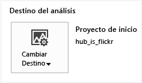
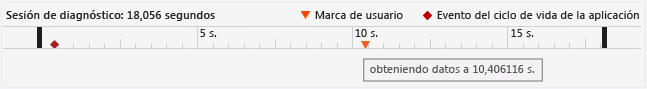
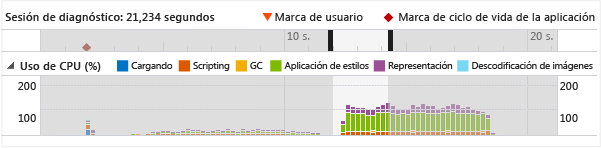
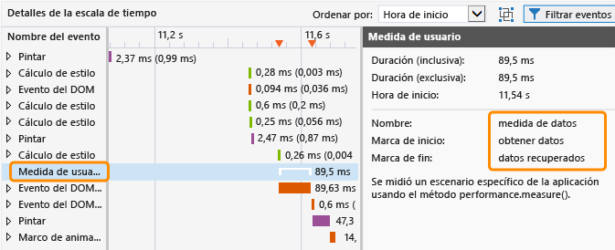
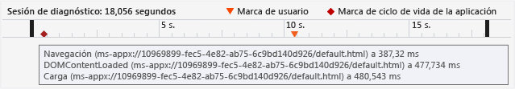
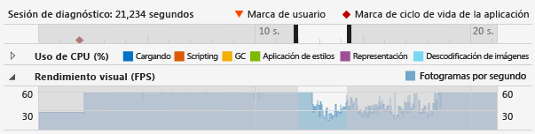
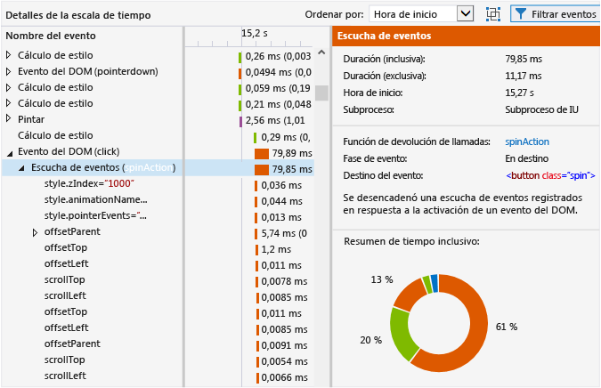
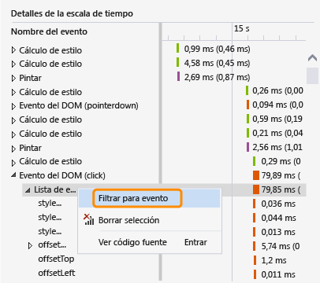
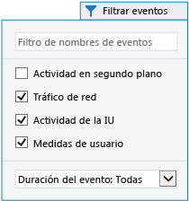
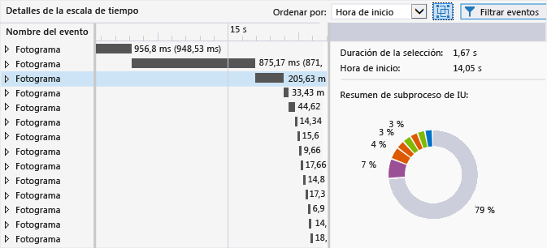

# <a name="analyze-html-ui-responsiveness-in-universal-windows-apps"></a>Análisis de la capacidad de respuesta de la IU HTML en aplicaciones de UWP
En este tema se describe cómo aislar los problemas de rendimiento en las aplicaciones mediante el generador de perfiles de la capacidad de respuesta de la interfaz de usuario, una herramienta de rendimiento disponible para las aplicaciones universales de Windows.  
  
 El generador de perfiles de la capacidad de respuesta de la IU puede ayudarle a aislar los problemas, como los relacionados con la respuesta de la IU, o los efectos secundarios de la plataforma que aparecen normalmente con estos síntomas:  
  
-   Falta de capacidad de respuesta en la interfaz de usuario. Es posible que la aplicación tarde en responder si se está bloqueando el subproceso de interfaz de usuario. Este bloqueo puede estar producido por un exceso de código JavaScript sincrónico, un trabajo de cálculo o presentación de CSS excesivo, las solicitudes XHR sincrónicas, la recolección de elementos no utilizados, unos tiempos de pintura excesivos o código JavaScript que realiza un uso intensivo del procesador, entre otros.  
  
-   Tiempo de carga lento de la aplicación o de una página. Esto suele deberse a que se emplea demasiado tiempo en cargar los recursos.  
  
-   Las actualizaciones visuales son menos frecuentes de lo esperado. Esto ocurre si el subproceso de interfaz de usuario está demasiado ocupado para mantener una velocidad de fotogramas suave. Por ejemplo, si el subproceso de interfaz de usuario está ocupado, es posible que se pierdan fotogramas. Ciertos trabajos no relacionados con el subproceso de interfaz de usuario, como las solicitudes de red, la descodificación de imágenes y las operaciones de pintura, también pueden limitar la frecuencia de las actualizaciones visuales. (No todas las operaciones de pintura se realizan en el subproceso de interfaz de usuario).  
  
##  <a name="RunningProfiler"></a> Ejecutar la herramienta de capacidad de respuesta de la interfaz de usuario HTML  
 Puede usar la herramienta Capacidad de respuesta de la IU de HTML si tiene una aplicación para UWP o de Windows 8.1 abierta en Visual Studio o instalada en un equipo que ejecuta Windows 8 o una versión posterior.  
  
1.  Si estás ejecutando la aplicación desde Visual Studio, en la barra de herramientas **Estándar** , en la lista **Iniciar depuración** , elige un destino de implementación, como uno de los emuladores de Windows Phone, **Equipo local**, **Simulador**o **Equipo remoto**.  
  
2.  En el menú **Depurar** , elija **Performance Profiler...**(Generador de perfiles de rendimiento...).  
  
     Si quiere cambiar el destino del análisis del generador de perfiles, elija**Cambiar destino**.  
  
       
  
     Tienes las siguientes opciones disponibles para el destino de análisis:  
  
    -   **Proyecto de inicio**. Elige esta opción para analizar el proyecto de inicio actual. Si estás ejecutando la aplicación en un equipo o dispositivo remoto, tienes que usar esta opción, que es el valor predeterminado.  
  
    -   **Aplicación en ejecución**. Elija esta opción para seleccionar una aplicación para UWP en una lista de aplicaciones en ejecución. No puedes utilizar esta opción si estás ejecutando la aplicación en un equipo o dispositivo remoto.  
  
         Puedes usar esta opción para analizar el rendimiento de las aplicaciones que se ejecutan en el equipo cuando no tienes acceso al código fuente.  
  
    -   **Aplicación instalada**. Elige esta opción para seleccionar una aplicación instalada que quieras analizar. No puedes utilizar esta opción si estás ejecutando la aplicación en un equipo o dispositivo remoto.  
  
         Puedes usar esta opción para analizar el rendimiento de las aplicaciones que has instalado en el equipo cuando no tienes acceso al código fuente. Esta opción también es útil cuando solo deseas analizar el rendimiento de cualquier aplicación que no forma parte de tu trabajo de desarrollo de aplicaciones.  
  
3.  En **Herramientas disponibles**, selecciona **Capacidad de respuesta de la IU de HTML**y elige **Iniciar**.  
  
4.  Al iniciar el generador de perfiles de la capacidad de respuesta de la IU, puede aparecer una ventana de Control de cuentas de usuario que solicite tu permiso para ejecutar Visual Studio ETW Collector.exe. Elija **Sí**.  
  
     Interactúa con la aplicación para probar el escenario de rendimiento pertinente. Para obtener un flujo de trabajo detallado, consulte [Aislar un problema de capacidad de respuesta de la IU](#Workflow) y [Isolate a visual throughput problem](#IsolateVisualThroughput).  
  
5.  Cambia a Visual Studio presionando Alt+Tab.  
  
6.  Para detener la generación de perfiles de la aplicación y ver los datos recopilados por el generador de perfiles, elige **Detener colección**.  
  
##  <a name="IsolateAnIssue"></a> Aislar un problema  
 En la siguiente sección se proporcionan sugerencias para ayudarte a aislar problemas de rendimiento. Para obtener una explicación paso a paso de cómo identificar y corregir problemas de rendimiento con una aplicación de prueba de rendimiento de ejemplo, consulte [Tutorial: Mejorar la capacidad de respuesta de la interfaz de usuario (HTML)](../profiling/walkthrough-improving-ui-responsiveness-html.md).  
  
###  <a name="Workflow"></a> Aislar un problema de capacidad de respuesta de la IU  
 Estos pasos proporcionan un flujo de trabajo sugerido que puede ayudarte a utilizar el generador de perfiles de la capacidad de respuesta de la IU de forma más eficaz:  
  
1.  Abre la aplicación en Visual Studio.  
  
2.  Prueba la aplicación para detectar problemas de capacidad de respuesta de la IU. (Presiona Ctrl+F5 para iniciar la aplicación sin depurar).  
  
     Si encuentras algún problema, sigue probando para intentar restringir el intervalo de tiempo en que este se produce o identificar los desencadenadores que causan dicho comportamiento.  
  
3.  Cambia a Visual Studio (presiona Alt+Tab) y detén la aplicación (Mayús+F5).  
  
4.  Opcionalmente, agregue marcas de usuario al código mediante [Marcar código para el análisis](#ProfileMark).  
  
    > [!TIP]
    >  Las marcas de usuario pueden ayudarte a identificar el problema de capacidad de respuesta mientras ves los datos del generador de perfiles. Por ejemplo, puedes agregar una marca de usuario al principio y al final de una sección de código que genera un problema de capacidad de respuesta.  
  
5.  Ejecuta el generador de perfiles de la capacidad de respuesta de la IU siguiendo las instrucciones de la sección anterior.  
  
6.  Pon la aplicación en el estado que da como resultado un problema de capacidad de respuesta de la IU.  
  
7.  Cambia a Visual Studio (presiona Alt+Tab) y elige **Detener colección** en la pestaña del generador de perfiles de la capacidad de respuesta de la IU.  
  
8.  Si ha agregado marcas de usuario, estas aparecerán en la [Ver la escala de tiempo de la sesión de diagnóstico](#Ruler) del generador de perfiles. En la ilustración siguiente se muestra una marca de usuario única que se usa para especificar una operación determinada en el código.  
  
       
  
9. Identifica un área de interés en la escala de tiempo y los gráficos del generador de perfiles mediante marcas de usuario, eventos del ciclo de vida de la aplicación o datos visibles en los gráficos. A continuación se ofrecen algunas instrucciones para ayudarte a analizar y usar los datos en los gráficos:  
  
    -   Use la [Ver la escala de tiempo de la sesión de diagnóstico](#Ruler) para ver [Marcar código para el análisis](#ProfileMark), eventos del ciclo de vida de la aplicación y la escala de tiempo asociada a estos eventos, así como la de los datos de los gráficos restantes.  
  
    -   Utilice [CPU utilization graph](#CPUutilization) para ver información general sobre la actividad de la CPU y el tipo de trabajo que lleva a cabo durante un período de tiempo concreto. En los períodos en los que hay una actividad excesiva de la CPU es más probable que se produzcan problemas de la capacidad de respuesta y fotogramas descartados.  
  
    -   Si está desarrollando un juego o una aplicación multimedia compleja, use el [Ver el rendimiento visual (FPS)](#VisualThroughput) para identificar los períodos de tiempo en los que disminuyó la velocidad de los fotogramas.  
  
10. Selecciona el área de interés en uno de los gráficos haciendo clic en una parte del gráfico y arrastrando el puntero para realizar una selección (o usando la tecla TAB y las teclas de dirección). Al seleccionar un período de tiempo de esta manera, el gráfico de detalles de la escala de tiempo situado en el panel inferior del generador de perfiles cambia para mostrar solo el período de tiempo seleccionado.  
  
     En la ilustración siguiente se muestra el gráfico de uso de CPU con un área de interés resaltada.  
  
       
  
11. Use la [Ver detalles de la escala de tiempo](#TimelineDetails) para obtener información detallada sobre los eventos que se ejecutan con demasiada frecuencia o tardan demasiado en completarse. Por ejemplo, busca lo siguiente:  
  
    -   Agentes de escucha de eventos, temporizadores y devoluciones de llamada de fotogramas de animación. En función del evento concreto, los datos que se ofrecen pueden incluir el id. de los elementos DOM modificados, el nombre de las propiedades CSS modificadas, un vínculo a la ubicación de origen y el nombre del evento asociado o de la función de devolución de llamada.  
  
    -   Eventos de scripting o diseño que dieron lugar a la representación de elementos, como llamadas a `window.getComputedStyles`. Se ofrece el elemento DOM asociado del evento.  
  
    -   Páginas o recursos de direcciones URL cargados por la aplicación, como evaluaciones de script de eventos de análisis de HTML. Se proporciona el nombre de archivo o recurso.  
  
    -   Otros eventos especificados en [Profiler event reference](#ProfilerEvents).  
  
    > [!TIP]
    >  La mayor parte de la información útil del generador de perfiles aparece en el gráfico de detalles de la escala de tiempo.  
  
12. Selecciona un área en el gráfico de uso de CPU o de rendimiento visual (FPS) y elige **Acercar** (el botón o menú contextual) para obtener información más detallada. La escala de tiempo para el gráfico cambia para mostrar solo el período de tiempo seleccionado.  
  
13. Una vez hayas acercado la imagen, selecciona una parte del gráfico de uso de CPU o de rendimiento visual. Al realizar una selección, el gráfico de detalles de la escala de tiempo situado en el panel inferior del generador de perfiles cambia para mostrar solo el período de tiempo seleccionado.  
  
###  <a name="IsolateVisualThroughput"></a> Isolate a visual throughput problem  
 Los períodos de utilización excesiva de CPU pueden dar lugar a velocidades de fotogramas bajas o irregulares. Si desarrollas juegos y aplicaciones multimedia complejas, el gráfico de rendimiento visual puede proporcionar datos más importantes que el de uso de la CPU.  
  
 Para aislar un problema de rendimiento visual, sigue los pasos descritos en la sección anterior, pero usa el gráfico de rendimiento visual como uno de los puntos de datos clave.  
  
###  <a name="ProfileMark"></a> Marcar código para el análisis  
 Para poder aislar una sección del código de la aplicación que esté asociada con los datos que aparecen en los gráficos, puedes agregar a la aplicación una llamada a una función que indique al generador de perfiles que debe insertar una marca de usuario (triángulo invertido) en la escala de tiempo en el momento en que la función se ejecute. Las marcas de usuario agregadas aparecen en la escala de tiempo de los gráficos de uso de CPU, de rendimiento visual y de detalles de la escala de tiempo.  
  
 Para agregar una marca de usuario, agrega el código siguiente a la aplicación. En este ejemplo se usa "getting data" como descripción del evento.  
  
```javascript  
if (performance && performance.mark) {  
    performance.mark("getting data");  
}  
  
```  
  
 La descripción del evento aparece como información sobre herramientas al colocar el puntero del mouse sobre la marca de usuario. Puedes agregar todas las marcas de usuario que necesites.  
  
> [!NOTE]
>  `console.timeStamp`, un comando de Chrome, aparece también como marca de usuario.  
  
 En la ilustración siguiente se muestra la regla de diagnósticos con una única marca de usuario y la información sobre herramientas.  
  
   
  
 También puede crear eventos generados por la herramienta en la vista de detalles de la escala de tiempo para mostrar el período de tiempo existente entre dos marcas de usuario. El código siguiente agrega una segunda marca de usuario y una medida del tiempo transcurrido entre la ejecución de las dos marcas de usuario (el código anterior muestra la primera marca de usuario).  
  
```javascript  
if (performance.mark && performance.measure) {  
    performance.mark("data retrieved");  
    performance.measure("data measure", "getting data", "data retrieved");  
}  
```  
  
 Si la segunda marca de usuario no se especifica, `performance.measure` utiliza una marca de tiempo como segunda marca de usuario. La primera marca de usuario es necesaria.  
  
 La medida de la duración aparece como un evento de **medida de usuario** en la vista de detalles de la escala de tiempo y muestra información detallada cuando se selecciona.  
  
   
  
##  <a name="AnalyzeData"></a> Analizar datos  
 En las secciones siguientes se proporciona información para ayudar a interpretar los datos que aparecen en el generador de perfiles.  
  
###  <a name="Ruler"></a> Ver la escala de tiempo de la sesión de diagnóstico  
 La regla que aparece en la parte superior del generador de perfiles muestra la escala de tiempo para la información cuyo perfil se ha generado. Esta escala de tiempo se aplica a los gráficos de uso de CPU y de rendimiento visual.  
  
 Este es el aspecto de la escala de tiempo de la sesión de diagnóstico al mostrar información sobre herramientas para varios eventos del ciclo de vida de la aplicación:  
  
   
  
 La escala de tiempo muestra cuándo se producen los eventos del ciclo de vida de la aplicación, como el evento de activación, y muestra marcas de usuario (triángulos de marca de usuario) que puedes agregar al código. Puede seleccionar los eventos para mostrar información sobre herramientas con más información. Para obtener más información sobre las marcas de usuario, consulte [Marcar código para el análisis](#ProfileMark) en este tema.  
  
 Los eventos del ciclo de vida de la aplicación aparecen como símbolos con forma de diamante. Estos son eventos DOM, entre los que se incluyen:  
  
-   Eventos`DOMContentLoaded` y `Load` events, which typically occur in the activated event hyler in your code. La información sobre herramientas del evento muestra el evento específico y la dirección URL.  
  
-   Un evento de navegación, que se produce cuando navegas a otra página. La información sobre herramientas del evento muestra la dirección URL de la página de destino.  
  
###  <a name="CPUUtilization"></a> Ver uso de CPU  
 El gráfico de uso de CPU te permite identificar los períodos de tiempo en los que hay una actividad excesiva de la CPU. Proporciona información sobre el promedio de consumo de CPU de la aplicación durante un período de tiempo. La información está codificada por colores para representar las categorías específicas siguientes: **Carga**, **Scripting**, recolección de elementos no utilizados (**GC**), **Aplicación de estilos**, **Representación**y **Descodificación de imágenes**. Para obtener más información sobre estas categorías, consulte [Profiler event reference](#ProfilerEvents) en este tema.  
  
 El gráfico de uso de CPU muestra la cantidad de tiempo empleado en todos los subprocesos de la aplicación, agrupando valores de uso de CPU de una o más CPU en un único valor de porcentaje. El valor de uso de CPU puede superar el cien por cien si se utilizan varias CPU.  
  
> [!NOTE]
>  La utilización de GPU no aparece en el gráfico.  
  
 En este ejemplo se muestra el aspecto del gráfico de uso de CPU:  
  
   
  
 Utiliza este gráfico para:  
  
-   Identificar áreas generales problemáticas.  
  
-   Elegir un período de tiempo concreto para mostrar en el gráfico de detalles de la escala de tiempo. Para elegir un período de tiempo, selecciona una parte del gráfico y arrastra el puntero para realizar una selección.  
  
-   Obtener una vista más detallada de un período de tiempo seleccionado eligiendo el botón **Acercar** .  
  
 Para obtener más información sobre el uso del gráfico, consulte [Isolate a UI responsiveness problem](#Workflow) en este tema.  
  
###  <a name="VisualThroughput"></a> Ver el rendimiento visual (FPS)  
 El gráfico de rendimiento visual te permite identificar los períodos de tiempo en los que disminuyó la velocidad de fotogramas. Muestra los fotogramas por segundo (FPS) para la aplicación. Este gráfico es muy útil para el desarrollo de juegos y aplicaciones multimedia complejas.  
  
 Es posible que el valor de FPS mostrado difiera de la velocidad de fotogramas real. Ten esto en cuenta al examinar los datos de este gráfico:  
  
-   El gráfico muestra los FPS que la aplicación es capaz de alcanzar en un momento concreto. Cuando la aplicación está inactiva, el valor de FPS coincide con la frecuencia de actualización del monitor.  
  
-   El gráfico muestra los FPS reales si la aplicación realiza operaciones que requieren actualizaciones visuales.  
  
-   El gráfico muestra un valor cero si se pierden fotogramas.  
  
 En este ejemplo se muestra el aspecto del gráfico de rendimiento visual:  
  
   
  
 Utiliza el gráfico de rendimiento visual para:  
  
-   Identificar áreas generales problemáticas.  
  
-   Elegir un período de tiempo concreto para mostrar en el gráfico de detalles de la escala de tiempo. Para elegir un período de tiempo, selecciona una parte del gráfico y arrastra el puntero para realizar una selección.  
  
-   Obtener una vista más detallada de un período de tiempo seleccionado eligiendo el botón **Acercar** .  
  
###  <a name="TimelineDetails"></a> Ver detalles de la escala de tiempo  
 El gráfico de detalles de la escala de tiempo aparece en el panel inferior del generador de perfiles de la capacidad de respuesta de la IU. Este proporciona información secuencial y jerárquica sobre los eventos que consumieron la mayor cantidad de tiempo de CPU durante períodos de tiempo seleccionados. Este gráfico puede ayudarte a determinar qué desencadenó un evento concreto y, en algunos casos, cómo se corresponde el evento con el código fuente. Además, también te permite determinar el tiempo necesario para pintar actualizaciones visuales de la pantalla.  
  
 El gráfico muestra el trabajo del subproceso de interfaz de usuario y el trabajo en subprocesos de segundo plano que pueden acarrear actualizaciones visuales lentas. El gráfico no muestra el trabajo de JavaScript JIT, el trabajo asincrónico de GPU, el trabajo realizado fuera del proceso de host (como el trabajo de RuntimeBroker.exe y dwm.exe) ni el trabajo de las áreas de Windows en tiempo de ejecución que aún no se han instrumentado para la generación de perfiles (como la E/S de disco).  
  
> [!TIP]
>  Cuando se produce un evento en un subproceso de segundo plano, el identificador del subproceso aparece entre corchetes junto al nombre del evento.  
  
 En este ejemplo se muestra el aspecto del gráfico de detalles de la escala de tiempo cuando se selecciona el agente de escucha de eventos para un evento clic de DOM:  
  
   
  
 En esta ilustración, el controlador de eventos **spinAction** en la columna **Nombre del evento** es un vínculo que, cuando se selecciona, te permite acceder al controlador de eventos en el código fuente. En el panel derecho, la propiedad **Función de devolución de llamada** ofrece el mismo vínculo al código fuente. Otras propiedades también proporcionan información sobre el evento, como el elemento DOM asociado.  
  
 Si seleccionas una parte de la escala de tiempo para el gráfico de uso de CPU y de rendimiento visual (FPS), el gráfico de detalles de la escala de tiempo muestra información detallada para el período de tiempo seleccionado.  
  
 Los eventos del gráfico de detalles de la escala de tiempo están codificados por colores para representar las mismas categorías de trabajo que se muestran en el gráfico de uso de CPU. Para obtener más información sobre las categorías de eventos y los eventos específicos, consulte [Profiler event reference](#ProfilerEvents) en este tema.  
  
 Utiliza el gráfico de detalles de la escala de tiempo para:  
  
-   Ver las horas de inicio, la duración y las horas de finalización aproximadas para un evento en una vista de escala de tiempo y de cuadrícula. El gráfico de detalles de la escala de tiempo puede mostrar períodos que van desde 30 milisegundos a 30 segundos en la vista de cuadrícula, según el estado de zoom. Para los valores de duración:  
  
    -   Los tiempos inclusivos representan la duración del evento, incluyendo los elementos secundarios del evento. En la vista de cuadrícula, este valor aparece en primer lugar.  
  
    -   Los tiempos exclusivos representan la duración del evento, sin incluir los elementos secundarios del evento. En la vista de cuadrícula, este valor aparece entre paréntesis.  
  
-   Expandir un evento en la jerarquía para ver sus elementos secundarios. Los elementos secundarios del evento son otros eventos generados por el evento primario. Por ejemplo, un evento DOM puede tener agentes de escucha de eventos que aparecen como elementos secundarios. Un agente de escucha de eventos puede tener otros eventos resultantes, como un evento de presentación.  
  
-   Ordenar eventos por hora de inicio (valor predeterminado) o duración. Utiliza la lista **Ordenar por** para seleccionar un método de ordenación.  
  
-   Puedes ver los detalles de cada evento en el panel de detalles (panel derecho). Las propiedades varían en función de cada evento, como muestran estos ejemplos:  
  
    -   Para los temporizadores, los agentes de escucha de eventos (eventos DOM) y las devoluciones de llamada de fotogramas de animación, la propiedad **Función de devolución de llamada** incluye un vínculo a la ubicación del código fuente, así como el nombre del controlador de eventos o de la función de devolución de llamada.  
  
    -   Para los temporizadores, los agentes de escucha de eventos (eventos DOM), los eventos de diseño y las devoluciones de llamada de fotogramas de animación, aparece un resumen codificado por colores del evento seleccionado y todos sus elementos secundarios en la sección **Resumen de tiempo inclusivo** (el anillo codificado por colores). Cada segmento codificado por colores de la imagen representa un tipo de evento. La información sobre herramientas proporciona el nombre del tipo de evento.  
  
    > [!TIP]
    >  El gráfico de detalles de la escala de tiempo y el **Resumen de tiempo inclusivo** pueden ayudarte a identificar áreas que deben optimizarse. Si alguna de estas vistas muestra un gran número de pequeñas tareas, el evento puede ser un posible candidato para optimización. Por ejemplo, una aplicación puede estar actualizando elementos DOM con frecuencia, lo que produce un gran número de eventos de diseño y de análisis de código HTML. Podrías optimizar el rendimiento procesando este trabajo por lotes.  
  
###  <a name="FilterTimelineDetails"></a> Filtrar detalles de la escala de tiempo  
 Puedes filtrar la vista de detalles de escala de tiempo de un evento concreto si seleccionas **Filtro para evento** en el menú contextual de ese evento. Cuando eliges esta opción, el ámbito de la escala de tiempo y la cuadrícula se ajusta al evento seleccionado. La selección del gráfico de uso de CPU también limita su ámbito a ese evento específico.  
  
   
  
###  <a name="FilterEvents"></a> Filtrar eventos  
 Puedes filtrar algunos eventos del gráfico de detalles de la escala de tiempo para reducir el ruido de los datos o para eliminar datos que no sean de interés para el escenario de rendimiento. Puede filtrar por nombre o duración del evento, o bien por los filtros específicos descritos aquí.  
  
 Para filtrar los eventos de descodificación de imágenes, descarga especulativa y GC, desactive la opción **Actividad en segundo plano** en el icono de filtro del panel inferior. Estos eventos están ocultos de manera predeterminada debido a que no son muy procesables.  
  
   
  
 Para filtrar los eventos de solicitud HTTP, desactive la opción **Tráfico de red** en el icono de filtro del panel inferior. De manera predeterminada, estos eventos se muestran en el gráfico de detalles de la escala de tiempo.  
  
 Para filtrar la actividad de subproceso de la interfaz de usuario, desactive la opción **Actividad de IU** .  
  
> [!TIP]
>  Desactive esta opción y seleccione la opción Tráfico de red para investigar los problemas relacionados con la latencia de red.  
  
 Para filtrar las medidas de usuario, desactive la opción **Medidas de usuario** . Las medidas de usuario son eventos de nivel superior sin elementos secundarios.  
  
###  <a name="GroupFrames"></a> Agrupar eventos por fotograma  
 Puede agrupar eventos que aparecen en la vista de detalles de la escala de tiempo en fotogramas individuales. Estos eventos de fotogramas son eventos generados por la herramienta y representan contenedores de eventos de nivel superior para todo el trabajo del subproceso de interfaz de usuario que tiene lugar entre eventos de pintar. Para habilitar esta vista, seleccione **Agrupar eventos de nivel superior por fotogramas**.  
  
   
  
 Al agrupar eventos por fotogramas, cada evento de nivel superior de la vista de detalles de la escala de tiempo representa un fotograma.  
  
   
  
##  <a name="SaveSession"></a> Guardar una sesión de diagnóstico  
 En Visual Studio, puedes guardar una sesión de diagnóstico al cerrar la pestaña asociada con dicha sesión. Las sesiones guardadas se pueden volver a abrir en otro momento.  
  
##  <a name="ProfilerEvents"></a> Profiler event reference  
 Los eventos del generador de perfiles están clasificados por categorías y codificados por colores en el generador de perfiles de la capacidad de respuesta de la IU. Estas son las categorías de eventos:  
  
-   **Cargando.** Indica el tiempo invertido en recuperar recursos de aplicación y analizar HTML y CSS cuando se carga por primera vez la aplicación. Puede incluir solicitudes de red.  
  
-   **Scripting.** Indica el tiempo invertido en analizar y ejecutar JavaScript. Esto incluye eventos DOM, temporizadores, evaluación de scripts y trabajo de fotogramas de animación. Incluye código de usuario y código de biblioteca.  
  
-   **GC.** Indica el tiempo invertido en la recolección de elementos no utilizados.  
  
-   **Aplicación de estilos.** Indica el tiempo invertido en analizar CSS y calcular la presentación y distribución de elementos.  
  
-   **Representación.** Indica el tiempo invertido en pintar la pantalla.  
  
-   **Descodificación de imágenes.** Indica el tiempo invertido en descomprimir y descodificar imágenes.  
  
 En las categorías de script y de aplicación de estilos, el generador de perfiles de la capacidad de respuesta de la IU puede proporcionar datos procesables en el gráfico de detalles de la escala de tiempo. Si identificas algún problema de scripting, puedes ejecutar el generador de perfiles de muestreo de la CPU con el generador de perfiles de la capacidad de respuesta de la IU. Como alternativa, podrías utilizar el generador de perfiles de función de Visual Studio para obtener datos más detallados. Para obtener más información, consulte [Memoria de JavaScript](../profiling/javascript-memory.md).  
  
 En las otras categorías de eventos, es posible que puedas identificar efectos secundarios de la plataforma que son el resultado de agregar características a la aplicación, pero en estos casos no está garantizado que puedas resolver los problemas de rendimiento específicos mediante el generador de perfiles de la capacidad de respuesta de la IU.  
  
 En esta tabla se muestran los eventos y sus descripciones:  
  
|Evento|Categoría de eventos|Se produce cuando|  
|-----------|--------------------|-----------------|  
|Análisis de CSS|Carga|Se encontró nuevo contenido de CSS y se intentó analizarlo.|  
|Análisis de HTML|Carga|Se encontró nuevo contenido HTML y se intentó analizarlo en nodos e insertarlo en el árbol DOM.|  
|Solicitud HTTP|Carga|Se encontró un recurso remoto en el DOM, o se creó un objeto XMLHttpRequest que produjo una solicitud HTTP.|  
|Descarga especulativa|Carga|Se buscaron los recursos necesarios en el contenido HTML de la página para poder programar las solicitudes HTTP subsiguientes de estos lo más rápidamente posible.|  
|Función de devolución de llamada de fotograma de animación|Scripting|El explorador iba a presentar otro fotograma, y esto desencadenó una función de devolución de llamada proporcionada por la aplicación.|  
|Evento del DOM|Scripting|Se produjo un evento del DOM y se ejecutó.<br /><br /> La propiedad `context` para el evento del DOM, como  `DOMContentLoaded` o `click`, se muestra entre paréntesis.|  
|Agente de escucha de eventos|Scripting|Se llamó y ejecutó un agente de escucha de eventos.|  
|Agente de escucha de eventos|Scripting|Se invalida una consulta de medios registrada, lo que produce la ejecución de los agentes de escucha asociados.|  
|Observador de mutaciones|Scripting|Se modifican uno o varios elementos DOM observados, lo que da como resultado la ejecución de una devolución de llamada asociada de MutationObserver.|  
|Evaluación de script|Scripting|Se encontró un nuevo elemento SCRIPT en el DOM, y se intentó analizar y ejecutar el script.|  
|Temporizador|Scripting|Terminó un temporizador programado, lo que resultó en la ejecución de la función de devolución de llamada asociada a este.|  
|Función de devolución de llamada asincrónica de Windows en tiempo de ejecución|Scripting|Un objeto de Windows en tiempo de ejecución completó una operación asincrónica que desencadenó una función de devolución de llamada `Promise` .|  
|Evento de Windows en tiempo de ejecución|Scripting|Un evento producido en un objeto de Windows en tiempo de ejecución desencadenó un agente de escucha registrado.|  
|Recolección de elementos no utilizados|GC|Tiempo invertido en recopilar memoria para objetos que ya no se usan.|  
|Cálculo de CSS|Aplicación de estilos|Se realizaron cambios en el DOM que requerían volver a calcular las propiedades de estilo de todos los elementos afectados.|  
|Diseño|Aplicación de estilos|Se realizaron cambios en el DOM que requerían volver a calcular el tamaño o la posición de todos los elementos afectados.|  
|Pintar|Representación|Se realizaron cambios visuales en el elemento DOM y se intentó volver a presentar partes de la página.|  
|Capa de presentación|Representación|Se realizaron cambios visuales en un fragmento del DOM presentado de forma independiente (denominado capa) que requerían volver a presentar una parte de la página.|  
|Descodificación de imágenes|Descodificación de imágenes|Se incluyó una imagen en el DOM, y se intentó descomprimirla y descodificarla desde su formato original a un mapa de bits.|  
|Fotograma|N/D|Se realizan cambios visuales al DOM que requieren una nueva representación de todas las partes afectadas de la página. Se trata de un evento generado por la herramienta que se utiliza para la agrupación.|  
|medida de usuario|N/D|Se ha medido un escenario específico de la aplicación con el método `performance.measure` . Se trata de un evento generado por la herramienta que se utiliza para el análisis del código.|  
  
##  <a name="Tips"></a> Información adicional  
  
-   Vea [este vídeo](http://channel9.msdn.com/Events/Build/2013/3-316) de la conferencia Build 2013 sobre el generador de perfiles de capacidad de respuesta de la interfaz de usuario.  
  
-   Lea los consejos de rendimiento para las aplicaciones para UWP compiladas para Windows con JavaScript. Para más información, vea [Procedimientos recomendados de rendimiento para las aplicaciones para UWP con JavaScript](http://msdn.microsoft.com/library/windows/apps/hh465194.aspx).  
  
-   Para obtener información sobre el modelo y rendimiento de ejecución de código uniproceso, consulte [Ejecución de código](http://msdn.microsoft.com/library/windows/apps/hh781217.aspx).  
  
## <a name="see-also"></a>Vea también  
 [Herramientas de generación de perfiles](../profiling/profiling-tools.md)