# Análisis del uso de memoria sin el depurador

La herramienta **Uso de memoria** supervisa el uso de memoria de la aplicación. Puede usar la herramienta para estudiar los efectos en la memoria en tiempo real de los escenarios que esté desarrollando en Visual Studio. Puede tomar instantáneas detalladas de los estados de memoria de la aplicación y compararlas para determinar las causas de los problemas de memoria.

La herramienta **Uso de memoria** se puede ejecutar [con o sin el depurador](../profiling/running-profiling-tools-with-or-without-the-debugger.md). En este artículo, se muestra cómo usar la herramienta **Uso de memoria** sin el depurador en el **Generador de perfiles de rendimiento** de Visual Studio.

## Sesiones de diagnóstico de uso de memoria

**Para iniciar una sesión de diagnóstico de uso de memoria:**

1. Abra un proyecto en Visual Studio.

   La herramienta Uso de memoria es compatible con aplicaciones .NET, ASP.NET, nativas o de modo mixto (.NET y nativas).

1. En el menú Depurar, establezca la configuración de la solución en **Versión** y seleccione **Depurador local de Windows** (o **Equipo local**) como el destino de implementación.

1. En la barra de menús, elija **Depurar** > **Generador de perfiles de rendimiento**.

1. En **Herramientas disponibles**, seleccione **Uso de memoria** y después **Iniciar**.

   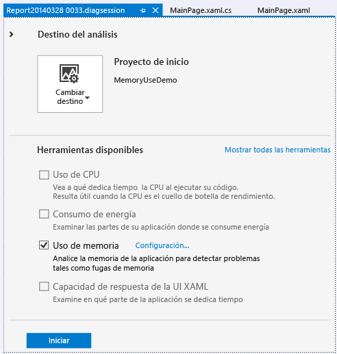

### Supervisar el uso de memoria

Al iniciar una sesión de diagnóstico, se inicia la aplicación y en la ventana **Herramientas de diagnóstico** se muestra un gráfico de escala de tiempo del uso de memoria de la aplicación.

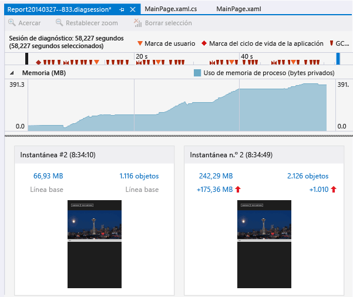

En el gráfico de escala de tiempo se muestran las fluctuaciones de memoria mientras se ejecuta la aplicación. Los picos del gráfico suelen indicar que hay código recopilando o creando datos que luego descarta una vez que termina el procesamiento. Los picos acusados indican áreas que se podrían optimizar. Más preocupante es un aumento del consumo de memoria que no se devuelva, ya que podría indicar un uso de memoria ineficaz o incluso una fuga de la misma.

### Tome instantáneas de los estados de memoria de la aplicación

Una aplicación usa un gran número de objetos, y es posible que quiera concentrar el análisis en un escenario. O bien, es posible que encuentre problemas de memoria para investigar. Puede tomar instantáneas durante una sesión de diagnóstico para capturar el uso de memoria en momentos concretos. Es buena idea obtener una instantánea de línea de base de una aplicación antes de la aparición del problema de memoria, otra tras la primera aparición del problema y varias más si puede repetir el escenario.

Para recopilar instantáneas, elija **Tomar instantánea** cuando quiera capturar los datos de memoria.

###  Cerrar la sesión de diagnóstico

Para detener una sesión de supervisión sin crear un informe, simplemente cierre la ventana de diagnóstico. Para generar un informe cuando haya terminado de recopilar o haya tomado instantáneas, haga clic en **Detener recopilación**.

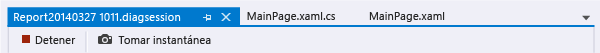

## Informes de uso de memoria

Una vez detenida la recopilación de datos, la herramienta **Uso de memoria** detiene la aplicación y muestra la página de información general **Uso de memoria**.

###  Instantáneas de uso de memoria

Los números de los paneles de **Instantánea** muestran los bytes y objetos en memoria cuando se tomó cada instantánea y la diferencia entre la instantánea y la anterior.

Los números son vínculos que abren vistas de informes de **Uso de memoria** detalladas en nuevas ventanas de Visual Studio. Un [informe detallado de instantánea](#snapshot-details-reports) muestra los tipos y las instancias en una instantánea. Un [informe de diferencias de instantáneas (diff)](#snapshot-difference-diff-reports) compara los tipos y las instancias en las dos instantáneas.

  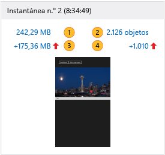

|||
|-|-|
||El número total de bytes en memoria cuando se tomó la instantánea.   Haga clic en este vínculo para mostrar un informe de detalles de instantánea ordenado por el tamaño total de las instancias de tipo.|
||El número total de objetos en memoria cuando se tomó la instantánea.   Haga clic en este vínculo para mostrar un informe de detalles de instantánea ordenado por el recuento de instancias de los tipos.|
||La diferencia entre el tamaño total de los objetos de memoria de esta instantánea y de la instantánea anterior.    Un número positivo indica que el tamaño de memoria de esta instantánea es mayor que el de la anterior y un número negativo indica que el tamaño es menor. **Línea base** significa que una instantánea es la primera de una sesión de diagnóstico. **No hay diferencia** significa que la diferencia es cero.   Haga clic en este vínculo para mostrar un informe diferencial de instantánea ordenado por la diferencia en cuanto al tamaño total de instancias de los tipos.|
||La diferencia entre el número total de objetos de memoria de esta instantánea y de la instantánea anterior.   Haga clic en este vínculo para mostrar un informe diferencial de instantánea ordenado por la diferencia en cuanto al recuento total de instancias de los tipos.|

## Informes de instantáneas de Uso de memoria

 Cuando hace clic en uno de los vínculos de instantánea en la página de información general **Uso de memoria**, se abre un informe de instantáneas en una página nueva.

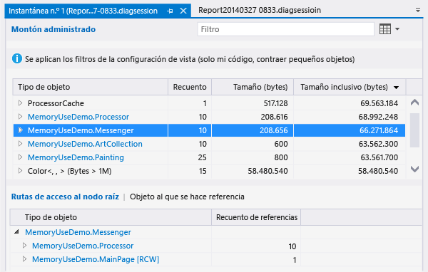

En un informe de instantáneas, puede expandir las entradas de **Tipo de objeto** para mostrar entradas secundarias. Los nombres de instancia son identificadores únicos generados por la herramienta Uso de memoria.

Si un **Tipo de objeto** es de color azul, puede seleccionarlo para navegar hasta el objeto en el código fuente en una ventana independiente.

Los tipos que no pueda identificar o cuya participación en el código no comprenda probablemente sean objetos de compilador, de .NET o del sistema operativo. La herramienta **Uso de memoria** muestra estos objetos si están implicados en las cadenas de propiedad de los objetos.

En el informe de instantáneas:

- El árbol del **Montón administrado** muestra los tipos e instancias del informe. Al seleccionar un tipo o una instancia se muestran los árboles **Rutas de acceso al nodo raíz** y **Objetos a los que se hace referencia** para el elemento seleccionado.

- El árbol **Ruta de acceso al nodo raíz** muestra la cadena de objetos que hace referencia a un tipo o una instancia. El recolector de elementos no utilizados de .NET limpia la memoria de un objeto únicamente si todas las referencias a este se han liberado.

- En el árbol **Tipos a los que se hace referencia** u **Objetos a los que se hace referencia** se muestran los objetos a los que hace referencia el tipo o instancia seleccionado.

###  Filtros de árbol de informes

Muchos tipos de aplicaciones no son muy interesantes para los desarrolladores de aplicaciones. Los filtros de informe de instantáneas pueden ocultar la mayoría de estos tipos en los árboles **Montón administrado** y **Rutas de acceso a la raíz**.

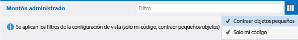

-  Para filtrar un árbol por nombre de tipo, escriba el nombre en el cuadro **Filtro**. El filtro no distingue mayúsculas de minúsculas y reconoce la cadena especificada en cualquier parte de los nombres de tipo.

-  Seleccione **Contraer pequeños objetos** en la lista desplegable **Filtro** para ocultar aquellos tipos cuyo **Tamaño (Bytes)** es inferior al 0,5 por ciento de la memoria total.

-  Seleccione **Solo mi código** en la lista desplegable **Filtro** para ocultar la mayoría de las instancias generadas por código externo. Los tipos externos pertenecen al sistema operativo o a componentes de Framework, o son generados por el compilador.

## Informes de detalles de instantánea

 Un informe de detalles de instantánea describe una instantánea de una sesión de diagnóstico. Para abrir el informe, haga clic en el vínculo de tamaño o de objetos en un panel de instantánea.

 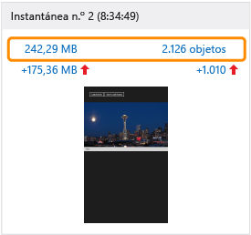

Ambos vínculos abren el mismo informe. La única diferencia es el orden de inicio del árbol **Montón administrado**. El vínculo de tamaño ordena el informe por la columna **Tamaño inclusivo (bytes)** . El vínculo Objetos ordena el informe por la columna **Recuento**. Puede cambiar la columna por la que se ordena o el orden después de abrir el informe.

###  Árbol Montón administrado (informes de detalles de instantánea)
 El árbol **Montón administrado** enumera los tipos de objetos retenidos en memoria. Expanda un nombre de tipo para ver las diez mayores instancias del tipo, ordenadas por tamaño. Haga clic en un tipo o una instancia para mostrar los árboles **Rutas de acceso al nodo raíz** y **Objetos a los que se hace referencia** para el elemento seleccionado.

 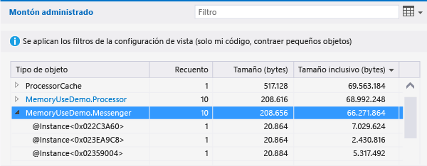

El árbol **Montón administrado** en un informe de detalles de instantánea tiene las siguientes columnas:

|||
|-|-|
|**Tipo de objeto**|Nombre del tipo o instancia del objeto.|
|**Recuento**|Número de instancias del objeto del tipo. **Recuento** siempre es 1 para una instancia.|
|**Tamaño (bytes)**|Para un tipo, el tamaño de todas las instancias del tipo en la instantánea, sin incluir el tamaño de objetos incluidos en las instancias.   Para una instancia, el tamaño del objeto sin incluir el tamaño de objetos incluidos en la instancia. |
|**Tamaño inclusivo (bytes)**|El tamaño de las instancias del tipo o el tamaño de una única instancia, incluso el tamaño de los objetos incluidos.|
|**Módulo**|El módulo que contiene este objeto.|

###  Rutas de acceso al árbol raíz (informes de detalles de instantánea)
El árbol **Ruta de acceso al nodo raíz** muestra la cadena de objetos que hace referencia a un tipo o una instancia. El recolector de elementos no utilizados de .NET limpia la memoria de un objeto únicamente si todas las referencias a este se han liberado.

Para un tipo en el árbol **Rutas de acceso al nodo raíz**, el número de objetos que contienen referencias a ese tipo se muestra en la columna **Recuento de referencias**.

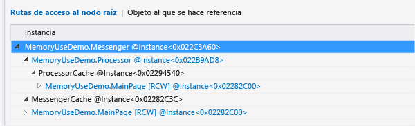

###  Árboles Tipos a los que se referencia u Objetos a los que se hace referencia (informes de detalles de instantánea)
En el árbol **Tipos a los que se hace referencia** u **Objetos a los que se hace referencia** se muestran los objetos a los que hace referencia el tipo o instancia seleccionado.

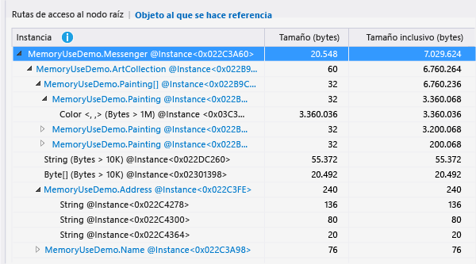

El árbol **Tipos a los que se hace referencia** en un informe de detalles de instantánea tiene las siguientes columnas. Un árbol **Objetos a los que se hace referencia** no tiene la columna **Recuento de referencias**.

|||
|-|-|
|**Tipo de objeto** o **Instancia**|El nombre del tipo o instancia.|
|**Recuento de referencias**|Para los tipos, el número de instancias del objeto del tipo.|
|**Tamaño (bytes)**|Para un tipo, el tamaño de todas las instancias del tipo, sin incluir el tamaño de objetos incluidos en el tipo.   Para una instancia, el tamaño del objeto sin incluir el tamaño de objetos incluidos en el objeto.|
|**Tamaño inclusivo (bytes)**|El tamaño de las instancias del tipo o tamaño de la instancia, incluyendo el tamaño de los objetos incluidos.|
|**Módulo**|El módulo que contiene este objeto.|

## Informes de diferencias de instantánea

Un informe de diferencias de instantánea muestra los cambios entre una instantánea principal y la anterior. Para abrir un informe de diferencias, haga clic en uno de los vínculos de diferencia en un panel de la instantánea.

Ambos vínculos abren el mismo informe. La única diferencia es el orden de inicio del árbol **Montón administrado** en el informe. El vínculo de tamaño ordena el informe por la columna **Diferencias de tamaño inclusivo (bytes)** . El vínculo Objetos ordena el informe por la columna **Diferencias de recuento**. Puede cambiar la columna por la que se ordena o el orden después de abrir el informe.

 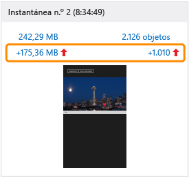

###  Árbol Montón administrado (informes de diferencias de instantánea)

 El árbol **Montón administrado** enumera los tipos de objetos retenidos en memoria. Puede expandir un nombre de tipo para ver las diez mayores instancias del tipo, ordenadas por tamaño. Haga clic en un tipo o una instancia para mostrar los árboles **Rutas de acceso al nodo raíz** y **Objetos a los que se hace referencia** para el elemento seleccionado.

 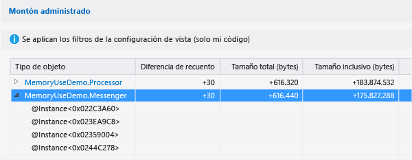

El árbol **Montón administrado** en un informe de diferencias de instantánea tiene las siguientes columnas:

|||
|-|-|
|**Tipo de objeto**|Nombre del tipo o instancia del objeto.|
|**Recuento**|Número de instancias de un tipo en la instantánea principal. **Recuento** siempre es 1 para una instancia.|
|**Diferencia de recuento**|Para un tipo, diferencia en cuanto al número de instancias del tipo entre la instantánea principal y la anterior. Para una instancia el campo está en blanco.|
|**Tamaño (bytes)**|El tamaño de los objetos de la instantánea principal, sin incluir el tamaño de los objetos en los objetos. Para un tipo, **Tamaño (bytes)** y **Tamaño inclusivo (bytes)** son los totales de los tamaños de las instancias del tipo.|
|**Diferencia de tamaño total (bytes)**|Para un tipo, la diferencia en el tamaño total de instancias del tipo entre la instantánea principal y la anterior, sin incluir el tamaño de objetos en las instancias. Para una instancia el campo está en blanco.|
|**Tamaño inclusivo (bytes)**|El tamaño de los objetos de la instantánea principal, incluyendo el tamaño de los objetos en los objetos.|
|**Diferencia de tamaño inclusivo (bytes)**|Para un tipo, la diferencia en el tamaño de todas las instancias del tipo entre la instantánea principal y la anterior, incluyendo el tamaño de objetos en los objetos. Para una instancia el campo está en blanco.|
|**Módulo**|El módulo que contiene este objeto.|

###  Árbol Rutas de acceso al nodo raíz (informes de diferencias de instantánea)

El árbol **Ruta de acceso al nodo raíz** muestra la cadena de objetos que hace referencia a un tipo o una instancia. El recolector de elementos no utilizados de .NET limpia la memoria de un objeto únicamente si todas las referencias a este se han liberado.

Para un tipo en el árbol **Rutas de acceso al nodo raíz**, el número de objetos que contienen referencias a ese tipo se muestra en la columna **Recuento de referencias**. La diferencia de recuento con respecto a la instantánea anterior está en la columna **Diferencia de referencia**.

 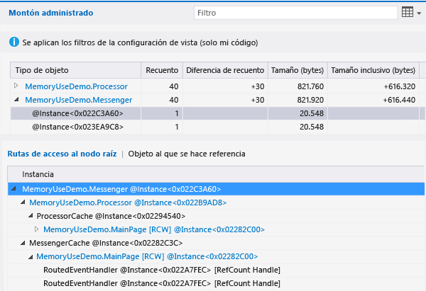

###  Árboles Tipos a los que se referencia u Objetos a los que se hace referencia (informes de diferencias de instantánea)

En el árbol **Tipos a los que se hace referencia** u **Objetos a los que se hace referencia** se muestran los objetos a los que hace referencia el tipo o instancia seleccionado.

El árbol **Tipos a los que se hace referencia** en un informe de diferencias de instantánea tiene las siguientes columnas. Un árbol **Objetos a los que se hacer referencia** tiene las columnas **Instancia**, **Tamaño (Bytes)** , **Tamaño inclusivo (Bytes)** y **Módulo**.

|||
|-|-|
|**Tipo de objeto** o **Instancia**|Nombre del tipo o instancia del objeto.|
|**Recuento de referencias**|Número de instancias de un tipo en la instantánea principal.|
|**Diferencia de recuento de referencias**|Para un tipo, diferencia en cuanto al número de instancias del tipo entre la instantánea principal y la anterior.|
|**Tamaño (bytes)**|El tamaño de los objetos de la instantánea principal, sin incluir el tamaño de los objetos en los objetos. Para un tipo, **Tamaño (bytes)** y **Tamaño inclusivo (bytes)** son los totales de los tamaños de las instancias del tipo.|
|**Diferencia de tamaño total (bytes)**|Para un tipo, la diferencia en el tamaño total de instancias del tipo entre la instantánea principal y la anterior, sin incluir el tamaño de objetos en las instancias. |
|**Tamaño inclusivo (bytes)**|El tamaño de los objetos de la instantánea principal, incluyendo el tamaño de los objetos en los objetos.|
|**Diferencia de tamaño inclusivo (bytes)**|Para un tipo, la diferencia en el tamaño de todas las instancias del tipo entre la instantánea principal y la anterior, incluyendo el tamaño de objetos en los objetos.|
|**Módulo**|El módulo que contiene este objeto.|

## Vea también
- [Memoria de JavaScript](../profiling/javascript-memory.md)
- [Generación de perfiles en Visual Studio](../profiling/index.yml)
- [Primer vistazo a la generación de perfiles](../profiling/profiling-feature-tour.md)
- [Procedimientos recomendados de rendimiento para aplicaciones para UWP con C++, C# y Visual Basic](/previous-versions/windows/apps/hh750313\(v\=win.10\))
- [Diagnosticar problemas de memoria con la nueva herramienta Uso de memoria en Visual Studio](https://devblogs.microsoft.com/devops/diagnosing-memory-issues-with-the-new-memory-usage-tool-in-visual-studio/)