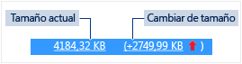

# Uso de memoria
[!INCLUDE[vs2017banner](../code-quality/includes/vs2017banner.md)]

Busque pérdidas de memoria y memoria ineficaz durante la depuración con la herramienta de diagnóstico **Uso de memoria** integrada del depurador. La herramienta Uso de memoria permite tomar una o más *instantáneas* del montón de memoria nativo y administrado. Puede recopilar instantáneas de aplicaciones .NET, nativas o de modo mixto \(.NET y nativo\).  
  
-   Puede analizar una sola instantánea para entender el impacto relativo de los tipos de objeto en el uso de la memoria y buscar código en la aplicación que use la memoria de forma ineficaz.  
  
-   También puede comparar \(diff\) dos instantáneas de una aplicación para buscar las áreas del código que generen un aumento del uso de la memoria con el tiempo.  
  
 En el gráfico siguiente se muestra la ventana de **Herramientas de diagnóstico** en Visual Studio 2015 Update 1:  
  
   
  
 Aunque puede recopilar instantáneas de memoria en cualquier momento en la herramienta **Uso de memoria**, puede usar el depurador de Visual Studio para controlar cómo se ejecuta la aplicación mientras investiga los problemas de rendimiento. Las acciones del depurador como establecer puntos de interrupción, ejecutar paso a paso e interrumpir todos, entre otras, pueden ayudarle a centrarse en las investigaciones de rendimiento en las rutas de acceso de código que son más importantes. Si realiza esas acciones mientras la aplicación se ejecuta, puede eliminar el ruido del código que no le interesa y reducir considerablemente la cantidad de tiempo necesario para diagnosticar un problema.  
  
 También puede usar la herramienta de memoria fuera del depurador. Vea [Analizar el uso de la memoria sin depuración](../Topic/Memory%20Usage%20without%20Debugging1.md).  
  
> [!NOTE]
>  **Compatibilidad con el asignador personalizado** El generador de perfiles de memoria nativa funciona mediante la recopilación de datos de asignación de eventos de [ETW](https://msdn.microsoft.com/en-us/library/windows/desktop/bb968803\(v=vs.85\).aspx) que se emiten en tiempo de ejecución.  Los asignadores de CRT y Windows SDK se han anotado en el nivel de origen para que se pueden capturar los datos de asignación.  Si escribe sus propios asignadores, que las funciones que devuelven un puntero a la memoria de montón recientemente asignada se pueden decorar con [\_\_declspec](/visual-cpp/cpp/declspec)\(allocator\), tal como se muestra en este ejemplo para myMalloc:  
>   
>  `__declspec(allocator) void* myMalloc(size_t size)`  
  
## Analizar el uso de memoria con el depurador  
  
> [!NOTE]
>  Dado que la recopilación de datos de memoria puede afectar al rendimiento de depuración de las aplicaciones nativas o de modo mixto, las instantáneas de memoria están deshabilitadas de forma predeterminada. Para habilitar las instantáneas de aplicaciones nativas o de modo mixto, inicie una sesión de depuración \(tecla de método abreviado: **F5**\). Cuando aparezca la ventana **Herramientas de diagnóstico**, seleccione la pestaña Uso de memoria y, a continuación, elija **Habilitar instantáneas**.  
>   
>    
>   
>  Detenga la depuración \(tecla de método abreviado: **Mayús \+ F5**\) y reiníciela.  
  
 Cada vez que desee capturar el estado de memoria, elija **Tomar instantánea** en la barra de herramientas reducida **Uso de memoria**.  
  
   
  
> [!TIP]
>  -   Para crear una línea base para las comparaciones de memoria, considere la posibilidad de tomar una instantánea al comienzo de la sesión de depuración.  
> -   Dado que puede resultar complicado capturar el perfil de memoria de una operación que le interese cuando la aplicación asigna y desasigna memoria con frecuencia, establezca puntos de interrupción al principio y al final de la operación o revise paso a paso la operación para buscar el punto exacto en que se modificó la memoria.  
  
## Ver detalles de la instantánea de memoria  
 Las filas de la tabla de resumen Uso de memoria enumeran las instantáneas que se tomaron durante la sesión de depuración.  
  
 Las columnas de la fila dependen del modo de depuración seleccionado en las propiedades del proyecto: .NET, nativo o mixto \(.NET y nativo\).  
  
-   Las columnas **Objeto administrado** y **Asignaciones nativas** muestran el número de objetos en la memoria .NET y nativa cuando se tomó la instantánea.  
  
-   Las columnas **Tamaño del montón administrado** y **Tamaño de montón nativo** muestran el número de bytes en los montones .NET y nativos.  
  
-   Cuando se toman varias instantáneas, las celdas de la tabla de resumen incluyen el cambio de valor entre la instantánea de la fila y la instantánea anterior.  
  
       
  
 **Para ver un informe de detalles:**  
  
-   Para ver los detalles únicamente de la instantánea seleccionada elija el vínculo actual.  
  
-   Para ver los detalles de la diferencia entre la instantánea actual y la anterior, elija el vínculo de cambio.  
  
 El informe aparece en una ventana separada.  
  
## Informes de detalles del uso de memoria  
  
### Informes de tipos administrados  
 Elija el vínculo actual de una celda **Objetos administrados** o **Tamaño del montón administrado** de la tabla de resumen Uso de memoria.  
  
   
  
 El panel superior muestra el número y el tamaño de los tipos en la instantánea, incluido el tamaño de todos los objetos a los que hace referencia el tipo \(**Tamaño inclusivo**\).  
  
 El árbol **Rutas de acceso al nodo raíz** en el panel inferior muestra los objetos que hacen referencia al tipo seleccionado en el panel superior. El recolector de elementos no utilizados de .NET Framework limpia la memoria de un objeto solo cuando se libera el último tipo que hace referencia a él.  
  
 El árbol **Tipos a los que se hace referencia** muestra las referencias que se incluyen en el tipo seleccionado en el panel superior.  
  
   
  
 Para mostrar las instancias de un tipo seleccionado en el panel superior, seleccione el icono .  
  
   
  
 La vista **Instancias** muestra las instancias del objeto seleccionado en la instantánea en el panel superior. Los paneles Rutas de acceso al nodo raíz y Objetos a los que se hace referencia muestran los objetos que hacen referencia a la instancia seleccionada y los tipos a los que hace referencia la instancia seleccionada. Cuando el depurador se detiene en el punto donde se tomó la instantánea, puede desplazar el puntero sobre la celda Valor para mostrar los valores del objeto en la información sobre herramientas.  
  
### Informes de tipo nativo  
 Elija el vínculo actual de una celda **Asignaciones nativas** o **Tamaño de montón nativo** en la tabla de resumen Uso de memoria de la ventana **Herramientas de diagnóstico**.  
  
   
  
 La **Vista de tipos** muestra el número y el tamaño de los tipos de la instantánea.  
  
-   Elija el icono de instancias \(\) de un tipo seleccionado para mostrar información sobre los objetos del tipo seleccionado en la instantánea.  
  
     La vista **Instancias** muestra cada instancia del tipo seleccionado. Al seleccionar una instancia se muestra la pila de llamadas que produjo la creación de la instancia en el panel **Pila de llamadas de asignación**.  
  
       
  
-   Elija **Vista de pilas** en la lista **Modo de vista** para ver la pila de asignación del tipo seleccionado.  
  
       
  
### Informes de cambios \(diferencias\)  
  
-   Elija el vínculo de cambio en una celda de la tabla de resumen de la pestaña **Uso de memoria** en la ventana **Herramientas de diagnóstico**.  
  
       
  
-   Elija una instantánea de la lista **Comparar con** en un informe administrado o nativo.  
  
       
  
 El informe de cambios agrega columnas \(marcadas con **\(Dif.\)**\) al informe base, que muestran la diferencia entre el valor de la instantánea de base y la instantánea de comparación. Este es el aspecto de un informe de diferencias de la vista de tipo nativo:  
  
   
  
## Blogs y vídeos  
 [Ventana del depurador Herramientas de diagnóstico en Visual Studio 2015](http://blogs.msdn.com/b/visualstudioalm/archive/2015/01/16/diagnostic-tools-debugger-window-in-visual-studio-2015.aspx)  
  
 [Blog: herramienta de uso de memoria durante la depuración en Visual Studio 2015](http://blogs.msdn.com/b/visualstudioalm/archive/2014/11/13/memory-usage-tool-while-debugging-in-visual-studio-2015.aspx)  
  
 [Blog de Visual C\+\+: diagnóstico de memoria nativa en Visual Studio 2015 Preview](http://blogs.msdn.com/b/vcblog/archive/2014/11/21/native-memory-diagnostics-in-vs2015-preview.aspx)  
  
 [Blog de Visual C\+\+: herramientas de diagnóstico de memoria nativa para Visual Studio 2015 CTP](http://blogs.msdn.com/b/vcblog/archive/2014/06/04/native-memory-diagnostic-tools-for-visual-studio-14-ctp1.aspx)