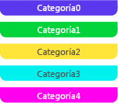

# Marcadores de intervalo
Un marcador de intervalo representa una fase significativa de una aplicación. Por ejemplo, puede usar un intervalo para representar un intervalo de tiempo durante el cual se está procesando un elemento de trabajo determinado. Su longitud representa la duración de la fase de la aplicación correspondiente. Esta ilustración muestra un intervalo en el visualizador de simultaneidad:  
  
   
Un marcador de intervalo en el visualizador de simultaneidad  
  
## Categoría de intervalo  
 Se muestra un marcador de intervalo en uno de los cinco colores diferentes, dependiendo de su categoría. Los colores se repiten si hay más de cinco categorías. La categoría puede ser cualquier número entero. Esta ilustración muestra los cinco colores posibles:  
  
   
Los colores de las cinco primeras categorías de intervalo  
  
## Marcadores de agregación de intervalo  
 En ocasiones los marcadores de intervalo se producen tan cerca de otros en el visualizador de simultaneidad que no se pueden dibujar individualmente. Cuando esto ocurre, se muestra un *marcador de agregación de intervalo* gris que representa los intervalos subyacentes. Cuando coloca el puntero en uno de estos iconos, una información sobre herramientas muestra el número de intervalos subyacentes que se representan. Amplíe para ver los intervalos. Si amplía completamente y sigue recibiendo un marcador de agregación de intervalo, puede ver los marcadores de intervalo subyacentes en el [Informe de marcadores](../profiling/markers-report.md). Esta ilustración muestra un marcador de agregación de intervalo:  
  
   
Un marcador de agregación de intervalo  
  
## Vea también  
 [Marcadores del visualizador de simultaneidad](../profiling/concurrency-visualizer-markers.md)   
 [SDK del visualizador de simultaneidad](../profiling/concurrency-visualizer-sdk.md)
