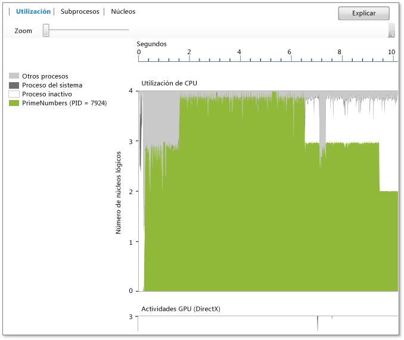

# Vista de utilizaci&#243;n
[!INCLUDE[vs2017banner](../code-quality/includes/vs2017banner.md)]

La **Vista de utilización** muestra información de la CPU, GPU y otros recursos del sistema utilizados por el proceso actual.  Muestra el promedio de utilización del núcleo por parte del proceso analizado, el proceso Idle, el proceso System y otros procesos que se ejecutan en el sistema conforme avanza el tiempo.  No muestra qué núcleo concreto está activo en un momento determinado.  Por ejemplo, si dos núcleos se están ejecutando cada uno al 50 por ciento de su capacidad en un período de tiempo determinado, esta vista mostrará que se está utilizando un núcleo lógico.  La vista se genera dividiendo el tiempo de generación de perfiles en segmentos de tiempo breves.  Para cada segmento, el gráfico traza el promedio de subprocesos del proceso que se ejecutan en núcleos lógicos durante ese intervalo.  
  
   
  
 El gráfico muestra el tiempo \(en el eje X\) y el promedio de núcleos lógicos usados por el proceso de destino, el proceso Idle, y el proceso System. \(El proceso Idle muestra núcleos inactivos.  El proceso del sistema es un proceso de Windows que puede realizar el trabajo en nombre de otros procesos.\) Los demás procesos que se ejecutan en el sistema son los que utilizan los núcleos restantes.  
  
 El número de núcleos lógicos se muestra en el eje Y.  El sistema operativo Windows trata la compatibilidad con multithreading simultáneo en el hardware como núcleos lógicos \(por ejemplo, Hyper\-Threading\).  Por consiguiente, un sistema que tiene un procesador de núcleos cuádruple que admite dos subprocesos de hardware por núcleo aparecerá como un sistema de ocho núcleos lógicos.  Esto también se aplica a la vista Núcleos.  Para obtener más información, vea [Vista de núcleos](../profiling/cores-view.md).  
  
 El diagrama de actividad de la GPU muestra el número de motores de DirectX en uso conforme avanza el tiempo.  Un motor está en uso si está procesando un paquete de DMA.  El gráfico no muestra el motor específico de DirectX \(por ejemplo, el motor de 3D, de vídeo y los otros\).  
  
## Objetivo  
 Se recomienda la vista de utilización como punto de partida para realizar investigaciones de rendimiento cuando se usa el Visualizador de simultaneidad.  Dado que proporciona una información general del grado de simultaneidad de una aplicación conforme avanza el tiempo, se puede utilizar para identificar rápidamente las áreas que requieren ajuste del rendimiento o paralelización del rendimiento.  
  
 Si está interesado en ajustar el rendimiento, quizás desee identificar un comportamiento que no cumple sus expectativas.  También podría estar buscando identificar la existencia de regiones con poca utilización de núcleos lógicos de la CPU y su causa.  Puede que también busque modelos de uso entre CPU y el GPU.  
  
 Si está interesado en paralelizar una aplicación, probablemente busque áreas de ejecución enlazadas a la CPU o áreas donde no se está utilizando la CPU.  
  
 Las áreas enlazadas a la CPU son verdes.  El gráfico muestra un núcleo utilizado si la aplicación es de serie.  
  
 Las áreas donde no se está utilizando la CPU se muestran en color gris.  Estas podrían representar puntos en los que la aplicación está inactiva o realizando una E\/S de bloqueo que ofrece oportunidades para el paralelismo mediante la superposición con otro trabajo enlazado a la CPU.  
  
 Si encuentra un comportamiento de interés, puede acercar esa región seleccionándola.  Después del acercamiento, puede cambiar a la vista Subprocesos o a la de Núcleos para realizar un análisis más detallado.  
  
 Si usa la GPU mediante AMP o DirectX de C\+\+, es posible que le interese identificar el número de motores de la GPU en uso o las áreas donde la GPU está inesperadamente inactiva.  
  
## Zoom  
 Para acercar el gráfico de utilización de la CPU o el diagrama de actividad de la GPU, seleccione una sección o utilice el control deslizante de zoom sobre el gráfico.  El valor de zoom se conserva cuando se cambia a otras vistas.  Para alejar la imagen de nuevo, use el control deslizante de zoom.  También puede acercarse mediante Ctrl\+scroll.  
  
## Vea también  
 [Visualizador de simultaneidad](../profiling/concurrency-visualizer.md)   
 [Vista de núcleos](../profiling/cores-view.md)