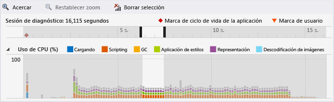
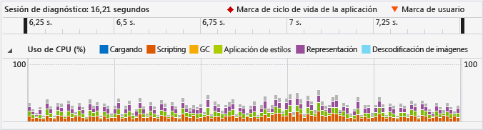
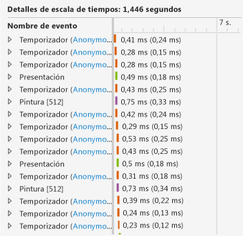
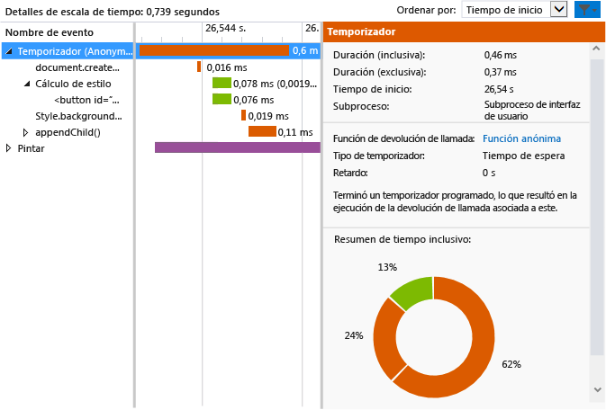

# <a name="walkthrough-improving-ui-responsiveness-html"></a>Tutorial: Mejorar la capacidad de respuesta de la interfaz de usuario (HTML)
Este tutorial le guía a través del proceso de identificar y corregir un problema de rendimiento con el [Generador de perfiles de capacidad de respuesta de la IU de HTML](../profiling/html-ui-responsiveness.md). El generador de perfiles está disponible en las aplicaciones de Visual Studio para UWP a través de JavaScript. En este escenario, crearás una aplicación de prueba de rendimiento que actualiza los elementos DOM con demasiada frecuencia, y usarás el generador de perfiles para identificar y corregir este problema.  
  
### <a name="creating-and-running-the-performance-test-app"></a>Crear y ejecutar la aplicación de prueba de rendimiento  
  
1.  En Visual Studio, cree un nuevo proyecto de JavaScript para Windows Universal. (Seleccione **Archivo / Nuevo / Proyecto**. Seleccione **JavaScript** en el panel izquierdo y seleccione **Windows**, **Windows 10**, y después **Universal** o **Windows Phone**.  
  
2.  > [!IMPORTANT]
    >  Los resultados de diagnóstico que se muestran en este tema son para una aplicación de Windows 8.  
  
3.  Seleccione una de las plantillas de proyecto vacías del panel central, como **Aplicación vacía**.  
  
4.  En el cuadro **Nombre**, especifique un nombre como `JS_Perf_Tester` y elija **Aceptar**.  
  
5.  En el **Explorador de soluciones**, abre default.html y pega el siguiente código entre las etiquetas \<body>:  
  
    ```html  
    <div class="wrapper">  
        <button id="content">Waiting for values</button>  
    </div>  
    ```  
  
6.  Abre default.css y agrega el código CSS siguiente:  
  
    ```css  
    #content {  
        margin-left: 100px;  
        margin-top: 100px;  
    }  
    ```  
  
7.  Abre default.js y reemplaza todo el código con este código:  
  
    ```javascript  
    (function () {  
        "use strict";  
  
        var app = WinJS.Application;  
        var activation = Windows.ApplicationModel.Activation;  
  
        var content;  
        var wrapper;  
  
        app.onactivated = function (args) {  
            if (args.detail.kind === activation.ActivationKind.launch) {  
                if (args.detail.previousExecutionState !== activation.ApplicationExecutionState.terminated) {  
  
                    content = document.getElementById("content");  
                    wrapper = document.querySelector(".wrapper");  
  
                    content.addEventListener("click", handler);  
  
                } else {  
                }  
  
                args.setPromise(WinJS.UI.processAll());  
            }  
        };  
  
        app.oncheckpoint = function (args) {  
        };  
  
        app.start();  
  
        var idx = 0;  
        var count = 0;  
        var max = 5000;  
        var text = ["what", "is", "the", "Matrix?"];  
        var color = ["red", "crimson", "maroon", "purple"];  
  
        function increment() {  
  
            setTimeout(function () {  
  
                idx++;  
                count++;  
  
                if (idx > 3) { idx = 0; }  
                if (count < max) { increment(); }  
  
            }, 1000);  
        }  
  
        function setValues() {  
  
            content = document.getElementById("content");  
            content.removeNode(true);  
  
            var newNode = document.createElement("button");  
            newNode.id = "content";  
            newNode.textContent = text[idx];  
            //newNode.textContent = getData();  
            newNode.style.backgroundColor = color[idx];  
            //newNode.style.animationName = "move";  
            //count++;  
  
            wrapper.appendChild(newNode);  
  
        }  
  
        function update() {  
  
            setTimeout(function () {  
  
                setValues();  
                if (count < max) { update(); }  
            });  
        }  
  
        function handler(args) {  
  
            content.textContent = "eenie";  
            increment();  
            update();  
        }  
  
    })();  
  
    ```  
  
8.  Elija la tecla F5 para iniciar la depuración. Compruebe que el botón **En espera de valores** aparece en la página.  
  
9. Seleccione **En espera de valores** y compruebe que el texto y el color del botón se actualizan aproximadamente una vez por segundo. Esto es intencionado.  
  
10. Vuelve a Visual Studio (Alt+Tab) y presiona Mayús+F5 para detener la depuración.  
  
     Ahora que has comprobado que la aplicación funciona, puedes examinar el rendimiento utilizando el generador de perfiles.  
  
### <a name="analyzing-performance-data"></a>Analizar los datos de rendimiento  
  
1.  En la barra de herramientas **Depurar**, en la lista **Iniciar depuración**, elija uno de los emuladores de Windows Phone o **Simulator**.  
  
2.  En el menú **Depurar** , elija **Rendimiento y diagnósticos**.  
  
3.  En **Herramientas disponibles**, elija **Capacidad de respuesta de la IU de HTML** y después **Iniciar**.  
  
     En este tutorial, asociarás el generador de perfiles al proyecto de inicio. Para obtener información sobre otras opciones, como asociar el generador de perfiles a una aplicación instalada, consulta [Capacidad de respuesta de la UI de HTML](../profiling/html-ui-responsiveness.md).  
  
     Al iniciar el generador de perfiles, puede aparecer un Control de cuentas de usuario que solicite tu permiso para ejecutar VsEtwCollector.exe. Elija **Sí**.  
  
4.  En la aplicación en ejecución, seleccione **En espera de valores** y espere unos 10 segundos. Comprueba que el texto y el color del botón se actualizan más o menos una vez por segundo.  
  
5.  Desde la aplicación en ejecución, cambia a Visual Studio (Alt+Tab).  
  
6.  Elija **Detener recopilación**.  
  
     El generador de perfiles muestra información en una nueva pestaña en Visual Studio. Cuando examines los datos de utilización de CPU y rendimiento visual (FPS), podrás identificar fácilmente algunas tendencias:  
  
    -   La utilización de CPU aumenta de forma considerable después de unos 3 segundos (cuando presionó el botón **En espera de valores**) y muestra un patrón claro de eventos (una combinación sistemática de eventos de script, aplicación de estilo y presentación) a partir de ese momento.  
  
    -   El rendimiento visual no resulta afectado y el valor de FPS permanece en una velocidad de 60 (es decir, no se han eliminado fotogramas).  
  
     Veamos una sección típica del gráfico de utilización de CPU para averiguar lo que está haciendo la aplicación en este período de alta actividad.  
  
7.  Selecciona una sección de uno o dos segundos en el centro del gráfico de utilización de CPU (haz clic en la sección y arrástrala o usa las teclas de tabulación y de dirección). En la siguiente ilustración se muestra el gráfico de utilización de CPU después de hacer la selección. El área no compartida es la selección.  
  
       
  
8.  Elija **Acercar**.  
  
     El gráfico cambia para mostrar el período seleccionado con más detalle. En la siguiente ilustración se muestra el gráfico de utilización de CPU después de acercarlo. (Los datos concretos pueden variar, pero el patrón general será parecido).  
  
       
  
     Los detalles de escala de tiempo del panel inferior muestran un ejemplo de los detalles del período seleccionado.  
  
       
  
     Los eventos de los detalles de la escala de tiempo confirman tendencias visibles en el gráfico de utilización de CPU: hay muchos eventos que tienen lugar durante breves períodos de tiempo. En la vista de detalles de la escala de tiempo se indica que estos eventos son eventos `Timer`, `Layout` y `Paint`.  
  
9. Use el menú contextual (o secundario) de uno de los eventos `Timer` del panel inferior y seleccione **Filtro al evento**. En la ilustración siguiente se muestra un ejemplo de detalles típico de uno de los eventos `Timer` de esta aplicación de prueba.  
  
       
  
     Se pueden deducir varios hechos de los datos. Por ejemplo:  
  
    -   Cada evento `Timer`, con un código de color que lo identifica como evento de scripting, incluye una llamada a `document.createElement`, seguida de un cálculo de estilos y una llamada a `style.backgroundColor` y `appendChild()`.  
  
    -   En el breve intervalo de tiempo seleccionado (aproximadamente uno o dos segundos), se produce una gran cantidad de eventos `Timer`, `Layout` y `Paint`. Los eventos `Timer` ocurren con más frecuencia, incluso más de una vez por segundo, lo que resulta evidente después de ejecutar la aplicación y seleccionar el botón **En espera de valores**.  
  
10. Para investigar este problema, elige el vínculo a la función anónima de uno de los eventos `Timer` en el panel izquierdo inferior. La siguiente función se abre en default.js:  
  
    ```javascript  
    function update() {  
  
        setTimeout(function () {  
  
            setValues();  
            if (count < max) { update(); }  
        });  
    }  
    ```  
  
     Esta función recursiva define un bucle que llama a la función `setValues()`, que actualiza el botón de la interfaz de usuario. Al examinar los distintos eventos del temporizador del generador de perfiles, descubre que la mayoría o todos ellos se deben a este código, que se ejecuta con demasiada frecuencia, así que parece probable que el problema se origine ahí.  
  
### <a name="fixing-the-performance-issue"></a>Corregir el problema de rendimiento  
  
1.  Reemplaza la función `update()` por el código siguiente:  
  
    ```javascript  
    function update() {  
  
        setTimeout(function () {  
  
            setValues();  
            if (count < max) { update(); }  
        }, 1000 );  
    }  
    ```  
  
     Esta versión corregida del código incluye un retraso de 1.000 milisegundos, que estaba omitido en la versión anterior del código, que permite el uso de un valor predeterminado de retraso. A tenor de los datos del generador de perfiles, parece que el valor predeterminado son cero milisegundos, lo que hace que la función `setValues()` se ejecute con demasiada frecuencia.  
  
2.  Ejecuta de nuevo el generador de perfiles de capacidad de respuesta de la IU de HTML y consulta el gráfico de utilización de CPU. Verás que los eventos que se producían con demasiada frecuencia han desaparecido y que la utilización de la CPU ha disminuido a un nivel próximo al cero. ¡Arreglado!  
  
## <a name="see-also"></a>Vea también  
 [Capacidad de respuesta de la IU HTML](../profiling/html-ui-responsiveness.md)