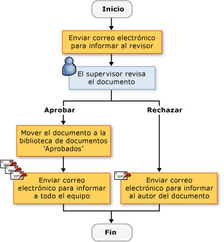
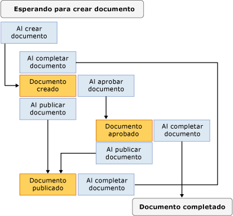

# Crear soluciones de flujo de trabajo de SharePoint
  [!INCLUDE[vsprvs](../sharepoint/includes/vsprvs-md.md)] proporciona herramientas para ayudarle a crear flujos de trabajo personalizados que administran el ciclo de vida de documentos y elementos de lista en un sitio SharePoint Web. Los elementos proporcionados incluyen un diseñador, un conjunto de controles de actividad y las referencias de ensamblado necesarias. [!INCLUDE[vsprvs](../sharepoint/includes/vsprvs-md.md)] También incluye el **Asistente para personalización de SharePoint**, para ayudar a crear y configurar los flujos de trabajo.  
  
 Para obtener la lista de requisitos previos para crear proyectos de SharePoint en [!INCLUDE[vsprvs](../sharepoint/includes/vsprvs-md.md)], consulte [requisitos para desarrollar soluciones de SharePoint](../sharepoint/requirements-for-developing-sharepoint-solutions.md). Para obtener más información acerca de SharePoint, vea [tecnologías y productos de Microsoft SharePoint](http://go.microsoft.com/fwlink/?LinkId=178470).  
  
## Flujos de trabajo en SharePoint  
 Cuando se agrega un flujo de trabajo a una lista o biblioteca de SharePoint, aplicar un proceso empresarial en todos los elementos en la biblioteca o lista. Un flujo de trabajo describe las acciones que el sistema o los usuarios deben realizar en cada elemento, como enviar el elemento para editar y, a continuación, revisar. Estas acciones, conocidas como *actividades*, son los bloques de creación del flujo de trabajo.  
  
 Puede crear flujos de trabajo de SharePoint en [!INCLUDE[vsprvs](../sharepoint/includes/vsprvs-md.md)] e implementarlas en un sitio SharePoint Web. Después de implementa un flujo de trabajo en SharePoint, se asocia con una lista o biblioteca. Se puede, a continuación, se inicia automáticamente, mediante un proceso o manualmente por el usuario. Para obtener más información acerca de la operación de flujo de trabajo, consulte [flujos de trabajo de desarrollo de SharePoint mediante Visual Studio](https://docs.microsoft.com/sharepoint/dev/general-development/develop-sharepoint-workflows-using-visual-studio).  
  
## Crear flujos de trabajo de SharePoint personalizado  
 Dos proyectos de flujo de trabajo de SharePoint están disponibles en [!INCLUDE[vsprvs](../sharepoint/includes/vsprvs-md.md)]: **flujo de trabajo secuencial** y **flujo de trabajo de máquina de estados**.  
  
 A *flujo de trabajo secuencial* representa una serie de pasos. Los pasos se realizan uno tras otro hasta que se complete la última actividad. Flujos de trabajo secuenciales siempre son estrictamente secuenciales en su ejecución. Ya que pueden recibir eventos externos y se puede incluir flujos paralelos lógicos, el orden exacto de ejecución puede variar. En la siguiente ilustración muestra un ejemplo de un flujo de trabajo secuencial.  
  
   
  
 A *flujo de trabajo de máquina de estados* representa un conjunto de Estados, transiciones y acciones. Los pasos de un flujo de trabajo de máquina de Estados ejecutarán de forma asincrónica. Esto significa que no se realizan necesariamente uno tras otro, sino que se activan mediante acciones y Estados. Se asigna un estado como el estado de inicio y, a continuación, en función de un evento, se realiza una transición a otro estado. La máquina de estados puede tener un estado final que determina el final del flujo de trabajo. El siguiente diagrama muestra un ejemplo de un flujo de trabajo de máquina de Estados.  
  
   
  
 Para obtener más información acerca de los tipos de flujo de trabajo, consulte [tipos de flujo de trabajo](http://go.microsoft.com/fwlink/?LinkId=178995).  
  
### Mediante el Asistente para  
 Cuando se crea un proyecto de flujo de trabajo de SharePoint en [!INCLUDE[vsprvs](../sharepoint/includes/vsprvs-md.md)], primero especifica su configuración en el **Asistente para personalización de SharePoint**. El asistente usa estos valores para crear un proyecto en **el Explorador de soluciones**. Este proyecto contiene un archivo de código, varios archivos que se utilizan para implementar el flujo de trabajo, y las referencias a ensamblados que se necesitan para crear un flujo de trabajo de SharePoint personalizado.  
  
 Después de crear el flujo de trabajo, puede modificar sus propiedades en la ventana Propiedades. Aunque la mayoría de propiedades de flujo de trabajo se puede cambiar directamente en la ventana Propiedades, algunos requieren hacer clic en un botón de puntos suspensivos () a cambiar sus valores. Este botón se reinicia el **Asistente para personalización de SharePoint**. Después de realizar la propiedad cambia el valor, elija el **finalizar** botón para finalizar a ellos.  
  
> [!NOTE]  
>  El **tipo de flujo de trabajo** propiedad es de solo lectura y no se puede cambiar. Si desea cambiar el tipo de flujo de trabajo, debe crear otro flujo de trabajo.  
  
## Diseñar un flujo de trabajo de SharePoint  
 Después de definir todos los pasos en el proceso empresarial, utilice la [!INCLUDE[vsprvs](../sharepoint/includes/vsprvs-md.md)] Diseñador de flujo de trabajo para diseñar el flujo de trabajo de SharePoint. Para abrir el diseñador, haga doble clic en Workflow1.cs o Workflow1.vb en **el Explorador de soluciones**, o abra el menú contextual para cada uno de esos archivos y, a continuación, elija **abrir**.  
  
### Actividades  
 Para diseñar un flujo de trabajo, agregue actividades desde el **cuadro de herramientas** a una *programación de flujo de trabajo* en el diseñador. Una programación de flujo de trabajo contiene la secuencia de actividades en el orden en que debe realizarse.  
  
 Hay dos tipos de actividades:  
  
-   *Actividades simples* realizar una sola unidad de trabajo, como "retrasar 1 día" o "iniciar servicio Web".  
  
-   *Las actividades compuestas* contienen otras actividades; por ejemplo, una actividad condicional puede contener dos bifurcaciones.  
  
 Ambos tipos de actividades están disponibles en la **cuadro de herramientas**.  
  
 Las actividades pueden tener propiedades, métodos y eventos. Use la **propiedades** ventana para establecer las propiedades de una actividad.  
  
 También puede crear una actividad personalizada. Para obtener más información, consulte [Tutorial: crear una actividad de flujo de trabajo de sitio personalizada](../sharepoint/walkthrough-create-a-custom-site-workflow-activity.md).  
  
 Las actividades se clasifican en las siguientes fichas en el **cuadro de herramientas**:  
  
-   **Flujo de trabajo de SharePoint**  
  
-   **Windows Workflow v3.0**  
  
-   **V3.5 de flujo de trabajo de Windows**  
  
 No todas las actividades de flujo de trabajo de core son compatibles con SharePoint. Para obtener más información, consulte [flujo de trabajo para Windows SharePoint Services Introducción a las actividades](http://go.microsoft.com/fwlink/?LinkID=156094).  
  
#### Actividades de flujo de trabajo de SharePoint  
 El **flujo de trabajo de SharePoint** pestañas contienen actividades especializadas para su uso en [!INCLUDE[wss_14_long](../sharepoint/includes/wss-14-long-md.md)]. Estas actividades simplifican y agilizar el desarrollo de flujos de trabajo de ciclo de vida de documento. Para obtener más información acerca de las actividades enumeradas en la **flujo de trabajo de SharePoint** pestaña, vea [flujo de trabajo para Windows SharePoint Services Introducción a las actividades](http://go.microsoft.com/fwlink/?LinkID=156094).  
  
#### Actividades de flujo de trabajo de Windows  
 El **Windows Workflow** pestañas contienen las actividades que se proporcionan con el [!INCLUDE[TLA#tla_workflow](../sharepoint/includes/tlasharptla-workflow-md.md)]. Puede utilizar estas actividades para crear programaciones de flujo de trabajo para cualquier tipo de aplicación de flujo de trabajo de Windows.  
  
 Para obtener más información acerca de las actividades enumeradas en la **flujos de trabajo de Windows** pestaña, vea [actividades de Windows Workflow Foundation](http://go.microsoft.com/fwlink/?LinkID=156096). Para obtener más información acerca de Windows Workflow Foundation, consulte [información general de Windows Workflow Foundation](http://go.microsoft.com/fwlink/?LinkID=128632).  
  
### Trabajar con actividades en el diseñador  
 La programación de flujo de trabajo puede contener una combinación de actividades de flujo de trabajo de Windows y las actividades de flujo de trabajo de SharePoint.  
  
 El diseñador muestra indicaciones visuales para ayudarle a colocar y configurar actividades correctamente. Al arrastrar o copiar una actividad en la programación de flujo de trabajo, el diseñador muestra iconos de signo de más (+) verde que indican las ubicaciones válidas para esa actividad en el flujo de trabajo. No se puede colocar una actividad en una ubicación donde no sería válido. Por ejemplo, no se puede colocar una actividad de envío como la primera actividad en una rama de actividad de escuchar. Para obtener más información, consulte [Centro para desarrolladores de SharePoint Designer](http://go.microsoft.com/fwlink/?LinkId=178476).  
  
## Recopilar información durante el flujo de trabajo  
 Desea recopilar información de los usuarios en momentos en el flujo de trabajo predefinidos. Puede recopilar información mediante formularios o propiedades de los elementos.  
  
### Formularios  
 Los formularios son como cuadros de diálogo que contienen preguntas y proporcionan maneras de dar respuestas.  
  
 Hay cuatro tipos de formularios que pueden utilizarse en un flujo de trabajo:  
  
-   Asociación  
  
-   Inicio  
  
-   Modificación  
  
-   Tarea  
  
 De estos, [!INCLUDE[vsprvs](../sharepoint/includes/vsprvs-md.md)] incluye plantillas de elementos para los formularios de asociación e iniciación. Un ejemplo de un *formulario de asociación* es uno que permite al administrador instalar el flujo de trabajo escribir parámetros que se relacionan con el flujo de trabajo, como un límite de gasto para un flujo de trabajo de gastos. Un ejemplo de un *formulario de iniciación* es aquel que permite al usuario de un flujo de trabajo de gastos escribir la cantidad que invierten en el flujo de trabajo. Para obtener más información acerca de estos tipos de formas, consulte [proyecto de SharePoint y plantillas de elementos de proyecto](../sharepoint/sharepoint-project-and-project-item-templates.md).  
  
### Propiedades de los elementos  
 También puede recopilar información de los usuarios mediante las propiedades de un elemento en la lista o biblioteca de SharePoint. El archivo de código principal (Workflow1.cs o Workflow1.vb) declara una instancia de la clase Microsoft.SharePoint.Workflow.SPWorkflowActivationProperties.WorkflowProperties denominada `workflowProperties`. Use la `workflowProperties` objeto para tener acceso a las propiedades de la biblioteca o lista en el código. Para obtener un ejemplo, vea [Tutorial: crear y depurar una solución de flujo de trabajo de SharePoint](../sharepoint/walkthrough-creating-and-debugging-a-sharepoint-workflow-solution.md).  
  
## Depurar una plantilla de flujo de trabajo de SharePoint  
 Puede depurar un proyecto de flujo de trabajo de SharePoint el mismo como depurar otros [!INCLUDE[vsprvs](../sharepoint/includes/vsprvs-md.md)] proyectos basados en Web. Al iniciar la [!INCLUDE[vsprvs](../sharepoint/includes/vsprvs-md.md)] depurador, [!INCLUDE[vsprvs](../sharepoint/includes/vsprvs-md.md)] utiliza la configuración que especifique en el **Asistente para personalización de SharePoint** para abrir el sitio SharePoint Web adecuado y asociar automáticamente la plantilla de flujo de trabajo con la biblioteca adecuada o la lista. [!INCLUDE[vsprvs](../sharepoint/includes/vsprvs-md.md)] también asocia el [!INCLUDE[vsprvs](../sharepoint/includes/vsprvs-md.md)] del depurador para la [!INCLUDE[wss_14_long](../sharepoint/includes/wss-14-long-md.md)] proceso denominado w3wp.exe.  
  
 Para probar el flujo de trabajo, debe iniciarlo manualmente. Para obtener más información, vea la sección "Depuración de flujos de trabajo" en [depurar soluciones de SharePoint](../sharepoint/debugging-sharepoint-solutions.md). Para obtener más información acerca de [!INCLUDE[vsprvs](../sharepoint/includes/vsprvs-md.md)] Web depurar la aplicación, vea [depurar aplicaciones Web y el Script](/visualstudio/debugger/debugging-web-applications-and-script).  
  
## Implementar una plantilla de flujo de trabajo de SharePoint  
 [!INCLUDE[vsprvs](../sharepoint/includes/vsprvs-md.md)] Implementación proyectos de flujo de trabajo de SharePoint como otro [!INCLUDE[vsprvs](../sharepoint/includes/vsprvs-md.md)] proyectos de SharePoint. Para obtener más información, consulte [empaquetado e implementación de soluciones de SharePoint](../sharepoint/packaging-and-deploying-sharepoint-solutions.md).  
  
## Importar flujos de trabajo reutilizables globalmente  
 Además de crear flujos de trabajo reutilizables específica del sitio, SharePoint Designer le permite crear *flujos de trabajo reutilizables globalmente*, que son flujos de trabajo que pueden usarse en cualquier sitio de SharePoint. El proyecto Importar flujo de trabajo reutilizable en [!INCLUDE[vsprvs](../sharepoint/includes/vsprvs-md.md)] actualmente importar flujos de trabajo reutilizables globalmente. Sin embargo, puede usar SharePoint Designer para convertir un flujo de trabajo reutilizable globalmente en un flujo de trabajo reutilizable o importar el flujo de trabajo como un flujo de trabajo declarativo no convertida. Para obtener más información, consulte [importar elementos de un sitio de SharePoint existente](../sharepoint/importing-items-from-an-existing-sharepoint-site.md).  
  
## Temas relacionados  
  
|Título|Descripción|  
|-----------|-----------------|  
|[Tutorial: Crear y depurar una solución de flujo de trabajo de SharePoint](../sharepoint/walkthrough-creating-and-debugging-a-sharepoint-workflow-solution.md)|Le guía paso a paso para crear y depurar un sencillo [!INCLUDE[vsprvs](../sharepoint/includes/vsprvs-md.md)] flujo de trabajo.|  
|[Tutorial: Crear un flujo de trabajo con formularios de asociación y de iniciación](../sharepoint/walkthrough-creating-a-workflow-with-association-and-initiation-forms.md)|Le guía paso a paso para crear una más completos [!INCLUDE[vsprvs](../sharepoint/includes/vsprvs-md.md)] completar el flujo de trabajo con formularios de asociación e iniciación.|  
|[Tutorial: Agregar una página de aplicación a un flujo de trabajo](../sharepoint/walkthrough-add-an-application-page-to-a-workflow.md)|Se basa en el tema [Tutorial: crear un flujo de trabajo con una asociación y formularios de iniciación](../sharepoint/walkthrough-creating-a-workflow-with-association-and-initiation-forms.md) mediante la adición de una página de aplicación de .aspx adicional que informa de los datos introducidos en el flujo de trabajo.|  
|[Tutorial: Crear una actividad de flujo de trabajo de sitio personalizado](../sharepoint/walkthrough-create-a-custom-site-workflow-activity.md)|Muestra cómo realizar dos tareas claves: crear un flujo de trabajo de nivel de sitio y crear una actividad de flujo de trabajo personalizado.|  
|[Tutorial: Importar un flujo de trabajo reutilizable de SharePoint Designer en Visual Studio](../sharepoint/walkthrough-import-a-sharepoint-designer-reusable-workflow-into-visual-studio.md)|Muestra cómo importar flujos de trabajo declarativos reutilizables creados en SharePoint Designer 2010 en un [!INCLUDE[vsprvs](../sharepoint/includes/vsprvs-md.md)] proyecto de SharePoint.|  
  
## Vea también  
 [Desarrollar soluciones de SharePoint](../sharepoint/developing-sharepoint-solutions.md)   
 [Compilar y depurar soluciones de SharePoint](../sharepoint/building-and-debugging-sharepoint-solutions.md)   
 [Crear páginas de aplicación para SharePoint](../sharepoint/creating-application-pages-for-sharepoint.md)  
  
  