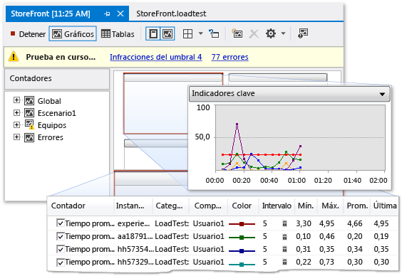

# Generar perfiles de rendimiento de aplicaciones de SharePoint
  Si las aplicaciones de SharePoint se ejecuta con lentitud o de forma ineficaz, puede usar las características de generación de perfiles de Visual Studio para identificar código problemático y otros elementos. Mediante el uso de la característica de prueba de carga, puede determinar cómo se realiza una aplicación de SharePoint en situaciones de estrés, por ejemplo, cuando varios usuarios tener acceso a la aplicación al mismo tiempo. Al ejecutar pruebas de rendimiento web, puede medir cómo se realiza la aplicación en la web. Mediante el uso de pruebas de IU codificadas, puede comprobar si toda la aplicación de SharePoint, incluidos su interfaz de usuario, funciona correctamente. Cuando utilices conjuntamente estas pruebas, puede ayudarle a identificar problemas de rendimiento antes de implementar la aplicación.  
  
## Información general sobre las Herramientas de generación de perfiles  
 Generación de perfiles se refiere al proceso de observar y registrar el comportamiento de rendimiento de la aplicación mientras se ejecuta. Mediante la generación de perfiles de la aplicación, puede descubrir problemas, como los cuellos de botella y código ineficaz, problemas de asignación de memoria, lo que hacer que las aplicaciones se ejecute lentamente o utilizar demasiada memoria. Por ejemplo, puede usar la generación de perfiles para identificar los puntos de conexión en el código, que son segmentos de código que se llaman con frecuencia y pueden ralentizar el rendimiento general de la aplicación. Después de identificar los puntos de conexión, a menudo puede optimizar o eliminarlas.  
  
 Puede usar varias herramientas de generación de perfiles en el entorno de desarrollo integrado (IDE) para identificar y buscar estos tipos de problemas de rendimiento. Estas herramientas funcionan igual en los proyectos de SharePoint que para otros tipos de proyectos de Visual Studio. El Asistente de rendimiento de herramientas de generación de perfiles le guía a través de la creación de una sesión de rendimiento que usa las pruebas que especifique. Una sesión de rendimiento es un conjunto de datos de configuración que se usan para recopilar información de rendimiento de una aplicación, junto con los resultados de una o más ejecuciones de generación de perfiles. Las sesiones de rendimiento se almacenan en la carpeta del proyecto, y puede verlos en **Explorador de rendimiento**. Para obtener más información, vea [Introducción a los métodos de generación de perfiles](/visualstudio/profiling/understanding-performance-collection-methods).  
  
 Después de crear y ejecutar un análisis de perfil en la aplicación, un informe proporciona detalles sobre su rendimiento. Este informe puede incluir elementos como un gráfico de uso de CPU en el tiempo, una pila de llamadas de función jerárquica o un árbol de llamadas. El contenido exacto del informe puede variar, dependiendo del tipo de prueba que se ejecuta, por ejemplo, el muestreo o instrumentación. Para obtener más información, consulte [introducción de informes de herramientas de generación de perfiles](http://go.microsoft.com/fwlink/?LinkId=224689).  
  
## Proceso de la sesión de rendimiento  
 Para generar perfiles de una aplicación, primero debe usar al Asistente para generación de perfiles de rendimiento de herramientas para crear una sesión de rendimiento. En la barra de menús, elija **analizar**, **iniciar Asistente de rendimiento**. Complete el asistente, escriba la información necesaria para la sesión de rendimiento, como el método de perfil que desea y la aplicación que desea generar perfiles. Para obtener más información, consulte [Cómo: generar perfiles de un sitio Web o aplicación Web utilizando el Asistente para rendimiento](http://go.microsoft.com/fwlink/?LinkId=224692). Como alternativa, puede utilizar opciones de línea de comandos para configurar y ejecutar una sesión de rendimiento. Para obtener más información, consulte [mediante la generación de perfiles de herramientas de la línea de comandos](http://go.microsoft.com/fwlink/?LinkId=224703). Si desea configurar todos los aspectos de una sesión de rendimiento de forma manual, consulte [Cómo: crear manualmente los sesiones de rendimiento con las herramientas de generación de perfiles](http://go.microsoft.com/fwlink/?LinkId=224691). También puede crear una sesión de rendimiento de una prueba unitaria, en la **resultados de pruebas** ventana, abra el menú contextual de la prueba unitaria y, a continuación, elija **crear sesión de rendimiento**.  
  
 Después de configurar una sesión de rendimiento, se guarda la configuración de sesión, el servidor está configurado para proporcionar datos de generación de perfiles y se ejecuta la aplicación. Cuando usa la aplicación, los datos de rendimiento se escriben en un archivo de registro. Sesiones de rendimiento se muestran en **Explorador de rendimiento** en el **destinos** carpeta. Al finalizar una sesión de rendimiento, su informe aparece en la **informes** carpeta **Explorador de rendimiento**. Para mostrar el informe, abrirlo en **Explorador de rendimiento**. Para ver o configurar las propiedades de una sesión de rendimiento, abra su menú contextual en **Explorador de rendimiento**y, a continuación, elija **propiedades**. Para obtener más información acerca de las propiedades específicas de una sesión de rendimiento, consulte [configurar sesiones de rendimiento para las herramientas de generación de perfiles](http://go.microsoft.com/fwlink/?LinkId=224694). Para obtener información acerca de cómo interpretar los resultados de una sesión de rendimiento, consulte [analizar datos de generación de perfiles de las herramientas](http://go.microsoft.com/fwlink/?LinkId=224704).  
  
## Pruebas de esfuerzo  
 Puede analizar el rendimiento de esfuerzo de las aplicaciones mediante la creación de pruebas de carga y pruebas de rendimiento web en Visual Studio Ultimate. Cuando se crea una prueba de carga en Visual Studio, especifica una combinación de factores, llamado a un escenario, para probar la aplicación en. Estos factores incluyen el modelo de carga, el modelo de combinación de pruebas, combinación de pruebas, combinación de redes y combinación de exploradores web. Escenarios de prueba de carga pueden incluir pruebas unitarias y pruebas de rendimiento web.  
  
 Figura 1: Ejemplo de resultados de pruebas de carga  
  
   
  
 Pruebas de rendimiento web simulan cómo un usuario final puede interactuar con una aplicación de SharePoint. Puede crear pruebas de rendimiento web grabando las solicitudes HTTP en una sesión del explorador o mediante el **grabadora de prueba de rendimiento Web**. Las solicitudes web aparecen en la **Editor de prueba de rendimiento Web** una vez finalizada la sesión del explorador. A continuación, puede depurar los resultados en la **Visor de resultados de pruebas de rendimiento Web**. Puede crear pruebas de rendimiento web manualmente mediante el uso de la **Editor de prueba de rendimiento Web**.  
  
## Probar interfaces de usuario  
 Pruebas de IU codificadas llevar a cabo automáticamente la aplicación de SharePoint a través de su interfaz de usuario (UI). Estas pruebas cubren los controles de interfaz de usuario, como botones y menús, para comprobar que funcionan correctamente. Este tipo de pruebas es especialmente útil si la validación o cualquier otra lógica se realiza en la interfaz de usuario, como en una página web. También puede usar pruebas de IU codificadas para automatizar las pruebas manuales. Crear pruebas de IU codificadas para las aplicaciones de SharePoint de la misma manera para crear pruebas para otros tipos de aplicaciones. Para obtener más información, consulte [probar aplicaciones de SharePoint 2010 con pruebas de IU codificadas](/visualstudio/test/testing-sharepoint-2010-applications-with-coded-ui-tests).  
  
## Temas relacionados  
  
|Título|Descripción|  
|-----------|-----------------|  
|[Tutorial: Generar el perfil de una aplicación de SharePoint](../sharepoint/walkthrough-profiling-a-sharepoint-application.md)|Muestra cómo realizar un análisis de perfiles de muestreo en una aplicación de SharePoint.|  
|[Ejecutar pruebas de rendimiento en la aplicación antes del lanzamiento](https://www.visualstudio.com/docs/test/performance-testing/run-performance-tests-app-before-release)|Describe cómo crear pruebas de carga, que le ayudarán a las aplicaciones de SharePoint de prueba de esfuerzo.|  
|[Haga una prueba unitaria de su código](/visualstudio/test/unit-test-your-code)|Describe cómo buscar errores lógicos en el código mediante pruebas unitarias.|  
|[Probar aplicaciones de SharePoint 2010 con pruebas de IU codificadas](/visualstudio/test/testing-sharepoint-2010-applications-with-coded-ui-tests)|Describe cómo probar la interfaz de usuario de las aplicaciones de SharePoint.|  
  
## Vea también

[Compilar y depurar soluciones de SharePoint](../sharepoint/building-and-debugging-sharepoint-solutions.md)  
[Mejorar la calidad del código](/visualstudio/test/improve-code-quality)