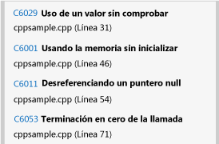
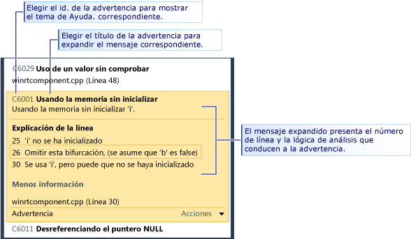
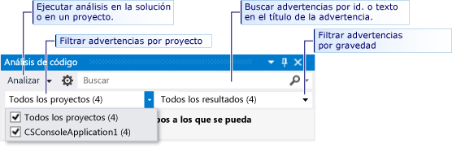

# Analizar la calidad del código de C++ de las aplicaciones de la Tienda utilizando análisis de código estático de Visual Studio
  
  
 La herramienta de análisis de código de las versiones de Visual Studio Express Edition examina el código para detectar una serie de problemas comunes e infracciones de las prácticas recomendadas de programación. Las advertencias del análisis de código son distintas de los errores y advertencias del compilador, porque el análisis de código busca patrones de código concretos que, aunque son válidos, pueden crear problemas para ti o para otros usuarios del código. El análisis de código también puede encontrar defectos del código que son difíciles de detectar al hacer las pruebas. Ejecutar la herramienta de análisis de código a intervalos regulares durante el proceso de desarrollo puede mejorar la calidad de la aplicación final.  
  
> [!NOTE]
>  En Visual Studio Ultimate, Visual Studio Premium y Visual Studio Professional, puede usar la funcionalidad completa de las herramientas de análisis de código. Consulte [Analizar la calidad de la aplicación mediante herramientas de análisis del código](http://msdn.microsoft.com/library/dd264897.aspx) en la MSDN Library.  
  
## En este tema  
 Puedes obtener información sobre:  
  
 [Ejecutar análisis de código](../test/analyze-cpp-code-quality-of-store-apps-using-visual-studio-static-code-analysis.md#BKMK_Run)  
  
 [Analizar y resolver advertencias del análisis de código](../test/analyze-cpp-code-quality-of-store-apps-using-visual-studio-static-code-analysis.md#BKMK_Analyze)  
  
 [Suprimir las advertencias de análisis de código](../test/analyze-cpp-code-quality-of-store-apps-using-visual-studio-static-code-analysis.md#BKMK_Suppress)  
  
 [Buscar y filtrar resultados del análisis de código](../test/analyze-cpp-code-quality-of-store-apps-using-visual-studio-static-code-analysis.md#BKMK_Search)  
  
 [Advertencias de análisis de código de C++](../test/analyze-cpp-code-quality-of-store-apps-using-visual-studio-static-code-analysis.md#Warnings)  
  
##   Ejecutar análisis de código  
 Para ejecutar un análisis de código en la solución de Visual Studio:  
  
-   En el menú **Compilar**, elija **Ejecutar análisis de código en la solución**.  
  
 Para ejecutar automáticamente el análisis de código cada vez que compiles un proyecto:  
  
1.  Elija el nombre del proyecto en el Explorador de soluciones y elija **Propiedades**.  
  
2.  En la página de propiedades del proyecto, elija **Análisis de código** y después **Habilitar análisis de código para C/C++ al compilar**.  
  
 Se compila la solución y se ejecuta el análisis de código. Los resultados aparecen en la ventana Análisis de código.  
  
   
  
##   Analizar y resolver advertencias del análisis de código  
 Para analizar una advertencia concreta, elija el título en la ventana Análisis de código. La advertencia se expande para mostrar información detallada sobre el problema. Cuando sea posible, el análisis de código mostrará el número de línea y la lógica del análisis que ha provocado la advertencia.  
  
   
  
 Cuando se expande una advertencia, las líneas de código que han causado la advertencia se resaltan en el editor de código de Visual Studio.  
  
   
  
 Cuando haya entendido el problema, podrá resolverlo en el código. A continuación vuelva a ejecutar el análisis de código para asegurarse de que la advertencia ya no aparece en la ventana de análisis de código y que la corrección no genera nuevas advertencias.  
  
> [!TIP]
>  Puedes repetir el análisis de código desde la ventana Análisis de código. Elija el botón **Analizar** y después elija el ámbito del análisis. Puedes repetir el análisis en toda la solución o en el proyecto seleccionado.  
  
##   Suprimir las advertencias de análisis de código  
 A veces, uno decide no corregir una advertencia del análisis de código. Puede ser que para resolverla se necesita un esfuerzo de codificación excesivo en proporción con la probabilidad de que el problema surja en las implementaciones reales del código. O puede que consideres que el análisis que ha dado lugar a la advertencia no es apropiado para ese contexto concreto. Puedes suprimir advertencias individuales de modo que ya no aparezcan en la ventana Análisis de código.  
  
 Para suprimir una advertencia:  
  
1.  Si la información detallada no aparece, expanda el título de la advertencia.  
  
2.  Elige el vínculo **Acciones** en la parte inferior de la advertencia.  
  
3.  Elija **Suprimir mensaje** y después **En origen**.  
  
 Al suprimir un mensaje se inserta un identificador `#pragma(warning:`*WarningId*`)` que suprime la advertencia en la línea de código.  
  
##   Buscar y filtrar resultados del análisis de código  
 Puedes buscar en las listas largas de mensajes de advertencia y filtrar las advertencias en las soluciones de varios proyectos.  
  
   
  
##   Advertencias de análisis de código de C++  
 El análisis de código produce las advertencias siguientes para código de C++:  
  
|Regla|Descripción|  
|----------|-----------------|  
|[C6001](../code-quality/c6001.md)|Uso de la memoria sin inicializar|  
|[C6011](../code-quality/c6011.md)|Desreferenciación de un puntero null|  
|[C6029](../code-quality/c6029.md)|Uso de un valor sin comprobar|  
|[C6053](../code-quality/c6053.md)|Terminación en cero de la llamada|  
|[C6059](../code-quality/c6059.md)|Concatenación incorrecta|  
|[C6063](../code-quality/c6063.md)|Falta el argumento de cadena para la función de formato|  
|[C6064](../code-quality/c6064.md)|Falta el argumento de entero para la función de formato|  
|[C6066](../code-quality/c6066.md)|Falta el argumento de puntero para la función de formato|  
|[C6067](../code-quality/c6067.md)|Falta el argumento de puntero de cadena para la función de formato|  
|[C6101](../code-quality/c6101.md)|Devolución de memoria sin inicializar|  
|[C6200](../code-quality/c6200.md)|El índice supera el valor máximo para el búfer|  
|[C6201](../code-quality/c6201.md)|El índice supera el valor máximo para el búfer de pila|  
|[C6270](../code-quality/c6270.md)|Falta el argumento float para la función de formato|  
|[C6271](../code-quality/c6271.md)|Argumento adicional para la función de formato|  
|[C6272](../code-quality/c6272.md)|Argumento no flotante para la función de formato|  
|[C6273](../code-quality/c6273.md)|Argumento no entero para la función de formato|  
|[C6274](../code-quality/c6274.md)|Argumento sin caracteres para la función de formato|  
|[C6276](../code-quality/c6276.md)|Conversión de cadena no válida|  
|[C6277](../code-quality/c6277.md)|Llamada no válida a CreateProcess|  
|[C6284](../code-quality/c6284.md)|Argumento de objeto no válido para la función de formato|  
|[C6290](../code-quality/c6290.md)|Prioridad entre operadores NOT lógico y AND bit a bit|  
|[C6291](../code-quality/c6291.md)|Prioridad entre operadores NOT lógico y OR bit a bit|  
|[C6302](../code-quality/c6302.md)|Argumento de cadena de caracteres no válido para la función de formato|  
|[C6303](../code-quality/c6303.md)|Argumento de cadena de caracteres anchos no válido para la función de formato|  
|[C6305](../code-quality/c6305.md)|Error de coincidencia en el uso de size y count|  
|[C6306](../code-quality/c6306.md)|Llamada incorrecta a función de argumento variable|  
|[C6328](../code-quality/c6328.md)|Error de coincidencia de tipo de argumento potencial|  
|[C6385](../code-quality/c6385.md)|Saturación de lectura|  
|[C6386](../code-quality/c6386.md)|Saturación de escritura|  
|[C6387](../code-quality/c6387.md)|Valor de parámetro no válido|  
|[C6500](../code-quality/c6500.md)|Propiedad de atributo no válida|  
|[C6501](../code-quality/c6501.md)|Valores de propiedad de atributo en conflicto|  
|[C6503](../code-quality/c6503.md)|Las referencias no pueden ser null|  
|[C6504](../code-quality/c6504.md)|Null en valores que no son de puntero|  
|[C6505](../code-quality/c6505.md)|MustCheck en valores void|  
|[C6506](../code-quality/c6506.md)|Tamaño de búfer en valores que no son de puntero o matriz|  
|[C6507](http://msdn.microsoft.com/en-us/18f88cd1-d035-4403-a6a4-12dd0affcf21)|No coincidencia Null en desreferenciación cero|  
|[C6508](../code-quality/c6508.md)|Acceso de escritura en valores constantes|  
|[C6509](../code-quality/c6509.md)|Return usado en condición previa|  
|[C6510](../code-quality/c6510.md)|NullTerminated en valores que no son de puntero|  
|[C6511](../code-quality/c6511.md)|MustCheck debe ser Yes o No|  
|[C6513](../code-quality/c6513.md)|ElementSize sin tamaño de búfer|  
|[C6514](../code-quality/c6514.md)|El tamaño del búfer supera el tamaño de la matriz|  
|[C6515](../code-quality/c6515.md)|Tamaño de búfer en valores que no son de puntero|  
|[C6516](../code-quality/c6516.md)|No hay propiedades del atributo|  
|[C6517](../code-quality/c6517.md)|Tamaño válido en búfer no legible|  
|[C6518](../code-quality/c6518.md)|Tamaño de escritura en búfer no modificable|  
|[C6519](http://msdn.microsoft.com/en-us/2b6326b0-0539-4d26-8fb1-720114933232)|Anotación no válida: el valor de la propiedad 'NeedsRelease' debe ser Yes o No|  
|[C6521](http://msdn.microsoft.com/en-us/e98d0ae3-6f13-47b2-9a15-15d4055af9ef)|Desreferenciación de cadena de tamaño no válida|  
|[C6522](../code-quality/c6522.md)|Tipo de cadena de tamaño no válido|  
|[C6523](http://msdn.microsoft.com/en-us/11397a31-b224-46b0-afb7-d49ca576a3bb)|Parámetro de cadena de tamaño no válido|  
|[C6525](../code-quality/c6525.md)|Cadena de tamaño no válida, ubicación inaccesible|  
|[C6526](http://msdn.microsoft.com/en-us/59c590c7-0098-4166-a1ac-87f324596002)|Tipo de búfer de cadena de tamaño no válido|  
|[C6527](../code-quality/c6527.md)|Anotación no válida: la propiedad 'NeedsRelease' no se puede usar en valores de tipo void|  
|[C6530](../code-quality/c6530.md)|Estilo de cadena de formato no reconocido|  
|[C6540](../code-quality/c6540.md)|El uso de anotaciones de atributo en esta función invalidará todas las anotaciones __declspec existentes|  
|[C6551](../code-quality/c6551.md)|Especificación de tamaño no válido: no se puede analizar la expresión|  
|[C6552](../code-quality/c6552.md)|Valor Deref= o Notref= no válido: no se puede analizar la expresión|  
|[C6701](../code-quality/c6701.md)|Este no es un valor Yes/No/Maybe válido|  
|[C6702](../code-quality/c6702.md)|Este no es un valor de cadena|  
|[C6703](../code-quality/c6703.md)|El valor no es un número|  
|[C6704](../code-quality/c6704.md)|Error de expresión de anotación inesperado|  
|[C6705](../code-quality/c6705.md)|El número esperado de argumentos para la anotación no coincide con el número real de argumentos para la anotación|  
|[C6706](../code-quality/c6706.md)|Error inesperado de la anotación|  
|[C28021](../code-quality/c28021.md)|El parámetro que se va a anotar debe ser un puntero|  
|[C28182](../code-quality/c28182.md)|Desreferenciación de un puntero null. El puntero contiene el mismo valor NULL que otro puntero.|  
|[C28202](../code-quality/c28202.md)|Referencia no válida a un miembro no estático|  
|[C28203](../code-quality/c28203.md)|Referencia ambigua a un miembro de la clase.|  
|[C28205](../code-quality/c28205.md)|_Success\_ o _On_failure\_ usados en un contexto no válido|  
|[C28206](../code-quality/c28206.md)|El operando izquierdo señala a un struct, use '->'|  
|[C28207](../code-quality/c28207.md)|El operando izquierdo es un struct, use '->'|  
|[C28210](../code-quality/c28210.md)|Las anotaciones del contexto __on_failure no deben estar en un contexto previo explícito|  
|[C28211](../code-quality/c28211.md)|Se esperaba un nombre de contexto estático para SAL_context|  
|[C28212](../code-quality/c28212.md)|Se esperaba una expresión de puntero para la anotación|  
|[C28213](../code-quality/c28213.md)|La anotación _Use_decl_annotations\_ se debe usar para hacer referencia, sin modificación, a una declaración anterior.|  
|[C28214](../code-quality/c28214.md)|Los nombres de los parámetros de atributo deben ser p1...p9|  
|[C28215](../code-quality/c28215.md)|typefix no se puede aplicar a un parámetro que ya tenga un typefix|  
|[C28216](../code-quality/c28216.md)|La anotación checkReturn solamente se aplica a las condiciones posteriores del parámetro de la función específica.|  
|[C28217](../code-quality/c28217.md)|Para la función, el número de parámetros de la anotación no coincide con el encontrado en el archivo|  
|[C28218](../code-quality/c28218.md)|Para el parámetro de la función, el parámetro de la anotación no coincide con el encontrado en el archivo|  
|[C28219](../code-quality/c28219.md)|Se esperaba un miembro de enumeración para el parámetro de la anotación|  
|[C28220](../code-quality/c28220.md)|Se esperaba una expresión de entero para el parámetro de la anotación|  
|[C28221](../code-quality/c28221.md)|Se esperaba una expresión de cadena para el parámetro de la anotación|  
|[C28222](../code-quality/c28222.md)|Se esperaba __yes, \__no, o \__maybe para la anotación|  
|[C28223](../code-quality/c28223.md)|No se encontró el token o identificador para la anotación, parámetro|  
|[C28224](../code-quality/c28224.md)|La anotación requiere parámetros|  
|[C28225](../code-quality/c28225.md)|No se encontró el número correcto de parámetros necesarios en la anotación|  
|[C28226](../code-quality/c28226.md)|La anotación no puede ser un PrimOp (en la declaración actual)|  
|[C28227](../code-quality/c28227.md)|La anotación no puede ser un PrimOp (consulte la declaración anterior)|  
|[C28228](../code-quality/c28228.md)|Parámetro de anotación: no se puede usar un tipo en las anotaciones|  
|[C28229](../code-quality/c28229.md)|La anotación no admite parámetros|  
|[C28230](../code-quality/c28230.md)|El tipo de parámetro no tiene ningún miembro.|  
|[C28231](../code-quality/c28231.md)|La anotación solo es válida en la matriz|  
|[C28232](../code-quality/c28232.md)|pre, post o deref no se aplican a ninguna anotación|  
|[C28233](../code-quality/c28233.md)|pre, post o deref se aplican a un bloque|  
|[C28234](../code-quality/c28234.md)|La expresión __at no se aplica a la función actual|  
|[C28235](../code-quality/c28235.md)|La función no puede actuar por sí sola como una anotación|  
|[C28236](../code-quality/c28236.md)|La anotación no se puede usar en una expresión|  
|[C28237](../code-quality/c28237.md)|La anotación del parámetro ya no se admite|  
|[C28238](../code-quality/c28238.md)|La anotación del parámetro tiene más de un valor, stringValue y longValue Use paramn=xxx|  
|[C28239](../code-quality/c28239.md)|La anotación del parámetro tiene el valor stringValue o longValue, y paramn=xxx. Use solo paramn=xxx|  
|[C28240](../code-quality/c28240.md)|La anotación del parámetro tiene param2 pero no param1|  
|[C28241](../code-quality/c28241.md)|La anotación para la función del parámetro no se reconoce|  
|[C28243](../code-quality/c28243.md)|La anotación para la función del parámetro requiere más desreferenciaciones de las que permite el tipo real anotado|  
|[C28245](../code-quality/c28245.md)|La anotación para la función anota 'this' en una en una función no miembro|  
|[C28246](../code-quality/c28246.md)|La anotación del parámetro para la función no coincide con el tipo del parámetro|  
|[C28250](../code-quality/c28250.md)|Anotación incoherente de la función: la instancia anterior tiene un error.|  
|[C28251](../code-quality/c28251.md)|Anotación incoherente de la función: esta instancia tiene un error.|  
|[C28252](../code-quality/c28252.md)|Anotación incoherente de la función: el parámetro tiene otra anotación en esta instancia.|  
|[C28253](../code-quality/c28253.md)|Anotación incoherente de la función: el parámetro tiene otra anotación en esta instancia.|  
|[C28254](../code-quality/c28254.md)|dynamic_cast<>() no se admite en anotaciones|  
|[C28262](../code-quality/c28262.md)|Se encontró un error de sintaxis de anotación en la función, para la anotación|  
|[C28263](../code-quality/c28263.md)|Se encontró un error de sintaxis en una anotación condicional para la anotación intrínseca|  
|[C28264](http://msdn.microsoft.com/en-us/bf6ea983-a06e-4752-a042-747a7dbf338c)|Los valores de listas de resultados deben ser constantes.|  
|[C28267](../code-quality/c28267.md)|Se encontró un error de sintaxis de anotaciones en la función.|  
|[C28272](../code-quality/c28272.md)|La anotación del parámetro de la función, al examinar su incoherencia con la declaración de la función|  
|[C28273](../code-quality/c28273.md)|Para la función, las pistas son incoherentes con la declaración de la función|  
|[C28275](../code-quality/c28275.md)|El parámetro para _Macro_value\_ es null|  
|[C28279](../code-quality/c28279.md)|Para el símbolo, se encontró un 'begin' sin un 'end' coincidente|  
|[C28280](../code-quality/c28280.md)|Para el símbolo, se encontró un 'end' sin un 'begin' coincidente|  
|[C28282](../code-quality/c28282.md)|Las cadenas de formato deben estar en las condiciones previas|  
|[C28285](../code-quality/c28285.md)|Para la función, error de sintaxis en el parámetro|  
|[C28286](../code-quality/c28286.md)|Para la función, error de sintaxis cerca del final|  
|[C28287](../code-quality/c28287.md)|Para la función, error de sintaxis en la anotación _At\_() (nombre de parámetro no reconocido)|  
|[C28288](../code-quality/c28288.md)|Para la función, error de sintaxis en la anotación _At\_() (nombre de parámetro no válido)|  
|[C28289](../code-quality/c28289.md)|Para la función: ReadableTo o WritableTo no tenían una especificación de límite como parámetro|  
|[C28290](../code-quality/c28290.md)|la anotación de la función contiene más valores External que el número real de parámetros|  
|[C28291](../code-quality/c28291.md)|El valor null/notnull posterior en el nivel 0 de desreferenciación carece de sentido para la función.|  
|[C28300](../code-quality/c28300.md)|Operandos de expresión de tipos no compatibles para el operador|  
|[C28301](../code-quality/c28301.md)|No hay anotaciones para la primera declaración de la función.|  
|[C28302](../code-quality/c28302.md)|Se encontró un operador _Deref\_ adicional en la anotación.|  
|[C28303](../code-quality/c28303.md)|Se encontró un operador _Deref\_ ambiguo en la anotación.|  
|[C28304](../code-quality/c28304.md)|Se encontró un operador _Notref\_ mal colocado aplicado al token.|  
|[C28305](../code-quality/c28305.md)|Se descubrió un error al analizar un token.|  
|[C28350](../code-quality/c28350.md)|La anotación describe una situación no aplicable de forma condicional.|  
|[C28351](../code-quality/c28351.md)|La anotación describe dónde no se puede usar un valor dinámico (una variable) en la condición.|

