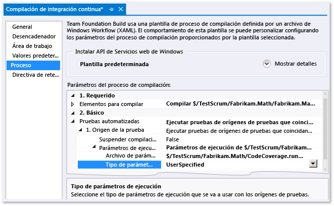

# Analizar la cobertura de código en pruebas de comprobación de la compilación
El análisis de cobertura de código de Microsoft Visual Studio muestra que cantidad del código ejecutan las pruebas automatizadas. Para obtener más información, consulte [Usar cobertura de código para determinar la cantidad de código que se está probando](../test/using-code-coverage-to-determine-how-much-code-is-being-tested.md).  
  
 Al insertar en el repositorio el código, las pruebas se ejecutarán en el servidor de compilación, junto con todas las demás pruebas de otros miembros del equipo. (Si aún no lo ha configurado, vea [Ejecutar pruebas en el proceso de compilación](http://msdn.microsoft.com/Library/d05743a1-c5cf-447e-bed9-bed3cb595e38)). Es útil analizar la cobertura de código del servicio de compilación, porque proporciona la imagen más actualizada y más completa de cobertura de todo el proyecto. También se incluyen las pruebas del sistema automatizadas y otras pruebas codificadas que no se ejecutan normalmente en los equipos de desarrollo.  
  
1.  En Team Explorer, abra **Compilaciones** y agregue o modifique una definición de compilación.  
  
2.  En la página **Proceso**, expanda **Pruebas automatizadas**, **Origen de la prueba**, **Parámetros de ejecución**. Establezca **Tipo de archivo de parámetros de configuración** en **Cobertura de código habilitada**.  
  
     Si tiene más de una definición de origen de la prueba, repita este paso para cada una.  
  
    -   *Pero no hay ningún campo denominado**Tipo de archivo de parámetros de ejecución**.*  
  
         En **Pruebas automatizadas**, seleccione **Ensamblado de prueba** y elija los puntos suspensivos **[...]** al final de la línea. En el cuadro de diálogo **Agregar o editar serie de pruebas**, en **Ejecutor de pruebas**, elija **Ejecutor de pruebas de Visual Studio**.  
  
   
  
 Después de que la compilación se ejecute, los resultados de cobertura de código aparecen en el resumen de la compilación.  
  
## Vea también  
 [Usar cobertura de código para determinar la cantidad de código que se está probando](../test/using-code-coverage-to-determine-how-much-code-is-being-tested.md)
