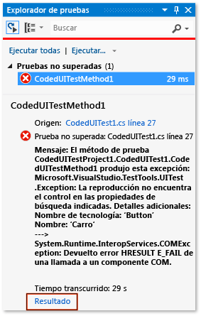
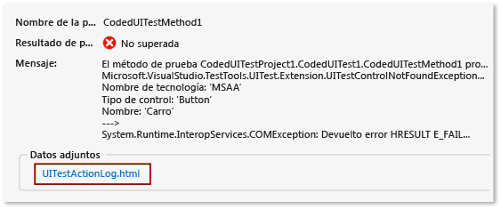
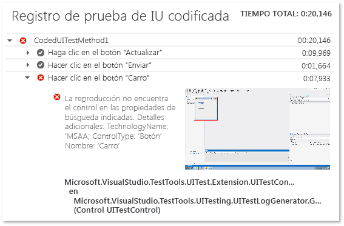

# <a name="analyzing-coded-ui-tests-using-coded-ui-test-logs"></a>Análisis de pruebas automatizadas de IU mediante los registros de pruebas automatizadas de IU

Los registros de pruebas de IU codificadas filtran y guardan información importante sobre las series de pruebas de IU codificadas. Los registros se muestran en un formato que permite depurar problemas rápidamente.

[!INCLUDE [coded-ui-test-deprecation](includes/coded-ui-test-deprecation.md)]

## <a name="step-1-enable-logging"></a>Paso 1: Habilite el registro

En función de su escenario, use uno de los siguientes métodos para habilitar el registro:

- Si no hay ningún archivo *App.config* en el proyecto de prueba:

   1. Determine qué proceso *QTAgent\*.exe* se inicia al ejecutar la prueba. Una forma de hacerlo es ver la pestaña **Detalles** en el **Administrador de tareas** de Windows.

   2. Abra el correspondiente archivo *.config* de archivos desde la carpeta *%ProgramFiles(x86)%\Microsoft Visual Studio\\\<version>\\\<edition>\Common7\IDE*. Por ejemplo, si el proceso que se ejecuta es *QTAgent_40.exe*, abra *QTAgent_40.exe.config*.

   2. Modifique el valor de **EqtTraceLevel** para que tenga el nivel de registro que quiera.

      ```xml
      <!-- You must use integral values for "value".
           Use 0 for off, 1 for error, 2 for warn, 3 for info, and 4 for verbose. -->
      <add name="EqtTraceLevel" value="4" />
      ```

   3. Guarde el archivo.

- Si hay un archivo *App.config* en el proyecto de prueba:

  - Abra el archivo *App.config* en el proyecto y agregue el siguiente código bajo el nodo de configuración:

    ```xml
    <system.diagnostics>
      <switches>
        <add name="EqtTraceLevel" value="4" />
      </switches>
    </system.diagnostics>`
    ```

- Habilitar el registro desde el propio código de prueba:

   ```csharp
   Microsoft.VisualStudio.TestTools.UITesting.PlaybackSettings.LoggerOverrideState = HtmlLoggerState.AllActionSnapshot;
   ```

## <a name="step-2-run-your-coded-ui-test-and-view-the-log"></a>Paso 2: Ejecutar la prueba de IU codificada y ver el registro

Cuando ejecute una prueba automatizada de IU una vez realizadas las modificaciones en el archivo *QTAgent32\*.exe.config*, verá que hay un vínculo de salida en los resultados del **Explorador de pruebas**. Los archivos de registro no solo se generan cuando la prueba produzca un error, sino también para las pruebas correctas cuando el nivel de seguimiento sea **detallado**.

1. En el menú **Prueba**, seleccione **Ventanas** y después elija **Explorador de pruebas**.

2. En el menú **Compilar** , elija **Compilar solución**.

3. En el **Explorador de pruebas**, seleccione la prueba automatizada de IU que quiera ejecutar, abra el menú contextual y después elija **Ejecutar pruebas seleccionadas**.

     Las pruebas automatizadas se ejecutan e indican si se superan o no.

    > [!TIP]
    > Para ver el **Explorador de pruebas**, elija **Prueba** > **Ventanas** y, después, seleccione **Explorador de pruebas**.

4. Elija el vínculo **Resultado** en el **Explorador de pruebas**.

     

     Con esto se muestra la salida de la prueba, que incluye un vínculo al registro de acciones.

     

5. Elija el vínculo *UITestActionLog.html*.

     El registro se muestra en el explorador web.

     

## <a name="see-also"></a>Vea también

- [Usar la automatización de la interfaz de usuario para probar el código](../test/use-ui-automation-to-test-your-code.md)
- [Cómo: Ejecutar pruebas desde Microsoft Visual Studio](https://msdn.microsoft.com/Library/1a1207a9-2a33-4a1e-a1e3-ddf0181b1046)
