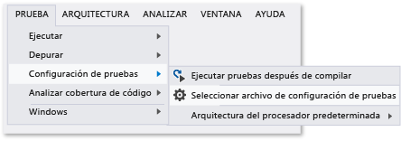

# <a name="configure-unit-tests-by-using-a-runsettings-file"></a>Configurar pruebas unitarias usando un archivo .runsettings
Las pruebas unitarias en Visual Studio se pueden configurar mediante un archivo \*.runsettings. (El nombre de archivo no importa, siempre que use la extensión ".runsettings"). Por ejemplo, puede cambiar el .NET Framework en el que se ejecutarán las pruebas, el directorio en el que se entregan los resultados de las pruebas y los datos recopilados durante una serie de pruebas.  
  
 Si no quiere realizar ninguna configuración especial, no necesita un archivo \*.runsettings. El uso más frecuente es personalizar [Cobertura de código](../test/customizing-code-coverage-analysis.md).  
  
> [!NOTE]
>  **.runsettings y .testsettings**  
>   
>  Hay dos tipos de archivos para configurar las pruebas. Los archivos \*.runsettings se usan para las pruebas unitarias. mientras que los archivos \*.testsettings se usan para las [pruebas en entorno de laboratorio](/devops-test-docs/test/specifying-test-settings-for-visual-studio-tests), las pruebas de rendimiento web y las pruebas de carga, así como para personalizar determinados tipos de adaptadores de datos de diagnóstico como, por ejemplo, los adaptadores de registros de IntelliTrace y de eventos.  
>   
>  En las ediciones anteriores de Visual Studio hasta la versión 2010, las pruebas unitarias también se personalizaban mediante archivos \*.testsettings. Puede seguir realizando esa acción, pero las pruebas se ejecutarán más despacio que si usara las configuraciones equivalentes en un archivo \*.runsettings.  
  
## <a name="customizing-tests-with-a-runsettings-file"></a>Personalizar pruebas con un archivo .runsettings  
  
1.  Agregue un archivo XML a la solución Visual Studio y cámbiele el nombre para que sea test.runsettings. (El nombre de archivo no importa, pero la extensión debe ser .runsettings).  
  
2.  Reemplace el contenido del archivo con el [ejemplo](#example).  
  
     Edite los valores según sus necesidades.  
  
3.  En el menú **Prueba** , elija **Configuración de pruebas**, **Seleccionar archivo de configuración de pruebas**.  
  
 Puede crear más de un archivo \*.runsettings en la solución y habilitarlo o deshabilitarlo en momentos diferentes en el menú **Configuración de pruebas**.  
  
   
  
##  <a name="example"></a> Copiar este archivo de ejemplo .runsettings  
 A continuación se muestra un archivo \*.runsettings típico. Cada elemento del archivo es opcional, porque cada valor tiene una configuración predeterminada.  
  
```xml  
<?xml version="1.0" encoding="utf-8"?>  
<RunSettings>  
  <!-- Configurations that affect the Test Framework -->  
  <RunConfiguration>  
    <MaxCpuCount>1</MaxCpuCount>  
    <!-- Path relative to solution directory -->  
    <ResultsDirectory>.\TestResults</ResultsDirectory>  
  
    <!-- [x86] | x64    
      - You can also change it from menu Test, Test Settings, Default Processor Architecture -->  
    <TargetPlatform>x86</TargetPlatform>  
  
    <!-- Framework35 | [Framework40] | Framework45 -->  
    <TargetFrameworkVersion>Framework40</TargetFrameworkVersion>  
  
    <!-- Path to Test Adapters -->  
    <TestAdaptersPaths>%SystemDrive%\Temp\foo;%SystemDrive%\Temp\bar</TestAdaptersPaths>  
  </RunConfiguration>  
  
  <!-- Configurations for data collectors -->  
  <DataCollectionRunSettings>  
    <DataCollectors>  
      <DataCollector friendlyName="Code Coverage" uri="datacollector://Microsoft/CodeCoverage/2.0" assemblyQualifiedName="Microsoft.VisualStudio.Coverage.DynamicCoverageDataCollector, Microsoft.VisualStudio.TraceCollector, Version=11.0.0.0, Culture=neutral, PublicKeyToken=b03f5f7f11d50a3a">  
        <Configuration>  
          <CodeCoverage>  
            <ModulePaths>  
              <Exclude>  
                <ModulePath>.*CPPUnitTestFramework.*</ModulePath>  
              </Exclude>  
            </ModulePaths>  
  
            <!-- We recommend you do not change the following values: -->  
            <UseVerifiableInstrumentation>True</UseVerifiableInstrumentation>  
            <AllowLowIntegrityProcesses>True</AllowLowIntegrityProcesses>  
            <CollectFromChildProcesses>True</CollectFromChildProcesses>  
            <CollectAspDotNet>False</CollectAspDotNet>  
  
          </CodeCoverage>  
        </Configuration>  
      </DataCollector>  
  
    </DataCollectors>  
  </DataCollectionRunSettings>  
  
  <!-- Parameters used by tests at runtime -->  
  <TestRunParameters>  
    <Parameter name="webAppUrl" value="http://localhost" />  
    <Parameter name="webAppUserName" value="Admin" />  
    <Parameter name="webAppPassword" value="Password" />  
  </TestRunParameters>  
  
  <!-- Adapter Specific sections -->  
  
  <!-- MSTest adapter -->  
  <MSTest>  
    <MapInconclusiveToFailed>True</MapInconclusiveToFailed>  
    <CaptureTraceOutput>false</CaptureTraceOutput>  
    <DeleteDeploymentDirectoryAfterTestRunIsComplete>False</DeleteDeploymentDirectoryAfterTestRunIsComplete>  
    <DeploymentEnabled>False</DeploymentEnabled>  
    <AssemblyResolution>  
      <Directory Path="D:\myfolder\bin\" includeSubDirectories="false"/>  
    </AssemblyResolution>  
  </MSTest>  
  
</RunSettings>  
```  
  
 El archivo .runsettings también se usa para configurar la [Cobertura de código](../test/customizing-code-coverage-analysis.md).  
  
 El resto de este tema describe el contenido del archivo.  
  
## <a name="edit-your-runsettings-file"></a>Editar el archivo .runsettings  
 El archivo .runsettings tiene los elementos siguientes.  
  
### <a name="test-run-configuration"></a>Configuración de serie de pruebas  
  
|Nodo|Default|Valores|  
|----------|-------------|------------|  
|`ResultsDirectory`||El directorio en el que se colocarán los resultados de las pruebas.|  
|`TargetFrameworkVersion`|Framework40|Framework35, Framework40, Framework45<br /><br /> Esto especifica qué versión del marco de pruebas unitarias se utiliza para detectar y ejecutar las pruebas. Puede ser diferente de la versión de la plataforma .NET que especifique en las propiedades de compilación del proyecto de prueba unitaria.|  
|`TargetPlatform`|x86|x86, x64|  
|`TreatTestAdapterErrorsAsWarnings`|false|false, true|  
|`TestAdaptersPaths`||Una o varias rutas de acceso al directorio donde se encuentran los TestAdapters|  
|`MaxCpuCount`|1|Esto controla el grado de ejecución de pruebas paralelas cuando se ejecutan pruebas unitarias, mediante núcleos disponibles en el equipo.  El motor de ejecución de pruebas se inicia como un proceso distinto en cada núcleo disponible y proporciona a cada núcleo un contenedor con pruebas que se deben ejecutar, como por ejemplo un ensamblado, un archivo DLL o un artefacto relevante.  El contenedor de pruebas es la unidad de programación.  En cada contenedor, las pruebas se ejecutan según el marco de pruebas.  Si hay muchos contenedores, a medida que los procesos finalizan la ejecución de las pruebas en un contenedor, se les proporciona el siguiente contenedor disponible.<br /><br /> El valor de MaxCpuCount puede ser:<br /><br /> n, donde 1 <= n <= número de núcleos: se iniciarán hasta n procesos<br /><br /> n, donde n = cualquier otro valor: el número de procesos que se iniciarán será como máximo el número de núcleos disponibles en la máquina|  
  
### <a name="diagnostic-data-adapters-data-collectors"></a>Adaptadores de datos de diagnóstico (recopiladores de datos)  
 El elemento `DataCollectors` especifica la configuración de los adaptadores de datos de diagnóstico. Los adaptadores de datos de diagnóstico se utilizan para recopilar información adicional sobre el entorno y la aplicación en pruebas. Cada adaptador tiene una configuración predeterminada, por lo que solo tiene que proporcionar valores si no quiere usar los predeterminados.  
  
#### <a name="code-coverage-adapter"></a>Adaptador de cobertura de código  
 El recopilador de datos de cobertura de código crea un registro de las partes del código de aplicación que se han empleado en las pruebas. Para obtener más información sobre la personalización de los valores de cobertura de código, vea [Personalizar el análisis de la cobertura de código](../test/customizing-code-coverage-analysis.md).  
  
#### <a name="other-diagnostic-data-adapters"></a>Otros adaptadores de datos de diagnóstico  
 El adaptador de cobertura de código es actualmente el único adaptador que se puede personalizar mediante el archivo de configuración de ejecución.  
  
 Para personalizar cualquier otro tipo de adaptador de datos de diagnóstico, debe usar un archivo de configuración de pruebas. Para obtener más información, consulte [Especificar la configuración de prueba para las pruebas en Visual Studio](/devops-test-docs/test/specifying-test-settings-for-visual-studio-tests).  
  
#### <a name="testrunparameters"></a>TestRunParameters  
 TestRunParameters proporciona una manera de definir las variables y los valores que están disponibles para las pruebas en tiempo de ejecución.  
  
### <a name="mstest-run-settings"></a>Parámetros de ejecución de MSTest  
 Estos valores son específicos del adaptador de pruebas que ejecuta métodos de prueba con el atributo `[TestMethod]` .  
  
|Configuración|Default|Valores|  
|-------------------|-------------|------------|  
|ForcedLegacyMode|false|En Visual Studio 2012, el adaptador MSTest se ha optimizado para que sea más rápido y escalable. Es posible que parte del comportamiento, como el orden en que se ejecutan las pruebas, no sea exactamente igual que en ediciones anteriores de Visual Studio. Establezca este valor en `true` para utilizar el adaptador de pruebas más antiguo.<br /><br /> Por ejemplo, puede utilizarlo si tiene un archivo app.config especificado para una prueba unitaria.<br /><br /> Se recomienda que considere la refactorización de las pruebas para poder usar el adaptador más reciente.|  
|IgnoreTestImpact|false|La característica de impacto de pruebas asigna prioridades a las pruebas afectadas por cambios recientes, cuando se ejecuta en MSTest o desde Microsoft Test Manager. Esta configuración desactiva la característica. Para obtener más información, consulte [Cómo: Recopilar datos para comprobar qué pruebas se deben ejecutar después de realizar cambios en el código](http://msdn.microsoft.com/Library/2f921ea1-9bb0-4870-a30f-0521fc22cb47).|  
|SettingsFile||Puede especificar un archivo de configuración de pruebas para usarlo con el adaptador MSTest aquí. También puede especificar un archivo de configuración de pruebas en el menú **Prueba**, **Configuración de pruebas**, **Seleccionar archivo de configuración de pruebas**.<br /><br /> Si especifica este valor, también debe establecer **ForcedlegacyMode** en **true**.<br /><br /> `<RunSettings>   <MSTest>     <SettingsFile>my.testsettings</SettingsFile>      <ForcedLegacyMode>true</ForcedLegacyMode>    </MSTest> </RunSettings>`|  
|KeepExecutorAliveAfterLegacyRun|false|Una vez completada una serie de pruebas, se cierra MSTest. Cualquier proceso que se inicie como parte de la prueba también se eliminará en este momento. Si desea mantener activo el ejecutor de pruebas, establezca esta configuración en true.<br /><br /> Por ejemplo, podría servir para mantener el explorador en ejecución entre pruebas de IU codificadas.|  
|DeploymentEnabled|true|Si lo establece en false, los elementos de implementación especificados en el método de prueba no se copian en el directorio de implementación.|  
|CaptureTraceOutput|true|Puede escribir en el seguimiento de depuración desde su método de prueba mediante Trace.WriteLine. Con esta configuración, puede desactivar estos seguimientos de depuración.|  
|DeleteDeploymentDirectoryAfterTestRunIsComplete|true|Puede conservar el directorio de implementación después de una serie de pruebas estableciendo este valor en false.|  
|MapInconclusiveToFailed|false|Si una prueba devuelve un estado no concluyente, se le asigna normalmente el estado Omitido en el Explorador de pruebas. Si desea que las pruebas no concluyentes se muestren como Error, utilice esta configuración.|  
|InProcMode|false|Si desea que las pruebas se ejecuten en el mismo proceso que el adaptador MSTest, establezca este valor en true. Este valor proporciona una pequeña mejora del rendimiento. Pero si una prueba finaliza con una excepción, el resto de pruebas no podrán continuar.|  
|AssemblyResolution|false|Puede especificar rutas de acceso a ensamblados adicionales cuando busque y ejecute pruebas unitarias.  Por ejemplo, puede utilizar estas rutas de acceso para los ensamblados de dependencias que no residan en el mismo directorio que el ensamblado de pruebas.  Para especificar una ruta de acceso, use un elemento "Directory Path".  Las rutas de acceso pueden contener variables de entorno.<br /><br /> `<AssemblyResolution>  <Directory Path>"D:\myfolder\bin\" includeSubDirectories="false"/> </AssemblyResolution>`|  
  
## <a name="see-also"></a>Vea también  
 [Personalizar el análisis de cobertura de código](../test/customizing-code-coverage-analysis.md)   
 [Especificar la configuración de pruebas para las pruebas en Visual Studio](/devops-test-docs/test/specifying-test-settings-for-visual-studio-tests)
