# <a name="create-a-data-driven-coded-ui-test"></a>Crear una prueba de IU codificada controlada por datos

Para probar las distintas condiciones, puede ejecutar las pruebas varias veces con distintos valores de parámetros. Las pruebas de IU codificada controlada por datos son una forma cómoda de hacerlo. Defina los valores de parámetros en un origen de datos, y cada fila de dicho origen de datos será una iteración de la prueba de IU codificada. El resultado general de la prueba se basará en el resultado de todas las iteraciones. Por ejemplo, si se produce un error en una iteración de la prueba, el resultado general es error.

**Requisitos**

- Visual Studio Enterprise
- Componente Prueba automatizada de IU

## <a name="create-a-test-project"></a>Crear un proyecto de prueba

En este ejemplo se crea una prueba de IU codificada que se ejecuta en la aplicación Calculadora de Windows. Esta suma dos números y utiliza una aserción para validar que la suma sea correcta. A continuación, la aserción y los valores de parámetro de ambos números se codifican para que se controlen por datos y se almacenan en un archivo de valores separados por comas (.*csv*).

### <a name="step-1---create-a-coded-ui-test"></a>Paso 1: crear una prueba de IU codificada

1.  Cree un proyecto.

     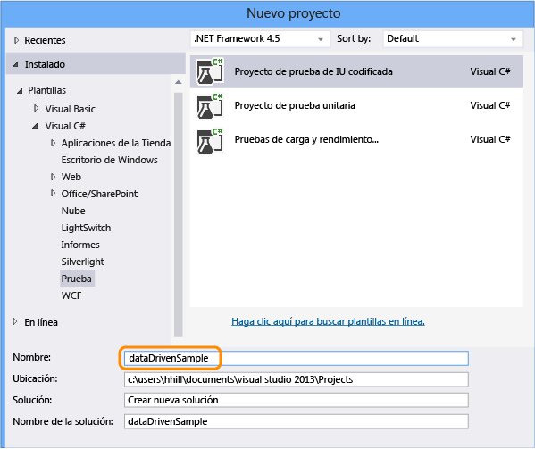

   > [!NOTE]
   > Si no ve la plantilla **Proyecto de prueba automatizada de IU**, necesitará [instalar el componente de prueba automatizada de IU](../test/use-ui-automation-to-test-your-code.md#install-the-coded-ui-test-component).

2.  Elija la opción de grabar las acciones.

     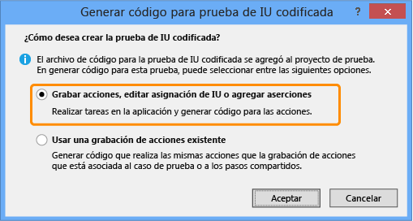

3.  Abra la aplicación Calculadora y empiece a grabar la prueba.

     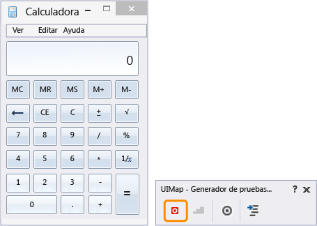

4.  Sume 1 más 2, pause la grabadora y genere el método de prueba. Más adelante reemplazaremos los valores de entrada del usuario con los valores de un archivo de datos.

     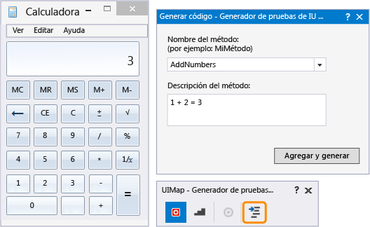

     Cierre el generador de pruebas. El método se agrega a la prueba:

    ```csharp
    [TestMethod]
    public void CodedUITestMethod1()
    {
        // To generate code for this test, select "Generate Code for Coded UI Test" from the shortcut menu and select one of the menu items.
        this.UIMap.AddNumbers();
    }
    ```

5.  Use el método `AddNumbers()` para comprobar que se ejecuta la prueba. Coloque el cursor en el método de prueba que se muestra arriba, abra el menú contextual y elija **Ejecutar pruebas**. (Método abreviado de teclado: **Control**+**R**,**T**).

     El resultado que indica si se ha superado la prueba se muestra en la ventana del Explorador de pruebas. Para abrir la ventana del Explorador de pruebas, en el menú **Prueba**, elija **Ventanas** y después **Explorador de pruebas**.

6.  Como un origen de datos puede usarse también para los valores de parámetro de aserción (los cuales usan la prueba para comprobar los valores esperados), vamos a agregar una aserción para validar que la suma de los dos números es correcta. Coloque el cursor en el método de prueba que se muestra arriba, abra el menú contextual y elija **Generar código para prueba de IU codificada** y después **Usar generador de pruebas de IU codificadas**.

     Asigne el control de texto de la calculadora que muestre la suma.

     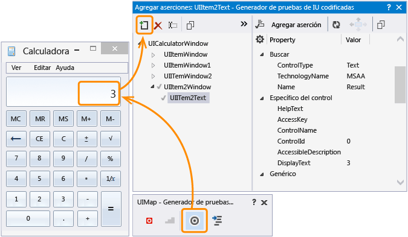

7.  Agregue una aserción que valide que el valor de la suma es correcto. Elija la propiedad **DisplayText** que tiene el valor**3** y después seleccione **Agregar aserción**. Use el comparador **AreEqual** y compruebe que el valor de comparación es **3**.

     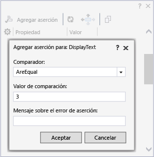

8.  Después de configurar la aserción, vuelva a generar código en el generador. De este modo se crea un nuevo método para la validación.

     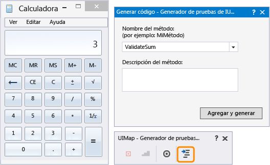

     Dado que el método `ValidateSum` valida los resultados del método `AddNumbers`, desplácelo a la parte inferior del bloque de código.

    ```csharp
    public void CodedUITestMethod1()
    {
        // To generate code for this test, select "Generate Code for Coded UI Test" from the shortcut menu and select one of the menu items.
        this.UIMap.AddNumbers();
        this.UIMap.ValidateSum();
    }
    ```

9. Compruebe que la prueba se ejecuta utilizando el método `ValidateSum()`. Coloque el cursor en el método de prueba que se muestra arriba, abra el menú contextual y elija **Ejecutar pruebas**. (Método abreviado de teclado: **Control**+**R**,**T**).

     En este momento, todos los valores de parámetro se definen en sus métodos como constantes. Después, vamos a crear un conjunto de datos para realizar la prueba controlada por datos.

### <a name="step-2---create-a-data-set"></a>Paso 2: crear un conjunto de datos

1.  Agregue al proyecto dataDrivenSample un archivo de texto llamado `data.csv`.

     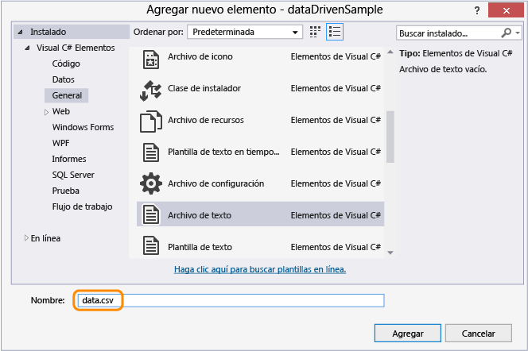

2.  Llene el archivo .*csv* con los siguientes datos:

    |Num1|Num2|Sum|
    |-|-|-|
    |3|4|7|
    |5|6|11|
    |6|8|14|

     Después de agregar los datos, el archivo debería ser similar al siguiente:

     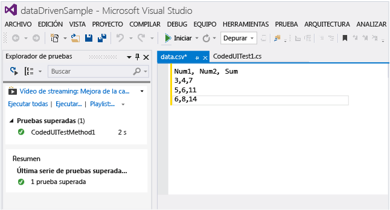

3.  Es importante que guarde el archivo .*csv* con la codificación correcta. En el menú **Archivo**, seleccione **Opciones avanzadas para guardar** y seleccione **Unicode (UTF-8 sin firma) – Página de códigos 65001** como codificación.

4.  El archivo .*csv* debe copiarse en el directorio de salida. De lo contrario, no podrá ejecutarse la prueba. Use la ventana **Propiedades** para copiarlo.

     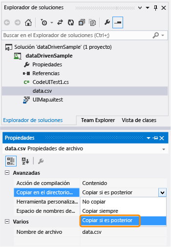

     Ahora que hemos creado el conjunto de datos, vamos a enlazar los datos a la prueba.

### <a name="step-3---add-data-source-binding"></a>Paso 3: agregar enlaces de origen de datos

1.  Para enlazar el origen de datos, agregue un atributo `DataSource` al atributo `[TestMethod]` existente situado inmediatamente encima del método de prueba.

    ```csharp
    [DataSource("Microsoft.VisualStudio.TestTools.DataSource.CSV", "|DataDirectory|\\data.csv", "data#csv", DataAccessMethod.Sequential), DeploymentItem("data.csv"), TestMethod]
    public void CodedUITestMethod1()
    {
        // To generate code for this test, select "Generate Code for Coded UI Test" from the shortcut menu and select one of the menu items.
        this.UIMap.AddNumbers();
        this.UIMap.ValidateSum();
    }
    ```

     El origen de datos está ahora disponible para su uso en este método de prueba.

    > [!TIP]
    > Consulte los [ejemplos de atributo de origen de datos](#CreateDataDrivenCUIT_QA_DataSourceAttributes) en la sección de preguntas y respuestas. Allí encontrará ejemplos del uso de otros tipos de origen de datos, como XML, SQL Express y Excel.

2.  Ejecute la prueba.

     Tenga en cuenta que la prueba se ejecuta a través de tres iteraciones. Esto se debe a que el origen de datos que se enlazó contiene tres filas de datos. Sin embargo, también observará que la prueba sigue utilizando los valores de parámetro constantes y que suma 1 + 2, lo que genera cada vez un resultado de 3.

     Después, configuraremos la prueba para usar los valores del archivo de origen de datos.

### <a name="step-4---use-the-data-in-the-coded-ui-test"></a>Paso 4: usar los datos de la prueba de IU codificada

1.  Agregue `using Microsoft.VisualStudio.TestTools.UITesting.WinControls` al principio del archivo *CodedUITest.cs*:

    ```csharp
    using System;
    using System.Collections.Generic;
    using System.Text.RegularExpressions;
    using System.Windows.Input;
    using System.Windows.Forms;
    using System.Drawing;
    using Microsoft.VisualStudio.TestTools.UITesting;
    using Microsoft.VisualStudio.TestTools.UnitTesting;
    using Microsoft.VisualStudio.TestTools.UITest.Extension;
    using Keyboard = Microsoft.VisualStudio.TestTools.UITesting.Keyboard;
    using Microsoft.VisualStudio.TestTools.UITesting.WinControls;
    ```

2.  Agregue `TestContext.DataRow[]` en el método `CodedUITestMethod1()` que aplicará valores del origen de datos. Los valores del origen de datos reemplazan las constantes asignadas a los controles UIMap utilizando los controles `SearchProperties`:

    ```csharp
    public void CodedUITestMethod1()
    {
        // To generate code for this test, select "Generate Code for Coded UI Test" from the shortcut menu and select one of the menu items.
        this.UIMap.UICalculatorWindow.UIItemWindow.UIItem1Button.SearchProperties[WinButton.PropertyNames.Name] = TestContext.DataRow["Num1"].ToString();this.UIMap.UICalculatorWindow.UIItemWindow21.UIItem2Button.SearchProperties[WinButton.PropertyNames.Name] = TestContext.DataRow["Num2"].ToString();
        this.UIMap.AddNumbers();
        this.UIMap.ValidateSumExpectedValues.UIItem2TextDisplayText = TestContext.DataRow["Sum"].ToString();
        this.UIMap.ValidateSum();
    }
    ```

     Para averiguar qué propiedades de búsqueda tienen datos por codificar, utilice el Editor de pruebas de IU codificadas.

    -   Abra el archivo UIMap.uitest.

         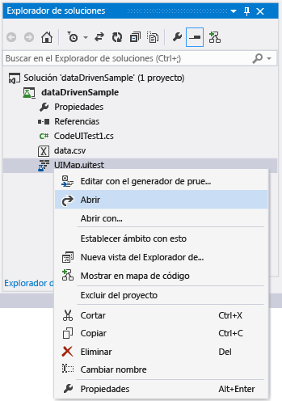

    -   Elija la acción de la IU y observe la asignación de controles de IU correspondientes. Fíjese en cómo la asignación se corresponde con el código, por ejemplo, `this.UIMap.UICalculatorWindow.UIItemWindow.UIItem1Button`.

         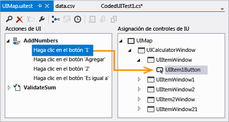

    -   En la ventana Propiedades, abra **Propiedades de búsqueda**. El valor **Nombre** de las propiedades de búsqueda es lo que se está manipulando en el código que utiliza el origen de datos. Por ejemplo, a `SearchProperties` se le asignan los valores de la primera columna de cada fila de datos: `UIItem1Button.SearchProperties[WinButton.PropertyNames.Name] = TestContext.DataRow["Num1"].ToString();`. Para las tres iteraciones, esta prueba cambiará el valor **Nombre** de la propiedad de búsqueda a 3, 5 y, por último, 6.

         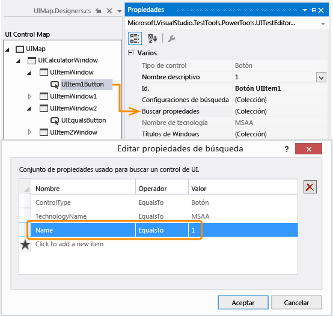

3.  Guarde la solución.

### <a name="step-5---run-the-data-driven-test"></a>Paso 5: ejecutar la prueba controlada por datos

1.  Compruebe que la prueba está ahora controlada por datos ejecutándola de nuevo.

     Debería ver como la prueba se ejecuta en las tres iteraciones usando los valores del archivo .*csv*. La validación también debería funcionar y la prueba debería mostrarse como superada en el Explorador de pruebas el paso.

## <a name="q--a"></a>Preguntas y respuestas

###  <a name="CreateDataDrivenCUIT_QA_DataSourceAttributes"></a> ¿Cuáles son los atributos de fuente de datos para otros tipos de orígenes de datos, como SQL Express o XML?

Puede utilizar las cadenas de origen de datos de muestra de la tabla siguiente copiándolas en el código y personalizándolas en caso necesario.

**Tipos y atributos de origen de datos**

-   CSV

     `[DataSource("Microsoft.VisualStudio.TestTools.DataSource.CSV", "|DataDirectory|\\data.csv", "data#csv", DataAccessMethod.Sequential), DeploymentItem("data.csv"), TestMethod]`

-   Excel

     `DataSource("System.Data.Odbc", "Dsn=ExcelFiles;Driver={Microsoft Excel Driver (*.xls)};dbq=|DataDirectory|\\Data.xls;defaultdir=.;driverid=790;maxbuffersize=2048;pagetimeout=5;readonly=true", "Sheet1$", DataAccessMethod.Sequential), DeploymentItem("Sheet1.xls"), TestMethod]`

-   Caso de prueba de Team Foundation Server

     `[DataSource("Microsoft.VisualStudio.TestTools.DataSource.TestCase", "http://vlm13261329:8080/tfs/DefaultCollection;Agile", "30", DataAccessMethod.Sequential), TestMethod]`

-   XML

     `[DataSource("Microsoft.VisualStudio.TestTools.DataSource.XML", "|DataDirectory|\\data.xml", "Iterations", DataAccessMethod.Sequential), DeploymentItem("data.xml"), TestMethod]`

-   SQL Express

     `[DataSource("System.Data.SqlClient", "Data Source=.\\sqlexpress;Initial Catalog=tempdb;Integrated Security=True", "Data", DataAccessMethod.Sequential), TestMethod]`

### <a name="q-why-cant-i-modify-the-code-in-the-uimapdesigner-file"></a>P: ¿Por qué no puedo modificar el código en el archivo UIMap.Designer?

**R:** Cualquier cambio que se efectúe en el código del archivo UIMapDesigner.cs se sobrescribirá cada vez que se genere código mediante UIMap - Generador de pruebas de IU codificadas. En este ejemplo, y en la mayoría de los casos, los cambios de código necesarios para habilitar una prueba para utilizar un origen de datos pueden introducirse en el archivo de código fuente de la prueba (es decir, CodedUITest1.cs).

Si tiene que modificar un método grabado, debe copiarlo en el archivo UIMap.cs y cambiar el nombre. El archivo UIMap.cs se puede utilizar para invalidar métodos y propiedades en el archivo UIMapDesigner.cs. Debe quitar la referencia al método original en el archivo UITest.cs el Codificado y reemplazarlo con el nombre del método cuyo nombre ha cambiado.

## <a name="see-also"></a>Vea también

- <xref:Microsoft.VisualStudio.TestTools.UITest.Common.UIMap.UIMap>
- <xref:Microsoft.VisualStudio.TestTools.UnitTesting.Assert>
- [Usar Automatización de la interfaz de usuario para probar el código](../test/use-ui-automation-to-test-your-code.md)
- [Crear pruebas de IU codificadas](../test/use-ui-automation-to-test-your-code.md)
- [Procedimientos recomendados para las pruebas de IU codificadas](../test/best-practices-for-coded-ui-tests.md)
- [Configuraciones y plataformas compatibles con las pruebas de IU codificadas y las grabaciones de acciones](../test/supported-configurations-and-platforms-for-coded-ui-tests-and-action-recordings.md)