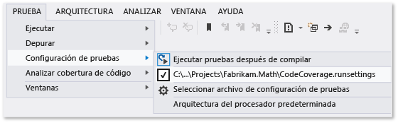

# <a name="customize-code-coverage-analysis"></a>Personalizar el análisis de cobertura de código

De forma predeterminada, la cobertura de código analiza todos los ensamblados de la solución que se cargan durante las pruebas unitarias. Se recomienda usar este comportamiento de forma predeterminada, porque funciona bien la mayoría de los casos. Para obtener más información, vea [Usar cobertura de código para determinar la cantidad de código que se está probando](../test/using-code-coverage-to-determine-how-much-code-is-being-tested.md).

Para excluir el código de prueba de los resultados de cobertura de código e incluir solo código de la aplicación, agregue el atributo <xref:System.Diagnostics.CodeAnalysis.ExcludeFromCodeCoverageAttribute> a la clase de prueba.

Para incluir ensamblados que no forman parte de la solución, obtenga los archivos *.pdb* para los ensamblados y cópielos en la misma carpeta que los archivos de ensamblado *.dll*.

## <a name="run-settings-file"></a>Archivo de parámetros de ejecución

Es el [archivo de parámetros de ejecución](../test/configure-unit-tests-by-using-a-dot-runsettings-file.md) que usan las herramientas de pruebas unitarias. La configuración avanzada de la cobertura de código se especifica en un archivo *.runsettings*.

Para personalizar la cobertura de código, siga estos pasos:

1. Agregue un archivo de parámetros de ejecución a la solución. En el **Explorador de soluciones**, en el menú contextual de la solución, seleccione **Agregar** > **Nuevo elemento** y seleccione **Archivo XML**. Guarde el archivo con un nombre como *CodeCoverage.runsettings*.

2. Agregue el contenido que se muestra en el archivo de ejemplo al final del artículo y después personalícelo de acuerdo con sus necesidades como se describe en las secciones siguientes.

::: moniker range="vs-2017"

3. Para seleccionar el archivo de parámetros de ejecución, en el menú **Prueba**, elija **Configuración de pruebas** > **Seleccionar archivo de configuración de pruebas**. Para especificar un archivo de parámetros de ejecución para ejecutar pruebas desde la línea de comandos, vea [Configuración de pruebas unitarias](../test/configure-unit-tests-by-using-a-dot-runsettings-file.md#command-line).

::: moniker-end

::: moniker range=">=vs-2019"

3. Para seleccionar el archivo de parámetros de ejecución, en el menú **Prueba**, elija **Seleccionar archivo de configuración**. Para especificar un archivo de parámetros de ejecución para ejecutar pruebas desde la línea de comandos, vea [Configuración de pruebas unitarias](../test/configure-unit-tests-by-using-a-dot-runsettings-file.md#command-line).

::: moniker-end

   Al seleccionar **Analizar cobertura de código**, la información de configuración se lee desde el archivo de parámetros de ejecución.

   > [!TIP]
   > Los anteriores resultados de cobertura y colores de código no se ocultan automáticamente al ejecutar pruebas o actualizar el código.

::: moniker range="vs-2017"

Para desactivar y activar la configuración personalizada, anule la selección o seleccione el archivo en el menú **Prueba** > **Configuración de pruebas**.



::: moniker-end

::: moniker range=">=vs-2019"

Para desactivar y activar la configuración personalizada, anule la selección o seleccione el archivo en el menú **Prueba**.

::: moniker-end

## <a name="symbol-search-paths"></a>Rutas de acceso de búsqueda de símbolos

La cobertura de código requiere que haya símbolos (archivos *.pdb*) para los ensamblados. En el caso de los ensamblados compilados por su solución, los archivos de símbolos normalmente están presentes con los archivos binarios y la cobertura de código funciona automáticamente. En algunos casos, puede que le interese incluir los ensamblados a los que se hace referencia en el análisis de cobertura de código. En esos casos, los archivos *.pdb* podrían no estar adyacentes a los archivos binarios pero puede especificar la ruta de búsqueda de símbolos en el archivo *.runsettings*.

```xml
<SymbolSearchPaths>
      <Path>\\mybuildshare\builds\ProjectX</Path>
      <!--More paths if required-->
</SymbolSearchPaths>
```

> [!NOTE]
> La resolución de símbolos puede tardar tiempo, especialmente al utilizar una ubicación de archivo remota con muchos ensamblados. Por tanto, considere la posibilidad de copiar los archivos *.pdb* en la misma ubicación local que los archivos binarios ( *.dll* y *.exe*).

## <a name="include-or-exclude-assemblies-and-members"></a>Inclusión o exclusión de ensamblados y miembros

Puede incluir o excluir ensamblados o tipos y miembros específicos del análisis de cobertura de código. Si la sección **Include** está vacía o se omite, se incluyen todos los ensamblados que se cargan y que tienen archivos PDB asociados. Si un ensamblado o un miembro coincide con una cláusula de la sección **Exclude**, se excluye de la cobertura de código. La sección **Exclude** tiene prioridad sobre la sección **Include**. Si un ensamblado aparece tanto en **Include** como en **Exclude**, no se incluirá en la cobertura de código.

Por ejemplo, el siguiente código XML excluye un solo ensamblado mediante la especificación de su nombre:

```xml
<ModulePaths>
  <Exclude>
   <ModulePath>Fabrikam.Math.UnitTest.dll</ModulePath>
   <!-- Add more ModulePath nodes here. -->
  </Exclude>
</ModulePaths>
```

En el ejemplo siguiente se especifica que solo se debe incluir un ensamblado en la cobertura de código:

```xml
<ModulePaths>
  <Include>
   <ModulePath>Fabrikam.Math.dll</ModulePath>
   <!-- Add more ModulePath nodes here. -->
  </Include>
</ModulePaths>
```

En la tabla siguiente se muestran las distintas formas en las que se pueden hacer coincidir los ensamblados y los miembros para incluirlos en la cobertura de código o excluirlos de ella.

| Elemento XML | Con qué busca coincidencias |
| - | - |
| ModulePath | Busca coincidencias con los ensamblados especificados por el nombre o la ruta de acceso del ensamblado. |
| CompanyName | Busca coincidencias con ensamblados por el atributo **Compañía**. |
| PublicKeyToken | Busca coincidencias con ensamblados firmados por el token de clave pública. |
| Origen | Busca coincidencias con los elementos por el nombre de ruta de acceso del archivo de código fuente en el cual se definen. |
| Atributo | Busca coincidencias con los elementos que tienen el atributo especificado. Especifique el nombre completo del atributo, por ejemplo, `<Attribute>^System\.Diagnostics\.DebuggerHiddenAttribute$</Attribute>`.<br/><br/>Si excluye el atributo <xref:System.Runtime.CompilerServices.CompilerGeneratedAttribute>, el código que usa características del lenguaje como `async`, `await`, `yield return` y propiedades implementadas automáticamente se excluye del análisis de cobertura de código. Para excluir el código generado realmente, excluya solo el atributo <xref:System.CodeDom.Compiler.GeneratedCodeAttribute>. |
| Función | Busca coincidencias de procedimientos, funciones o métodos por el nombre completo, incluida la lista de parámetros. También puede buscar coincidencias con parte del nombre mediante el uso de una [expresión regular](#regular-expressions).<br/><br/>Ejemplos:<br/><br/>`Fabrikam.Math.LocalMath.SquareRoot(double);` (C#)<br/><br/>`Fabrikam::Math::LocalMath::SquareRoot(double)` (C++) |

### <a name="regular-expressions"></a>Expresiones regulares

Los nodos de inclusión y exclusión usan expresiones regulares, que no son iguales que los caracteres comodín. Ninguna coincidencia distingue entre mayúsculas y minúsculas. A continuación, se indican algunos ejemplos:

- **.\*** coincide con una cadena de caracteres cualquiera

- **\\.** coincide con un punto (".")

- **\\(   \\)** coincide con paréntesis "( )"

- **\\\\** coincide con el delimitador de ruta de acceso "\\"

- **^** coincide con el inicio de la cadena

- **$** coincide con el final de la cadena

En el siguiente código XML se muestra cómo incluir y excluir ensamblados específicos mediante expresiones regulares:

```xml
<ModulePaths>
  <Include>
    <!-- Include all loaded .dll assemblies (but not .exe assemblies): -->
    <ModulePath>.*\.dll$</ModulePath>
  </Include>
  <Exclude>
    <!-- But exclude some assemblies: -->
    <ModulePath>.*\\Fabrikam\.MyTests1\.dll$</ModulePath>
    <!-- Exclude all file paths that contain "Temp": -->
    <ModulePath>.*Temp.*</ModulePath>
  </Exclude>
</ModulePaths>
```

En el siguiente código XML se muestra cómo incluir y excluir funciones específicas mediante expresiones regulares:

```xml
<Functions>
  <Include>
    <!-- Include methods in the Fabrikam namespace: -->
    <Function>^Fabrikam\..*</Function>
    <!-- Include all methods named EqualTo: -->
    <Function>.*\.EqualTo\(.*</Function>
  </Include>
  <Exclude>
    <!-- Exclude methods in a class or namespace named UnitTest: -->
    <Function>.*\.UnitTest\..*</Function>
  </Exclude>
</Functions>
```

> [!WARNING]
> Si hay un error en una expresión regular, como paréntesis sin caracteres de escape o sin su correspondiente pareja, el análisis de cobertura de código no se ejecutará.

Para obtener más información sobre las expresiones regulares, consulte [Usar expresiones regulares en Visual Studio](../ide/using-regular-expressions-in-visual-studio.md).

## <a name="sample-runsettings-file"></a>Archivo de ejemplo .runsettings

Copie el código y edítelo para satisfacer sus necesidades.

```xml
<?xml version="1.0" encoding="utf-8"?>
<!-- File name extension must be .runsettings -->
<RunSettings>
  <DataCollectionRunSettings>
    <DataCollectors>
      <DataCollector friendlyName="Code Coverage" uri="datacollector://Microsoft/CodeCoverage/2.0" assemblyQualifiedName="Microsoft.VisualStudio.Coverage.DynamicCoverageDataCollector, Microsoft.VisualStudio.TraceCollector, Version=11.0.0.0, Culture=neutral, PublicKeyToken=b03f5f7f11d50a3a">
        <Configuration>
          <CodeCoverage>
<!--
Additional paths to search for .pdb (symbol) files. Symbols must be found for modules to be instrumented.
If .pdb files are in the same folder as the .dll or .exe files, they are automatically found. Otherwise, specify them here.
Note that searching for symbols increases code coverage runtime. So keep this small and local.
-->
<!--
            <SymbolSearchPaths>
                   <Path>C:\Users\User\Documents\Visual Studio 2012\Projects\ProjectX\bin\Debug</Path>
                   <Path>\\mybuildshare\builds\ProjectX</Path>
            </SymbolSearchPaths>
-->

<!--
About include/exclude lists:
Empty "Include" clauses imply all; empty "Exclude" clauses imply none.
Each element in the list is a regular expression (ECMAScript syntax). See https://docs.microsoft.com/visualstudio/ide/using-regular-expressions-in-visual-studio.
An item must first match at least one entry in the include list to be included.
Included items must then not match any entries in the exclude list to remain included.
-->

            <!-- Match assembly file paths: -->
            <ModulePaths>
              <Include>
                <ModulePath>.*\.dll$</ModulePath>
                <ModulePath>.*\.exe$</ModulePath>
              </Include>
              <Exclude>
                <ModulePath>.*CPPUnitTestFramework.*</ModulePath>
              </Exclude>
            </ModulePaths>

            <!-- Match fully qualified names of functions: -->
            <!-- (Use "\." to delimit namespaces in C# or Visual Basic, "::" in C++.)  -->
            <Functions>
              <Exclude>
                <Function>^Fabrikam\.UnitTest\..*</Function>
                <Function>^std::.*</Function>
                <Function>^ATL::.*</Function>
                <Function>.*::__GetTestMethodInfo.*</Function>
                <Function>^Microsoft::VisualStudio::CppCodeCoverageFramework::.*</Function>
                <Function>^Microsoft::VisualStudio::CppUnitTestFramework::.*</Function>
              </Exclude>
            </Functions>

            <!-- Match attributes on any code element: -->
            <Attributes>
              <Exclude>
                <!-- Don't forget "Attribute" at the end of the name -->
                <Attribute>^System\.Diagnostics\.DebuggerHiddenAttribute$</Attribute>
                <Attribute>^System\.Diagnostics\.DebuggerNonUserCodeAttribute$</Attribute>
                <Attribute>^System\.CodeDom\.Compiler\.GeneratedCodeAttribute$</Attribute>
                <Attribute>^System\.Diagnostics\.CodeAnalysis\.ExcludeFromCodeCoverageAttribute$</Attribute>
              </Exclude>
            </Attributes>

            <!-- Match the path of the source files in which each method is defined: -->
            <Sources>
              <Exclude>
                <Source>.*\\atlmfc\\.*</Source>
                <Source>.*\\vctools\\.*</Source>
                <Source>.*\\public\\sdk\\.*</Source>
                <Source>.*\\microsoft sdks\\.*</Source>
                <Source>.*\\vc\\include\\.*</Source>
              </Exclude>
            </Sources>

            <!-- Match the company name property in the assembly: -->
            <CompanyNames>
              <Exclude>
                <CompanyName>.*microsoft.*</CompanyName>
              </Exclude>
            </CompanyNames>

            <!-- Match the public key token of a signed assembly: -->
            <PublicKeyTokens>
              <!-- Exclude Visual Studio extensions: -->
              <Exclude>
                <PublicKeyToken>^B77A5C561934E089$</PublicKeyToken>
                <PublicKeyToken>^B03F5F7F11D50A3A$</PublicKeyToken>
                <PublicKeyToken>^31BF3856AD364E35$</PublicKeyToken>
                <PublicKeyToken>^89845DCD8080CC91$</PublicKeyToken>
                <PublicKeyToken>^71E9BCE111E9429C$</PublicKeyToken>
                <PublicKeyToken>^8F50407C4E9E73B6$</PublicKeyToken>
                <PublicKeyToken>^E361AF139669C375$</PublicKeyToken>
              </Exclude>
            </PublicKeyTokens>

            <!-- We recommend you do not change the following values: -->

            <!-- Set this to True to collect coverage information for functions marked with the "SecuritySafeCritical" attribute. Instead of writing directly into a memory location from such functions, code coverage inserts a probe that redirects to another function, which in turns writes into memory. -->
            <UseVerifiableInstrumentation>True</UseVerifiableInstrumentation>
            <!-- When set to True, collects coverage information from child processes that are launched with low-level ACLs, for example, UWP apps. -->
            <AllowLowIntegrityProcesses>True</AllowLowIntegrityProcesses>
            <!-- When set to True, collects coverage information from child processes that are launched by test or production code. -->
            <CollectFromChildProcesses>True</CollectFromChildProcesses>
            <!-- When set to True, restarts the IIS process and collects coverage information from it. -->
            <CollectAspDotNet>False</CollectAspDotNet>

          </CodeCoverage>
        </Configuration>
      </DataCollector>
    </DataCollectors>
  </DataCollectionRunSettings>
</RunSettings>
```

## <a name="see-also"></a>Vea también

- [Configurar pruebas unitarias con un archivo de parámetros de ejecución](../test/configure-unit-tests-by-using-a-dot-runsettings-file.md)
- [Usar cobertura de código para determinar la cantidad de código que se va a probar](../test/using-code-coverage-to-determine-how-much-code-is-being-tested.md)
- [Haga una prueba unitaria de su código](../test/unit-test-your-code.md)
