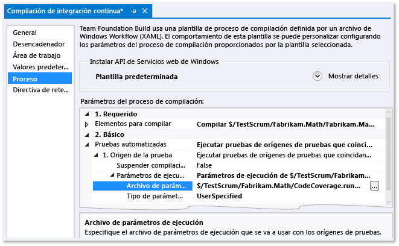

# Personalizar el an&#225;lisis de cobertura de c&#243;digo
[!INCLUDE[vs2017banner](../code-quality/includes/vs2017banner.md)]

De forma predeterminada, la herramienta de cobertura de código de Visual Studio analiza todos los ensamblados de la solución \(.exe\/.dll\) que se cargan durante las pruebas unitarias.  Se recomienda mantener esta configuración predeterminada, porque funciona bien la mayoría de los casos.  Para obtener más información, consulte [Usar cobertura de código para determinar la cantidad de código que se está probando](../test/using-code-coverage-to-determine-how-much-code-is-being-tested.md).  
  
 Antes de personalizar el comportamiento de la cobertura de código, considere algunas alternativas:  
  
-   *Deseo excluir el código de prueba de los resultados de cobertura de código e incluir únicamente el código de la aplicación.*  
  
     Agregue la clase `ExcludeFromCodeCoverage Attribute` a la clase de prueba.  
  
-   *Quiero incluir ensamblados que no forman parte de mi solución.*  
  
     Obtenga los archivos .pdb para los ensamblados y cópielos en la misma carpeta que los archivos de ensamblado .dll.  
  
 Para personalizar el comportamiento de la cobertura de código, copie el [ejemplo al final de este tema](#sample) y agréguelo a la solución utilizando la extensión de archivo .runsettings.  Edítelo según sus propias necesidades y, luego, en el menú **Prueba**, elija **Configuración de pruebas**, **Seleccionar archivo de configuración de pruebas**.  En el resto de este tema se describe el procedimiento con más detalle.  
  
## Archivo .runsettings  
 La configuración avanzada de la cobertura de código se especifica en un archivo .runsettings.  Es el archivo de configuración que usan las herramientas de pruebas unitarias.  Le recomendamos copiar el [ejemplo al final de este tema](#sample) y editarlo según sus propias necesidades.  
  
-   *¿Qué le sucedió al archivo .testsettings que utilicé en Visual Studio 2010?*  
  
     En Visual Studio 2010, el archivo .testsettings solo se aplica a las pruebas unitarias basadas en el marco MSTest.  En Visual Studio 2012, las herramientas de pruebas no solo se aplican a MSTest, sino también a otros marcos como NUnit y xUnit.  net.  El archivo .testsettings no funcionará con ellos.  El archivo .runsettings está diseñado para personalizar las herramientas de prueba de forma que funcionen con todos los marcos de pruebas.  
  
 Para personalizar la cobertura de código, debe agregar un archivo .runsettings a la solución:  
  
1.  Agregue un archivo .xml como elemento de solución con la extensión `.runsettings`:  
  
     En el Explorador de soluciones, en el menú contextual de la solución, elija **Agregar**, **Nuevo elemento** y seleccione **Archivo XML**.  Guarde el archivo con un nombre que finalice, por ejemplo, con `CodeCoverage.runsettings`  
  
2.  Agregue el contenido que se muestra en el ejemplo al final del tema y después personalícelo de acuerdo con sus necesidades como se describe en las secciones siguientes.  
  
3.  En el menú **Prueba**, elija **Configuración de pruebas**, **Seleccionar archivo de configuración de pruebas** y seleccione el archivo.  
  
4.  Ahora cuando se ejecute **Analizar cobertura de código**, este archivo `.runsettings` controlará su comportamiento.  No olvide que debe ejecutar la cobertura de código de nuevo: los anteriores resultados de cobertura y colores de código no se ocultan automáticamente al ejecutar pruebas o actualizar el código.  
  
5.  Para desactivar y activar la configuración personalizada, deseleccione o seleccione el archivo en el menú **Prueba**, **Configuración de pruebas**.  
  
   
  
 Otros aspectos de las pruebas unitarias se pueden configurar en el mismo archivo .runsettings.  Para obtener más información, consulte [Haga una prueba unitaria de su código](../test/unit-test-your-code.md).  
  
### Especificar rutas de búsqueda de símbolos  
 La cobertura de código requiere que estén presentes los símbolos \(archivos .pdb\) para los ensamblados.  En el caso de los ensamblados compilados por su solución, los archivos de símbolos normalmente están presentes con los archivos binarios y la cobertura de código funciona automáticamente.  Pero, en algunos casos, puede que desee incluir los ensamblados a los que se hace referencia en el análisis de cobertura de código.  En esos casos, los archivos .pdb podrían no estar adyacentes a los archivos binarios pero puede especificar la ruta de búsqueda de símbolos en el archivo .runsettings.  
  
```xml  
<SymbolSearchPaths>                
      <Path>\\mybuildshare\builds\ProjectX</Path>  
      <!--More paths if required-->  
</SymbolSearchPaths>  
  
```  
  
> [!WARNING]
>  La resolución de símbolos puede tardar tiempo, especialmente al utilizar una ubicación de archivo remoto con muchos ensamblados.  Por consiguiente, considere la posibilidad de copiar los archivos remotos .pdb en la misma ubicación local que los archivos binarios \(.dll y .exe\).  
  
### Exclusión e inclusión  
 Puede excluir los ensamblados especificados del análisis de cobertura de código.  Por ejemplo:  
  
```minterastlib  
<ModulePaths>  
  <Exclude>  
   <ModulePath>Fabrikam.Math.UnitTest.dll</ModulePath>  
   <!-- Add more ModulePath nodes here. -->  
  </Exclude>  
</ModulePaths>  
```  
  
 Como alternativa, puede especificar qué ensamblados deben incluirse.  Este enfoque tiene la desventaja de que, cuando agrega más ensamblados a la solución, tiene que recordar agregarlos a la lista:  
  
```minterastlib  
<ModulePaths>  
  <Include>  
   <ModulePath>Fabrikam.Math.dll</ModulePath>  
   <!-- Add more ModulePath nodes here. -->  
  </Include>  
</ModulePaths>  
```  
  
 Si `<Include>` está vacío, el procesamiento de cobertura de código incluye todos los ensamblados \(archivos .dll y .exe\) que se cargan y para los que se pueden encontrar archivos **.pdb**, salvo los elementos que coinciden con una cláusula en una lista `<Exclude>`.  
  
 `Include` se procesa antes de `Exclude`.  
  
### Expresiones regulares  
 Los nodos de inclusión y exclusión usan expresiones regulares.  Para obtener más información, consulte [Usar expresiones regulares en Visual Studio](../ide/using-regular-expressions-in-visual-studio.md).  Las expresiones regulares no son iguales que los caracteres comodín.  En concreto:  
  
1.  **.\*** coincide con una cadena de caracteres cualquiera  
  
2.  **\\.** coincide con un punto \(“."\)  
  
3.  **\\\(   \\\)** coincide con paréntesis "\(  \)"  
  
4.  **\\ \\** coincide con el delimitador de ruta de acceso “\\”  
  
5.  **^** coincide con el inicio de la cadena  
  
6.  **$** coincide con el final de la cadena  
  
 Ninguna coincidencia distingue entre mayúsculas y minúsculas.  
  
 Por ejemplo:  
  
```xml  
<ModulePaths>  
  <Include>  
    <!-- Include all loaded .dll assemblies (but not .exe assemblies): -->  
    <ModulePath>.*\.dll$</ModulePath>  
  </Include>  
  <Exclude>  
    <!-- But exclude some assemblies: -->  
    <ModulePath>.*\\Fabrikam\.MyTests1\.dll$</ModulePath>  
    <!-- Exclude all file paths that contain "Temp": -->  
    <ModulePath>.*Temp.*</ModulePath>   
  </Exclude>  
</ModulePaths>  
  
```  
  
> [!WARNING]
>  Si hay un error en una expresión regular, como paréntesis sin caracteres de escape o sin su correspondiente pareja, el análisis de cobertura de código no se ejecuta.  
  
### Otras maneras de incluir o excluir elementos  
 Dispone de un [ejemplo al final de este tema](#sample).  
  
-   `ModulePath`: ensamblados especificados por la ruta de acceso del ensamblado.  
  
-   `CompanyName`: busca coincidencias con ensamblados por el atributo de compañía.  
  
-   `PublicKeyToken`: busca coincidencias con ensamblados firmados por el token de clave pública.  Por ejemplo, para buscar coincidencias con todos los componentes y extensiones de Visual Studio, utilice `<PublicKeyToken>^B03F5F7F11D50A3A$</PublicKeyToken>`.  
  
-   `Source`: busca coincidencias con los elementos por el nombre de ruta de acceso del archivo de código fuente en el cual se definen.  
  
-   `Attribute`: busca coincidencias con los elementos en los que se asocia un atributo determinado.  Especifique el nombre completo del atributo, incluyendo “Attribute” al final del nombre.  
  
-   `Function`: busca coincidencias de procedimientos, funciones o métodos por el nombre completo.  
  
 **Coincidencia con nombres de función**  
  
 La expresión regular debe coincidir con el nombre completo de la función, incluidos el espacio de nombres, nombre de clase, nombre de método y lista de parámetros.  Por ejemplo,  
  
-   C\# o Visual Basic: `Fabrikam.Math.LocalMath.SquareRoot(double)`  
  
-   C\+\+: `Fabrikam::Math::LocalMath::SquareRoot(double)`  
  
```xml  
<Functions>  
  <Include>  
    <!-- Include methods in the Fabrikam namespace: -->  
    <Function>^Fabrikam\..*</Function>  
    <!-- Include all methods named EqualTo: -->  
    <Function>.*\.EqualTo\(.*</Function>  
  </Include>  
  <Exclude>  
    <!-- Exclude methods in a class or namespace named UnitTest: -->  
    <Function>.*\.UnitTest\..*</Function>  
  </Exclude>  
</Functions>  
  
```  
  
## Cómo especificar los archivos .runsettings mientras se ejecutan pruebas  
  
### Para personalizar runsettings en las pruebas de Visual Studio  
 Elija **Prueba**, **Configuración de pruebas**, **Seleccionar archivo de configuración de pruebas** y seleccione el archivo .runsettings.  El archivo aparece en el menú Configuración de pruebas, y puede seleccionarlo o cancelarlo.  Mientras está seleccionado, el archivo .runsettings se aplica siempre que se utilice **Analizar cobertura de código**.  
  
### Para personalizar la configuración de ejecución en una prueba de la línea de comandos  
 Para ejecutar pruebas desde la línea de comandos, utilice vstest.console.exe.  El archivo de configuración es un parámetro de esta utilidad.  Para obtener más información, consulte [Usar VSTest.Console desde la línea de comandos](/devops-test-docs/test/using-vstest-console-from-the-command-line).  
  
1.  Abra el símbolo del sistema de Visual Studio Developer:  
  
     En Windows, elija **Inicio**, **Todos los programas**, **Microsoft Visual Studio**, **Visual Studio Tools** y **Símbolo del sistema para desarrolladores**.  
  
2.  Ejecute:  
  
     `vstest.console.exe MyTestAssembly.dll /EnableCodeCoverage /Settings:CodeCoverage.runsettings`  
  
### Para personalizar la configuración de ejecución en una definición de compilación  
 Puede obtener datos de cobertura de código de una compilación de equipo.  
  
   
  
1.  Asegúrese de que el archivo .runsettings está protegido.  
  
2.  En Team Explorer, abra **Compilaciones** y agregue o modifique una definición de compilación.  
  
3.  En la página **Proceso**, expanda **Pruebas automatizadas**, **Origen de la prueba**, **Parámetros de ejecución**.  Seleccione el archivo **.runsettings**.  
  
    -   *Sin embargo, aparece **Ensamblado de prueba** en lugar de **Origen de la prueba**.  Cuando intento establecer el campo **Parámetros de ejecución**, solo puedo seleccionar los archivos .testsettings.*  
  
         En **Pruebas automatizadas**, seleccione **Ensamblado de prueba** y elija **\[...\]** al final de la línea.  En el cuadro de diálogo **Agregar o editar serie de pruebas**, establezca **Ejecutor de pruebas** en **Ejecutor de pruebas de Visual Studio**.  
  
 Los resultados están visibles en la sección de resumen del informe de compilación.  
  
##  <a name="sample"></a> Archivo de ejemplo .runsettings  
 Copie el código y edítelo para satisfacer sus propias necesidades.  Este es el archivo .runsettings predeterminado.  
  
 \(Para otros usos del archivo .runsettings, consulte [Configurar pruebas unitarias usando un archivo .runsettings](../test/configure-unit-tests-by-using-a-dot-runsettings-file.md)\).  
  
```xml  
<?xml version="1.0" encoding="utf-8"?>  
<!-- File name extension must be .runsettings -->  
<RunSettings>  
  <DataCollectionRunSettings>  
    <DataCollectors>  
      <DataCollector friendlyName="Code Coverage" uri="datacollector://Microsoft/CodeCoverage/2.0" assemblyQualifiedName="Microsoft.VisualStudio.Coverage.DynamicCoverageDataCollector, Microsoft.VisualStudio.TraceCollector, Version=11.0.0.0, Culture=neutral, PublicKeyToken=b03f5f7f11d50a3a">  
        <Configuration>  
          <CodeCoverage>  
<!--  
Additional paths to search for .pdb (symbol) files. Symbols must be found for modules to be instrumented.  
If .pdb files are in the same folder as the .dll or .exe files, they are automatically found. Otherwise, specify them here.  
Note that searching for symbols increases code coverage runtime. So keep this small and local.  
-->   
<!--             
            <SymbolSearchPaths>                
                   <Path>C:\Users\User\Documents\Visual Studio 2012\Projects\ProjectX\bin\Debug</Path>  
                   <Path>\\mybuildshare\builds\ProjectX</Path>  
            </SymbolSearchPaths>  
-->  
  
<!--  
About include/exclude lists:  
Empty "Include" clauses imply all; empty "Exclude" clauses imply none.  
Each element in the list is a regular expression (ECMAScript syntax). See http://msdn.microsoft.com/library/2k3te2cs.aspx.  
An item must first match at least one entry in the include list to be included.  
Included items must then not match any entries in the exclude list to remain included.  
-->  
  
            <!-- Match assembly file paths: -->  
            <ModulePaths>  
              <Include>  
                <ModulePath>.*\.dll$</ModulePath>  
                <ModulePath>.*\.exe$</ModulePath>  
              </Include>  
              <Exclude>  
                <ModulePath>.*CPPUnitTestFramework.*</ModulePath>  
              </Exclude>  
            </ModulePaths>  
  
            <!-- Match fully qualified names of functions: -->  
            <!-- (Use "\." to delimit namespaces in C# or Visual Basic, "::" in C++.)  -->  
            <Functions>  
              <Exclude>  
                <Function>^Fabrikam\.UnitTest\..*</Function>           
                <Function>^std::.*</Function>  
                <Function>^ATL::.*</Function>  
                <Function>.*::__GetTestMethodInfo.*</Function>  
                <Function>^Microsoft::VisualStudio::CppCodeCoverageFramework::.*</Function>  
                <Function>^Microsoft::VisualStudio::CppUnitTestFramework::.*</Function>  
              </Exclude>  
            </Functions>  
  
            <!-- Match attributes on any code element: -->  
            <Attributes>  
              <Exclude>  
                <!—Don't forget "Attribute" at the end of the name -->  
                <Attribute>^System\.Diagnostics\.DebuggerHiddenAttribute$</Attribute>  
                <Attribute>^System\.Diagnostics\.DebuggerNonUserCodeAttribute$</Attribute>  
                <Attribute>^System\.Runtime\.CompilerServices.CompilerGeneratedAttribute$</Attribute>  
                <Attribute>^System\.CodeDom\.Compiler.GeneratedCodeAttribute$</Attribute>  
                <Attribute>^System\.Diagnostics\.CodeAnalysis.ExcludeFromCodeCoverageAttribute$</Attribute>  
              </Exclude>  
            </Attributes>  
  
            <!-- Match the path of the source files in which each method is defined: -->  
            <Sources>  
              <Exclude>  
                <Source>.*\\atlmfc\\.*</Source>  
                <Source>.*\\vctools\\.*</Source>  
                <Source>.*\\public\\sdk\\.*</Source>  
                <Source>.*\\microsoft sdks\\.*</Source>  
                <Source>.*\\vc\\include\\.*</Source>  
              </Exclude>  
            </Sources>  
  
            <!-- Match the company name property in the assembly: -->  
            <CompanyNames>  
              <Exclude>  
                <CompanyName>.*microsoft.*</CompanyName>  
              </Exclude>  
            </CompanyNames>  
  
            <!-- Match the public key token of a signed assembly: -->  
            <PublicKeyTokens>  
              <!-- Exclude Visual Studio extensions: -->  
              <Exclude>  
                <PublicKeyToken>^B77A5C561934E089$</PublicKeyToken>  
                <PublicKeyToken>^B03F5F7F11D50A3A$</PublicKeyToken>  
                <PublicKeyToken>^31BF3856AD364E35$</PublicKeyToken>  
                <PublicKeyToken>^89845DCD8080CC91$</PublicKeyToken>  
                <PublicKeyToken>^71E9BCE111E9429C$</PublicKeyToken>  
                <PublicKeyToken>^8F50407C4E9E73B6$</PublicKeyToken>  
                <PublicKeyToken>^E361AF139669C375$</PublicKeyToken>  
              </Exclude>  
            </PublicKeyTokens>  
  
            <!-- We recommend you do not change the following values: -->  
            <UseVerifiableInstrumentation>True</UseVerifiableInstrumentation>  
            <AllowLowIntegrityProcesses>True</AllowLowIntegrityProcesses>  
            <CollectFromChildProcesses>True</CollectFromChildProcesses>  
            <CollectAspDotNet>False</CollectAspDotNet>  
  
          </CodeCoverage>  
        </Configuration>  
      </DataCollector>  
    </DataCollectors>  
  </DataCollectionRunSettings>  
</RunSettings>  
  
```  
  
## Vea también  
 [Usar cobertura de código para determinar la cantidad de código que se está probando](../test/using-code-coverage-to-determine-how-much-code-is-being-tested.md)   
 [Haga una prueba unitaria de su código](../test/unit-test-your-code.md)