# Editar pruebas automatizadas de IU con el Editor de pruebas automatizadas de IU

el Editor de pruebas de IU codificadas permite modificar fácilmente este tipo de pruebas. Con el editor de pruebas de IU codificadas puede localizar, ver y editar las propiedades de los métodos de prueba y acciones de IU. Además, puede usar la asignación de controles de IU para ver y editar sus controles correspondientes.

[!INCLUDE [coded-ui-test-deprecation](includes/coded-ui-test-deprecation.md)]

**Requisitos**

- Visual Studio Enterprise
- Componente Prueba automatizada de IU

## Características del Editor de pruebas automatizadas de IU

El uso del editor de pruebas de IU codificadas es más rápido y eficaz que editar el código en los métodos de pruebas de IU codificadas con el editor de código. Con el editor de pruebas de IU codificadas puede usar la barra de herramientas y los menús contextuales para ubicar y modificar rápidamente los valores de propiedad asociados a acciones y controles de la interfaz de usuario. Por ejemplo, puede usar la barra de herramientas del editor de pruebas de IU codificadas para ejecutar los siguientes comandos:

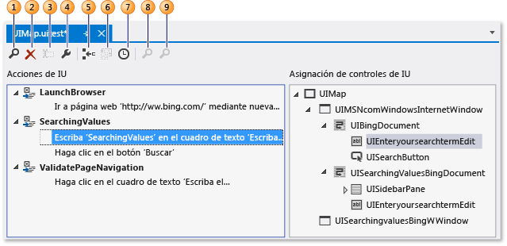

1. [Buscar](../ide/finding-and-replacing-text.md) le ayuda a localizar las acciones y los controles de la interfaz de usuario.

2. **Eliminar** quita las acciones no deseadas de la interfaz de usuario.

3. **Cambiar nombre** cambia los nombres de los controles y los métodos de prueba.

4. **Propiedades** abre la ventana **Propiedades** del elemento seleccionado.

5. **Dividir en un método nuevo** permite modularizar las acciones de la interfaz de usuario.

6. **Mover código** agrega código personalizado a los métodos de prueba.

7. **Insertar retraso antes** agrega una pausa en milisegundos antes de una acción de interfaz de usuario.

8. **Buscar control de IU** identifica la ubicación del control en la interfaz de usuario de la aplicación sometida a prueba.

9. **Localizar todos** le ayuda a comprobar la propiedad del control y los cambios importantes efectuados en los controles de la aplicación.

Al abrir el archivo *UIMap.uitest* afiliado a la prueba automatizada de IU, esta se abre en el **Editor de pruebas automatizadas de IU**. En los siguientes procedimientos se describe cómo se pueden localizar y editar los métodos de prueba, las propiedades de acciones de la interfaz de usuario y los controles mediante la barra de herramientas y los menús contextuales del editor.

## Abrir una prueba de IU codificada

Puede ver y editar la prueba automatizada de IU basada en Visual C# y Visual Basic mediante el **Editor de pruebas automatizadas de IU**.

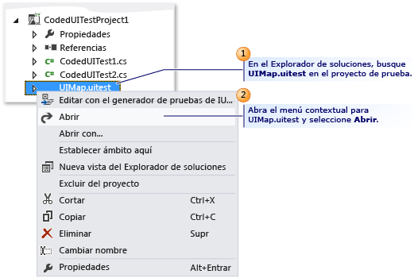

En el **Explorador de soluciones**, abra el menú contextual de *UIMap.uitest* y elija **Abrir**. La prueba automatizada de IU se muestra en el **Editor de pruebas automatizadas de IU**. Ahora puede ver y editar los métodos grabados, las acciones y los controles correspondientes en la prueba de IU codificada.

> [!TIP]
> Al seleccionar una acción de la interfaz de usuario ubicada en un método del panel **Acciones de IU** , el control correspondiente queda resaltado. También puede modificar la acción de la interfaz de usuario o las propiedades de los controles.

## Modificar las propiedades de acción y control de la interfaz de usuario

Con el editor de pruebas de IU codificadas puede localizar y ver rápidamente todas las acciones de la interfaz de usuario en los métodos de prueba. Al seleccionar la acción de la interfaz de usuario en el editor, se resalta automáticamente el control correspondiente. Del mismo modo, si selecciona un control, se resaltan las acciones de la interfaz de usuario asociadas. Al seleccionar una acción de la interfaz de usuario o un control, es muy sencillo usar la ventana **Propiedades** para modificar las propiedades correspondientes.

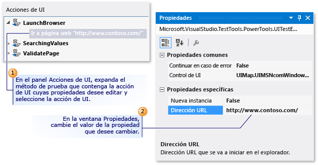

Para modificar las propiedades de una acción de la interfaz de usuario, en el panel **Acción de IU** , expanda el método de prueba que contenga una acción de la interfaz de usuario de la que desee modificar las propiedades, seleccione la acción de la interfaz de usuario y, después, modifique las propiedades mediante la ventana Propiedades.

Por ejemplo, si un servidor no está disponible y tiene una acción de la interfaz de usuario asociada al explorador web que indica **Ir a la página web http:\//Contoso1/default.aspx**, puede cambiar la dirección URL por `http://Contoso2/default.aspx`.

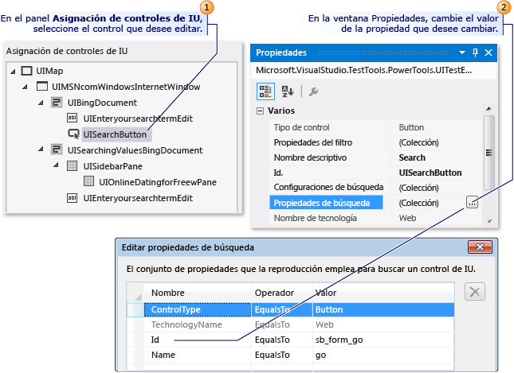

Modificar las propiedades de un control se hace de la misma manera que se modifican las acciones de interfaz de usuario. En el panel **Asignación de controles de IU**, seleccione el control que desea editar y modifique sus propiedades en la ventana **Propiedades**.

Por ejemplo, un desarrollador puede haber cambiado la propiedad **(ID)** en un control de botón en el código fuente de la aplicación que se prueba de "idSubmit" a "idLogin". Con la propiedad **(ID)** cambiada en la aplicación, la prueba de IU codificada no encontrará el control de botón y se producirá un error. En este caso, el evaluador puede abrir la colección **Propiedades de búsqueda** y cambiar la propiedad **Id** para que coincida con el valor nuevo usado por el programador en la aplicación. El evaluador también podría cambiar el valor de la propiedad **Nombre descriptivo** de "Enviar" a "Iniciar sesión". Si realiza este cambio, la acción de la interfaz de usuario asociada en el editor de pruebas de IU codificadas se actualiza de "Elegir el botón 'Enviar'" a "Elegir el botón 'Iniciar sesión'".

Tras completar las modificaciones, guarde los cambios en el archivo *UIMap.Designer* con **Guardar** en la barra de herramientas de Visual Studio.

### Sugerencias

- Si no se muestra la ventana **Propiedades**, mantenga pulsada la tecla **Alt** mientras presiona **ENTRAR**, o bien presione **F4**.

- Para deshacer los cambios de propiedad efectuados, seleccione **Deshacer** en el menú **Editar** o presione **Ctrl**+**Z**.

- Puede usar el botón **Buscar** de la barra de herramientas del editor de pruebas automatizadas de IU para abrir la herramienta **Buscar y reemplazar** en Visual Studio. Después, puede usar el control **Buscar** para localizar una acción de la interfaz de usuario en el Editor de pruebas automatizadas de IU. Por ejemplo, puede intentar buscar "Hacer clic en el botón 'Inicio de sesión'". Esto puede ser útil en las pruebas de gran tamaño. No puede usar la funcionalidad de reemplazo en la herramienta **Buscar y reemplazar** del Editor de pruebas automatizadas de IU. Para más información, consulte el control Buscar en [Buscar y reemplazar texto](../ide/finding-and-replacing-text.md).

- En ocasiones puede ser difícil visualizar dónde se ubican los controles en la interfaz de usuario de la aplicación sometida a prueba. Una de las capacidades del editor de pruebas de IU codificadas es que puede seleccionar un control de la asignación de controles de IU y ver su ubicación en la aplicación sometida a prueba. Para más información, consulte [Buscar un control de interfaz de usuario en la aplicación sometida a prueba](#locate-a-ui-control-in-the-application-under-test), que se encuentra en un apartado posterior de este artículo.

- Es posible que sea necesario expandir el control de contenedor que contiene el control que desea editar. Para más información, consulte [Buscar un control y sus descendientes](#locate-a-control-and-its-descendants), que se encuentra en un apartado posterior de este artículo.

## Eliminar acciones de IU no deseadas

Puede quitar fácilmente las acciones de interfaz de usuario no deseadas en la prueba de IU codificada.

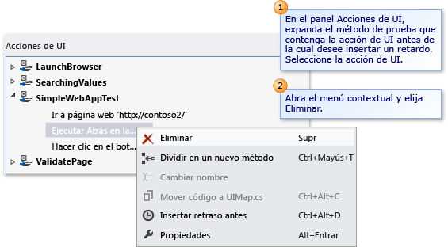

En el panel **Acción de IU** , expanda el método de prueba que contiene la acción de la interfaz de usuario que desea eliminar. Abra el menú contextual de la acción de la interfaz de usuario y elija **Eliminar**.

## Dividir un método de prueba en dos métodos independientes

Puede dividir un método de prueba para refinar o modularizar las acciones de la interfaz de usuario. Por ejemplo, la prueba podría tener un solo método de prueba con acciones de la interfaz de usuario en dos controles de contenedor. Las acciones de la interfaz de usuario podrían estar más modularizadas en dos métodos que se corresponden con un contenedor.

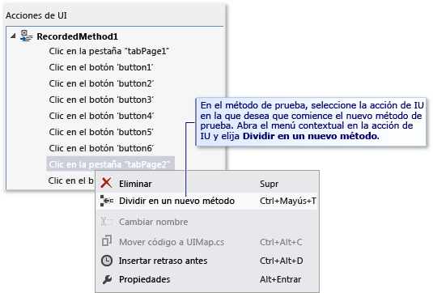

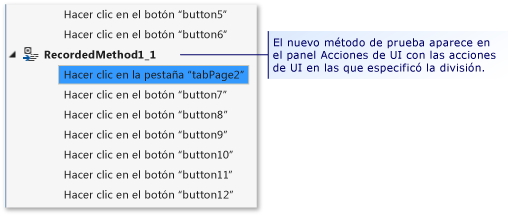

En el panel **Acción de IU** , expanda el método de prueba que quiere dividir en dos métodos independientes y seleccione la acción de la interfaz de usuario donde quiere que comience el nuevo método de prueba. Abra el menú contextual de la acción de la interfaz de usuario y, después, elija **Dividir en un nuevo método**o elija el botón **Dividir en un nuevo método** en la barra de herramientas del editor de pruebas de IU codificadas. El nuevo método de prueba aparece en el panel **Acciones de IU**. Contiene las acciones de la interfaz de usuario de la acción en la que especificó la división.

Una vez que haya acabado de dividir el método, guarde los cambios en el archivo *UIMap.Designer* con **Guardar** en la barra de herramientas de Visual Studio.

> [!WARNING]
> Si divide un método, debe modificar todos los códigos que llamen al método existente para llamar también al método nuevo que va a crear, en el caso de que quiera seguir incluyendo dichas acciones de interfaz de usuario. Al dividir un método se abre un cuadro de diálogo de Microsoft Visual Studio. Le advierte que debe modificar cualquier código que llame al método existente para llamar también al método nuevo que va a crear. Elija **Sí**.

### Sugerencias

- Para deshacer la división, elija **Deshacer** en el menú **Editar** o presione **Ctrl**+**Z**.

- Puede cambiar el nombre del método nuevo. Selecciónelo desde el panel **Acciones de IU** y elija el botón **Cambiar nombre** de la barra de herramientas del Editor de pruebas automatizadas de IU.

   o bien

   Abra el menú contextual del nuevo método de prueba y elija **Cambiar nombre**.

   Se abrirá el cuadro de diálogo Microsoft Visual Studio. Le advierte que debe modificar todos los códigos que hagan referencia al método. Elija **Sí**.

## Mover un método de prueba al archivo UIMap para facilitar la personalización

Si determina que uno de los métodos de prueba de la prueba automatizada de IU requiere un código personalizado, debe moverlo al archivo *UIMap.cs* o *UIMap.vb*. De lo contrario, el código se sobrescribirá cada vez que se vuelva a compilar la prueba de IU codificada. Si no mueve el método, el código personalizado se sobrescribirá cada vez que se vuelva a compilar la prueba.

En el panel **Acción de IU**, seleccione el método de prueba que quiere mover al archivo *UIMap.cs* o *UIMap.vb* para facilitar la función de código personalizado que no se sobrescribirá cuando se vuelva a compilar el código de prueba. Después, elija el botón **Mover código** , situado en la barra de herramientas del editor de pruebas de IU codificadas, o abra el menú contextual del método de prueba y elija **Mover código**. El método de prueba se quita del archivo *UIMap.uitest* y ya no se muestra en el panel **Acción de IU**. Para editar el archivo de prueba que ha movido, abra el archivo *UIMap.cs* o *UIMap.vb* desde el **Explorador de soluciones**.

Una vez que haya acabado de mover el método, guarde los cambios en el archivo *UIMap.Designer* con **Guardar** en la barra de herramientas de Visual Studio.

> [!WARNING]
> Una vez que haya movido un método, ya no puede modificarlo con el editor de pruebas automatizadas de IU. Debe agregar el código personalizado y mantenerlo con el Editor de código. Al mover un método se abre un cuadro de diálogo de Microsoft Visual Studio. Advierte de que el método se va a mover del archivo *UIMap.uitest* al archivo *UIMap.cs* o *UIMap.vb* y ya no podrá modificarlo en el Editor de pruebas automatizadas de IU. Elija **Sí**.

### Sugerencias

Para deshacer el cambio, seleccione **Deshacer** en el menú **Editar** o presione **Ctrl**+**Z**. Sin embargo, luego debe quitar el código manualmente desde el archivo *UIMap.cs* o *UIMap.vb*.

## Búsqueda de un control de interfaz de usuario en la aplicación sometida a prueba

En ocasiones puede ser difícil visualizar dónde se ubican los controles en la interfaz de usuario de la aplicación sometida a prueba. Una de las capacidades del editor de pruebas de IU codificadas es que puede seleccionar un control de la asignación de controles de IU y ver su ubicación en la aplicación sometida a prueba. También se puede usar la característica **Buscar control de IU** de la aplicación sometida a prueba para comprobar las modificaciones de propiedades de búsqueda que haya efectuado en un control.

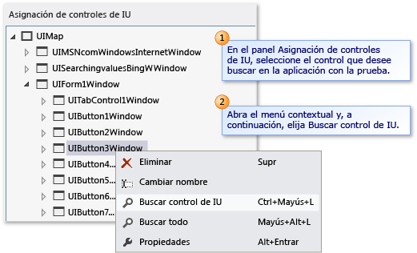

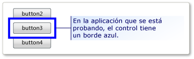

En el panel **Asignación de controles de IU** , seleccione el control que quiere buscar en la aplicación asociada a la prueba. Después, abra el menú contextual del control y elija **Buscar control de IU**. En la aplicación que está probando, el control se marca con un borde azul.

> [!NOTE]
> Antes de buscar un control de interfaz de usuario, compruebe que se está ejecutando la aplicación asociada a la prueba.

### Sugerencias

Puede usar la opción **Buscar todos** para comprobar que se puedan buscar correctamente todos los controles de un contenedor. Esta opción se describe en la siguiente sección.

## Buscar un control y sus descendientes

Puede comprobar que todos los controles de un contenedor se pueden buscar correctamente en la interfaz de usuario de la aplicación sometida a prueba. Esto puede resultar útil para comprobar los cambios en las propiedades de búsqueda que haya hecho en el contenedor. Además, si ha habido cambios significativos en la interfaz de usuario de la aplicación sometida a prueba, puede validar que las propiedades de búsqueda existentes del control sigan siendo correctas.

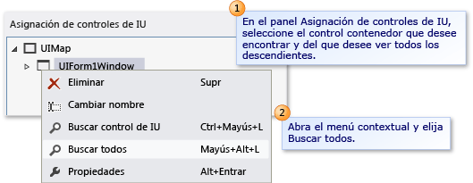

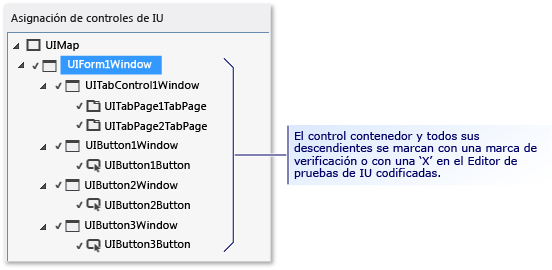

En el panel **Asignación de controles de IU** , seleccione el control de contenedor que quiera buscar y del que quiera ver todos los descendientes. Después, abra el menú contextual del control y elija **Buscar todos**. El control contenedor y sus controles descendiente están marcados en el editor de pruebas de IU codificadas con una marca de verificación verde o una "X" roja. Estas marcas le permiten saber si los controles se han localizado correctamente en la aplicación sometida a prueba.

> [!NOTE]
> Antes de buscar los controles de interfaz de usuario, compruebe que se está ejecutando la aplicación asociada a la prueba.

## Insertar un retraso antes de una acción de IU

A veces, es posible que quiera que la prueba espere a que se produzcan ciertos eventos, como que se muestre una ventana, que se oculte la barra de progreso, etc. Con el editor de pruebas de IU codificadas puede hacerlo; para ello, inserte un retraso antes de una acción de la interfaz de usuario. Puede especificar el intervalo de retraso (en segundos).

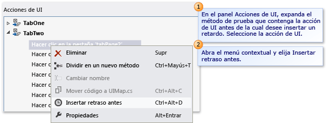

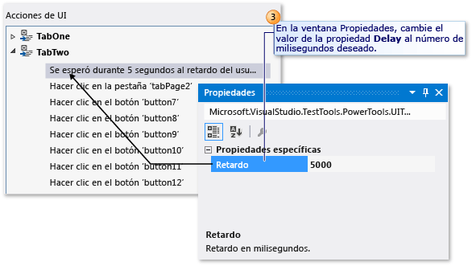

En el panel **Acción de IU** , expanda el método de prueba que contiene la acción de la interfaz de usuario antes de la que quiere insertar un retraso. Seleccione la acción de IU. Después, abra el menú contextual de la acción de la interfaz de usuario y elija **Insertar retraso antes**. Se inserta un retraso y se resalta antes de la acción de la interfaz de usuario seleccionada con el siguiente texto: **Esperar durante 1 segundos al retraso del usuario entre acciones**. En la ventana **Propiedades**, cambie el valor de la propiedad **Retraso** con el número deseado de milisegundos.

Una vez que haya insertado el retraso, guarde los cambios en el archivo *UIMap.Designer* con **Guardar** en la barra de herramientas de Visual Studio.

Si necesita asegurarse de que un control determinado está disponible antes de realizar una acción de la interfaz de usuario, considere la posibilidad de agregar código personalizado al método de prueba con el método UITestControl.WaitForControlXXX() adecuado. Para más información, consulte [Hacer que la prueba de IU codificada espere eventos concretos durante la reproducción](../test/making-coded-ui-tests-wait-for-specific-events-during-playback.md).

## Vea también

- [Usar la automatización de la interfaz de usuario para probar el código](../test/use-ui-automation-to-test-your-code.md)
- [Crear pruebas automatizadas de IU](../test/use-ui-automation-to-test-your-code.md)
- [Crear una prueba automatizada de IU controlada por datos](../test/creating-a-data-driven-coded-ui-test.md)
- [Tutorial: Crear, editar y mantener una prueba automatizada de IU](../test/walkthrough-creating-editing-and-maintaining-a-coded-ui-test.md)
