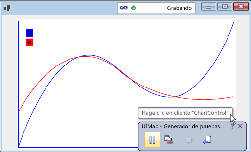
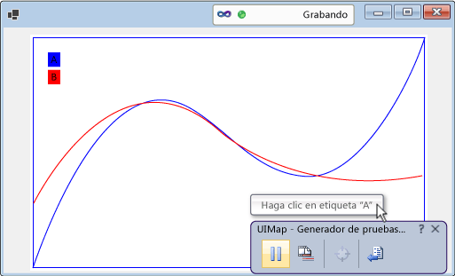
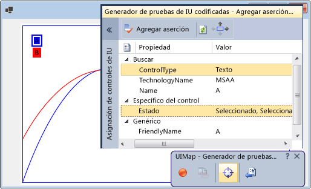

# <a name="enable-coded-ui-testing-of-your-controls"></a>Habilitación de pruebas automatizadas de IU en los controles

Para un control más estable, implemente compatibilidad con el marco de pruebas automatizadas de IU. Se pueden agregar niveles de compatibilidad de forma incremental. Para comenzar, admita la grabación, la reproducción y la validación de propiedades. A continuación, compile en base a eso para habilitar el generador de pruebas automatizadas de IU y que se reconozcan las propiedades personalizadas del control. Proporcione clases personalizadas para tener acceso a esas propiedades desde el código generado. También se puede ayudar al generador de pruebas de IU codificadas a capturar acciones de una manera que es próxima a la intención de la acción que se está registrando.


[!INCLUDE [coded-ui-test-deprecation](includes/coded-ui-test-deprecation.md)]

## <a name="support-record-and-playback-and-property-validation-by-implementing-accessibility"></a>Admitir la grabación, la reproducción y la validación de propiedades al implementar la accesibilidad

El generador de pruebas de IU codificadas captura información acerca de los controles que encuentra durante una grabación y después genera código para reproducir esa sesión. Si el control no admite accesibilidad, el generador de pruebas automatizadas de IU capturará acciones (como clics del mouse) mediante las coordenadas de pantalla. Cuando la prueba se reproduce, el código generado emite esas acciones en las mismas coordenadas de la pantalla. Si el control aparece en un lugar diferente de la pantalla cuando se reproduce la prueba, el código generado no podrá realizar la acción. Al no implementar la accesibilidad para el control, es posible que vea errores si la prueba se reproduce en otras configuraciones de pantalla, en entornos distintos, o cuando cambia el diseño de la interfaz de usuario.

 

 Si implementa accesibilidad, el generador de pruebas automatizadas de IU la usará para capturar información sobre el control cuando registre una prueba. A continuación, al ejecutar la prueba, el código generado volverá a reproducir esos eventos en el control, aunque esté en alguna otra parte en la interfaz de usuario. Los autores de las pruebas también pueden crear aserciones usando las propiedades básicas del control.

 

### <a name="to-support-record-and-playback-property-validation-and-navigation-for-a-windows-forms-control"></a>Para admitir la grabación y reproducción, la validación de propiedades y la navegación de un control de Windows Forms
 Implemente la accesibilidad para el control como se indica en el procedimiento siguiente, que se explica en detalle en <xref:System.Windows.Forms.AccessibleObject>.

 

1.  Implemente una clase que se derive de <xref:System.Windows.Forms.Control.ControlAccessibleObject> y reemplace la propiedad <xref:System.Windows.Forms.Control.AccessibilityObject%2A> para devolver un objeto de la clase.

    ```csharp
    public partial class ChartControl : UserControl
    {
        // Overridden to return the custom AccessibleObject for the control.
        protected override AccessibleObject CreateAccessibilityInstance()
        {
            return new ChartControlAccessibleObject(this);
        }

        // Inner class ChartControlAccessibleObject represents accessible information
        // associated with the ChartControl and is used when recording tests.
        public class ChartControlAccessibleObject : ControlAccessibleObject
        {
            ChartControl myControl;
            public ChartControlAccessibleObject(ChartControl ctrl)
                : base(ctrl)
            {
                myControl = ctrl;
            }
        }
    }
    ```

2.  Reemplace las propiedades y métodos <xref:System.Windows.Forms.AccessibleObject.Role%2A>, <xref:System.Windows.Forms.AccessibleObject.State%2A>, <xref:System.Windows.Forms.AccessibleObject.GetChild%2A> y <xref:System.Windows.Forms.AccessibleObject.GetChildCount%2A> del objeto accesible.

3.  Implemente otro objeto de accesibilidad para el control secundario y reemplace la propiedad <xref:System.Windows.Forms.Control.AccessibilityObject%2A> del control secundario para devolver el objeto de accesibilidad.

4.  Reemplace las propiedades y métodos <xref:System.Windows.Forms.AccessibleObject.Bounds%2A>, <xref:System.Windows.Forms.AccessibleObject.Name%2A>, <xref:System.Windows.Forms.AccessibleObject.Parent%2A>, <xref:System.Windows.Forms.AccessibleObject.Role%2A>, <xref:System.Windows.Forms.AccessibleObject.State%2A>, <xref:System.Windows.Forms.AccessibleObject.Navigate%2A> y <xref:System.Windows.Forms.AccessibleObject.Select%2A> del objeto de accesibilidad del control secundario.

> [!NOTE]
> Este tema comienza con el ejemplo de accesibilidad en <xref:System.Windows.Forms.AccessibleObject> y, a continuación, se basa en este para compilar los procedimientos restantes. Si desea crear una versión operativa del ejemplo de accesibilidad, cree una aplicación de consola y reemplace el código en *Program.cs* por el código de ejemplo. Agregue referencias a Accesibilidad, System.Drawing y System.Windows.Forms. Cambie **Incrustar tipos de interoperabilidad** para la Accesibilidad a **False** para eliminar una advertencia de compilación. Puede cambiar el tipo de salida del proyecto de **Aplicación de consola** a **Aplicación Windows** de modo que no aparezca una ventana de consola al ejecutar la aplicación.

## <a name="support-custom-property-validation-by-implementing-a-property-provider"></a>Admitir la validación de propiedades personalizada al implementar un proveedor de propiedades

Una vez que haya implementado la compatibilidad básica para grabar, reproducir y validar propiedades, puede poner las propiedades personalizadas del control a disposición de las pruebas automatizadas de IU mediante la implementación de un complemento <xref:Microsoft.VisualStudio.TestTools.UITesting.UITestPropertyProvider>. Por ejemplo, el procedimiento siguiente crea un proveedor de propiedades que permite que las pruebas automatizadas de IU tengan acceso a la propiedad State de los controles secundarios CurveLegend del control chart:

 

### <a name="to-support-custom-property-validation"></a>Para admitir la validación de propiedades personalizada


1. Reemplace la propiedad <xref:System.Windows.Forms.AccessibleObject.Description%2A> del objeto accesible Curve Legend para pasar valores de propiedades enriquecidos en la cadena de descripción. Separe los distintos valores con punto y coma (;).

    ```csharp
    public class CurveLegendAccessibleObject : AccessibleObject
    {
        // add the state property value to the description
        public override string Description
        {
            get
            {
                // Add ";" and the state value to the end
                // of the curve legend's description
                return "CurveLegend; " + State.ToString();
            }
        }
    }
    ```

1. Cree un paquete de extensión de pruebas de IU para el control mediante la creación de un proyecto de biblioteca de clases. Agregue referencias a Accesibilidad, Microsoft.VisualStudio.TestTools.UITesting, Microsoft.VisualStudio.TestTools.UITest.Common y Microsoft.VisualStudio.TestTools.Extension. Cambie **Incrustar tipos de interoperabilidad** para Accesibilidad a **False**.

1. Agregue una clase de proveedor de propiedades que se derive de <xref:Microsoft.VisualStudio.TestTools.UITesting.UITestPropertyProvider>:

    ```csharp
    using System;
    using System.Collections.Generic;
    using Accessibility;
    using Microsoft.VisualStudio.TestTools.UITesting;
    using Microsoft.VisualStudio.TestTools.UITest.Extension;
    using Microsoft.VisualStudio.TestTools.UITesting.WinControls;
    using Microsoft.VisualStudio.TestTools.UITest.Common;

    namespace ChartControlExtensionPackage
    {
        public class ChartControlPropertyProvider : UITestPropertyProvider
        {
        }
    }
    ```

1. Implemente el proveedor de propiedades colocando nombres y descriptores de propiedad en un objeto <xref:System.Collections.Generic.Dictionary%602>.

1. Reemplace <xref:Microsoft.VisualStudio.TestTools.UITesting.UITestPropertyProvider.GetControlSupportLevel%2A?displayProperty=fullName> para indicar que el ensamblado proporciona compatibilidad específica del control tanto para el control como para sus elementos secundarios.

1. Reemplace los métodos abstractos restantes de <xref:Microsoft.VisualStudio.TestTools.UITesting.UITestPropertyProvider?displayProperty=fullName>.

1. Agregue una clase de paquete de extensión que se derive de <xref:Microsoft.VisualStudio.TestTools.UITest.Extension.UITestExtensionPackage>.

1. Defina el atributo `UITestExtensionPackage` para el ensamblado.

1. En la clase de paquete de extensión, reemplace el método <xref:Microsoft.VisualStudio.TestTools.UITest.Extension.UITestExtensionPackage.GetService%2A?displayProperty=fullName> para devolver la clase de proveedor de propiedades al solicitarse un proveedor de este tipo.

1. Reemplace los métodos y propiedades abstractos restantes de <xref:Microsoft.VisualStudio.TestTools.UITest.Extension.UITestExtensionPackage>.

1. Compile los binarios y cópielos en *%ProgramFiles%\Common\Microsoft Shared\VSTT\10.0\UITestExtensionPackages*.

> [!NOTE]
> Este paquete de extensión se aplica a cualquier control de tipo "Text". Si está probando varios controles del mismo tipo, tendrá que hacerlo por separado de modo que pueda administrar los paquetes de extensión que se implementan al registrar las pruebas.

## <a name="support-code-generation-by-implementing-a-class-to-access-custom-properties"></a>Admitir la generación de código al implementar una clase para obtener acceso a propiedades personalizadas

Cuando el generador de pruebas de IU codificadas genera código desde una grabación de sesión, este usa la clase <xref:Microsoft.VisualStudio.TestTools.UITesting.UITestControl> para obtener acceso a los controles.

Si ha implementado un proveedor de propiedades para proporcionar acceso a las propiedades personalizadas del control, puede agregar una clase especializada que se usa para obtener acceso a esas propiedades. La adición de una clase especializada simplifica el código generado.

### <a name="to-add-a-specialized-class-to-access-your-control"></a>Para agregar una clase especializada para obtener acceso al control


1. Implemente una clase que se derive de <xref:Microsoft.VisualStudio.TestTools.UITesting.WinControls.WinControl> y agregue el tipo del control a la colección de propiedades de búsqueda en el constructor.

1. Implemente las propiedades personalizadas del control como propiedades de la clase.

1. Reemplace el método <xref:Microsoft.VisualStudio.TestTools.UITesting.UITestPropertyProvider.GetSpecializedClass%2A?displayProperty=fullName> del proveedor de propiedades para devolver el tipo de la nueva clase para los controles secundarios CurveLegend.

1. Reemplace el método <xref:Microsoft.VisualStudio.TestTools.UITesting.UITestPropertyProvider.GetPropertyNamesClassType%2A> del proveedor de propiedades para devolver el tipo del método PropertyNames de la nueva clase.

## <a name="support-intent-aware-actions-by-implementing-an-action-filter"></a>Admitir acciones intencionales al implementar un filtro de acción

 Cuando Visual Studio registra una prueba, captura cada evento del mouse y del teclado. Sin embargo, en algunos casos, la intención de la acción se puede perder en la serie de eventos del mouse y del teclado. Por ejemplo, si el control admite autocompletar, el mismo conjunto de eventos del mouse y del teclado puede dar lugar a un valor diferente cuando la prueba se reproduce en un entorno distinto. Puede agregar un complemento de filtro de acciones que reemplace la serie de eventos del mouse y del teclado por una sola acción. De esta manera, puede reemplazar la serie de eventos del mouse y del teclado que seleccionan un valor con una única acción que establece el valor. De esta forma, se protegen las pruebas de IU codificadas de las diferencias de autocompletar de un entorno a otro.

### <a name="to-support-intent-aware-actions"></a>Para admitir acciones intencionales


1. Implemente una clase de filtro de acción que se derive de <xref:Microsoft.VisualStudio.TestTools.UITest.Common.UITestActionFilter>, reemplazando las propiedades <xref:Microsoft.VisualStudio.TestTools.UITest.Common.UITestActionFilter.ApplyTimeout%2A>, <xref:Microsoft.VisualStudio.TestTools.UITest.Common.UITestActionFilter.Category%2A>, <xref:Microsoft.VisualStudio.TestTools.UITest.Common.UITestActionFilter.Enabled%2A>, <xref:Microsoft.VisualStudio.TestTools.UITest.Common.UITestActionFilter.FilterType%2A>, <xref:Microsoft.VisualStudio.TestTools.UITest.Common.UITestActionFilter.Group%2A> y <xref:Microsoft.VisualStudio.TestTools.UITest.Common.UITestActionFilter.Name%2A>.

1. Reemplace <xref:Microsoft.VisualStudio.TestTools.UITest.Common.UITestActionFilter.ProcessRule%2A>. En este ejemplo se reemplaza una acción de doble clic por una acción de un solo clic.

1. Agregue el filtro de acción al método <xref:Microsoft.VisualStudio.TestTools.UITest.Extension.UITestExtensionPackage.GetService%2A> del paquete de extensión.

1. Compile los binarios y cópielos en *%ProgramFiles%\Common Files\Microsoft Shared\VSTT\10.0\UITestExtensionPackages*.

> [!NOTE]
> El filtro de acción no depende de la implementación de accesibilidad ni del proveedor de propiedades.

## <a name="debug-your-property-provider-or-action-filter"></a>Depurar el proveedor de propiedades o filtro de acción

El proveedor de propiedades y el filtro de acción se implementan en un paquete de extensión. El generador de pruebas ejecuta el paquete de extensión en un proceso independiente de la aplicación.

### <a name="to-debug-your-property-provider-or-action-filter"></a>Para depurar el proveedor de propiedades o filtro de acción

1.  Compile la versión de depuración del paquete de extensión y copie los archivos *.dll* y *.pdb* en *%ProgramFiles%\Common Files\Microsoft Shared\VSTT\10.0\UITestExtensionPackages*.

2.  Ejecute la aplicación (no en el depurador).

3.  Ejecute el generador de pruebas de IU codificadas.

     `codedUITestBuilder.exe  /standalone`

4.  Asocie el depurador al proceso codedUITestBuilder.

5.  Establezca puntos de interrupción en el código.

6.  En el generador de pruebas de IU codificadas, cree aserciones para ejecutar el proveedor de propiedades y registre acciones para usar los filtros de acción.

## <a name="see-also"></a>Vea también

- <xref:System.Windows.Forms.AccessibleObject>
- [Usar la automatización de la interfaz de usuario para probar el código](../test/use-ui-automation-to-test-your-code.md)