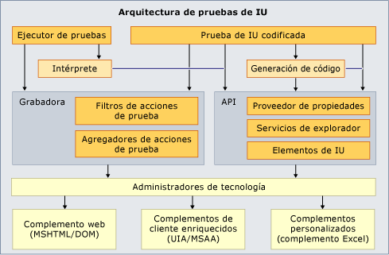

# Extender las pruebas automatizadas de IU y las grabaciones de acciones

El marco de pruebas de UI codificadas y grabaciones de acciones no admite todas las posibles interfaces de usuario. Tal vez no admita la interfaz de usuario concreta que desea probar. Por ejemplo, no puede crear directamente una prueba automatizada de IU o una grabación de acciones para una hoja de cálculo de Microsoft Excel. Pero puede crear una extensión para el marco de pruebas automatizadas de IU que admita la interfaz de usuario concreta aprovechando la extensibilidad del marco de pruebas automatizadas de IU.

[!INCLUDE [coded-ui-test-deprecation](includes/coded-ui-test-deprecation.md)]

## Extensión de muestra para probar Microsoft Excel

Esta [entrada de blog](/archive/blogs/gautamg/3-introducing-sample-excel-extension) contiene un vínculo a una [extensión de muestra](https://msdnshared.blob.core.windows.net/media/MSDNBlogsFS/prod.evol.blogs.msdn.com/CommunityServer.Components.PostAttachments/00/09/94/38/24/ExcelPluginSample.zip) para el marco de pruebas automatizadas de IU. También puede consultar toda la [serie de entradas de blog de extensibilidad de pruebas automatizadas de IU](/archive/blogs/gautamg/series-on-coded-ui-test-extensibility).

> [!NOTE]
> El ejemplo está pensado para usarse con Microsoft Excel 2010. Es posible o no que funcione con otras versiones de Excel.

## Consulte también

- <xref:Microsoft.VisualStudio.TestTools.UITesting.UITestPropertyProvider>
- <xref:Microsoft.VisualStudio.TestTools.UITest.Extension.UITechnologyElement>
- [UITestActionFilter](/previous-versions/visualstudio/visual-studio-2012/dd985757(v=vs.110))
- <xref:Microsoft.VisualStudio.TestTools.UITest.Extension.UITestExtensionPackage>
- [Usar la automatización de la interfaz de usuario para probar el código](../test/use-ui-automation-to-test-your-code.md)
- [Procedimientos recomendados para las pruebas automatizadas de IU](../test/best-practices-for-coded-ui-tests.md)
- [Configuraciones y plataformas compatibles con las pruebas automatizadas de IU y las grabaciones de acciones](../test/supported-configurations-and-platforms-for-coded-ui-tests-and-action-recordings.md)