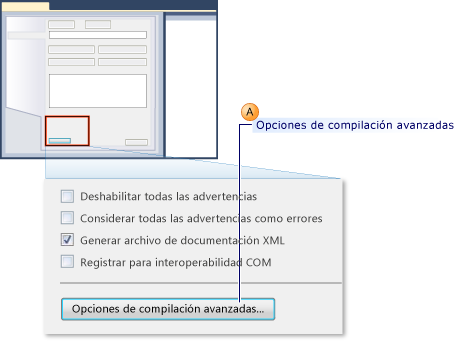
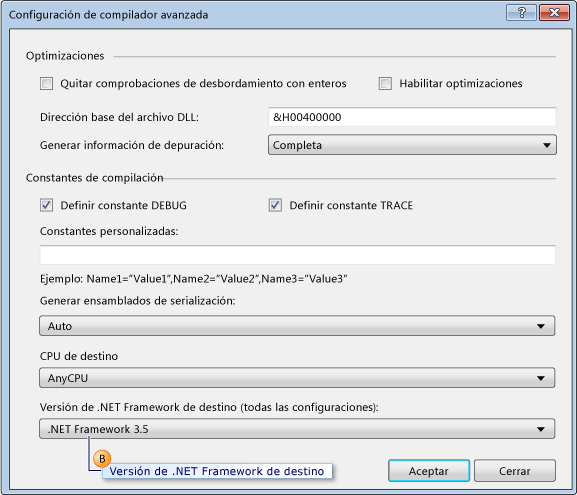
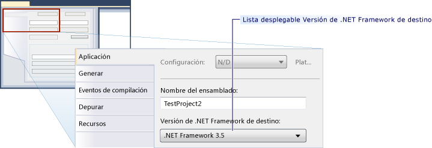

# <a name="how-to-configure-unit-tests-to-target-an-earlier-version-of-the-net-framework"></a>Procedimiento para configurar pruebas unitarias como destino para una versión anterior de .NET Framework

De forma predeterminada, al crear un proyecto de prueba en Microsoft Visual Studio, la versión más reciente de .NET Framework se establece como destino. Además, si actualiza los proyectos de prueba desde las versiones anteriores de Visual Studio, se actualizan para tener la versión más reciente de .NET Framework. Al editar las propiedades del proyecto, puede volver a destinar explícitamente el proyecto a las versiones anteriores de .NET Framework.

Puede crear proyectos de prueba unitaria destinados a versiones específicas de .NET Framework. La versión de destino debe ser 3.5 o posterior y no puede ser una versión de cliente. Visual Studio permite la siguiente compatibilidad básica para las pruebas unitarias destinadas a versiones específicas:

- Puede crear proyectos de prueba unitaria y destinarlos a una versión específica de .NET Framework.

- Puede ejecutar pruebas unitarias que tienen como destino una versión específica de .NET Framework desde Visual Studio en el equipo local.

- Puede ejecutar pruebas unitarias que tienen como destino una versión específica de .NET Framework mediante *MSTest.exe* desde el símbolo del sistema.

- Puede ejecutar pruebas unitarias en un agente de compilación como parte de una compilación.

**Probar aplicaciones de SharePoint**

Las funciones enumeradas anteriormente también permiten escribir pruebas unitarias y pruebas de integración de aplicaciones de SharePoint mediante Visual Studio. Para obtener más información sobre cómo desarrollar aplicaciones de SharePoint con Visual Studio, vea [Crear soluciones de SharePoint](../sharepoint/create-sharepoint-solutions.md), [Compilar y depurar soluciones de SharePoint](../sharepoint/building-and-debugging-sharepoint-solutions.md) y [Comprobar y depurar código de SharePoint](../sharepoint/verifying-and-debugging-sharepoint-code.md).

**Limitaciones**

Se aplican las siguientes limitaciones cuando cambia el destino los proyectos de prueba para usar versiones anteriores de .NET Framework:

- .NET Framework 3.5 incluye compatibilidad con múltiples versiones para los proyectos de prueba que contengan solo pruebas unitarias. .NET Framework 3.5 no es compatible con ningún otro tipo de prueba, como la prueba de carga o de interfaz de usuario codificada. El cambio de destino está bloqueado paran los tipos de prueba que no sean pruebas unitarias.

- Solo se admite la ejecución de pruebas que tienen como destino una versión anterior de .NET Framework en el adaptador de host predeterminado. No se admite en el adaptador de host ASP.NET. Las aplicaciones ASP.NET que se ejecutan en el contexto de servidor de desarrollo de ASP.NET deben ser compatibles con la versión actual de .NET Framework.

- La compatibilidad de recopilación de datos está deshabilitada cuando se ejecutan pruebas que son compatibles con múltiples versiones de .NET Framework 3.5. Puede ejecutar la cobertura de código mediante las herramientas de línea de comandos de Visual Studio.

- No se pueden ejecutar pruebas unitarias que usan .NET Framework 3.5 en un equipo remoto.

- No pueden destinarse las pruebas unitarias a versiones anteriores del cliente del marco.

## <a name="retargeting-for-visual-basic-unit-test-projects"></a>Redestinación de proyectos de prueba unitaria de Visual Basic

1. Cree un proyecto **Proyecto de prueba unitaria** de Visual Basic.

2. En el **Explorador de soluciones**, seleccione **Propiedades** en el menú contextual del nuevo proyecto de prueba de Visual Basic.

     Se muestran las propiedades de su proyecto de prueba de Visual Basic.

3. En la pestaña **Compilar** elija **Opciones de compilación avanzadas** tal como se muestra en la siguiente ilustración.

     

4. Utilice la lista desplegable **Marco de destino (todas las configuraciones)** para cambiar el marco de destino a **.NET Framework 3.5** o una versión posterior, como se muestra en la llamada B en la siguiente ilustración. No debe especificar una versión de cliente.

     

## <a name="retargeting-for-c-unit-test-projects"></a>Redestinación de proyectos de prueba unitaria de C#

1. Cree un proyecto **Proyecto de prueba unitaria** de C#.

2. En el **Explorador de soluciones**, seleccione **Propiedades** en el menú contextual del nuevo proyecto de prueba de C#.

   Se muestran las propiedades del proyecto de prueba de C#.

3. En la pestaña **Aplicación**, seleccione **Plataforma de destino**. En la lista desplegable, elija **.NET Framework 3.5** o una versión posterior, como se muestra en la siguiente ilustración. No debe especificar una versión de cliente.

   

## <a name="retargeting-for-ccli-unit-test-projects"></a>Redestinación de proyectos de prueba unitaria de C++/CLI

1. Cree un proyecto **Proyecto de prueba unitaria** de C++.

   > [!WARNING]
   > Para compilar pruebas unitarias de C + + /CLI para una versión anterior de .NET Framework para Visual C++, debe utilizar la versión correspondiente de Visual Studio.

2. En el **Explorador de soluciones**, elija **Descargar el proyecto** en el nuevo proyecto de prueba de C++.

3. En el **Explorador de soluciones**, elija el proyecto de prueba de C++ descargado y luego, **Editar \<nombre de proyecto>.vcxproj**.

   El archivo *.vcxproj* se abre en el editor.

4. Establezca el `TargetFrameworkVersion` a la versión 3.5 o una versión posterior en el `PropertyGroup` con la etiqueta `"Globals"`. No debe especificar una versión de cliente:

    ```xml
    <PropertyGroup Label="Globals">
        <TargetName>DefaultTest</TargetName>
        <ProjectTypes>{3AC096D0-A1C2-E12C-1390-A8335801FDAB};{8BC9CEB8-8B4A-11D0-8D11-00A0C91BC942}</ProjectTypes>
        <ProjectGUID>{CE16D77A-E364-4ACD-948B-1EB6218B0EA3}</ProjectGUID>
        <TargetFrameworkVersion>3.5</TargetFrameworkVersion>
        <Keyword>ManagedCProj</Keyword>
        <RootNamespace>CPP_Test</RootNamespace>
      </PropertyGroup>
    ```

5. Guarde y cierre el archivo *.vcxproj*.

6. En el **Explorador de soluciones**, seleccione **Recargar proyecto** en el menú contextual del nuevo proyecto de C++.

## <a name="see-also"></a>Vea también

- [Crear soluciones de SharePoint](../sharepoint/create-sharepoint-solutions.md)
- [Build and debug SharePoint solutions](../sharepoint/building-and-debugging-sharepoint-solutions.md) (Compilar y depurar las soluciones de SharePoint)
- [Configuración de compilador avanzada (Cuadro de diálogo, Visual Basic)](../ide/reference/advanced-compiler-settings-dialog-box-visual-basic.md)
