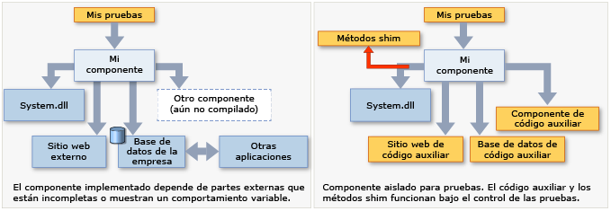

# <a name="isolate-code-under-test-with-microsoft-fakes"></a>Aislar el código en pruebas con Microsoft Fakes

Microsoft Fakes ayuda a aislar el código que se está probando mediante la sustitución de otros elementos de la aplicación con *código auxiliar* o *correcciones de compatibilidad (shim)* . Se trata de pequeños fragmentos de código que están bajo el control de las pruebas. Al aislar código para pruebas, sabe que, en caso de error, la causa está localizada ahí y no en alguna otra parte. El código auxiliar y las correcciones de compatibilidad (shims) también permiten probar el código aunque no funcionen otras partes de la aplicación todavía.

Fakes tiene dos versiones:

- El [código auxiliar](#get-started-with-stubs) reemplaza a una clase por un pequeño sustituto que implementa la misma interfaz.  Para utilizar código auxiliar, tiene que diseñar la aplicación para que cada componente dependa únicamente de interfaces y no de otros componentes. (Por "componente" se entiende una clase o grupo de clases diseñadas y actualizadas a la vez y que suelen estar contenidas en un ensamblado).

- Una [corrección de compatibilidad (shim)](#get-started-with-shims) modifica el código compilado de la aplicación en tiempo de ejecución para que, en lugar de realizar una llamada de método especificada, ejecute el código shim que proporciona la prueba. Las correcciones de compatibilidad (shims) se pueden usar para reemplazar las llamadas a ensamblados que no se pueden modificar, como los ensamblados .NET.



**Requisitos**

- Visual Studio Enterprise
- Un proyecto de .NET Framework
::: moniker range=">=vs-2019"
- La compatibilidad con proyectos de estilo SDK y .NET Core, que se encontraba en versión preliminar en Visual Studio 2019 Update 6, ya está habilitada de forma predeterminada en Update 8. Para obtener más información, vea [Microsoft Fakes para .NET Core y proyectos de tipo SDK](/visualstudio/releases/2019/release-notes#microsoft-fakes-for-net-core-and-sdk-style-projects).
::: moniker-end

> [!NOTE]
> - La generación de perfiles con Visual Studio no está disponible para las pruebas que usan Microsoft Fakes.

## <a name="choose-between-stub-and-shim-types"></a>Elegir entre código auxiliar y corrección de compatibilidad (shim)
Normalmente, un proyecto de Visual Studio se consideraría un componente, porque esas clases se desarrollan y actualizan al mismo tiempo. Puede considerar el uso de código auxiliar y correcciones de compatibilidad (shims) para las llamadas que el proyecto realice a otros proyectos de la solución o a otros ensamblados a los que el proyecto haga referencia.

Como directriz general, utilice código auxiliar para las llamadas dentro de la solución de Visual Studio y correcciones de compatibilidad (shims) para las llamadas a otros ensamblados a los que se hace referencia. El motivo es que, en su propia solución, es recomendable desacoplar los componentes definiendo las interfaces de la manera que el procesamiento con stub requiere. Pero los ensamblados externos, como *System.dll*, no se proporcionan normalmente con definiciones de interfaz independientes, por lo que en su lugar se deben utilizar correcciones de compatibilidad (shims).

Otras consideraciones son:

**Rendimiento.** Las correcciones de compatibilidad (shims) se ejecutan más lentamente porque reescriben el código en tiempo de ejecución. El código auxiliar no tiene esta sobrecarga de rendimiento y es tan rápido como los métodos virtuales.

**Métodos estáticos, tipos sellados.** Solo se puede utilizar código auxiliar para implementar interfaces. Por consiguiente, los tipos de código auxiliar no pueden utilizarse para los métodos estáticos, métodos no virtuales, métodos virtuales sellados, métodos de tipos sellados, etcétera.

**Tipos internos.** El código auxiliar y las correcciones de compatibilidad (shims) se pueden usar con los tipos internos que se hacen accesibles mediante el atributo de ensamblado <xref:System.Runtime.CompilerServices.InternalsVisibleToAttribute>.

**Métodos privados.** Las correcciones de compatibilidad (shims) pueden reemplazar llamadas a métodos privados si todos los tipos en la firma de método están visibles. El código auxiliar solo puede reemplazar métodos visibles.

**Interfaces y métodos abstractos.** El código auxiliar proporciona implementaciones de interfaces y métodos abstractos que se pueden utilizar en la prueba. Las correcciones de compatibilidad (shims) no pueden instrumentar interfaces y métodos abstractos, porque no tienen cuerpos de método.

Por lo general, nosotros recomendamos que se utilicen tipos de código auxiliar para aislar las dependencias del código base. Esto se puede conseguir ocultando los componentes en interfaces. Los tipos de corrección de compatibilidad (shim) pueden utilizarse para aislar los componentes de terceros que no proporcionan API comprobables.

## <a name="get-started-with-stubs"></a>Introducción a los stub
Para obtener una descripción más detallada, vea [Usar stubs para aislar las partes de la aplicación entre sí para las pruebas unitarias](../test/using-stubs-to-isolate-parts-of-your-application-from-each-other-for-unit-testing.md).

1. **Inyectar interfaces**

     Para utilizar código auxiliar, tiene que escribir el código que desea probar de manera que no mencione clases en otro componente de la aplicación. Por "componente" se entiende una clase o clases que se desarrollan y se actualizan juntas, y que normalmente están contenidas en un proyecto de Visual Studio. Las variables y los parámetros que se deben declarar con interfaces e instancias de otros componentes deben pasarse en o crearse mediante un generador. Por ejemplo, si StockFeed es una clase de otro componente de la aplicación, se consideraría erróneo:

     `return (new StockFeed()).GetSharePrice("COOO"); // Bad`

     En su lugar, defina una interfaz que el otro componente pueda implementar y que también pueda implementar el código auxiliar con fines de evaluación:

    ```csharp
    public int GetContosoPrice(IStockFeed feed) => feed.GetSharePrice("COOO");
    ```

    ```vb
    Public Function GetContosoPrice(feed As IStockFeed) As Integer
     Return feed.GetSharePrice("COOO")
    End Function

    ```

2. **Agregar un ensamblado de Fakes**

   1. En el **Explorador de soluciones**: 
       - Para un proyecto de .NET Framework anterior (que no sea de estilo SDK), expanda el nodo **Referencias** del proyecto de pruebas unitarias.
       ::: moniker range=">=vs-2019"
       - Para un proyecto de estilo SDK que tenga como destino .NET Framework o .NET Core, expanda el nodo **Dependencias** para buscar el ensamblado que desea imitar en **Ensamblados**, **Proyectos** o **Paquetes**.
       ::: moniker-end
       - Si está trabajando en Visual Basic, seleccione **Mostrar todos los archivos** en la barra de herramientas del **Explorador de soluciones** para ver el nodo **Referencias**.
   2. Seleccione el ensamblado que contiene las definiciones de clases para las que desea crear las correcciones de compatibilidad (shim). Por ejemplo, si quiere realizar una corrección de compatibilidad para **DateTime**, seleccione **System.dll**.

   3. En el menú contextual, seleccione **Agregar ensamblado de Fakes**.

3. En las pruebas, cree instancias de código auxiliar y proporcione código para sus métodos:

    ```csharp
    [TestClass]
    class TestStockAnalyzer
    {
        [TestMethod]
        public void TestContosoStockPrice()
        {
          // Arrange:

            // Create the fake stockFeed:
            IStockFeed stockFeed =
                 new StockAnalysis.Fakes.StubIStockFeed() // Generated by Fakes.
                     {
                         // Define each method:
                         // Name is original name + parameter types:
                         GetSharePriceString = (company) => { return 1234; }
                     };

            // In the completed application, stockFeed would be a real one:
            var componentUnderTest = new StockAnalyzer(stockFeed);

          // Act:
            int actualValue = componentUnderTest.GetContosoPrice();

          // Assert:
            Assert.AreEqual(1234, actualValue);
        }
        ...
    }
    ```

    ```vb
    <TestClass()> _
    Class TestStockAnalyzer

        <TestMethod()> _
        Public Sub TestContosoStockPrice()
            ' Arrange:
            ' Create the fake stockFeed:
            Dim stockFeed As New StockAnalysis.Fakes.StubIStockFeed
            With stockFeed
                .GetSharePriceString = Function(company)
                                           Return 1234
                                       End Function
            End With
            ' In the completed application, stockFeed would be a real one:
            Dim componentUnderTest As New StockAnalyzer(stockFeed)
            ' Act:
            Dim actualValue As Integer = componentUnderTest.GetContosoPrice
            ' Assert:
            Assert.AreEqual(1234, actualValue)
        End Sub
    End Class

    ```

    El toque mágico aquí lo pone la clase `StubIStockFeed`. Para cada interfaz del ensamblado al que se hace referencia, el mecanismo de Microsoft Fakes genera una clase de código auxiliar. El nombre de la clase de código auxiliar se deriva del nombre de la interfaz, con "`Fakes.Stub`" como prefijo y los nombres de los tipos de parámetros anexados.

    El código auxiliar también se genera para captadores y establecedores de propiedades, para los eventos y para métodos genéricos. Para obtener más información, vea [Usar stubs para aislar las partes de la aplicación entre sí para las pruebas unitarias](../test/using-stubs-to-isolate-parts-of-your-application-from-each-other-for-unit-testing.md).

## <a name="get-started-with-shims"></a>Introducción a las correcciones de compatibilidad (shim)
(Para obtener una descripción más detallada, vea [Usar correcciones de compatibilidad (shim) para aislar la aplicación de otros ensamblados para las pruebas unitarias](../test/using-shims-to-isolate-your-application-from-other-assemblies-for-unit-testing.md)).

Supongamos que el componente contiene las llamadas a `DateTime.Now`:

```csharp
// Code under test:
    public int GetTheCurrentYear()
    {
       return DateTime.Now.Year;
    }
```

Durante las pruebas, desea aplicar una corrección de compatibilidad (shim) a la propiedad `Now` porque la versión real devuelve de forma inapropiada un valor diferente en cada llamada.

Para usar correcciones de compatibilidad (shims) no tiene que modificar el código de aplicación o escribirlo de una manera determinada.

1. **Agregar un ensamblado de Fakes**

     En el **Explorador de soluciones**, abra las referencias del proyecto de prueba unitaria y seleccione la referencia al ensamblado que contiene el método que quiera imitar. En este ejemplo, la clase `DateTime` está en *System.dll*.  Para ver las referencias en un proyecto de Visual Basic, seleccione **Mostrar todos los archivos**.

     Seleccione **Agregar ensamblado de Fakes**.

2. **Insertar una corrección de compatibilidad (shim) en ShimsContext**

    ```csharp
    [TestClass]
    public class TestClass1
    {
            [TestMethod]
            public void TestCurrentYear()
            {
                int fixedYear = 2000;

                // Shims can be used only in a ShimsContext:
                using (ShimsContext.Create())
                {
                  // Arrange:
                    // Shim DateTime.Now to return a fixed date:
                    System.Fakes.ShimDateTime.NowGet =
                    () =>
                    { return new DateTime(fixedYear, 1, 1); };

                    // Instantiate the component under test:
                    var componentUnderTest = new MyComponent();

                  // Act:
                    int year = componentUnderTest.GetTheCurrentYear();

                  // Assert:
                    // This will always be true if the component is working:
                    Assert.AreEqual(fixedYear, year);
                }
            }
    }
    ```

    ```vb
    <TestClass()> _
    Public Class TestClass1
        <TestMethod()> _
        Public Sub TestCurrentYear()
            Using s = Microsoft.QualityTools.Testing.Fakes.ShimsContext.Create()
                Dim fixedYear As Integer = 2000
                ' Arrange:
                ' Detour DateTime.Now to return a fixed date:
                System.Fakes.ShimDateTime.NowGet = _
                    Function() As DateTime
                        Return New DateTime(fixedYear, 1, 1)
                    End Function

                ' Instantiate the component under test:
                Dim componentUnderTest = New MyComponent()
                ' Act:
                Dim year As Integer = componentUnderTest.GetTheCurrentYear
                ' Assert:
                ' This will always be true if the component is working:
                Assert.AreEqual(fixedYear, year)
            End Using
        End Sub
    End Class
    ```

    Los nombres de clase Shim se componen anteponiendo `Fakes.Shim` al nombre de tipo original. Los nombres de parámetro se anexan al nombre del método. (No es necesario agregar referencias de ensamblado a System.Fakes).

En el ejemplo anterior se utiliza una corrección de compatibilidad (shim) para un método estático. Para utilizar una corrección de compatibilidad (shim) para un método de instancia, escriba `AllInstances` entre el nombre del tipo y el nombre del método:

```vb
System.IO.Fakes.ShimFile.AllInstances.ReadToEnd = ...
```

(No hay ningún ensamblado "System.IO.Fakes" al que hacer referencia. El espacio de nombres lo genera el proceso de creación de correcciones de compatibilidad (shim), pero puede usar "using" o "Import" de la manera habitual).

También puede crear correcciones de compatibilidad (shims) para instancias concretas, para constructores y para propiedades. Para obtener más información, vea [Usar correcciones de compatibilidad (shim) para aislar la aplicación de otros ensamblados para las pruebas unitarias](../test/using-shims-to-isolate-your-application-from-other-assemblies-for-unit-testing.md).

## <a name="using-microsoft-fakes-in-the-ci"></a>Uso de Microsoft Fakes en la canalización de CI

### <a name="microsoft-fakes-assembly-generation"></a>Generación de ensamblados de Microsoft Fakes
Dado que Microsoft Fakes requiere Visual Studio Enterprise, para generar ensamblados de Fakes, hay que compilar el proyecto con una [tarea de compilación de Visual Studio](/azure/devops/pipelines/tasks/build/visual-studio-build?view=azure-devops&preserve-view=true).

::: moniker range=">=vs-2019"
> [!NOTE]
> También se pueden comprobar los ensamblados de Fakes en la canalización de CI y usar una [tarea de MSBuild](../msbuild/msbuild-task.md?view=vs-2019&preserve-view=true). Al hacerlo, debe asegurarse de que tiene una referencia de ensamblado al ensamblado de Fakes generado en el proyecto de prueba, que es similar al siguiente fragmento de código:

```xml
<Project Sdk="Microsoft.NET.Sdk">
    <ItemGroup>
        <Reference Include="FakesAssemblies\System.Fakes.dll">
    </ItemGroup>
</Project>
```

Esta referencia debe agregarse de forma manual y específica en proyectos de estilo SDK (.NET Core y .NET Framework), ya que ahora las referencias de ensamblado se tienen que agregar implícitamente al proyecto de prueba. Si sigue este método, debe asegurarse de que el ensamblado de Fakes se actualice cuando cambia el ensamblado primario.
::: moniker-end

### <a name="running-microsoft-fakes-tests"></a>Ejecución de pruebas de Microsoft Fakes
Siempre que los ensamblados de Microsoft Fakes estén presentes en el directorio configurado `FakesAssemblies` (el valor predeterminado es `$(ProjectDir)FakesAssemblies`), puede ejecutar las pruebas mediante la [tarea VSTest](/azure/devops/pipelines/tasks/test/vstest?view=azure-devops&preserve-view=true).

::: moniker range=">=vs-2019"
Para realizar pruebas distribuidas con la [tarea VSTest](/azure/devops/pipelines/tasks/test/vstest?view=azure-devops&preserve-view=true) en proyectos de .NET Core que usan Microsoft Fakes, se requiere Visual Studio 2019 Update 9 Preview `20201020-06` y versiones posteriores.
::: moniker-end

::: moniker range=">=vs-2019"
## <a name="transitioning-your-net-framework-test-projects-that-use-microsoft-fakes-to-sdk-style-net-framework-or-net-core-projects"></a>Transición de los proyectos de prueba de .NET Framework que usan Microsoft Fakes a proyectos de .NET Core o .NET Framework de estilo SDK
Solo necesitará realizar unos pocos cambios en el entorno de .NET Framework configurado para Microsoft Fakes para llevar a cabo la transición a .NET Core. Debe tener en cuenta los siguientes casos:
- Si usa una plantilla de proyecto personalizada, debe asegurarse de que sea de estilo SDK y de que se compile para una plataforma de destino compatible.
- Hay algunos tipos que ya se encuentran en diferentes ensamblados de .NET Framework y .NET Core (por ejemplo, `System.DateTime` existe en `System`/`mscorlib`, en .NET Framework, y en `System.Runtime`, en .NET Core); en estos escenarios debe cambiar el ensamblado que se va a imitar.
- Si tiene una referencia de ensamblado a un ensamblado de Fakes y al proyecto de prueba, es posible que vea una advertencia de compilación que indica que falta una referencia similar a la siguiente:
  ```
  (ResolveAssemblyReferences target) ->
  warning MSB3245: Could not resolve this reference. Could not locate the assembly "AssemblyName.Fakes". Check to make sure the assembly exists on disk.
  If this reference is required by your code, you may get compilation errors.
  ```
  Esta advertencia se produce porque pueden omitirse los cambios necesarios realizados en la generación de ensamblados de Fakes. Para evitarla, se puede quitar la referencia de ensamblado del archivo de proyecto, ya que ahora se agrega implícitamente durante la compilación.
::: moniker-end

## <a name="microsoft-fakes-support"></a>Compatibilidad de Microsoft Fakes 
### <a name="microsoft-fakes-in-older-projects-targeting-net-framework-non-sdk-style"></a>Microsoft Fakes en proyectos antiguos que tienen como destino .NET Framework (estilo que no sea de SDK).
- La generación de ensamblados de Microsoft Fakes es compatible con Visual Studio Enterprise 2015 y versiones posteriores.
- Las pruebas de Microsoft Fakes se pueden ejecutar con todos los paquetes de NuGet Microsoft.TestPlatform disponibles.
- La cobertura de código es compatible con los proyectos de prueba que usan Microsoft Fakes en Visual Studio Enterprise 2015 y versiones posteriores.

### <a name="microsoft-fakes-in-sdk-style-net-framework-and-net-core-projects"></a>Microsoft Fakes en proyectos de .NET Core y .NET Framework de estilo SDK
- La generación de ensamblados de Microsoft Fakes, en versión preliminar en Visual Studio Enterprise 2019 Update 6, ya está habilitada de forma predeterminada en Update 8.
- Las pruebas de Microsoft Fakes para los proyectos que tienen como destino .NET Framework pueden ejecutarse con todos los paquetes de NuGet Microsoft.TestPlatform disponibles.
- Las pruebas de Microsoft Fakes para los proyectos que tienen como destino .NET Core pueden ejecutarse con los paquetes de NuGet Microsoft.TestPlatform en las versiones [16.8.0-preview-20200921-01](https://www.nuget.org/packages/Microsoft.TestPlatform/16.8.0-preview-20200921-01) y posteriores.
- La cobertura de código es compatible con los proyectos de prueba que tienen como destino .NET Framework y que usan Microsoft Fakes en Visual Studio Enterprise 2015 y versiones posteriores.
- La compatibilidad con la cobertura de código en los proyectos de prueba que tienen como destino .NET Core y que usan Microsoft Fakes está en desarrollo.


## <a name="in-this-section"></a>En esta sección
[Usar código auxiliar para aislar partes de la aplicación entre sí para las pruebas unitarias](../test/using-stubs-to-isolate-parts-of-your-application-from-each-other-for-unit-testing.md)

[Usar correcciones de compatibilidad (shim) para aislar la aplicación de otros ensamblados para las pruebas unitarias](../test/using-shims-to-isolate-your-application-from-other-assemblies-for-unit-testing.md)

[Generación de código, compilación y convenciones de nomenclatura en Microsoft Fakes](../test/code-generation-compilation-and-naming-conventions-in-microsoft-fakes.md)
