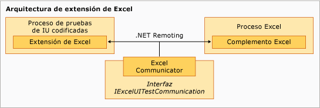

# Extensi&#243;n de muestra para probar la IU codificada para Excel
[!INCLUDE[vs2017banner](../code-quality/includes/vs2017banner.md)]

El componente de extensión del ejemplo se ejecuta en el proceso de prueba de IU codificada de [!INCLUDE[vsprvs](../code-quality/includes/vsprvs_md.md)] y es jerárquico, con la clase `ExtensionPackage` en la base.  Las clases `TechnologyManager`, `PropertyProvider` y `ActionFilter` están en el nivel siguiente, con los elementos de control en el nivel superior.  
  
   
Arquitectura de extensión de Excel  
  
## Puntos de extensión  
 Estas clases representan los puntos de la extensión que se implementan en el ejemplo para habilitar la prueba de IU codificada que comprueba [!INCLUDE[ofprexcel](../test/includes/ofprexcel_md.md)].  
  
### ExtensionPackage  
 Se hereda de la clase <xref:Microsoft.VisualStudio.TestTools.UITest.Extension.UITestExtensionPackage>, este es el punto de entrada para la extensión de la prueba de IU codificada.  Implementar esta clase abstracta da acceso interno al marco de prueba de IU codificada al administrador de tecnología de prueba de UI, al proveedor de propiedad de prueba de UI y al filtro de acción para probar la nueva interfaz de usuario.  Para obtener más información, vea [ExtensionPackage \(Clase\)](../test/sample-excel-extension-extensionpackage-class.md).  
  
### TechnologyManager  
 Se hereda de la clase <xref:Microsoft.VisualStudio.TestTools.UITest.Extension.UITechnologyManager>, esta clase proporciona un administrador de tecnología para la grabación de pruebas y su reproducción.  Para obtener más información, vea [TechnologyManager \(Clase\)](../test/sample-excel-extension-technologymanager-class.md).  
  
### ActionFilter  
 Se hereda de la clase <xref:Microsoft.VisualStudio.TestTools.UITest.Common.UITestActionFilter>, esta clase proporciona una clase base para agregar resultados similares de acción de pruebas en un único resultado.  Para obtener más información, vea [ActionFilter \(Clase\)](../test/sample-excel-extension-actionfilter-class.md).  
  
### Elementos de tecnología  
 Una clase base heredada de la clase <xref:Microsoft.VisualStudio.TestTools.UITest.Extension.UITechnologyElement> proporciona la base para los elementos de tecnología de las pruebas de UI que se pueden grabar y reproducir.  Para obtener más información, vea [Clases de elementos](../test/sample-excel-extension-element-classes.md).  
  
### PropertyProvider  
 Se hereda de la clase <xref:Microsoft.VisualStudio.TestTools.UITesting.UITestPropertyProvider>, esta clase proporciona una clase base que admite las propiedades de los elementos de la interfaz de usuario para la grabación de pruebas y su reproducción.  Para obtener más información, vea [PropertyProvider \(Clase\)](../test/sample-excel-extension-propertyprovider-class.md).  
  
## Vea también  
 <xref:Microsoft.VisualStudio.TestTools.UITesting.UITestPropertyProvider>   
 <xref:Microsoft.VisualStudio.TestTools.UITest.Extension.UITechnologyElement>   
 <xref:Microsoft.VisualStudio.TestTools.UITest.Common.UITestActionFilter>   
 <xref:Microsoft.VisualStudio.TestTools.UITest.Extension.UITestExtensionPackage>   
 [ExtensionPackage \(Clase\)](../test/sample-excel-extension-extensionpackage-class.md)   
 [TechnologyManager \(Clase\)](../test/sample-excel-extension-technologymanager-class.md)   
 [ActionFilter \(Clase\)](../test/sample-excel-extension-actionfilter-class.md)   
 [Clases de elementos](../test/sample-excel-extension-element-classes.md)   
 [PropertyProvider \(Clase\)](../test/sample-excel-extension-propertyprovider-class.md)