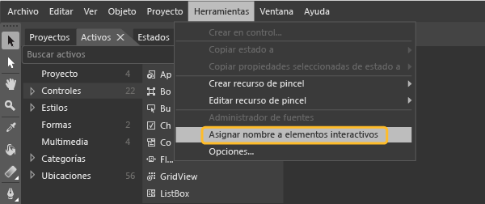

# <a name="set-a-unique-automation-property-for-uwp-controls-for-testing"></a>Establecer una propiedad única de automatización para controles UWP para pruebas

Si quiere ejecutar pruebas automatizadas de IU para la aplicación para UWP basada en XAML, cada control se debe identificar mediante una propiedad única de automatización. Puede asignar una propiedad única de automatización basada en el tipo de control de XAML de la aplicación.

[!INCLUDE [coded-ui-test-deprecation](includes/coded-ui-test-deprecation.md)]

## <a name="static-xaml-definition"></a>Definición estática XAML

Para especificar una propiedad única de automatización para un control definido en el archivo XAML, puede establecer **AutomationProperties.AutomationId** o **AutomationProperties.Name** de forma implícita o explícita, como se muestra en los ejemplos siguientes. Al establecer alguno de estos valores se proporciona al control una propiedad única de automatización que se puede usar para identificar el control cuando se crea una grabación de acciones o de pruebas de la interfaz de usuario.

### <a name="set-the-property-implicitly"></a>Establecer la propiedad implícitamente

Establezca **AutomationProperties.AutomationId** en **ButtonX** mediante la propiedad **Name** en el código XAML del control.

```xaml
<Button Name="ButtonX" Height="31" HorizontalAlignment="Left" Margin="23,26,0,0"  VerticalAlignment="Top" Width="140" Click="ButtonX_Click" />
```

Establezca **AutomationProperties.Name** en **ButtonY** mediante la propiedad **Content** en el código XAML del control.

```xaml
<Button Content="ButtonY" Height="31" HorizontalAlignment="Left" Margin="23,76,0,0" VerticalAlignment="Top" Width="140" Click="ButtonY_Click" />
```

### <a name="set-the-property-explicitly"></a>Establecer la propiedad explícitamente

Establezca **AutomationProperties.AutomationId** en **ButtonX** de forma explícita en el código XAML del control.

```xaml
<Button AutomationProperties.AutomationId="ButtonX" Height="31" HorizontalAlignment="Left" Margin="23,26,0,0"  VerticalAlignment="Top" Width="140" Click="ButtonX_Click" />
```

Establezca **AutomationProperties.Name** en **ButtonY** de forma explícita en el código XAML del control.

```xaml
<Button AutomationProperties.Name="ButtonY" Height="31" HorizontalAlignment="Left" Margin="23,76,0,0" VerticalAlignment="Top" Width="140" Click="ButtonY_Click" />
```

## <a name="assign-unique-names"></a>Asignar nombres únicos

En Blend para Visual Studio, se puede seleccionar una opción para asignar nombres únicos a elementos interactivos como botones, cuadros de lista, cuadros combinados y cuadros de texto, lo que proporciona los valores únicos de controles para **AutomationProperties.Name**.

Para asignar nombres únicos a los controles existentes, seleccione **Herramientas** > **Asignar nombre a elementos interactivos**.



Para asignar automáticamente nombres únicos a los nuevos controles que agregue, seleccione **Herramientas** > **Opciones** para abrir el cuadro de diálogo **Opciones**. Seleccione **Diseñador XAML** y después **Asignar nombre automáticamente a los elementos interactivos cuando se creen**. Haga clic en **Aceptar** para cerrar el cuadro de diálogo.

## <a name="use-a-data-template"></a>Usar plantillas de datos

Puede definir una plantilla sencilla mediante **ItemTemplate** para enlazar los valores de un cuadro de lista con variables:

```xaml
<ListBox Name="listBox1" ItemsSource="{Binding Source={StaticResource employees}}">
   <ListBox.ItemTemplate>
      <DataTemplate>
         <StackPanel Orientation="Horizontal">
            <TextBlock Text="{Binding EmployeeName}" />
            <TextBlock Text="{Binding EmployeeID}" />
         </StackPanel>
      </DataTemplate>
   </ListBox.ItemTemplate>
</ListBox>
```

También se puede usar una plantilla con **ItemContainerStyle** para enlazar los valores a las variables:

```xaml
<ListBox Name="listBox1" ItemsSource="{Binding Source={StaticResource employees}}">
   <ListBox.ItemContainerStyle>
      <Style TargetType="ListBoxItem">
         <Setter Property="Template">
            <Setter.Value>
               <ControlTemplate TargetType="ListBoxItem">
                  <Grid>
                     <Button Content="{Binding EmployeeName}" AutomationProperties.AutomationId="{Binding EmployeeID}"/>
                  </Grid>
               </ControlTemplate>
            </Setter.Value>
         </Setter>
      </Style>
   </ListBox.ItemContainerStyle>
</ListBox>
```

En ambos ejemplos, debe reemplazar el método **ToString()** de **ItemSource**, como se muestra en el ejemplo de código siguiente. Este código se asegura de que el valor de **AutomationProperties.Name** está establecido y es único, porque no se puede establecer una propiedad única de automatización para cada elemento de lista enlazado a datos mediante el enlace. En este caso, es suficiente con establecer un valor único para **Automation Properties.Name**.

> [!NOTE]
> Con este enfoque, el contenido interno del elemento de lista también se puede establecer en una cadena en la clase de empleados a través del enlace. Como se muestra en el ejemplo, al control de botón dentro de cada elemento de lista se le asigna un identificador único de automatización que es el id. de empleado.

```csharp
Employee[] employees = new Employee[]
{
   new Employee("john", "4384"),
   new Employee("margaret", "7556"),
   new Employee("richard", "8688"),
   new Employee("george", "1293")
};

listBox1.ItemsSource = employees;

public override string ToString()
{
    return EmployeeName + EmployeeID; // Unique Identification to be set as the AutomationProperties.Name
}
```

## <a name="use-a-control-template"></a>Usar una plantilla de control

Puede utilizar una plantilla de control para que cada instancia de un tipo específico obtenga una propiedad única de automatización cuando se define en el código. Cree la plantilla para que **AutomationProperty** enlace a un identificador único en la instancia del control. En el código XAML siguiente se muestra un enfoque para crear este enlace con una plantilla de control:

```xaml
<Style x:Key="MyButton" TargetType="Button">
<Setter Property="Template">
   <Setter.Value>
<ControlTemplate TargetType="Button">
   <Grid>
      <CheckBox HorizontalAlignment="Left" AutomationProperties.AutomationId="{TemplateBinding Content}"></CheckBox>
      <Button Width="90" HorizontalAlignment="Right" Content="{TemplateBinding Content}" AutomationProperties.AutomationId="{TemplateBinding Content}"></Button>
   </Grid>
</ControlTemplate>
   </Setter.Value>
</Setter>
</Style>
```

Al definir dos instancias de un botón mediante esta plantilla de control, el id. de automatización se establece en la cadena de contenido única para los controles de la plantilla, como se muestra en el código XAML siguiente:

```xaml
<Button Content="Button1" Style="{StaticResource MyButton}" Width="140"/>
<Button Content="Button2" Style="{StaticResource MyButton}" Width="140"/>
```

### <a name="dynamic-controls"></a>Controles dinámicos

Si tiene controles que se crean de forma dinámica a partir del código en lugar de estáticamente o a través de las plantillas de los archivos XAML, debe establecer las propiedades **Content** o **Name** para el control. Esta acción garantiza que cada control dinámico tiene una propiedad única de automatización. Por ejemplo, si tiene una casilla que debe mostrarse cuando se selecciona un elemento de lista, puede establecer estas propiedades, como se muestra aquí:

```csharp
private void CreateCheckBox(string txt, StackPanel panel)
{
   CheckBox cb = new CheckBox();
   cb.Content = txt; // Sets the AutomationProperties.Name
   cb.Height = 50;
   cb.Width = 100;
   cb.Name = "DynamicCheckBoxAid"+ txt; // Sets the AutomationProperties.AutomationId
   panel.Children.Add(cb);
}
```

## <a name="see-also"></a>Vea también

- [Comprobación de aplicaciones para UWP con pruebas automatizadas de IU](../test/test-uwp-app-with-coded-ui-test.md)
