# Probar aplicaciones de Windows Phone 8.1 con pruebas de IU codificadas
[!INCLUDE[vs2017banner](../code-quality/includes/vs2017banner.md)]

Use las pruebas de interfaz de usuario codificadas para comprobar las aplicaciones de Windows Phone.  
  
## Crear una aplicación simple de Windows Phone  
  
1.  Cree un nuevo proyecto para una aplicación de Windows Phone vacía mediante una plantilla de Visual C\# o Visual Basic.  
  
     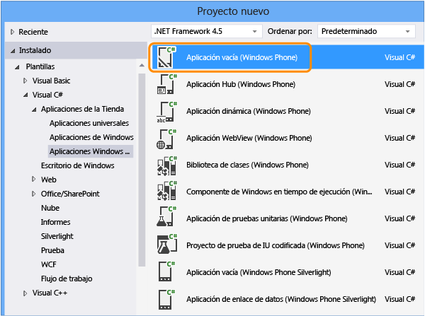  
  
2.  En el Explorador de soluciones, abra el archivo MainPage.xaml. Desde el Cuadro de herramientas, arrastre un control de botón y un control de cuadro de texto a la superficie de diseño.  
  
     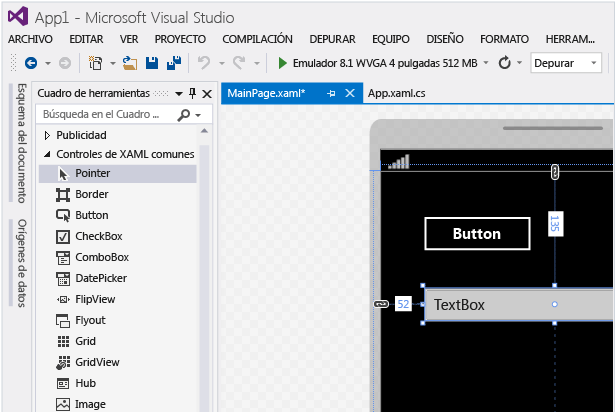  
  
3.  En la ventana Propiedades, asigne un nombre al control de botón.  
  
     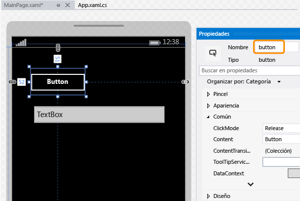  
  
4.  Asigne un nombre al control del cuadro de texto.  
  
     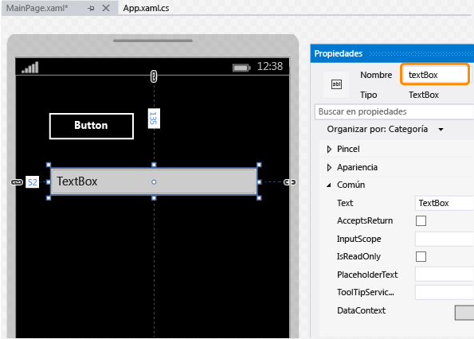  
  
5.  En la superficie del diseñador, haga doble clic en el control de botón y agregue el código siguiente:  
  
    ```c#  
    private void button_Click_1(object sender, RoutedEventArgs e) { this.textBox.Text = this.button.Name; }  
  
    ```  
  
    ```vb#  
    Public NotInheritable Class MainPage Inherits Page Private Sub button_Click(sender As Object, e As RoutedEventArgs) Handles Button.Click Me.textBox.Text = Me.button.Name End Sub End Class  
    ```  
  
6.  Presione F5 para ejecutar la aplicación de Windows Phone en el emulador y comprobar si está funcionando.  
  
       
  
7.  Salga del emulador.  
  
## Implementar la aplicación de Windows Phone  
  
1.  Para que la prueba de interfaz de usuario codificada pueda asignar controles de una aplicación, debe implementar la aplicación.  
  
     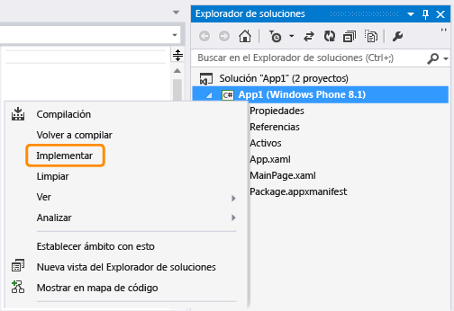  
  
     El emulador se inicia. La aplicación ya está disponible para probarla.  
  
     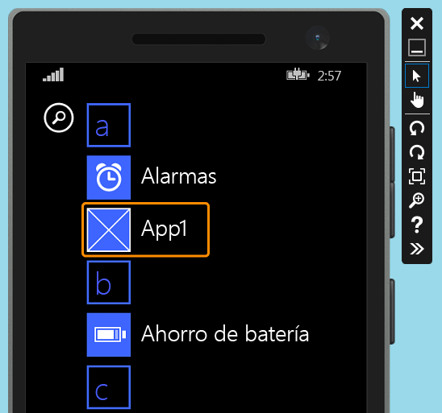  
  
     Mantenga el emulador ejecutándose mientras crea la prueba de interfaz de usuario codificada.  
  
## Crear una prueba de interfaz de usuario codificada para la aplicación de Windows Phone  
  
1.  Agregue un nuevo proyecto de prueba de interfaz de usuario codificada a la solución con la aplicación de Windows Phone.  
  
     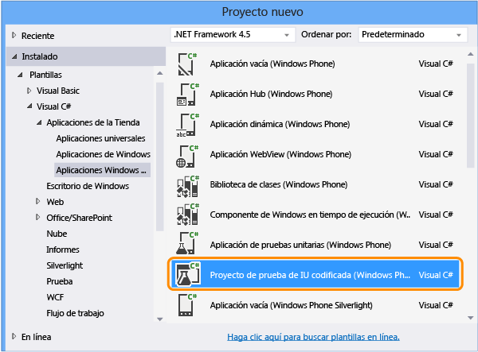  
  
2.  Elija editar la asignación de IU mediante la herramienta de selección precisa.  
  
     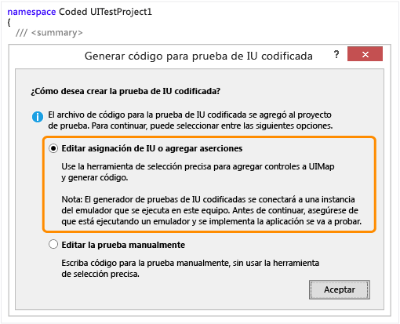  
  
3.  Utilice la herramienta de selección precisa para seleccionar la aplicación y luego copie el valor de la propiedad **AutomationId** de la aplicación, que se usará después para iniciar la aplicación en la prueba.  
  
     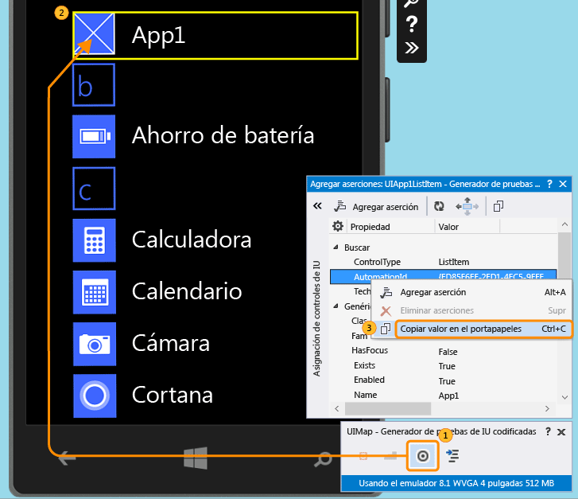  
  
4.  En el emulador, inicie la aplicación y use la herramienta de selección precisa para elegir el control de botón. Después, agregue el control de botón a la asignación de controles de interfaz de usuario.  
  
     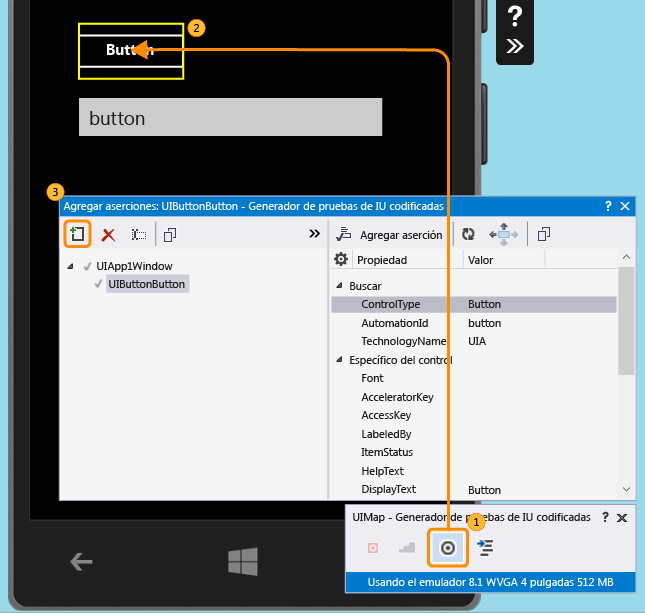  
  
5.  Para agregar el control de cuadro de texto a la asignación de control de interfaz de usuario, repita el paso anterior.  
  
     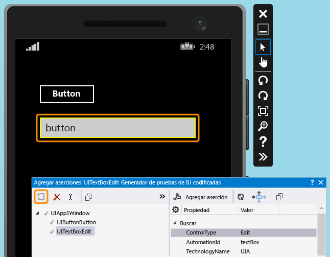  
  
6.  Elija Generar código para crear código para los cambios en la asignación de controles de interfaz de usuario.  
  
     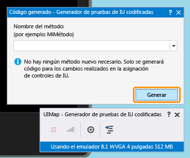  
  
7.  Utilice la herramienta de selección precisa para seleccionar el control de cuadro de texto y después seleccione la propiedad **Texto**.  
  
     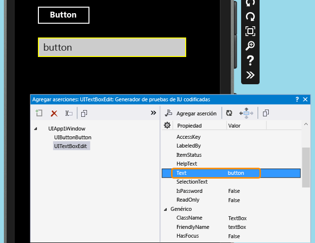  
  
8.  Agregue una aserción. Se utilizará en la prueba para comprobar que el valor sea correcto.  
  
     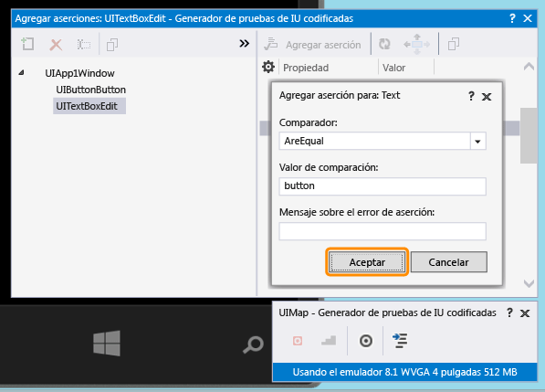  
  
9. Agregue y genere código para el método de aserción.  
  
     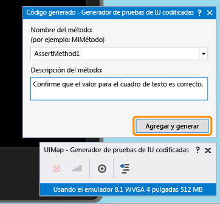  
  
10. **Visual C\#**  
  
     En el Explorador de soluciones, abra el archivo UIMap.Designer.cs para ver el código recién agregado para el método de aserción y los controles.  
  
     **Visual Basic**  
  
     En el Explorador de soluciones, abra el archivo CodedUITest1.vb. En el código del método de prueba CodedUITestMethod1\(\), haga clic con el botón secundario en la llamada al método de aserción que se agregó automáticamente, `Me.UIMap.AssertMethod1()`, y elija **Ir a definición**. Esto abrirá el archivo de UIMap.Designer.vb en el editor de código, de modo que pueda ver el código agregado para el método de aserción y los controles.  
  
    > [!WARNING]
    >  No modifique directamente el archivo UIMap.designer.cs o el archivo UIMap.Designer.vb. Si lo hace, se sobrescribirán los cambios en el archivo cada vez que se genere la prueba.  
  
     **Método de aserción**  
  
    ```c#  
    public void AssertMethod1() { #region Variable Declarations XamlEdit uITextBoxEdit = this.UIApp1Window.UITextBoxEdit; #endregion // Verify that the 'Text' property of 'textBox' text box equals 'button' Assert.AreEqual(this.AssertMethod1ExpectedValues.UITextBoxEditText, uITextBoxEdit.Text); }  
    ```  
  
    ```vb#  
    Public Sub AssertMethod1() Dim uITextBoxEdit As XamlEdit = Me.UIApp1Window.UITextBoxEdit 'Verify that the 'Text' property of 'textBox' text box equals 'button' Assert.AreEqual(Me.AssertMethod1ExpectedValues.UITextBoxEditText, uITextBoxEdit.Text) End Sub  
    ```  
  
     **Controles**  
  
    ```c#  
    #region Properties public virtual AssertMethod1ExpectedValues AssertMethod1ExpectedValues { get { if ((this.mAssertMethod1ExpectedValues == null)) { this.mAssertMethod1ExpectedValues = new AssertMethod1ExpectedValues(); } return this.mAssertMethod1ExpectedValues; } } public UIApp1Window UIApp1Window { get { if ((this.mUIApp1Window == null)) { this.mUIApp1Window = new UIApp1Window(); } return this.mUIApp1Window; } } #endregion #region Fields private AssertMethod1ExpectedValues mAssertMethod1ExpectedValues; private UIApp1Window mUIApp1Window; #endregion  
    ```  
  
    ```vb#  
    #Region "Properties" Public ReadOnly Property UIButtonButton() As XamlButton Get If (Me.mUIButtonButton Is Nothing) Then Me.mUIButtonButton = New XamlButton(Me) Me.mUIButtonButton.SearchProperties(XamlButton.PropertyNames.AutomationId) = "button" End If Return Me.mUIButtonButton End Get End Property Public ReadOnly Property UITextBoxEdit() As XamlEdit Get If (Me.mUITextBoxEdit Is Nothing) Then Me.mUITextBoxEdit = New XamlEdit(Me) Me.mUITextBoxEdit.SearchProperties(XamlEdit.PropertyNames.AutomationId) = "textBox" End If Return Me.mUITextBoxEdit End Get End Property #End Region #Region "Fields" Private mUIButtonButton As XamlButton Private mUITextBoxEdit As XamlEdit #End Region  
    ```  
  
11. En el Explorador de soluciones, abra el archivo CodedUITest1.cs o CodedUITest1.vb. Ahora puede agregar código al método CodedUTTestMethod1 para las acciones necesarias para ejecutar la prueba. Use los controles agregados a UIMap para agregar código:  
  
    1.  Inicie la aplicación de Windows Phone mediante la propiedad ID de automatización que copió al Portapapeles previamente:  
  
        ```c#  
        XamlWindow myAppWindow = XamlWindow.Launch("ed85f6ff-2fd1-4ec5-9eef-696026c3fa7b_cyrqexqw8cc7c!App");  
        ```  
  
        ```vb#  
        XamlWindow.Launch("ed85f6ff-2fd1-4ec5-9eef-696026c3fa7b_cyrqexqw8cc7c!App");  
        ```  
  
    2.  Agregue un gesto para pulsar el control de botón:  
  
        ```c#  
        Gesture.Tap(this.UIMap.UIApp1Window.UIButtonButton);  
        ```  
  
        ```vb#  
        Gesture.Tap(Me.UIMap.UIApp1Window.UIButtonButton)  
        ```  
  
    3.  Compruebe que la llamada al método de aserción que se generó automáticamente se incluye después de iniciar la aplicación y el gesto en el botón:  
  
        ```c#  
        this.UIMap.AssertMethod1();  
        ```  
  
        ```vb#  
        Me.UIMap.AssertMethod1()  
        ```  
  
     Tras agregar el código, el método de prueba CodedUITestMethod1 debería ser similar al siguiente:  
  
    ```c#  
    [TestMethod] public void CodedUITestMethod1() { // To generate code for this test, select "Generate Code for Coded UI Test" from the shortcut menu and select one of the menu items. // Launch the app. XamlWindow myAppWindow = XamlWindow.Launch("ed85f6ff-2fd1-4ec5-9eef-696026c3fa7b_cyrqexqw8cc7c!App"); // Tap the button. Gesture.Tap(this.UIMap.UIApp1Window.UIButtonButton); this.UIMap.AssertMethod1(); }  
    ```  
  
    ```vb#  
    <CodedUITest> Public Class CodedUITest1 <TestMethod()> Public Sub CodedUITestMethod1() ' ' To generate code for this test, select "Generate Code for Coded UI Test" from the shortcut menu and select one of the menu items. ' ' Launch the app. XamlWindow.Launch("ed85f6ff-2fd1-4ec5-9eef-696026c3fa7b_cyrqexqw8cc7c!App") '// Tap the button. Gesture.Tap(Me.UIMap.UIApp1Window.UIButtonButton) Me.UIMap.AssertMethod1() End Sub  
    ```  
  
## Ejecutar la prueba de interfaz de usuario codificada  
  
1.  Compile la prueba y luego ejecútela mediante el explorador de pruebas.  
  
     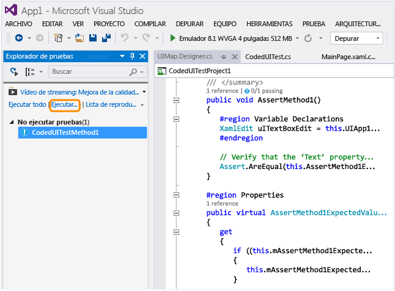  
  
     La aplicación de Windows Phone se inicia, la acción para pulsar el botón se completa y la propiedad Text del cuadro de texto se rellena y se valida mediante el método de aserción.  
  
       
  
     Una vez finalizada la prueba, el explorador de pruebas confirma que se superó la prueba.  
  
     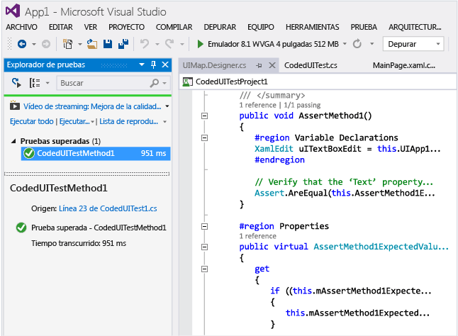  
  
##  <a name="TestingPhoneAppsCodedUI_DataDriven"></a> Usar pruebas de interfaz de usuario codificadas controladas por datos en las aplicaciones de Windows Phone  
 Para probar las distintas condiciones, se puede ejecutar varias veces una prueba de interfaz de usuario codificada con distintos conjuntos de datos.  
  
 Las pruebas de interfaz de usuario codificadas controladas por datos para Windows Phone se definen mediante el atributo DataRow en un método de prueba. En el siguiente ejemplo, x e y usan los valores 1 y 2 para la primera iteración y \-1 y \-2 para la segunda iteración de la prueba.  
  
```  
[DataRow(1, 2, DisplayName = "Add positive numbers")] [DataRow(-1, -2, DisplayName = "Add negative numbers")] [TestMethod] public void DataDrivingDemo_MyTestMethod(int x, int y)  
  
```  
  
## Preguntas y respuestas  
  
### P: ¿Tengo que implementar la aplicación de Windows Phone en el emulador para asignar los controles de interfaz de usuario?  
 **R**: Sí. El generador de pruebas de interfaz de usuario codificadas exige que se esté ejecutando un emulador y que la aplicación esté implementada en él. De lo contrario, mostrará un mensaje de error que indicará que no se encuentra ningún emulador en ejecución.  
  
###  <a name="TestingPhoneAppsCodedUI_EmulatorDevice"></a> P: ¿Se puede ejecutar las pruebas solo en el emulador o puedo también usar un dispositivo físico?  
 **R**: Se admiten ambas opciones. El destino de la ejecución de prueba se selecciona cambiando el tipo de emulador o seleccionando el dispositivo en la barra de herramientas del dispositivo. Si se seleccionó Dispositivo, tiene que haber un dispositivo Phone Blue conectado a uno de los puertos USB de la máquina.  
  
 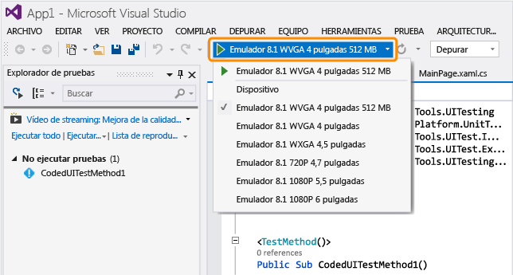  
  
### P: ¿Por qué no veo la opción para registrar la prueba de IU codificada en la opción Generar código de un cuadro de diálogo Prueba de IU codificada?  
 **R**: La opción para registrar no se admite en aplicaciones de Windows Phone.  
  
### P: ¿Puedo crear una prueba de interfaz de usuario codificada para las aplicaciones de Windows Phone basadas en WinJS, Silverlight o HTML5?  
 **R**: No. Solo se admiten aplicaciones basadas en XAML.  
  
### P: ¿Puedo crear pruebas de IU codificadas para las aplicaciones de Windows Phone en un sistema que no ejecute Windows 8.1 ni Windows 10?  
 **R**: No, las plantillas de proyecto de prueba de IU codificada solo están disponibles en Windows 8.1 y Windows 10. Para crear la automatización para las aplicaciones de la Plataforma universal de Windows \(UWP\), necesitará Windows 10.  
  
### P: ¿Cómo puedo crear pruebas de IU codificadas para las aplicaciones de la Plataforma universal de Windows \(UWP\)?  
 **R**: Según la plataforma en la que vaya a probar su aplicación para UWP, cree el proyecto de prueba de IU codificada de una de estas maneras:  
  
-   Una aplicación para UWP que se ejecuta en el equipo local se ejecutará como una aplicación de la Tienda. Para probarlo, debe usar la plantilla **Proyecto de prueba de IU codificada \(Windows\)**. Para encontrar esta plantilla cuando cree un nuevo proyecto, vaya al nodo **Windows**, **Universal**. O vaya al nodo **Windows**, **Windows 8**, **Windows**.  
  
-   Una aplicación para UWP que se ejecute en el dispositivo o emulador se ejecutará como una aplicación de Windows Phone. Para probarlo, debe usar la plantilla **Proyecto de prueba de IU codificada \(Windows Phone\)**. Para encontrar esta plantilla cuando cree un nuevo proyecto, vaya al nodo **Windows**, **Universal**. O vaya al nodo **Windows**, **Windows 8**, **Windows Phone**.  
  
 Después de crear el proyecto, el procedimiento para crear una prueba sigue siendo el mismo que antes.  
  
### P: ¿Puedo seleccionar controles externos al emulador?  
 **R**: No. El compilador no los detectará.  
  
### P: ¿Puedo usar el compilador de pruebas de interfaz de usuario codificadas para asignar controles mediante un dispositivo telefónico fijo?  
 **R**: No. El compilador solo puede asignar elementos de la interfaz de usuario si la aplicación se implementó en el emulador.  
  
### P: ¿Por qué no puedo modificar el código en el archivo UIMap.Designer?  
 **R:** Cualquier cambio que se efectúe en el código del archivo UIMapDesigner.cs se sobrescribirá cada vez que se genere código mediante UIMap \- Generador de pruebas de IU codificadas. Si tiene que modificar un método grabado, debe copiarlo en el archivo UIMap.cs y cambiar el nombre. El archivo UIMap.cs se puede utilizar para invalidar métodos y propiedades en el archivo UIMapDesigner.cs. Debe quitar la referencia al método original en el archivo UITest.cs el Codificado y reemplazarlo con el nombre del método cuyo nombre ha cambiado.  
  
### P: ¿Puedo ejecutar una prueba de interfaz de usuario codificada en mi aplicación de Windows Phone desde la línea de comandos?  
 **R**: Sí. Use un archivo runsettings para especificar el dispositivo de destino para la ejecución de prueba. Por ejemplo:  
  
 **vstest.console.exe “pathToYourCodedUITestDll” \/settings:devicetarget.runsettings**  
  
 Archivo de ejemplo runsettings:  
  
```  
<?xml version="1.0" encoding="utf-8"?> <RunSettings> <MSPhoneTest> <!--to specify test execution on device, use a TargetDevice option as follows--> <TargetDevice>Device</TargetDevice> <!--to specify an emulator instead, use a TargetDevice option like below--> <!--<TargetDevice>Emulator 8.1 WVGA 4 inch 512MB</TargetDevice>--> </MSPhoneTest> </RunSettings>  
```  
  
### P: ¿Cuáles son las diferencias entre las pruebas de interfaz de usuario codificadas para las aplicaciones de Windows Store basadas en XAML y las aplicaciones de Windows Phone?  
 **R**: Debajo se indican algunas de las diferencias clave:  
  
|Característica|Aplicaciones de la Tienda Windows|Aplicaciones de Windows Phone|  
|--------------------|---------------------------------------|-----------------------------------|  
|Destino para ejecutar las pruebas|Equipo local o remoto. Se pueden especificar equipos remotos cuando use un caso de prueba automatizado para ejecutar las pruebas. Vea [Automatizar un caso de prueba en Microsoft Test Manager](/devops-test-docs/test/automate-a-test-case-in-microsoft-test-manager).|Emulador o dispositivo. Vea [P: ¿Se puede ejecutar las pruebas solo en el emulador o puedo también usar un dispositivo físico?](#TestingPhoneAppsCodedUI_EmulatorDevice) en este tema.|  
|Ejecutar desde la línea de comandos|El archivo de configuración no es necesario para especificar el destino.|El archivo Runsettings es necesario para especificar el destino.|  
|Clases especializadas para controles de shell|<xref:Microsoft.VisualStudio.TestTools.UITesting.DirectUIControls.DirectUIControl>|<xref:Microsoft.VisualStudio.TestTools.UITesting.UITestControl>|  
|Control WebView en una aplicación XAML|Admitido si usa clases Html\* especializadas para interactuar con elementos HTML. Vea <xref:Microsoft.VisualStudio.TestTools.UITesting.HtmlControls>.|No se admite.|  
|Ejecutar pruebas automatizadas desde MTM|Se admite.|No se admite.|  
|Pruebas controladas por datos|Vea [Pruebas controladas por datos](../test/creating-a-data-driven-coded-ui-test.md) para información sobre el uso de orígenes de datos externos y el uso del atributo DataSource en un método de prueba.|Los datos se especifican en línea, con el atributo DataRow en un método de prueba. Vea [Usar pruebas de interfaz de usuario codificadas controladas por datos en las aplicaciones de Windows Phone](#TestingPhoneAppsCodedUI_DataDriven) en este tema.|  
  
 Para más información sobre las pruebas de interfaz de usuario codificadas para aplicaciones de Windows Store, vea [Probar aplicaciones de la Tienda Windows 8.1 con pruebas de interfaz de usuario codificadas](../test/test-windows-store-8-1-apps-with-coded-ui-tests.md).  
  
## Recursos externos  
 Blog de administración del ciclo de vida de las aplicaciones de Microsoft Visual Studio: [Uso de interfaces de usuario codificadas para probar aplicaciones de Windows Phone basadas en XAML](http://blogs.msdn.com/b/visualstudioalm/archive/2014/04/05/using-coded-ui-to-test-xaml-based-windows-phone-apps.aspx?PageIndex=2#comments)  
  
## Vea también  
 [Usar la automatización de IU para probar el código](../test/use-ui-automation-to-test-your-code.md)