# <a name="test-windows-uwp-and-81-store-apps-with-coded-ui-tests"></a>Probar aplicaciones para UWP y de la Tienda Windows 8.1 con pruebas automatizadas de IU

Use este tutorial para crear pruebas de interfaz de usuario para aplicaciones para UWP y aplicaciones de la Tienda Windows 8.1 basadas en XAML. 
  
## <a name="create-a-simple-windows-store-app"></a>Crear una aplicación simple de la Tienda Windows  
  
1.  Si desea ejecutar pruebas de IU codificadas para la aplicación de la Tienda Windows basada en XAML, debe [establecer una propiedad única de automatización que identifique cada control](../test/set-a-unique-automation-property-for-windows-store-controls-for-testing.md).  
  
     En el menú **Herramientas** , señale **Opciones** y después elija **Editor de texto**, **XAML**y, por último **Varios**.  
  
     Seleccione la casilla para asignar nombre automáticamente a los elementos interactivos cuando se creen.  
  
     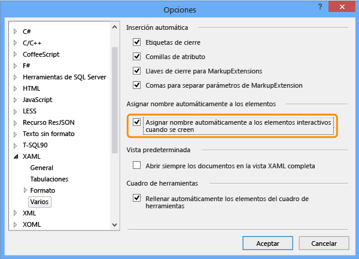  
  
2.  Cree un nuevo proyecto para una aplicación de la Tienda Windows basada en XAML en blanco mediante una plantilla de Visual C# o Visual Basic.  
  
       
  
3.  En el Explorador de soluciones, abra el archivo MainPage.xaml. Desde el Cuadro de herramientas, arrastre un control de botón y un control de cuadro de texto a la superficie de diseño.  
  
     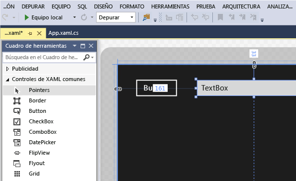  
  
4.  Haga doble clic en el control de botón y agregue el código siguiente:  
  
    ```c#  
    private void button_Click_1(object sender, RoutedEventArgs e)  
    {  
        this.textBox.Text = this.button.Name;  
    }  
  
    ```  
  
    ```vb#  
    Public NotInheritable Class MainPage  
        Inherits Page  
  
        Private Sub button_Click(sender As Object, e As RoutedEventArgs) Handles Button.Click  
            Me.textBox.Text = Me.button.Name  
        End Sub  
    End Class  
    ```  
  
5.  Presione F5 para ejecutar la aplicación de la Tienda Windows.  
  
## <a name="create-and-run-a-coded-ui-test-for-the-windows-store-app"></a>Crear y ejecutar una prueba de IU codificada para la aplicación de la Tienda Windows  

[¿Cómo puedo crear pruebas automatizadas de IU para aplicaciones de la Plataforma universal de Windows (UWP)?](#uwpapps)
  
1.  Cree un nuevo proyecto de prueba de IU codificada para la aplicación de la Tienda Windows.  
  
     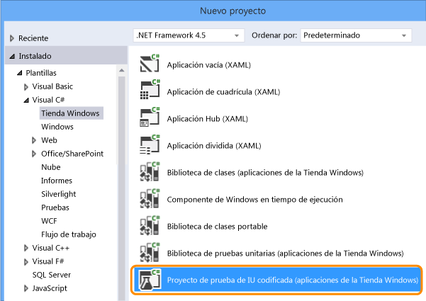  
  
2.  Elija editar la asignación de IU mediante la herramienta de selección precisa.  
  
     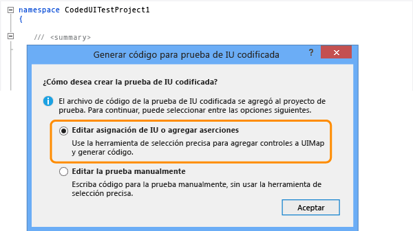  
  
3.  Use la herramienta de selección precisa en el Generador de pruebas de IU codificadas para seleccionar el icono de la aplicación, haga clic con el botón secundario en **AutomationId** y elija **Copiar valor en el Portapapeles**. El valor del Portapapeles se usará después para escribir la acción para iniciar la aplicación para prueba.  
  
     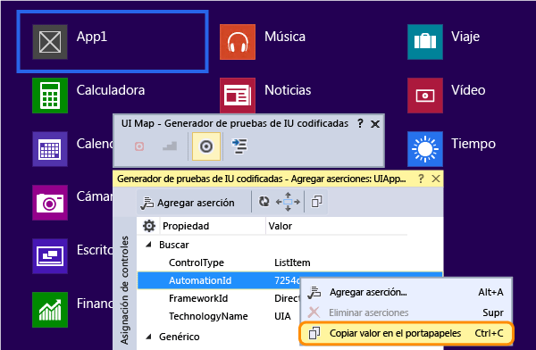  
  
4.  En la aplicación de la Tienda Windows en ejecución, use la herramienta de selección precisa para elegir el control de botón y el control de cuadro de texto. Tras agregar cada control, elija el botón **Agregar control a asignación de controles de IU** en la barra de herramientas del Generador de pruebas de IU codificadas.  
  
     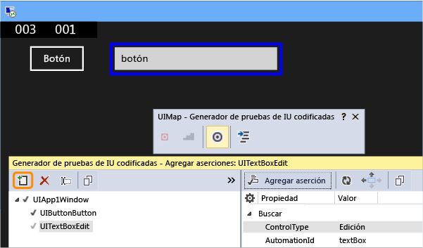  
  
5.  Elija el botón **Generar código** en la barra de herramientas del Generador de pruebas de IU codificadas y elija **Generar** para crear código para los cambios en la asignación de controles de IU.  
  
     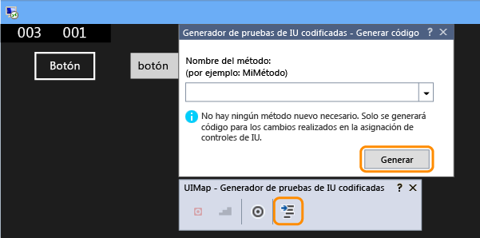  
  
6.  Elija el botón para establecer un valor en el cuadro de texto.  
  
     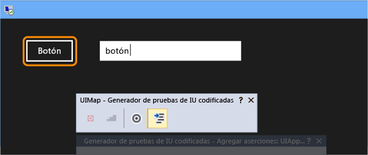  
  
7.  Utilice la herramienta de selección precisa para seleccionar el control de cuadro de texto y después seleccione la propiedad **Texto** .  
  
     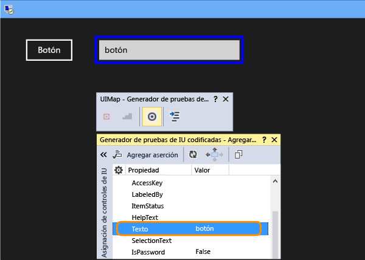  
  
8.  Agregue una aserción. Se utilizará en la prueba para comprobar que el valor sea correcto.  
  
     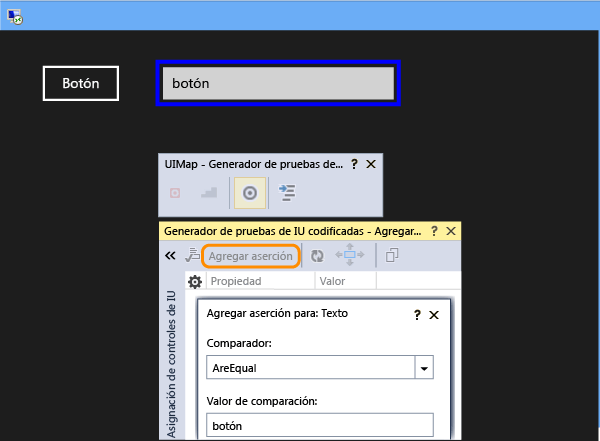  
  
9. Agregue y genere código para la aserción.  
  
     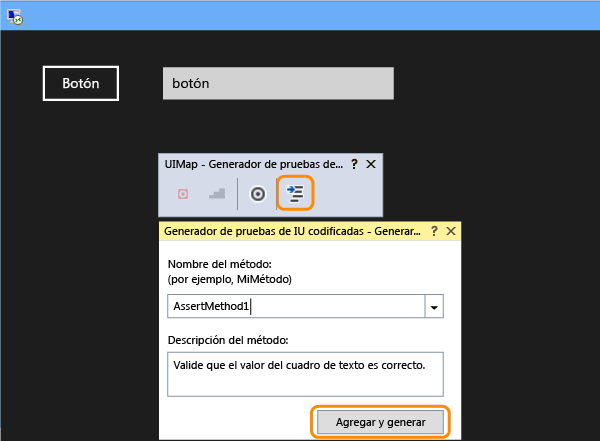  
  
10. **Visual C#**  
  
     En el Explorador de soluciones, abra el archivo UIMap.Designer.cs para ver el código agregado para el método de aserción y los controles.  
  
     **Visual Basic**  
  
     En el Explorador de soluciones, abra el archivo CodedUITest1.vb y, en el código del método de prueba CodedUITestMethod1(), haga clic con el botón secundario en la llamada al método de aserción que se agregó automáticamente, `Me.UIMap.AssertMethod1()` , y elija **Ir a definición**. Esto abrirá el archivo de UIMap.Designer.vb en el editor de código de modo que pueda ver el código agregado para el método de aserción y los controles.  
  
    > [!WARNING]
    >  No modifique directamente el archivo UIMap.designer.cs o el archivo UIMap.Designer.vb. Si lo hace, se sobrescribirán los cambios en el archivo cada vez que se genere la prueba.  
  
     **Método de aserción**  
  
    ```c#  
    public void AssertMethod1()  
    {  
        #region Variable Declarations  
        XamlEdit uITextBoxEdit = this.UIApp1Window.UITextBoxEdit;  
        #endregion  
  
        // Verify that the 'Text' property of 'textBox' text box equals 'button'  
        Assert.AreEqual(this.AssertMethod3ExpectedValues.UITextBoxEditText, uITextBoxEdit.Text);  
    }  
    ```  
  
    ```vb#  
    Public Sub AssertMethod1()  
        Dim uITextBoxEdit As XamlEdit = Me.UIApp2Window.UITextBoxEdit  
  
        'Verify that the 'Text' property of 'textBox' text box equals 'button'  
        Assert.AreEqual(Me.AssertMethod1ExpectedValues.UITextBoxEditText, uITextBoxEdit.Text)  
    End Sub  
    ```  
  
     **Controles**  
  
    ```c#  
    #region Properties  
    public XamlButton UIButtonButton  
    {  
        get  
        {  
            if ((this.mUIButtonButton == null))  
            {  
                this.mUIButtonButton = new XamlButton(this);  
                #region Search Criteria  
                this.mUIButtonButton.SearchProperties[XamlButton.PropertyNames.AutomationId] = "button";  
                this.mUIButtonButton.WindowTitles.Add("App1");  
                #endregion  
            }  
            return this.mUIButtonButton;  
        }  
    }  
  
    public XamlEdit UITextBoxEdit  
    {  
        get  
        {  
            if ((this.mUITextBoxEdit == null))  
            {  
                this.mUITextBoxEdit = new XamlEdit(this);  
                #region Search Criteria  
                this.mUITextBoxEdit.SearchProperties[XamlEdit.PropertyNames.AutomationId] = "textBox";  
                this.mUITextBoxEdit.WindowTitles.Add("App1");  
                #endregion  
            }  
            return this.mUITextBoxEdit;  
        }  
    }  
    #endregion  
  
    #region Fields  
    private XamlButton mUIButtonButton;  
  
    private XamlEdit mUITextBoxEdit;  
    #endregion  
    ```  
  
    ```vb#  
    #Region "Properties"  
    Public ReadOnly Property UIButtonButton() As XamlButton  
        Get  
            If (Me.mUIButtonButton Is Nothing) Then  
                Me.mUIButtonButton = New XamlButton(Me)  
                Me.mUIButtonButton.SearchProperties(XamlButton.PropertyNames.AutomationId) = "button"  
                Me.mUIButtonButton.WindowTitles.Add("App2")  
            End If  
            Return Me.mUIButtonButton  
        End Get  
    End Property  
  
    Public ReadOnly Property UITextBoxEdit() As XamlEdit  
        Get  
            If (Me.mUITextBoxEdit Is Nothing) Then  
                Me.mUITextBoxEdit = New XamlEdit(Me)  
                Me.mUITextBoxEdit.SearchProperties(XamlEdit.PropertyNames.AutomationId) = "textBox"  
                Me.mUITextBoxEdit.WindowTitles.Add("App2")  
            End If  
            Return Me.mUITextBoxEdit  
        End Get  
    End Property  
    #End Region  
  
    #Region "Fields"  
    Private mUIButtonButton As XamlButton  
  
    Private mUITextBoxEdit As XamlEdit  
    #End Region  
    ```  
  
11. En el Explorador de soluciones, abra el archivo CodedUITest1.cs o CodedUITest1.vb. Ahora puede agregar código al método CodedUTTestMethod1 para las acciones necesarias si desea ejecutar la prueba mediante los controles agregados a UIMap:  
  
    1.  Inicie la aplicación de la Tienda Windows mediante la propiedad ID de automatización que copió en el Portapapeles previamente:  
  
        ```c#  
        XamlWindow.Launch("8ebca7c4-effe-4c86-9998-068daccee452_cyrqexqw8cc7c!App")  
        ```  
  
        ```vb#  
        XamlWindow myAppWindow = XamlWindow.Launch("7254db3e-20a7-424e-8e05-7c4dabf4f28d_cyrqexqw8cc7c!App");  
        ```  
  
    2.  Agregue un gesto para pulsar el control de botón:  
  
        ```c#  
        Gesture.Tap(this.UIMap.UIApp1Window. UIButtonButton);  
        ```  
  
        ```vb#  
        Gesture.Tap(Me.UIMap.UIApp2Window. UIButtonButton)  
        ```  
  
    3.  Compruebe que la llamada al método de aserción que se generó automáticamente se incluye después de iniciar la aplicación y el gesto en el botón:  
  
        ```c#  
        this.UIMap.AssertMethod1();  
        ```  
  
        ```vb#  
        Me.UIMap.AssertMethod1()  
        ```  
  
     Tras agregar el código, el método de prueba CodedUITestMethod1 debería ser similar al siguiente:  
  
    ```c#  
    [TestMethod]  
    public void CodedUITestMethod1()  
    {  
        // To generate code for this test, select "Generate Code for Coded UI Test" from the shortcut menu and select one of the menu items.  
  
        // Launch the app.  
        XamlWindow myAppWindow = XamlWindow.Launch("7254db3e-20a7-424e-8e05-7c4dabf4f28d_cyrqexqw8cc7c!App");  
  
        // Tap the button.  
        Gesture.Tap(this.UIMap.UIApp1Window.UIButtonButton);  
  
        this.UIMap.AssertMethod1();  
    }  
    ```  
  
    ```vb#  
    <CodedUITest(CodedUITestType.WindowsStore)>  
    Public Class CodedUITest1  
  
        <TestMethod()>  
        Public Sub CodedUITestMethod1()  
            '              
            ' To generate code for this test, select "Generate Code for Coded UI Test" from the shortcut menu and select one of the menu items.  
            '  
  
            ' Launch the app.  
            XamlWindow.Launch("8ebca7c4-effe-4c86-9998-068daccee452_cyrqexqw8cc7c!App")  
  
            '// Tap the button.  
            Gesture.Tap(Me.UIMap.UIApp2Window.UIButtonButton)  
  
            Me.UIMap.AssertMethod1()  
        End Sub  
    ```  
  
12. Compile la prueba y luego ejecútela mediante el explorador de pruebas.  
  
     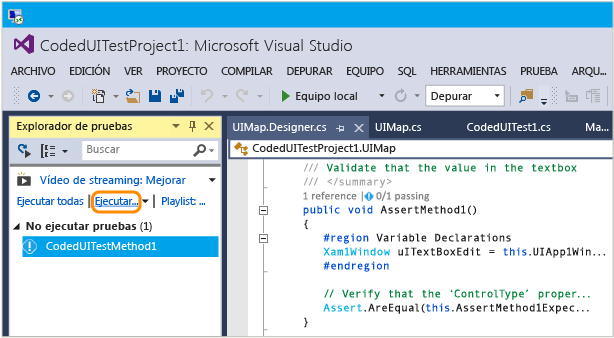  
  
     La aplicación de la Tienda Windows se inicia, la acción para pulsar el botón se completa y la propiedad Text del cuadro de texto se rellena y se valida mediante el método de aserción.  
  
     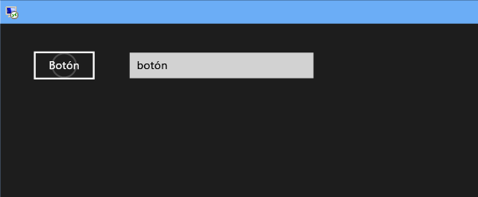  
  
     Una vez completada la prueba, el explorador de pruebas confirma que se superó la prueba.  
  
     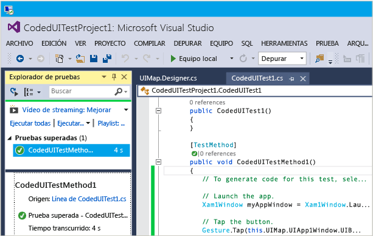  
  
## <a name="q--a"></a>Preguntas y respuestas  
  
#### <a name="q-why-dont-i-see-the-option-to-record-my-coded-ui-test-in-the-generate-code-for-a-coded-ui-test-dialog"></a>P: ¿Por qué no veo la opción para registrar la prueba automatizada de IU en la opción Generar código de un cuadro de diálogo Prueba automatizada de IU?**  
  
**R**: La opción para registrar no se admite en las aplicaciones de la Tienda Windows.  
  
#### <a name="q-can-i-create-a-coded-ui-test-for-my-windows-store-apps-based-on-winjs"></a>P: ¿Puedo crear una prueba automatizada de IU para las aplicaciones de la Tienda Windows basadas en WinJS?**  

**R**: No. Solo se admiten aplicaciones basadas en XAML.  
  
#### <a name="q-can-i-create-coded-ui-tests-for-my-windows-store-apps-on-a-system-that-is-not-running-windows-81-or-windows-10"></a>P: ¿Puedo crear pruebas automatizadas de IU para las aplicaciones de la Tienda Windows en un sistema que no ejecute Windows 8.1 ni Windows 10?**  
  
**R**: No, las plantillas de proyecto de prueba de IU codificada solo están disponibles en Windows 8.1 y Windows 10. Para crear la automatización para las aplicaciones de la Plataforma universal de Windows (UWP), necesitará Windows 10.  

<a name="uwpapps"></a>  
#### <a name="q-how-do-i-create-coded-ui-tests-for-universal-windows-platform-uwp-apps"></a>P: ¿Cómo puedo crear pruebas automatizadas de IU para las aplicaciones de la Plataforma universal de Windows (UWP)?**  
  
**R**: Según la plataforma en la que vaya a probar su aplicación para UWP, cree el proyecto de prueba de IU codificada de una de estas maneras:  
  
- Una aplicación para UWP que se ejecuta en el equipo local se ejecutará como una aplicación de la Tienda. Para probarlo, debe usar la plantilla **Proyecto de prueba de IU codificada (Windows)** . Para encontrar esta plantilla cuando cree un nuevo proyecto, vaya al nodo **Windows**, **Universal** . O vaya al nodo **Windows**, **Windows 8**, **Windows** .  
  
- Una aplicación para UWP que se ejecute en el dispositivo o emulador se ejecutará como una aplicación de Windows Phone. Para probarlo, debe usar la plantilla **Proyecto de prueba de IU codificada (Windows Phone)** . Para encontrar esta plantilla cuando cree un nuevo proyecto, vaya al nodo **Windows**, **Universal** . O vaya al nodo **Windows**, **Windows 8**, **Windows Phone** .  
  
Después de crear el proyecto, el procedimiento para crear una prueba sigue siendo el mismo que antes.  
  
#### <a name="q-why-cant-i-modify-the-code-in-the-uimapdesigner-file"></a>P: ¿Por qué no puedo modificar el código en el archivo UIMap.Designer?**  
  
**R:**Cualquier cambio que se efectúe en el código del archivo UIMapDesigner.cs se sobrescribirá cada vez que se genere código mediante UIMap - Generador de pruebas de IU codificadas. Si tiene que modificar un método grabado, debe copiarlo en el archivo UIMap.cs y cambiar el nombre. El archivo UIMap.cs se puede utilizar para invalidar métodos y propiedades en el archivo UIMapDesigner.cs. Debe quitar la referencia al método original en el archivo UITest.cs el Codificado y reemplazarlo con el nombre del método cuyo nombre ha cambiado.  
  
## <a name="see-also"></a>Vea también  
 [Usar UI Automation para probar el código](../test/use-ui-automation-to-test-your-code.md)   
 [Establecer una propiedad de Automation única para la prueba de controles de la Tienda Windows](../test/set-a-unique-automation-property-for-windows-store-controls-for-testing.md)

