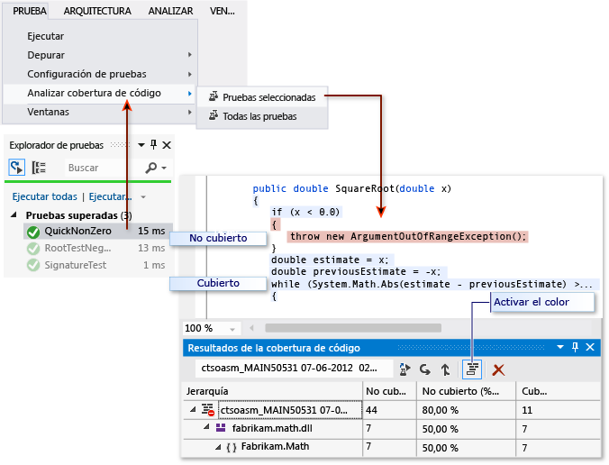

# Solucionar problemas de cobertura de código

La herramienta de análisis de cobertura de código de Visual Studio recopila datos para ensamblados nativos y administrados (archivos .dll o .exe). Sin embargo, en algunos casos, la ventana de resultados de cobertura de código muestra un error similar a “Resultados vacíos generados:….” Hay varios motivos por los que puede obtener resultados vacíos. Este artículo le ayuda a resolver esos problemas.

## Qué debe ver

Si se elige un comando **Analizar cobertura de código** en el menú Prueba, y si la compilación y las pruebas se ejecutan correctamente, debe verse una lista de resultados en la ventana Cobertura de código. Es posible que tenga que expandir los elementos para ver los detalles.

Para obtener más información, consulte [Usar cobertura de código para determinar la cantidad de código que se está probando](../test/using-code-coverage-to-determine-how-much-code-is-being-tested.md).

## Causas posibles para no ver ningún resultado o ver resultados antiguos

### ¿Tiene la edición correcta de Visual Studio?
 Necesita Visual Studio Enterprise.

### No se ejecutó ninguna prueba

Análisis: compruebe la ventana de resultados. En la lista desplegable **Mostrar resultados desde**, elija **Pruebas**. Compruebe si hay advertencias o errores registrados.

Explicación: el análisis de cobertura de código se realiza mientras se ejecutan las pruebas. Solo incluye los ensamblados cargados en memoria cuando se ejecutan las pruebas. Si no se ejecuta ninguna de las pruebas, no hay nada que notificar con respecto a la cobertura de código.

Resolución: en el Explorador de pruebas, elija **Ejecutar todas** para comprobar que las pruebas se ejecutan correctamente. Corrija cualquier error antes de usar **Analizar cobertura de código**.

### Está viendo un resultado anterior

Cuando se modifican y se vuelven a ejecutar las pruebas, todavía puede estar visible un resultado de cobertura de código anterior, incluido el color del código de esa ejecución anterior.

1.  Ejecute Analizar cobertura de código.

2.  Asegúrese de que ha seleccionado el conjunto de resultados más reciente en la ventana de resultados de cobertura de código.

### Los archivos .pdb (símbolo) no están disponibles

Análisis: abra la carpeta de destino de la compilación (normalmente bin\debug) y compruebe que, para cada ensamblado, hay un archivo .pdb en el mismo directorio que el archivo .dll o .exe.

Explicación: el motor de cobertura de código requiere que cada ensamblado tenga asociado su archivo .pdb, al que se puede tener acceso durante la serie de pruebas. Si no hay ningún archivo .pdb para un ensamblado determinado, este no se analizará.

El archivo .pdb se debe generar a partir de la misma compilación que los archivos .dll o .exe.

Resolución: asegúrese de que la configuración de compilación genere el archivo .pdb. Si los archivos .pdb no se actualizan cuando se compila el proyecto, abra las propiedades del proyecto, seleccione la página **Compilación**, elija **Avanzadas** e inspeccione **Info. de depuración**.

Si los archivos .pdb y .dll o .exe están en distintos lugares, copie el archivo .pdb en el mismo directorio. También es posible configurar el motor de cobertura de código para que busque archivos .pdb en otra ubicación. Para obtener más información, consulte [Personalizar el análisis de cobertura de código](../test/customizing-code-coverage-analysis.md).

### Usar un binario instrumentado u optimizado

Análisis: determine si el binario ha experimentado algún tipo de optimización avanzada, como Optimización guiada por perfiles, o si se ha instrumentado mediante una herramienta de generación de perfiles como vsinstr.exe o vsperfmon.exe.

Explicación: si otra herramienta de generación de perfiles ya ha instrumentado u optimizado un ensamblado, este se omitirá del análisis de cobertura de código. El análisis de cobertura de código no se puede realizar en dichos ensamblados.

Resolución: desactive la optimización y use una nueva compilación.

### El código no es administrado (.NET) o nativo (C++)

Análisis: compruebe que se están ejecutando algunas pruebas en el código administrado o de C++.

Explicación: el análisis de cobertura de código de Visual Studio solo está disponible en código administrado y nativo (C++). Si trabaja con herramientas de terceros, puede que parte del código, o todo, se ejecute en una plataforma diferente.

Resolución: ninguna disponible.

### NGen ha instalado el ensamblado

Análisis: compruebe que el ensamblado no se carga desde la memoria caché de imágenes nativas.

Explicación: por razones de rendimiento, no se analizan ensamblados de imágenes nativas. Para obtener más información, vea el artículo sobre [Ngen.exe (generador de imágenes nativas)](/dotnet/framework/tools/ngen-exe-native-image-generator).

Resolución: use una versión MSIL del ensamblado. No lo procese con NGen.

### Archivo .runsettings personalizado con sintaxis incorrecta

Análisis: si usa un archivo *.runsettings* personalizado, puede que contenga un error de sintaxis. La cobertura de código no se ejecuta, y la ventana de cobertura de código no se abre al final de la serie de pruebas o muestra resultados antiguos.

Explicación: se pueden ejecutar las pruebas unitarias con un archivo .runsettings personalizado para configurar las opciones de cobertura de código. Las opciones permiten incluir o excluir archivos. Para obtener más información, consulte [Personalizar el análisis de cobertura de código](../test/customizing-code-coverage-analysis.md).

Resolución: hay dos posibles tipos de errores que se indican a continuación.

-   **Error de XML**

     Abra el archivo .runsettings en el editor XML de Visual Studio. Busque las indicaciones del error.

-   **Error de expresión regular**

     Cada cadena del archivo es una expresión regular. Revise cada una de ellas en busca de errores y, en particular, busque:

    -   Paréntesis no coincidentes (...) o paréntesis sin escape \\(...\\). Si desea asociar un paréntesis en la cadena de búsqueda, debe indicar su secuencia de escape. Por ejemplo, para hacer coincidir una función, use: `.*MyFunction\(double\)`

    -   Asterisco o signo más al principio de una expresión. Para asociar cualquier cadena de caracteres, use un punto seguido de un asterisco: `.*`

### Archivo .runsettings personalizado con exclusiones incorrectas

Análisis: si usa un archivo *.runsettings* personalizado, asegúrese de que incluya el ensamblado.

Explicación: se pueden ejecutar las pruebas unitarias con un archivo .runsettings personalizado para configurar las opciones de cobertura de código. Las opciones permiten incluir o excluir archivos. Para obtener más información, consulte [Personalizar el análisis de cobertura de código](../test/customizing-code-coverage-analysis.md).

Resolución: elimine todos los nodos `Include` del archivo .runsettings y quite todos los nodos `Exclude`. Si eso corrige el problema, vuelva a colocarlos en fases.

Asegúrese de que el nodo DataCollectors especifica la cobertura de código. Compárelo con el ejemplo de [Personalizar el análisis de cobertura de código](../test/customizing-code-coverage-analysis.md).

## Siempre se muestra algún código como no cubierto

### El código de inicialización de archivos DLL nativos se ejecuta antes de la instrumentación

Análisis: en el código nativo vinculado estáticamente, parte de la función de inicialización **DllMain** y el código al que llama se muestran a veces como no cubiertos, aunque se haya ejecutado el código.

Explicación: la herramienta de cobertura de código funciona insertando la instrumentación en un ensamblado justo antes de que la aplicación comience a ejecutarse. En cualquier ensamblado cargado con antelación, el código de inicialización de **DllMain** se ejecuta tan pronto como se carga el ensamblado y antes de que se ejecute la aplicación. Ese código aparece como no cubierto. Normalmente, esto se aplica a los ensamblados cargados estáticamente.

Resolución: ninguna.

## Vea también

- [Usar cobertura de código para determinar la cantidad de código que se está probando](../test/using-code-coverage-to-determine-how-much-code-is-being-tested.md)