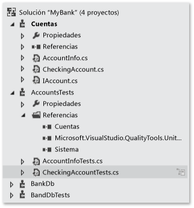
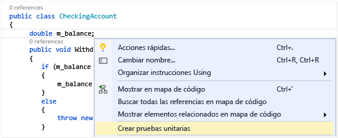
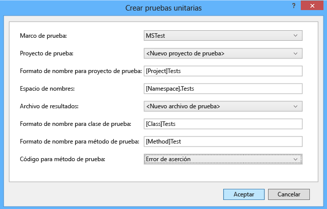
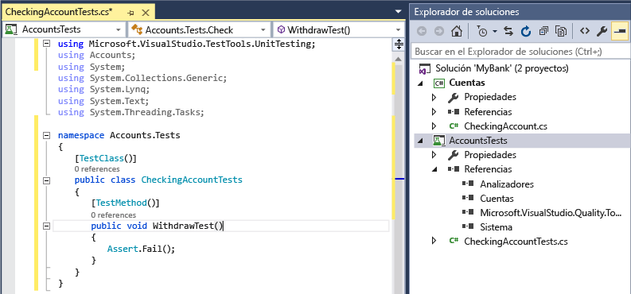
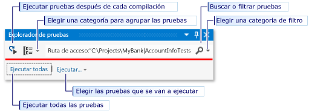
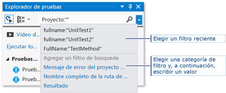
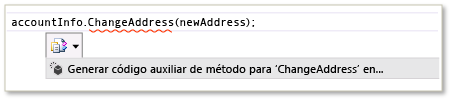
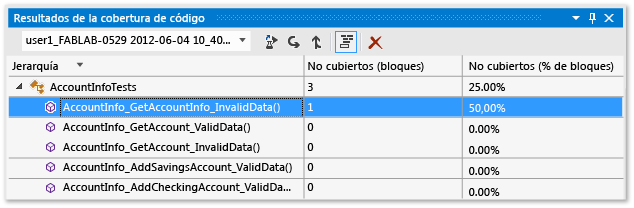

# <a name="unit-test-basics"></a>Conceptos básicos de prueba unitaria
Compruebe que el código funciona correctamente; para ello, cree y ejecute pruebas unitarias. Se llaman pruebas unitarias porque descomponen las funciones del programa en comportamientos comprobables discretos que se pueden probar como *unidades* individuales. El Explorador de pruebas de Visual Studio proporciona una forma flexible y eficaz de ejecutar las pruebas unitarias y ver los resultados en Visual Studio. Visual Studio instala los marcos de pruebas unitarias de Microsoft para el código administrado y nativo. Use un *marco de pruebas unitarias* para crear pruebas unitarias, ejecutarlas y notificar los resultados correspondientes. Cuando realice cambios, vuelva a ejecutar las pruebas unitarias para probar que el código sigue funcionando correctamente. Visual Studio Enterprise puede hacerlo automáticamente con [Live Unit Testing](live-unit-testing-intro.md), que detecta pruebas afectadas por los cambios en el código y las ejecuta en segundo plano mientras se escribe.
  
 Las pruebas unitarias tienen el mayor efecto en la calidad del código cuando son parte integral del flujo de trabajo de desarrollo de software. En cuanto escriba una función u otro bloque de código de aplicación, cree pruebas unitarias que comprueben el comportamiento del código en respuesta a casos estándar, límite e incorrectos de datos de entrada, así como cualquier suposición explícita o implícita creada por el código. En el *desarrollo controlado por pruebas*, las pruebas unitarias se crean antes de escribir el código, de modo que se usan como documentación de diseño y como especificaciones de las funciones.  
  
 Puede generar rápidamente proyectos y métodos de prueba a partir del código o crear manualmente las prueba a medida que las necesite. Cuando use IntelliTest para explorar el código .NET, puede generar datos de prueba y un conjunto de pruebas unitarias. Para cada instrucción en el código, se genera una entrada de prueba que ejecutará esa instrucción. Descubra cómo [generar pruebas unitarias para el código](http://msdn.microsoft.com/library/dn823749.aspx).  
  
 El Explorador de pruebas también puede ejecutar marcos de pruebas unitarias de terceros y de código abierto que hayan implementado interfaces complementarias del Explorador de pruebas. Muchos de estos marcos se pueden agregar a través del Administrador de extensiones de Visual Studio y la galería de Visual Studio. Vea [Instalar marcos de prueba unitaria de terceros](../test/install-third-party-unit-test-frameworks.md).  
  
-   [Guías rápidas](#BKMK_Quick_starts)  
  
-   [Ejemplo de la solución MyBank](#BKMK_The_MyBank_Solution_example)  
  
-   [Crear proyectos de prueba unitaria y métodos de prueba](#BKMK_Creating_the_unit_test_projects)  
  
-   [Escribir las pruebas](#BKMK_Writing_your_tests)  
  
-   [Ejecutar pruebas en Explorador de pruebas](#BKMK_Running_tests_in_Test_Explorer)  
  
-   [Ejecutar y ver las pruebas](#BKMK_Running_and_viewing_tests_from_the_Test_Explorer_toolbar)  
  
##  <a name="BKMK_Unit_testing_overview"></a> Información general de pruebas unitarias  
  
###  <a name="BKMK_Quick_starts"></a> Guías rápidas  
 Para obtener una introducción a las pruebas unitarias que le guíe directamente en la codificación, vea uno de estos temas:  
  
-   [Tutorial: Crear y ejecutar pruebas unitarias en código administrado](../test/walkthrough-creating-and-running-unit-tests-for-managed-code.md)  
  
-   [Inicio rápido: Desarrollo controlado por pruebas con el Explorador de pruebas](../test/quick-start-test-driven-development-with-test-explorer.md)  
  
-   [Pruebas unitarias de código nativo con el Explorador de pruebas](http://msdn.microsoft.com/en-us/8a09d6d8-3613-49d8-9ffe-11375ac4736c)  
  
##  <a name="BKMK_The_MyBank_Solution_example"></a> Ejemplo de la solución MyBank  
 En este tema, usamos el desarrollo de una aplicación ficticia denominada `MyBank` como ejemplo. No es necesario el código real para seguir las explicaciones de este tema. Los métodos de prueba se escriben en C# y se presentan mediante el marco de pruebas unitarias para código administrado de Microsoft. Sin embargo, los conceptos se transfieren fácilmente a otros lenguajes y marcos.  
  
   
  
 Nuestro primer intento de un diseño para la aplicación `MyBank` incluye un componente de cuentas que representa una cuenta individual y sus transacciones con el banco, así como un componente de base de datos que representa la funcionalidad para agregar y administrar las cuentas individuales.  
  
 Creamos una solución `MyBank` que contiene dos proyectos:  
  
-   `Accounts`  
  
-   `BankDb`  
  
 El primer intento en el diseño del proyecto `Accounts` contiene una clase para incluir información básica sobre una cuenta, una interfaz que especifica la funcionalidad común de cualquier tipo de cuenta, como el depósito y la retirada de activos de la misma, y una clase derivada de la interfaz que representa una cuenta corriente. Comenzamos los proyectos Accounts creando los archivos de código fuente siguientes:  
  
-   `AccountInfo.cs` define la información básica de una cuenta.  
  
-   `IAccount.cs` define una interfaz `IAccount` estándar para una cuenta, incluidos los métodos para depositar y retirar activos de una cuenta y recuperar el saldo de cuenta.  
  
-   `CheckingAccount.cs` contiene la clase `CheckingAccount` que implementa la interfaz de `IAccounts` para una cuenta corriente.  
  
 Sabemos por experiencia que al retirarse una cantidad de una cuenta corriente debe garantizarse que la cantidad retirada sea inferior al saldo de la cuenta. Por tanto, reemplazamos el método `IAccount.Withdaw` en `CheckingAccount` por un método que compruebe esta condición. El método puede presentar el siguiente aspecto:  
  
```csharp  
  
public void Withdraw(double amount)  
{  
    if(m_balance >= amount)  
    {  
        m_balance -= amount;  
    }  
    else  
    {  
        throw new ArgumentException(amount, "Withdrawal exceeds balance!")  
    }  
}  
  
```  
  
 Ahora que tenemos código, es el momento de probar.  
  
##  <a name="BKMK_Creating_the_unit_test_projects"></a> Crear proyectos de prueba unitaria y métodos de prueba  
 En general, es más rápido generar el proyecto de prueba unitaria y los códigos auxiliares de pruebas unitarias a partir del código, aunque también puede crear el proyecto y las pruebas manualmente según sus requisitos.  
  
 **Generar el proyecto de prueba unitaria y los códigos auxiliares correspondientes**  
  
1.  En la ventana del editor de código, haga clic en el botón secundario y elija **Crear pruebas unitarias** en el menú contextual.  
  
       
  
2.  Haga clic en Aceptar para aceptar los valores predeterminados al crear las pruebas unitarias o cambiar los valores usados para crear las pruebas unitarias y el proyecto que las engloba, y asignarles un nombre. Puede seleccionar el código que se agrega de forma predeterminada a los métodos de prueba unitaria.  
  
       
  
3.  El código auxiliar de prueba unitaria se crea en un proyecto de prueba unitaria nuevo para todos los métodos de la clase.  
  
       
  
4.  Avance para saber cómo [agregar código a los métodos de prueba unitaria](#BKMK_Writing_your_tests) (de modo que la prueba sea significativa) y cómo agregar pruebas unitarias adicionales para probar exhaustivamente el código.  
  
 **Crear el proyecto de pruebas unitarias y las pruebas manualmente**  
  
 Un proyecto de prueba unitaria suele reflejar la estructura de un solo proyecto de código. En el ejemplo de MyBank, se agregan dos proyectos de prueba unitaria denominados `AccountsTests` y `BankDbTests` a la solución `MyBanks` . Los nombres del proyecto de prueba son arbitrarios, pero es recomendable adoptar una convención de nomenclatura estándar.  
  
 **Para agregar un proyecto de prueba unitaria a una solución:**  
  
1.  En el menú **Archivo** , elija **Nuevo** y, a continuación, **Proyecto** (Ctrl + Mayús + N en el teclado).  
  
2.  En el cuadro de diálogo Nuevo proyecto, expanda el nodo **Instalado** , elija el lenguaje que desea usar para el proyecto de prueba y, a continuación, elija **Probar**.  
  
3.  Para usar uno de los marcos de pruebas unitarias de Microsoft, elija **Proyecto de prueba unitaria** en la lista de plantillas de proyecto. De lo contrario, elija la plantilla de proyecto del marco de pruebas unitarias que desea usar. Para probar el proyecto `Accounts` del ejemplo, el proyecto se denominaría `AccountsTests`.  
  
    > [!WARNING]
    >  No todos los marcos de pruebas unitarias de terceros y de código abierto proporcionan una plantilla de proyecto de Visual Studio. Consulte el documento del marco para obtener información sobre cómo crear un proyecto.  
  
4.  En el proyecto de prueba unitaria, agregue una referencia al proyecto de código en pruebas, en el ejemplo para el proyecto Accounts.  
  
     Para crear la referencia al proyecto de código:  
  
    1.  Seleccione el proyecto en el Explorador de soluciones.  
  
    2.  En el menú **Proyecto** , elija **Agregar referencia**.  
  
    3.  En el cuadro de diálogo Administrador de referencias, abra el nodo **Solución** y elija **Proyectos**. Seleccione el nombre del proyecto de código y cierre el cuadro de diálogo.  
  
 Cada proyecto de prueba unitaria contiene clases que reflejan los nombres de las clases en el proyecto de código. En nuestro ejemplo, el proyecto `AccountsTests` contendría las clases siguientes:  
  
-   La clase`AccountInfoTests` contiene los métodos de prueba unitaria para la clase `AccountInfo` del proyecto `BankAccount` .  
  
-   La clase`CheckingAccountTests` contiene los métodos de prueba unitaria para la clase `CheckingAccount` .  
  
##  <a name="BKMK_Writing_your_tests"></a> Escribir las pruebas  
 El marco de pruebas unitarias que use y Visual Studio IntelliSense le guiarán en la escritura del código de las pruebas unitarias para un proyecto de código. Para ejecutar en el Explorador de pruebas, la mayoría de los marcos requieren que se agreguen atributos específicos para identificar métodos de prueba unitaria. Los marcos también ofrecen una manera (normalmente a través de instrucciones assert o atributos method) de indicar si el método de prueba se ha superado o no. Otros atributos identifican métodos de configuración opcionales que están en la inicialización de la clase y antes de cada método de prueba y métodos de destrucción que se ejecutan después de cada método de prueba y antes de que la clase se destruya.  
  
 El patrón AAA (Arrange, Act, Assert) es una forma habitual de escribir pruebas unitarias para un método en pruebas.  
  
-   La sección **Arrange** de un método de prueba unitaria inicializa objetos y establece el valor de los datos que se pasa al método en pruebas.  
  
-   La sección **Act** invoca al método en pruebas con los parámetros organizados.  
  
-   La sección **Assert** comprueba si la acción del método en pruebas se comporta de la forma prevista.  
  
 Para probar el método `CheckingAccount.Withdraw` del ejemplo podemos escribir dos pruebas: una que compruebe el comportamiento estándar del método y otra que compruebe si una retirada que supere el saldo producirá un error. En la clase `CheckingAccountTests` , agregamos los siguientes métodos:  
  
```csharp  
[TestMethod]  
public void Withdraw_ValidAmount_ChangesBalance()  
{  
    // arrange  
    double currentBalance = 10.0;  
    double withdrawal = 1.0;  
    double expected = 9.0;  
    var account = new CheckingAccount("JohnDoe", currentBalance);  
    // act  
    account.Withdraw(withdrawal);  
    double actual = account.Balance;  
    // assert  
    Assert.AreEqual(expected, actual);  
}  
  
[TestMethod]  
[ExpectedException(typeof(ArgumentException))]  
public void Withdraw_AmountMoreThanBalance_Throws()  
{  
    // arrange  
    var account = new CheckingAccount("John Doe", 10.0);  
    // act  
    account.Withdraw(20.0);  
    // assert is handled by the ExpectedException  
}  
  
```  
  
 Observe que `Withdraw_ValidAmount_ChangesBalance` usa una instrucción `Assert` explícita para determinar si el método de prueba se supera o no, mientras que `Withdraw_AmountMoreThanBalance_Throws` usa el atributo `ExpectedException` para determinar el éxito del método de prueba. En segundo plano, un marco de pruebas unitarias incluye métodos de prueba en instrucciones try/catch. En la mayoría de los casos, si se detecta una excepción, el método de prueba no se supera y se omite la excepción. El atributo `ExpectedException` hace que el método de prueba se supere si se produce la excepción especificada.  
  
 Para obtener más información sobre los marcos de pruebas unitarias de Microsoft, consulte uno de los temas siguientes:  
  
-   [Escribir pruebas unitarias para .NET Framework con el Framework de pruebas unitarias de Microsoft para código administrado](../test/writing-unit-tests-for-the-dotnet-framework-with-the-microsoft-unit-test-framework-for-managed-code.md)  
  
-   [Escribir pruebas unitarias para C/C++](writing-unit-tests-for-c-cpp.md)  
  
## <a name="set-timeouts-for-unit-tests"></a>Establecer tiempos de espera de conexión para las pruebas unitarias  
 Para establecer un tiempo de espera en un método de prueba individual:  
  
```csharp  
[TestMethod]  
[Timeout(2000)]  // Milliseconds  
public void My_Test()  
{ ...  
}  
```  
  
```vb  
  
```  
  
 Para establecer el tiempo de espera en el máximo permitido:  
  
```csharp  
[TestMethod]  
[Timeout(TestTimeout.Infinite)]  // Milliseconds  
public void My_Test ()  
{ ...  
}  
```  
  
##  <a name="BKMK_Running_tests_in_Test_Explorer"></a> Ejecutar pruebas en Explorador de pruebas  
 Al compilar el proyecto de prueba, las pruebas aparecen en el Explorador de pruebas. Si el Explorador de pruebas no está visible, elija **Prueba** en el menú de Visual Studio, elija **Ventanas**y, después, **Explorador de pruebas**.  
  
   
  
 Al ejecutar, escribir y volver a ejecutar las pruebas, la vista predeterminada del Explorador de pruebas muestra los resultados en grupos de **Pruebas no superadas**, **Pruebas superadas**, **Pruebas omitidas** y **Pruebas no ejecutadas**. Se puede elegir el título de un grupo para abrir la vista que muestra todas las pruebas de ese grupo.  
  
 También puede filtrar las pruebas en cualquier vista haciendo coincidir texto del cuadro de búsqueda a nivel global o seleccionando uno de los filtros predefinidos. Se puede ejecutar cualquier selección de las pruebas en cualquier momento. Los resultados de una serie de pruebas son inmediatamente visibles en la barra de éxito/error de la parte superior de la ventana del explorador. Los detalles de un resultado del método de prueba se muestran al seleccionar la prueba.  
  
###  <a name="BKMK_Running_and_viewing_tests_from_the_Test_Explorer_toolbar"></a> Ejecutar y ver las pruebas  
 La barra de herramientas del Explorador de pruebas le ayuda a detectar, organizar y ejecutar las pruebas que le interesan.  
  
   
  
 Se puede elegir **Ejecutar todas** para ejecutar todas las pruebas o bien **Ejecutar** para elegir un subconjunto de pruebas que se desea ejecutar. Después de ejecutar un conjunto de pruebas, aparecerá un resumen de la serie de pruebas en la parte inferior de la ventana Explorador de pruebas. Seleccione una prueba para ver los detalles de esa prueba en el panel inferior. Elija **Abrir prueba** en el menú contextual (teclado: F12) para mostrar el código fuente de la prueba seleccionada.  
  
 Si las pruebas individuales no tienen ninguna dependencia que impida que se ejecuten en cualquier orden, active la ejecución de pruebas paralelas con el botón de alternancia  en la barra de herramientas. Esto puede reducir considerablemente el tiempo necesario para ejecutar todas las pruebas.  
  
###  <a name="BKMK_Running_tests_after_every_build"></a> Ejecutar pruebas después de cada compilación  
  
> [!WARNING]
>  La ejecución de pruebas unitarias después de cada compilación solo se admite en Visual Studio Enterprise.  
  
|||  
|-|-|  
||Para ejecutar pruebas unitarias después de cada compilación local, elija **Prueba** en el menú estándar o **Ejecutar pruebas después de compilar** en la barra de herramientas del Explorador de pruebas.|  
  
###  <a name="BKMK_Filtering_and_grouping_the_test_list"></a> Filtrar y agrupar la lista de pruebas  
 Si tiene un gran número de pruebas, puede escribir en el cuadro de búsqueda del Explorador de pruebas para filtrar la lista por la cadena especificada. Para limitar aún más el evento de filtro, elija una opción de la lista de filtros.  
  
   
  
|||  
|-|-|  
||Para agrupar las pruebas por categoría, elija el botón **Agrupar por** .|  
  
 Para más información, vea [Ejecutar pruebas unitarias con el Explorador de pruebas](../test/run-unit-tests-with-test-explorer.md).  
  
## <a name="qa"></a>Preguntas y respuestas  
 **P: ¿Cómo puedo depurar las pruebas unitarias?**  
  
 **R:** Use el Explorador de pruebas para iniciar una sesión de depuración de pruebas. La ejecución paso a paso del código con el depurador de Visual Studio permite avanzar y retroceder sin problemas entre las pruebas unitarias y el proyecto objeto de prueba. Para iniciar la depuración:  
  
1.  En el editor de Visual Studio, establezca un punto de interrupción en uno o varios métodos de prueba que desee depurar.  
  
    > [!NOTE]
    >  Dado que los métodos de prueba se pueden ejecutar en cualquier orden, establezca puntos de interrupción en todos los métodos de prueba que desee depurar.  
  
2.  En el Explorador de pruebas, seleccione los métodos de prueba y después elija **Depurar pruebas seleccionadas** en el menú contextual.  
  
 Más información sobre la [depuración de pruebas unitarias](../debugger/debugging-in-visual-studio.md).  
  
 **P: Si uso TDD, ¿cómo puedo generar el código a partir de las pruebas?**  
  
 **R:** Use IntelliSense para generar clases y métodos en el código del proyecto. Escriba una instrucción en un método de prueba que llame a la clase o método que desea generar y, a continuación, abra el menú de IntelliSense bajo la llamada. Si la llamada es a un constructor de la nueva clase, elija **Generar nuevo tipo** en el menú y siga el asistente para insertar la clase en el proyecto de código. Si la llamada es a un método, elija **Generar nuevo método** en el menú de IntelliSense.  
  
   
  
 **P: ¿Puedo crear pruebas unitarias que usan varios conjuntos de datos como entrada para ejecutar la prueba?**  
  
 **R:** Sí. Los*métodos de prueba controlados por datos* permiten probar un intervalo de valores con un solo método de prueba unitaria. En el método de prueba, use un atributo `DataSource` que especifique el origen de datos y la tabla que contienen los valores de las variables que desea probar.  En el cuerpo del método, se pueden asignar los valores de fila a las variables mediante el indizador `TestContext.DataRow[`*ColumnName*`]` .  
  
> [!NOTE]
>  Estos procedimientos se aplican solamente a los métodos de prueba que se escriben usando el marco de pruebas unitarias de Microsoft para código administrado. Si usa otro marco, consulte una función equivalente en la documentación correspondiente.  
  
 Por ejemplo, suponga que se agrega un método innecesario a la clase `CheckingAccount` denominado `AddIntegerHelper`. `AddIntegerHelper` agrega dos enteros.  
  
 Para crear una prueba controlada por datos para el método `AddIntegerHelper` , en primer lugar se crea una base de datos de Access denominada `AccountsTest.accdb` y una tabla denominada `AddIntegerHelperData`. La tabla `AddIntegerHelperData` define las columnas para especificar el primer y segundo operando de la suma y una columna para especificar el resultado esperado. Rellenamos varias filas con los valores adecuados.  
  
```csharp  
[DataSource(  
    @"Provider=Microsoft.ACE.OLEDB.12.0;Data Source=C:\Projects\MyBank\TestData\AccountsTest.accdb",   
    "AddIntegerHelperData"  
)]  
[TestMethod()]  
public void AddIntegerHelper_DataDrivenValues_AllShouldPass()  
{  
    var target = new CheckingAccount();  
    int x = Convert.ToInt32(TestContext.DataRow["FirstNumber"]);  
    int y = Convert.ToInt32(TestContext.DataRow["SecondNumber"]);   
    int expected = Convert.ToInt32(TestContext.DataRow["Sum"]);  
    int actual = target.AddIntegerHelper(x, y);  
    Assert.AreEqual(expected, actual);  
}
```  
  
 El método con el atributo se ejecuta una vez para cada fila de la tabla. El Explorador de pruebas notifica un error de prueba para el método si alguna de las iteraciones no se supera. El panel de detalles de los resultados de las pruebas para el método muestra el método de estado de éxito/error para cada fila de datos.  
  
 Más información sobre [pruebas unitarias controladas por datos](../test/how-to-create-a-data-driven-unit-test.md).  
  
 **P: ¿Puedo ver la cantidad de código probado en las pruebas unitarias?**  
  
 **R:** Sí. Con la herramienta de cobertura de código de Visual Studio se puede determinar la cantidad del código que las pruebas unitarias están probando realmente. Se admiten los lenguajes nativos y administrados, así como todos los marcos de pruebas unitarias que pueda ejecutar el Marco de pruebas unitarias.  
  
 La cobertura de código se puede ejecutar en pruebas seleccionadas o en todas las pruebas de una solución. La ventana Resultados de la cobertura de código muestra el porcentaje de bloques de código de producto que se han ejecutado por línea, función, clase, espacio de nombres y módulo.  
  
 Para iniciar la cobertura de código para los métodos de prueba de una solución, elija **Pruebas** en el menú de Visual Studio y, después, elija **Analizar cobertura de código**.  
  
 Los resultados de la cobertura aparecen en la ventana Resultados de la cobertura de código.  
  
   
  
 Obtenga más información sobre la [cobertura de código](../test/using-code-coverage-to-determine-how-much-code-is-being-tested.md).  
  
 **P: ¿Cómo puedo probar en el código métodos que tengan dependencias externas?**  
  
 **R:** Sí. Si tiene Visual Studio Enterprise, Microsoft Fakes se puede emplear con los métodos de prueba que se escriben usando marcos de pruebas unitarias para código administrado.  
  
 Microsoft Fakes usa dos enfoques para crear las clases de sustitución de dependencias externas:  
  
1.  Los*códigos auxiliares* generan clases de sustitución derivadas de la interfaz primaria de la clase de dependencia de destino. Los métodos de código auxiliar se pueden sustituir por métodos virtuales públicos de la clase de destino.  
  
2.  Las*correcciones de compatibilidad (shim)* usan la instrumentación del runtime para desviar las llamadas a un método de destino a un método shim de sustitución para métodos no virtuales.  
  
 En ambos enfoques, use los delegados generados de las llamadas al método de dependencia para especificar el comportamiento deseado en el método de prueba.  
  
 Más información sobre cómo [aislar métodos de prueba unitaria con Microsoft Fakes](../test/isolating-code-under-test-with-microsoft-fakes.md).  
  
 **P: ¿Puedo usar otros marcos de pruebas unitarias para crear pruebas unitarias?**  
  
 **A:** Sí, siga estos pasos para [buscar e instalar otros marcos](../test/install-third-party-unit-test-frameworks.md). Después de reiniciar Visual Studio, vuelva a abrir la solución para crear las pruebas unitarias y seleccione los marcos instalados aquí:  
  
   
  
 El código auxiliar de prueba unitaria se creará con el marco seleccionado.
